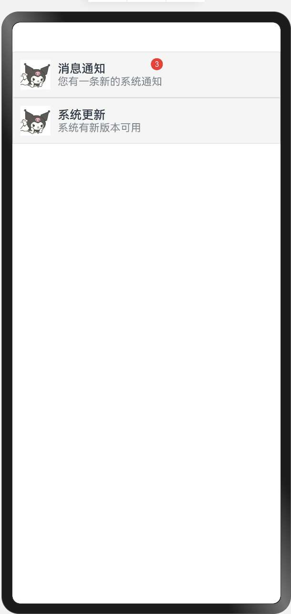

> 温馨提示：本篇博客的详细代码已发布到 [git](https://gitcode.com/nutpi/HarmonyosNext) : https://gitcode.com/nutpi/HarmonyosNext 可以下载运行哦！

 #  HarmonyOS Next性能优化之LazyForEach 列表渲染基础与实现详解 （一）

## 一、代码结构概览

本文将详细解析一个基于 HarmonyOS Next API 12 实现的高性能列表渲染示例。该示例展示了如何通过合理的代码组织和多种优化技巧来提升列表性能。主要包含以下几个核心部分：

1. 数据源管理（ArrayDataSource 类）
2. 数据结构定义（ItemData 接口）
3. 优化的列表项组件（OptimizedListItem）
4. 主列表组件（ListDemo）

> 案例运行效果如下





## 二、详细代码解析

### 1. 数据源管理实现

```typescript
class ArrayDataSource implements IDataSource {
    private dataArray: ItemData[];

    constructor(data: ItemData[]) {
        this.dataArray = data;
    }

    totalCount(): number {
        return this.dataArray.length;
    }

    getData(index: number): ItemData {
        return this.dataArray[index];
    }

    registerDataChangeListener(listener: DataChangeListener): void {
        // 简单实现可暂不处理
    }

    unregisterDataChangeListener(listener: DataChangeListener): void {
        // 简单实现可暂不处理
    }
}
```

**性能优化要点：**

1. **数据源封装**
   - 实现 IDataSource 接口，提供标准化的数据访问方式
   - 通过 getData 方法实现数据的按需加载，避免一次性加载全部数据
   - totalCount 方法提供数据总量信息，便于 LazyForEach 进行渲染优化

2. **数据变更监听机制**
   - 提供数据变更监听接口，支持数据动态更新
   - 可以根据实际需求实现更复杂的数据变更处理逻辑

### 2. 数据结构定义

```typescript
interface ItemData {
    id: number
    title: string
    description: string
    avatar: string
    type: 'simple' | 'badge'
    unreadCount?: number
}
```

**优化考虑：**

1. **类型安全**
   - 使用 TypeScript 接口定义数据结构，提供类型检查
   - 通过可选属性（unreadCount?）优化内存占用

2. **数据结构设计**
   - 使用 type 字段区分不同类型的列表项，支持条件渲染
   - 合理组织数据字段，避免冗余信息

### 3. 优化的列表项组件

```typescript
@Component
struct OptimizedListItem {
    @Prop item: ItemData

    @Builder
    ItemContent() {
        Row() {
            Image(this.item.avatar)
                .width(40)
                .height(40)
                .margin({ right: 10 })

            Column() {
                Text(this.item.title)
                    .fontSize(16)
                    .fontWeight(FontWeight.Medium)

                Text(this.item.description)
                    .fontSize(14)
                    .opacity(0.6)
            }
            .alignItems(HorizontalAlign.Start)
        }
        .width('100%')
        .padding(10)
        .backgroundColor('#F5F5F5')
        .border({
            width: 1,
            color: '#E0E0E0',
            style: BorderStyle.Solid
        })
    }

    build() {
        if (this.item.type === 'simple') {
            this.ItemContent()
        } else {
            Stack() {
                this.ItemContent()

                Badge({
                    value: this.item.unreadCount+'',
                    position: BadgePosition.RightTop,
                    style: { badgeSize: 16, badgeColor: '#FA2A2D' }
                }) {
                    Text('').width(40).height(40)
                }
            }
        }
    }
}
```

**性能优化策略：**

1. **组件复用**
   - 使用 @Builder 装饰器定义可复用的 ItemContent 子组件
   - 避免重复创建相同的 UI 结构，减少内存占用

2. **条件渲染**
   - 根据 item.type 进行条件渲染，只渲染必要的 UI 元素
   - 简单类型直接渲染 ItemContent，复杂类型添加 Badge 组件

3. **属性传递优化**
   - 使用 @Prop 装饰器接收数据，避免数据重复
   - 通过单一数据对象传递，减少属性传递开销

4. **布局优化**
   - 使用 Row 和 Column 组件实现高效的弹性布局
   - 通过 Stack 组件实现 Badge 的叠加效果，避免复杂的定位计算

### 4. 主列表组件实现

```typescript
@Entry
@Component
struct ListDemo {
    @State dataList: ItemData[] = [
        {
            id: 1,
            title: '消息通知',
            description: '您有一条新的系统通知',
            avatar: '/assets/userPhone.JPG',
            type: 'badge',
            unreadCount: 3
        },
        {
            id: 2,
            title: '系统更新',
            description: '系统有新版本可用',
            avatar: '/assets/userPhone.JPG',
            type: 'simple'
        }
    ]

    build() {
        List() {
            LazyForEach(new ArrayDataSource(this.dataList), (item: ItemData) => {
                ListItem() {
                    OptimizedListItem({ item: item })
                }
                .onClick(() => {
                    console.info(`Clicked item: ${item.title}`)
                })
            }, (item: ItemData) => item.id.toString())
        }
        .width('100%')
        .height('100%')
    }
}
```

**核心优化策略：**

1. **LazyForEach 懒加载**
   - 使用 LazyForEach 替代普通的 ForEach，实现列表项的按需渲染
   - 配合 ArrayDataSource 实现高效的数据管理

2. **状态管理**
   - 使用 @State 装饰器管理列表数据，支持响应式更新
   - 数据变更时只更新必要的 UI 部分

3. **唯一键优化**
   - 为每个列表项提供唯一的 key（item.id.toString()）
   - 帮助框架更好地进行 DOM diff 和更新优化

4. **事件处理**
   - 在 ListItem 级别处理点击事件，避免事件冒泡
   - 通过闭包保存当前项的数据，无需额外的数据查找
