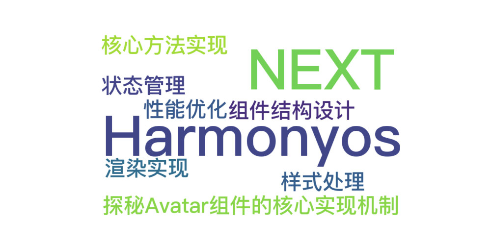

> 温馨提示：本篇博客的详细代码已发布到 [git](https://gitcode.com/nutpi/HarmonyosNext) : https://gitcode.com/nutpi/HarmonyosNext 可以下载运行哦！

 

# 【HarmonyOS NEXT】 仿uv-ui组件开发之Avatar组件深度剖析（二）

## 第二篇：探秘Avatar组件的核心实现机制

### 1. 组件结构设计

 


### 2. 状态管理

#### 2.1 组件状态定义

```typescript
@Component
export struct Avatar {
    // 私有属性
    private props: AvatarProps = {
        shape: AvatarShape.CIRCLE,
        size: AvatarSize.MEDIUM,
        randomBgColor: false
    }
    @State private loadError: boolean = false
    @State private bgColorValue: string = ''
}
```

状态说明：
1. `props`：组件的主要配置属性，设置默认值
2. `loadError`：图片加载错误状态标记
3. `bgColorValue`：随机背景色的具体值

#### 2.2 生命周期处理

```typescript
// 生命周期
aboutToAppear() {
    if (this.props.randomBgColor) {
        this.bgColorValue = this.getRandomColor()
    }
}
```

生命周期函数说明：
- 在组件即将出现时初始化随机背景色
- 只有启用随机背景色时才会生成颜色值

### 3. 核心方法实现

#### 3.1 随机颜色生成

```typescript
// 获取随机颜色
private getRandomColor(): string {
    const colors = ['#f56a00', '#7265e6', '#ffbf00', '#00a2ae']
    return colors[Math.floor(Math.random() * colors.length)]
}
```

实现说明：
- 预定义了一组美观的颜色值
- 通过随机数获取其中一个颜色
- 确保颜色搭配的视觉效果

#### 3.2 尺寸计算逻辑

```typescript
// 获取显示大小
private getSize(): number {
    if (typeof this.props.size === 'number') {
        return this.props.size
    }
    const currentSize = this.props.size ?? AvatarSize.MEDIUM
    switch (currentSize) {
        case AvatarSize.MINI:
            return 24
        case AvatarSize.SMALL:
            return 32
        case AvatarSize.MEDIUM:
            return 40
        case AvatarSize.LARGE:
            return 48
        default:
            return 40
    }
}
```

实现说明：
1. 优先使用自定义数值尺寸
2. 根据预设类型返回对应的像素值
3. 默认返回中等尺寸（40px）

### 4. 渲染实现

#### 4.1 背景渲染

```typescript
// 背景渲染
if (this.props.randomBgColor || this.props.bgColor) {
    Circle()
        .fill(this.props.bgColor ?? this.bgColorValue)
        .width('100%')
        .height('100%')
}
```

实现说明：
- 条件渲染背景圆形
- 优先使用自定义背景色
- 保持背景充满容器

#### 4.2 内容渲染逻辑

```typescript
// 内容渲染
if (this.props.text) {
    // 文字模式
    Text(this.props.text)
        .fontSize(this.getSize() * 0.4)
        .fontColor(Color.White)
} else if (this.props.icon) {
    // 图标模式
    Image(this.props.icon)
        .width('60%')
        .height('60%')
        .objectFit(ImageFit.Contain)
} else if (this.props.src && !this.loadError) {
    // 图片模式
    Image(this.props.src)
        .width('100%')
        .height('100%')
        .objectFit(ImageFit.Cover)
        .onError(() => {
            this.loadError = true
            this.props.onError?.()
        })
} else {
    // 加载失败默认图标
    Image($r("app.media.default_avatar"))
        .width('100%')
        .height('100%')
        .objectFit(ImageFit.Cover)
}
```

渲染逻辑说明：
1. 文字模式：
   - 字体大小与头像尺寸成比例
   - 使用白色确保可读性

2. 图标模式：
   - 控制图标大小比例
   - 使用Contain确保完整显示

3. 图片模式：
   - 图片充满容器
   - 使用Cover确保填充效果
   - 处理加载错误情况

4. 降级处理：
   - 使用默认头像兜底
   - 保持统一的展示效果

### 5. 样式处理

```typescript
// 容器样式
Stack({ alignContent: Alignment.Center }) {
    // 内容渲染
}
.width(this.getSize())
.height(this.getSize())
.borderRadius(this.props.shape === AvatarShape.SQUARE ? 4 : this.getSize() / 2)
```

样式说明：
1. 使用Stack布局确保内容居中
2. 宽高保持一致，由尺寸决定
3. 根据形状类型设置圆角：
   - 方形：固定4px圆角
   - 圆形：圆角为尺寸的一半

### 6. 性能优化

1. **状态管理优化**
   - 使用私有属性减少不必要的更新
   - 合理使用State装饰器
   - 避免频繁的状态变更

2. **渲染优化**
   - 条件渲染减少不必要的DOM操作
   - 使用适当的图片填充模式
   - 合理控制图片资源大小

3. **错误处理优化**
   - 统一的错误降级策略
   - 提供错误回调机制
   - 避免错误状态的频繁切换

> 下一篇教程将介绍Avatar组件的使用方法和样式定制，敬请期待！
