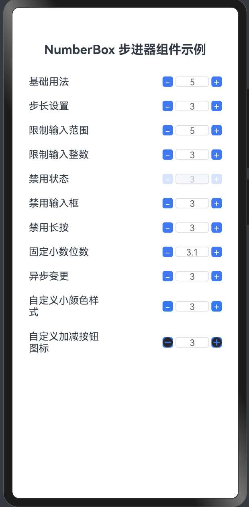

# Harmonyos Next仿uv-ui 组件NumberBox 步进器组件事件处理


## 1. 组件介绍

NumberBox步进器组件提供了丰富的事件处理功能，包括值变化事件、输入框聚焦和失焦事件等，使开发者能够灵活地响应用户交互。本文将详细介绍如何在HarmonyOS NEXT中处理NumberBox步进器的各种事件。

## 2. 效果展示




## 3. 事件处理功能

### 3.1 值变化事件

通过`onChange`回调函数可以监听NumberBox的值变化：

```typescript
NumberBox({
  value: this.value,
  onChange: (value: number) => {
    this.value = value;
    console.info('值变化为: ' + value);
    // 可以在这里执行其他操作，如数据验证、联动更新等
  }
})
```

### 3.2 输入框聚焦事件

通过`onFocus`回调函数可以监听输入框的聚焦事件：

```typescript
NumberBox({
  value: this.value,
  onFocus: () => {
    console.info('输入框获得焦点');
    // 可以在这里执行一些操作，如显示提示信息等
  },
  onChange: (value: number) => {
    this.value = value;
  }
})
```

### 3.3 输入框失焦事件

通过`onBlur`回调函数可以监听输入框的失焦事件：

```typescript
NumberBox({
  value: this.value,
  onBlur: () => {
    console.info('输入框失去焦点');
    // 可以在这里执行一些操作，如数据验证等
  },
  onChange: (value: number) => {
    this.value = value;
  }
})
```

## 4. 完整示例代码

下面是一个展示不同事件处理的完整示例：

```typescript
// NumberBoxEventDemo.ets
// NumberBox步进器事件处理示例

import { NumberBox } from '../components/NumberBox';

@Entry
@Component
struct NumberBoxEventDemo {
  @State value1: number = 5;  // 值变化事件
  @State value2: number = 5;  // 聚焦事件
  @State value3: number = 5;  // 失焦事件
  @State value4: number = 5;  // 综合事件
  
  @State eventLog: string = '事件日志将显示在这里';
  
  // 添加日志
  private addLog(message: string) {
    this.eventLog = message + '\n' + this.eventLog;
    // 只保留最近的10条日志
    const logs = this.eventLog.split('\n');
    if (logs.length > 10) {
      this.eventLog = logs.slice(0, 10).join('\n');
    }
  }

  build() {
    Column() {
      // 标题
      Text('NumberBox 事件处理示例')
        .fontSize(20)
        .fontWeight(FontWeight.Bold)
        .margin({ bottom: 20 })
      
      // 值变化事件
      Row() {
        Text('值变化事件')
          .width('40%')
          .fontSize(16)
        NumberBox({
          value: this.value1,
          onChange: (value: number) => {
            this.value1 = value;
            this.addLog(`值变化事件: ${value}`);
          }
        })
      }
      .width('100%')
      .justifyContent(FlexAlign.SpaceBetween)
      .alignItems(VerticalAlign.Center)
      .padding(10)
      
      // 聚焦事件
      Row() {
        Text('聚焦事件')
          .width('40%')
          .fontSize(16)
        NumberBox({
          value: this.value2,
          onFocus: () => {
            this.addLog(`输入框聚焦: ${this.value2}`);
          },
          onChange: (value: number) => {
            this.value2 = value;
          }
        })
      }
      .width('100%')
      .justifyContent(FlexAlign.SpaceBetween)
      .alignItems(VerticalAlign.Center)
      .padding(10)
      
      // 失焦事件
      Row() {
        Text('失焦事件')
          .width('40%')
          .fontSize(16)
        NumberBox({
          value: this.value3,
          onBlur: () => {
            this.addLog(`输入框失焦: ${this.value3}`);
          },
          onChange: (value: number) => {
            this.value3 = value;
          }
        })
      }
      .width('100%')
      .justifyContent(FlexAlign.SpaceBetween)
      .alignItems(VerticalAlign.Center)
      .padding(10)
      
      // 综合事件
      Row() {
        Text('综合事件')
          .width('40%')
          .fontSize(16)
        NumberBox({
          value: this.value4,
          onChange: (value: number) => {
            this.value4 = value;
            this.addLog(`值变化: ${value}`);
          },
          onFocus: () => {
            this.addLog(`输入框聚焦: ${this.value4}`);
          },
          onBlur: () => {
            this.addLog(`输入框失焦: ${this.value4}`);
          }
        })
      }
      .width('100%')
      .justifyContent(FlexAlign.SpaceBetween)
      .alignItems(VerticalAlign.Center)
      .padding(10)
      
      // 事件日志显示区域
      Column() {
        Text('事件日志：')
          .fontSize(16)
          .fontWeight(FontWeight.Bold)
          .width('100%')
          .margin({ top: 20, bottom: 10 })
        
        Text(this.eventLog)
          .fontSize(14)
          .width('100%')
          .backgroundColor('#f5f5f5')
          .padding(10)
          .borderRadius(5)
      }
      .width('100%')
      .margin({ top: 20 })
    }
    .width('100%')
    .padding(16)
  }
}
```

## 5. 知识点讲解

### 5.1 事件回调属性

NumberBox组件提供了以下事件回调属性：

1. **onChange**：当NumberBox的值发生变化时触发，接收一个number类型的参数，表示变化后的值。
2. **onFocus**：当输入框获得焦点时触发，不接收参数。
3. **onBlur**：当输入框失去焦点时触发，不接收参数。

### 5.2 事件触发时机

各事件的触发时机如下：

1. **onChange**：
   - 点击增加或减少按钮时
   - 长按按钮时（每次值变化都会触发）
   - 输入框中输入新值并失焦时

2. **onFocus**：
   - 点击或Tab键选中输入框时

3. **onBlur**：
   - 从输入框切换到其他元素时
   - 点击页面其他区域时

### 5.3 事件处理的内部实现

NumberBox组件内部的事件处理实现如下：

```typescript
// 值变化处理
private updateValue(newValue: number) {
  if (newValue !== this.currentValue) {
    this.currentValue = newValue;
    this.inputValue = this.formatValue(newValue);
    
    // 触发onChange回调
    if (this.onChange) {
      this.onChange(newValue);
    }
  }
}

// 输入框聚焦处理
private handleFocus() {
  this.isFocused = true;
  
  // 触发onFocus回调
  if (this.onFocus) {
    this.onFocus();
  }
}

// 输入框失焦处理
private handleBlur() {
  this.isFocused = false;
  
  // 尝试将输入值转换为数字
  let numValue = parseFloat(this.inputValue);
  if (isNaN(numValue)) {
    numValue = this.currentValue;
  }
  
  // 限制并更新值
  const newValue = this.limitValue(numValue);
  this.updateValue(newValue);
  
  // 触发onBlur回调
  if (this.onBlur) {
    this.onBlur();
  }
}
```

### 5.4 事件处理的应用场景

不同的事件处理适用于不同的场景：

1. **onChange**：
   - 实时更新UI显示
   - 数据同步
   - 联动其他组件
   - 计算派生值

2. **onFocus**：
   - 显示输入提示
   - 高亮相关元素
   - 展开辅助面板
   - 记录操作状态

3. **onBlur**：
   - 数据验证
   - 格式化输入
   - 保存数据
   - 隐藏辅助UI

## 6. 总结

本文详细介绍了NumberBox步进器组件的事件处理功能。通过onChange、onFocus和onBlur回调函数，开发者可以灵活地响应用户的交互行为，实现更加丰富的功能。事件处理不仅可以用于更新UI和数据，还可以实现更复杂的业务逻辑，如数据验证、联动更新和状态管理等。

在实际应用中，合理使用事件处理可以提升用户体验，使应用更加智能和易用。同时，事件处理也是实现组件间通信和状态同步的重要手段，是构建复杂应用的基础。

在下一篇文章中，我们将介绍NumberBox组件的异步操作处理，包括如何在异步环境中使用NumberBox组件以及如何处理异步数据更新。
