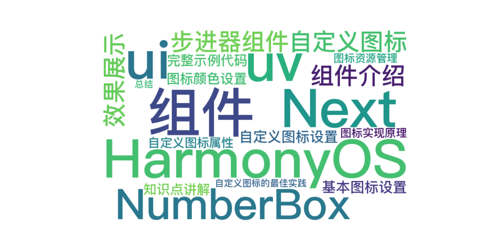

# Harmonyos Next仿uv-ui 组件NumberBox 步进器组件自定义图标



## 1. 组件介绍

NumberBox步进器组件支持自定义加减按钮的图标，使开发者能够根据应用的设计风格定制按钮外观。本文将详细介绍如何在HarmonyOS NEXT中设置和使用NumberBox步进器的自定义图标功能。

## 2. 效果展示


## 3. 自定义图标设置

### 3.1 基本图标设置

在NumberBox组件中，通过`minusIcon`和`plusIcon`属性可以设置减少和增加按钮的自定义图标：

```typescript
NumberBox({
  value: this.value,
  minusIcon: '/common/icons/minus.png',  // 设置减少按钮图标
  plusIcon: '/common/icons/plus.png',    // 设置增加按钮图标
  onChange: (value: number) => {
    this.value = value;
  }
})
```

### 3.2 图标颜色设置

自定义图标可以与`iconColor`属性结合使用，控制图标的颜色：

```typescript
NumberBox({
  value: this.value,
  minusIcon: '/common/icons/minus.png',
  plusIcon: '/common/icons/plus.png',
  iconColor: '#ff0000',  // 设置图标颜色为红色
  onChange: (value: number) => {
    this.value = value;
  }
})
```

## 4. 完整示例代码

下面是一个展示不同自定义图标设置的完整示例：

```typescript
// NumberBoxIconDemo.ets
// NumberBox步进器自定义图标示例

import { NumberBox } from '../components/NumberBox';

@Entry
@Component
struct NumberBoxIconDemo {
  @State value1: number = 5;  // 默认图标
  @State value2: number = 5;  // 自定义图标
  @State value3: number = 5;  // 自定义图标+颜色
  @State value4: number = 5;  // 不同风格图标

  build() {
    Column() {
      // 标题
      Text('NumberBox 自定义图标示例')
        .fontSize(20)
        .fontWeight(FontWeight.Bold)
        .margin({ bottom: 20 })
      
      // 默认图标
      Row() {
        Text('默认图标')
          .width('40%')
          .fontSize(16)
        NumberBox({
          value: this.value1,
          onChange: (value: number) => {
            this.value1 = value;
          }
        })
      }
      .width('100%')
      .justifyContent(FlexAlign.SpaceBetween)
      .alignItems(VerticalAlign.Center)
      .padding(10)
      
      // 自定义图标
      Row() {
        Text('自定义图标')
          .width('40%')
          .fontSize(16)
        NumberBox({
          value: this.value2,
          minusIcon: '/common/icons/minus.png',
          plusIcon: '/common/icons/plus.png',
          onChange: (value: number) => {
            this.value2 = value;
          }
        })
      }
      .width('100%')
      .justifyContent(FlexAlign.SpaceBetween)
      .alignItems(VerticalAlign.Center)
      .padding(10)
      
      // 自定义图标+颜色
      Row() {
        Text('自定义图标+颜色')
          .width('40%')
          .fontSize(16)
        NumberBox({
          value: this.value3,
          minusIcon: '/common/icons/minus.png',
          plusIcon: '/common/icons/plus.png',
          buttonColor: '#ff6b00',  // 橙色按钮
          iconColor: '#ffffff',     // 白色图标
          onChange: (value: number) => {
            this.value3 = value;
          }
        })
      }
      .width('100%')
      .justifyContent(FlexAlign.SpaceBetween)
      .alignItems(VerticalAlign.Center)
      .padding(10)
      
      // 不同风格图标
      Row() {
        Text('不同风格图标')
          .width('40%')
          .fontSize(16)
        NumberBox({
          value: this.value4,
          minusIcon: '/common/icons/remove.png',  // 减号图标
          plusIcon: '/common/icons/add.png',      // 加号图标
          onChange: (value: number) => {
            this.value4 = value;
          }
        })
      }
      .width('100%')
      .justifyContent(FlexAlign.SpaceBetween)
      .alignItems(VerticalAlign.Center)
      .padding(10)
      
      // 显示当前值
      Column() {
        Text('当前值：')
          .fontSize(16)
          .fontWeight(FontWeight.Bold)
          .margin({ top: 20, bottom: 10 })
        
        Text('默认图标值: ' + this.value1)
          .fontSize(14)
          .margin({ bottom: 5 })
        
        Text('自定义图标值: ' + this.value2)
          .fontSize(14)
          .margin({ bottom: 5 })
        
        Text('自定义图标+颜色值: ' + this.value3)
          .fontSize(14)
          .margin({ bottom: 5 })
        
        Text('不同风格图标值: ' + this.value4)
          .fontSize(14)
      }
      .width('100%')
      .alignItems(HorizontalAlign.Center)
      .margin({ top: 20 })
    }
    .width('100%')
    .padding(16)
  }
}
```

## 5. 知识点讲解

### 5.1 自定义图标属性

NumberBox组件提供了以下自定义图标相关的属性：

1. **minusIcon**：减少按钮的自定义图标路径，字符串类型，默认为空（使用文本'-'）。
2. **plusIcon**：增加按钮的自定义图标路径，字符串类型，默认为空（使用文本'+'）。
3. **iconColor**：图标颜色，适用于默认文本图标和自定义图标，默认为'#FFFFFF'。

### 5.2 图标实现原理

NumberBox组件内部根据是否设置了自定义图标来决定显示方式：

```typescript
// 减少按钮
Button({ type: ButtonType.Normal }) {
  if (this.minusIcon) {
    Image(this.minusIcon)
      .width(16)
      .height(16)
      .fillColor(this.iconColor)
  } else {
    Text('-')
      .fontSize(16)
      .fontColor(this.iconColor)
  }
}

// 增加按钮
Button({ type: ButtonType.Normal }) {
  if (this.plusIcon) {
    Image(this.plusIcon)
      .width(16)
      .height(16)
      .fillColor(this.iconColor)
  } else {
    Text('+')
      .fontSize(16)
      .fontColor(this.iconColor)
  }
}
```

### 5.3 图标资源管理

在HarmonyOS NEXT中，图标资源通常放在以下位置：

1. **应用资源目录**：`/common/icons/`目录下，可以通过相对路径访问。
2. **系统资源**：可以使用系统提供的图标资源。

图标文件格式推荐使用PNG或SVG格式，以获得更好的显示效果。

### 5.4 自定义图标的最佳实践

1. **图标尺寸**：建议使用16x16或24x24像素的图标，以适应默认按钮大小。
2. **图标风格**：保持图标风格的一致性，与应用的整体设计风格协调。
3. **可访问性**：确保图标含义清晰，用户容易理解其功能。
4. **颜色适配**：考虑在不同背景色下图标的可见性，必要时调整iconColor。
5. **高清图标**：提供2x或3x分辨率的图标，以适应高分辨率屏幕。

## 6. 总结

本文详细介绍了NumberBox步进器组件的自定义图标功能。通过设置minusIcon和plusIcon属性，开发者可以根据应用的设计需求自定义加减按钮的图标，使NumberBox组件更好地融入应用的整体设计风格。自定义图标与其他样式属性（如buttonColor和iconColor）的结合使用，可以实现更加丰富和个性化的视觉效果。

在实际应用中，应根据具体的设计需求选择合适的图标，并注意图标的尺寸、风格和可访问性，确保用户能够清晰地理解按钮的功能。同时，自定义图标的设置也应考虑到不同状态下的视觉反馈，提供一致且直观的用户体验。

在下一篇文章中，我们将介绍NumberBox组件的事件处理功能，包括如何处理值变化、输入框聚焦和失焦等事件。
