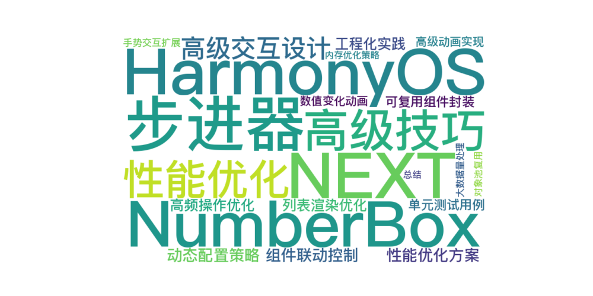

# HarmonyOS NEXT NumberBox 步进器高级技巧与性能优化



## 一、高级交互设计

### 1. 组件联动控制

```typescript
// 与Slider双向绑定
@State value: number = 50

Slider({
  value: this.value,
  onChange: (v) => this.value = v
})

NumberBox({
  value: this.value,
  onChange: (v) => this.value = v
})
```

### 2. 动态配置策略

```typescript
// 根据用户权限动态配置
NumberBox({
  min: this.userLevel > 1 ? 10 : 0,
  max: this.userLevel > 2 ? 100 : 50,
  disabled: !hasEditPermission
})
```

## 二、性能优化方案

### 1. 高频操作优化

```typescript
// 防抖处理（300ms）
private debounceUpdate = (value: number) => {
  clearTimeout(this.timer)
  this.timer = setTimeout(() => {
    this.saveToCloud(value)
  }, 300)
}

NumberBox({
  onChange: (v) => this.debounceUpdate(v)
})
```

### 2. 列表渲染优化

```typescript
// 虚拟列表懒加载
List({ scroller: this.scroller }) {
  ForEach(this.data, (item) => {
    ListItem() {
      NumberBox({
        value: item.count,
        onChange: (v) => this.updateItem(v)
      })
    }
  })
}
.onVisibleAreaChange((ratio) => {
  // 动态加载可见项数据
})
```

## 三、工程化实践

### 1. 可复用组件封装

```typescript
@Component
struct SmartNumberBox {
  @Prop value: number
  @Prop min: number = 0
  @Prop max: number = 100

  build() {
    NumberBox({
      value: this.value,
      min: this.min,
      max: this.max,
      onChange: (v) => this.value = v
    })
  }
}
```

### 2. 单元测试用例

```typescript
describe('NumberBox Test', () => {
  it('should respect min value', () => {
    const wrapper = new NumberBoxWrapper({ min: 5 })
    wrapper.simulateChange(3)
    expect(wrapper.value).toEqual(5)
  })
})
```

## 四、高级动画实现

### 1. 数值变化动画

```typescript
@State scale: number = 1

NumberBox({
  onChange: (v) => {
    this.scale = 1.2
    animateTo({ duration: 300 }, () => {
      this.scale = 1
    })
  }
})
.scale({ x: this.scale })
```

### 2. 手势交互扩展

```typescript
GestureGroup(Gesture.Tap().onAction(() => {
  // 双击重置
})).onClick(() => {
  this.value = this.defaultValue
})
```

## 五、内存优化策略

### 1. 大数据量处理

```typescript
// 分页加载策略
LazyForEach(this.dataSource, (item) => {
  NumberBox({
    value: item.value,
    onChange: this.updateItem
  })
})
```

### 2. 对象池复用

```typescript
const numberBoxPool = new RecyclePool(() => {
  return new NumberBoxComponent()
}, 10)

function getNumberBox() {
  return numberBoxPool.get()
}
```

## 六、总结

本文深入探讨了 NumberBox 的高级应用技巧，涵盖性能优化、工程化实践、动画实现等进阶主题。通过合理应用这些方案，可以显著提升组件的交互体验和运行效率，满足复杂业务场景的需求。建议开发者根据实际业务特点选择合适的优化策略。
