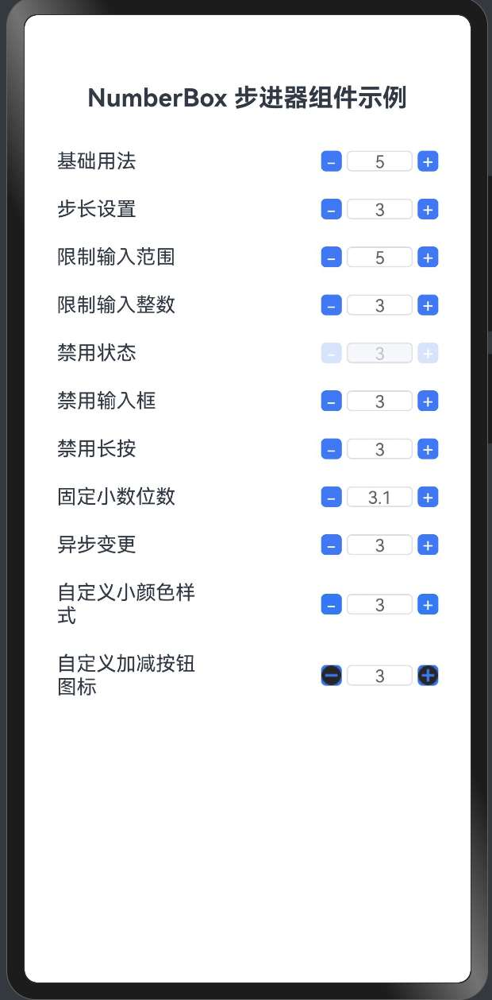

# Harmonyos Next仿uv-ui 组件 NumberBox 步进器组件样式定制


## 1. 组件介绍

NumberBox步进器组件提供了丰富的样式定制选项，允许开发者根据应用的设计风格自定义组件的外观。本文将详细介绍如何在HarmonyOS NEXT中定制NumberBox步进器的样式，包括按钮颜色、图标颜色、尺寸等方面。

## 2. 效果展示





## 3. 样式定制选项

### 3.1 按钮颜色设置

通过`buttonColor`属性可以设置按钮的背景颜色：

```typescript
NumberBox({
  value: this.value,
  buttonColor: '#007aff',  // 设置按钮颜色为蓝色
  onChange: (value: number) => {
    this.value = value;
  }
})
```

### 3.2 图标颜色设置

通过`iconColor`属性可以设置按钮上图标（加号、减号）的颜色：

```typescript
NumberBox({
  value: this.value,
  iconColor: '#ffffff',  // 设置图标颜色为白色
  onChange: (value: number) => {
    this.value = value;
  }
})
```

### 3.3 尺寸设置

通过`inputWidth`和`buttonSize`属性可以设置输入框宽度和按钮大小：

```typescript
NumberBox({
  value: this.value,
  inputWidth: '80px',   // 设置输入框宽度
  buttonSize: '40px',   // 设置按钮大小
  onChange: (value: number) => {
    this.value = value;
  }
})
```

### 3.4 边框显示控制

通过`showBorder`属性可以控制是否显示输入框的边框：

```typescript
NumberBox({
  value: this.value,
  showBorder: false,  // 不显示输入框边框
  onChange: (value: number) => {
    this.value = value;
  }
})
```

## 4. 完整示例代码

下面是一个展示不同样式定制的完整示例：

```typescript
// NumberBoxStyleDemo.ets
// NumberBox步进器样式定制示例

import { NumberBox } from '../components/NumberBox';

@Entry
@Component
struct NumberBoxStyleDemo {
  @State value1: number = 5;  // 默认样式
  @State value2: number = 5;  // 自定义按钮颜色
  @State value3: number = 5;  // 自定义尺寸
  @State value4: number = 5;  // 无边框样式
  @State value5: number = 5;  // 组合样式

  build() {
    Column() {
      // 标题
      Text('NumberBox 样式定制示例')
        .fontSize(20)
        .fontWeight(FontWeight.Bold)
        .margin({ bottom: 20 })
      
      // 默认样式
      Row() {
        Text('默认样式')
          .width('40%')
          .fontSize(16)
        NumberBox({
          value: this.value1,
          onChange: (value: number) => {
            this.value1 = value;
          }
        })
      }
      .width('100%')
      .justifyContent(FlexAlign.SpaceBetween)
      .alignItems(VerticalAlign.Center)
      .padding(10)
      
      // 自定义按钮颜色
      Row() {
        Text('自定义按钮颜色')
          .width('40%')
          .fontSize(16)
        NumberBox({
          value: this.value2,
          buttonColor: '#ff6b00',  // 橙色按钮
          iconColor: '#ffffff',     // 白色图标
          onChange: (value: number) => {
            this.value2 = value;
          }
        })
      }
      .width('100%')
      .justifyContent(FlexAlign.SpaceBetween)
      .alignItems(VerticalAlign.Center)
      .padding(10)
      
      // 自定义尺寸
      Row() {
        Text('自定义尺寸')
          .width('40%')
          .fontSize(16)
        NumberBox({
          value: this.value3,
          inputWidth: '80px',  // 宽输入框
          buttonSize: '40px',   // 大按钮
          onChange: (value: number) => {
            this.value3 = value;
          }
        })
      }
      .width('100%')
      .justifyContent(FlexAlign.SpaceBetween)
      .alignItems(VerticalAlign.Center)
      .padding(10)
      
      // 无边框样式
      Row() {
        Text('无边框样式')
          .width('40%')
          .fontSize(16)
        NumberBox({
          value: this.value4,
          showBorder: false,  // 不显示边框
          onChange: (value: number) => {
            this.value4 = value;
          }
        })
      }
      .width('100%')
      .justifyContent(FlexAlign.SpaceBetween)
      .alignItems(VerticalAlign.Center)
      .padding(10)
      
      // 组合样式
      Row() {
        Text('组合样式')
          .width('40%')
          .fontSize(16)
        NumberBox({
          value: this.value5,
          buttonColor: '#009688',  // 绿色按钮
          iconColor: '#ffffff',     // 白色图标
          inputWidth: '70px',       // 自定义输入框宽度
          buttonSize: '35px',       // 自定义按钮大小
          showBorder: true,         // 显示边框
          onChange: (value: number) => {
            this.value5 = value;
          }
        })
      }
      .width('100%')
      .justifyContent(FlexAlign.SpaceBetween)
      .alignItems(VerticalAlign.Center)
      .padding(10)
    }
    .width('100%')
    .padding(16)
  }
}
```

## 5. 知识点讲解

### 5.1 样式定制属性

NumberBox组件提供了以下样式定制属性：

1. **buttonColor**：按钮背景颜色，默认为'#2979ff'。
2. **iconColor**：按钮图标颜色，默认为'#FFFFFF'。
3. **inputWidth**：输入框宽度，可以是数字（如60）或字符串（如'60px'），默认为'60px'。
4. **buttonSize**：按钮大小，可以是数字或字符串，默认为'30px'。
5. **showBorder**：是否显示输入框边框，布尔值，默认为true。

### 5.2 样式应用原理

NumberBox组件内部通过链式调用样式方法来应用样式：

```typescript
// 按钮样式
.width(this.buttonSize)
.height(this.buttonSize)
.backgroundColor(this.buttonColor)
.borderRadius(4)

// 输入框样式
.width(this.inputWidth)
.height(this.buttonSize)
.backgroundColor(this.disabled ? '#F5F7FA' : '#FFFFFF')
.borderRadius(4)
.border(this.showBorder ? {
  width: 1,
  color: this.isFocused ? this.buttonColor : '#DCDFE6',
  radius: 4
} : undefined)
```

### 5.3 响应式样式

NumberBox组件的样式是响应式的，会根据状态变化自动调整：

1. **禁用状态**：通过opacity属性调整透明度，表示禁用状态。
2. **聚焦状态**：输入框聚焦时，边框颜色会变为按钮颜色，提供视觉反馈。
3. **边界值状态**：当值达到最小值或最大值时，相应的按钮会变灰并禁用。

### 5.4 样式定制的最佳实践

1. **保持一致性**：在应用中保持NumberBox样式的一致性，提升用户体验。
2. **遵循设计规范**：样式定制应遵循应用的整体设计规范和色彩系统。
3. **考虑可访问性**：确保按钮和文字之间有足够的对比度，方便用户识别。
4. **适配不同屏幕**：使用相对单位或响应式布局，确保在不同屏幕上显示正常。

## 6. 总结

本文详细介绍了NumberBox步进器组件的样式定制功能。通过设置buttonColor、iconColor、inputWidth、buttonSize和showBorder等属性，可以根据应用的设计需求自定义NumberBox的外观。样式定制不仅可以使组件更好地融入应用的整体设计风格，还可以提升用户体验和交互效果。

在实际应用中，应根据具体的设计需求选择合适的样式配置，并注意与应用的整体风格保持一致。同时，样式定制也应考虑到不同状态下的视觉反馈，确保用户能够清晰地理解组件的状态和操作方式。

在下一篇文章中，我们将介绍NumberBox组件的自定义图标功能，包括如何设置自定义的加减按钮图标。
