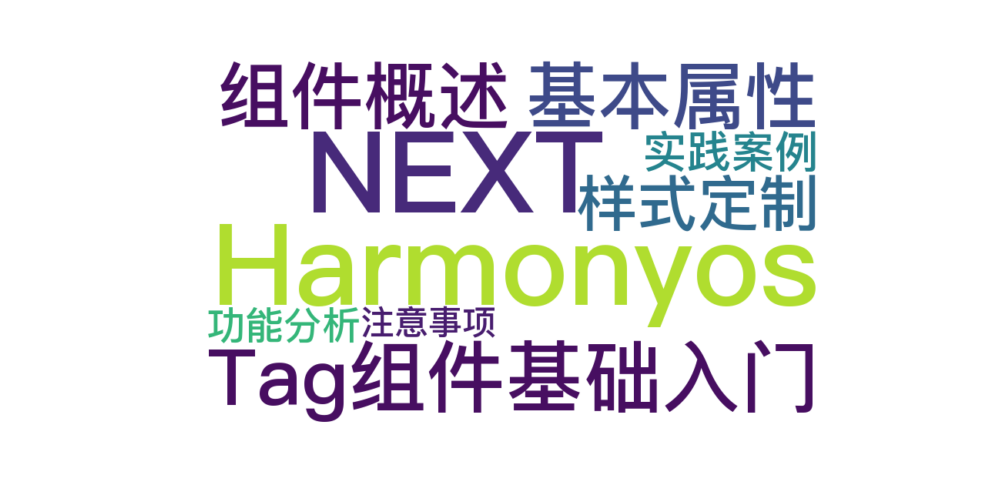
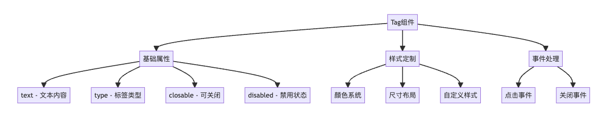
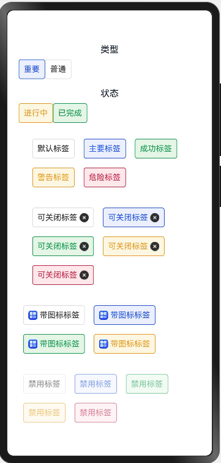

> 温馨提示：本篇博客的详细代码已发布到 [git](https://gitcode.com/nutpi/HarmonyosNext) : https://gitcode.com/nutpi/HarmonyosNext 可以下载运行哦！




 #  HarmonyOS NEXT 仿uv-ui Tag组件开发教程系列(一)

##  Tag组件基础入门

### 1. 组件概述

> Tag组件：轻量级标签展示，用于标记与分类。本教程将指导您如何在HarmonyOS NEXT中实现仿UV-UI的Tag组件。
 


#### 1.1 最终效果演示 




### 2. 基本属性

#### 2.1 核心属性说明

| 属性名 | 类型 | 默认值 | 说明 |
|--------|------|--------|------|
| text | string | - | 标签显示的文本内容 |
| type | string | 'default' | 标签类型，可选值：default/primary/success/warning/danger |
| closable | boolean | false | 是否可关闭 |
| disabled | boolean | false | 是否禁用 |
| icon | string \| Resource | - | 图标资源 |

#### 2.2 基础示例

```typescript
// 基础标签示例
Flex({ wrap: FlexWrap.Wrap }) {
    Tag({ text: '默认标签' })
    Tag({ text: '主要标签', type: 'primary' })
    Tag({ text: '成功标签', type: 'success' })
    Tag({ text: '警告标签', type: 'warning' })
    Tag({ text: '危险标签', type: 'danger' })
}
```

### 3. 样式定制

#### 3.1 颜色系统

Tag组件内置了一套完整的颜色系统，包括：
- 文本颜色（getTextColor）
- 背景颜色（getBackgroundColor）
- 边框颜色（getBorderColor）
- 悬停效果颜色（getHoverBackgroundColor）

```typescript
// 颜色配置示例
private getTextColor(): string {
    const colors = {
        default: '#333333',
        primary: '#2468f2',
        success: '#18a058',
        warning: '#f0a020',
        danger: '#d03050'
    }
    return colors[this.type] || colors.default
}
```

#### 3.2 布局与间距

Tag组件支持灵活的布局配置：

```typescript
Row() {
    // 图标布局
    if (this.icon) {
        Image(this.icon)
            .width(16)
            .height(16)
            .margin({ right: 4 })
    }
    
    // 文本布局
    Text(this.text)
        .fontSize(14)
        .fontColor(this.getTextColor())
}
.padding(8)
.borderRadius(4)
```

### 4. 实践案例

#### 4.1 可关闭标签

```typescript
Tag({
    text: '可关闭标签',
    closable: true,
    onCloseTag: () => {
        console.info('标签被关闭')
    }
})
```

#### 4.2 带图标标签

```typescript
Tag({
    text: '带图标标签',
    type: 'primary',
    icon: $r('app.media.startIcon')
})
```

#### 4.3 禁用状态

```typescript
Tag({
    text: '禁用标签',
    type: 'warning',
    disabled: true
})
```

### 5. 功能分析

1. **类型选择**：根据信息的重要程度选择合适的type
   - default：普通信息
   - primary：主要信息
   - success：成功状态
   - warning：警告信息
   - danger：错误或危险信息

2. **布局建议**：
   - 使用Flex布局实现灵活的标签组排列
   - 合理使用padding和margin控制间距
   - 注意标签组的换行处理

3. **交互设计**：
   - 可关闭标签添加适当的关闭回调
   - 禁用状态下注意视觉反馈
   - 合理使用图标增强可读性

### 6. 注意事项

1. 确保传入的type值在预定义范围内
2. 图标资源需要提前在资源文件中定义
3. 关闭事件处理需要考虑状态同步
4. 样式定制时注意保持视觉一致性

下一篇教程将介绍Tag组件的进阶特性和高级用法，敬请期待！
