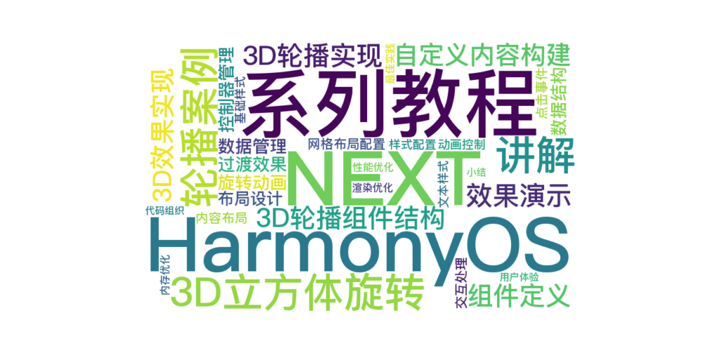

> 温馨提示：本篇博客的详细代码已发布到 [git](https://gitcode.com/nutpi/HarmonyosNext) : https://gitcode.com/nutpi/HarmonyosNext 可以下载运行哦！



# HarmonyOS NEXT系列教程之3D立方体旋转轮播案例讲解之3D轮播实现
## 效果演示


## 1. 3D轮播组件结构

### 1.1 组件定义
```typescript
CubeRotateAnimationSwiper({
    items: item,
    cubeSwiperController: this.cubeSwiperControllers[index],
    swiperItemSlotParam: (item: MySwiperItem) => {
        this.mySwiperItem(item);
    }
})
```

### 1.2 自定义内容构建
```typescript
@Builder
mySwiperItem(item: MySwiperItem) {
    Stack({ alignContent: Alignment.TopStart }) {
        Rect()
            .width($r('app.string.cube_animation_full_size'))
            .height($r('app.string.cube_animation_full_size'))
            .fill($r('app.color.cube_animation_mask'))
            .fillOpacity($r('app.float.cube_animation_mask_opacity'))

        Column() {
            Text(item.title)
            Text(item.subTitle)
        }
    }
}
```

## 2. 3D效果实现

### 2.1 旋转动画
```typescript
.rotate({
    x: 0,
    y: 1,
    z: 0,
    angle: this.angleList[index],
    centerX: this.centerXList[index],
    centerY: '50%',
    centerZ: 0,
    perspective: 0
})
```

### 2.2 过渡效果
```typescript
customContentTransition({
    timeout: 1000,
    transition: (proxy: SwiperContentTransitionProxy) => {
        let angle = proxy.position * 90;
        this.angleList[proxy.index] = angle;
    }
})
```

## 3. 数据管理

### 3.1 数据结构
```typescript
interface MySwiperItem {
    title: string;
    subTitle: string;
    image: Resource;
}
```

### 3.2 控制器管理
```typescript
private cubeSwiperControllers: CubeSwiperController[] = [];

// 初始化控制器
SWIPER_LIST.forEach((swiperItems: MySwiperItem[]) => {
    this.cubeSwiperControllers.push(new CubeSwiperController());
})
```

## 4. 布局设计

### 4.1 网格布局配置
```typescript
layoutOptions: GridLayoutOptions = {
    regularSize: [1, 1],
    onGetRectByIndex: (index: number) => {
        if (index == 0) {
            return [0, 0, 2, 1]
        } else if (index == 1) {
            return [0, 1, 1, 1]
        } else {
            return [1, 1, 1, 1]
        }
    }
};
```

### 4.2 内容布局
```typescript
Stack({ alignContent: Alignment.TopStart }) {
    // 背景遮罩
    Rect()
    // 内容区域
    Column() {
        Text(item.title)
        Text(item.subTitle)
    }
}
```

## 5. 交互处理

### 5.1 点击事件
```typescript
.onClick(() => {
    promptAction.showToast({
        message: $r('app.string.cube_animation_toast'),
    });
})
```

### 5.2 动画控制
```typescript
// 自动播放
.autoPlay(true)
// 循环播放
.loop(true)
```

## 6. 样式配置

### 6.1 基础样式
```typescript
.width($r('app.string.cube_animation_full_size'))
.height($r('app.string.cube_animation_full_size'))
.backgroundImage(item.image)
.backgroundImageSize(ImageSize.Cover)
```

### 6.2 文本样式
```typescript
Text(item.title)
    .fontColor($r('app.color.cube_animation_text_light'))
    .fontSize($r('app.integer.cube_animation_text_large'))
    .fontWeight(FontWeight.Bold)
```

## 7. 性能优化

### 7.1 渲染优化
1. 使用@Builder装饰器
2. 合理使用状态管理
3. 优化动画计算

### 7.2 内存优化
1. 及时释放资源
2. 控制图片大小
3. 优化数据结构

## 8. 最佳实践

### 8.1 代码组织
1. 组件封装
2. 样式分离
3. 逻辑解耦
4. 资源管理

### 8.2 用户体验
1. 流畅的动画
2. 合理的交互
3. 清晰的层次
4. 优雅的过渡

## 9. 小结

本篇教程详细介绍了：
1. 3D轮播组件的实现
2. 动画效果的处理
3. 数据管理方式
4. 布局设计方案
5. 性能优化策略

下一篇将介绍热门模块的实现细节。
