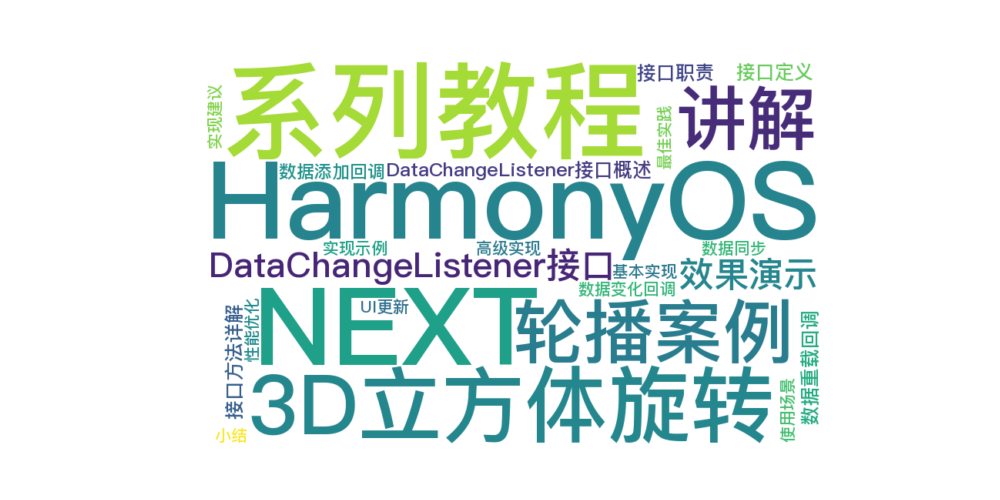

> 温馨提示：本篇博客的详细代码已发布到 [git](https://gitcode.com/nutpi/HarmonyosNext) : https://gitcode.com/nutpi/HarmonyosNext 可以下载运行哦！



# HarmonyOS NEXT系列教程之3D立方体旋转轮播案例讲解之DataChangeListener接口
## 效果演示


## 1. DataChangeListener接口概述

### 1.1 接口定义
```typescript
interface DataChangeListener {
    onDataReloaded(): void;
    onDataAdd(index: number): void;
    onDataChange(index: number): void;
    onDataDelete(index: number): void;
    onDataMove(from: number, to: number): void;
}
```

### 1.2 接口职责
1. 定义数据变化的回调方法
2. 提供标准的监听接口
3. 支持多种数据操作场景
4. 确保数据变化的可追踪性

## 2. 接口方法详解

### 2.1 数据重载回调
```typescript
onDataReloaded(): void;
```
- 触发时机：整体数据更新
- 使用场景：初始化或重置数据
- 特点：不需要参数

### 2.2 数据添加回调
```typescript
onDataAdd(index: number): void;
```
- 触发时机：新增数据时
- 参数：index - 新增位置
- 使用场景：动态添加数据

### 2.3 数据变化回调
```typescript
onDataChange(index: number): void;
```
- 触发时机：更新数据时
- 参数：index - 更新位置
- 使用场景：修改现有数据

## 3. 实现示例

### 3.1 基本实现
```typescript
class MyListener implements DataChangeListener {
    onDataReloaded(): void {
        console.log('Data reloaded');
    }

    onDataAdd(index: number): void {
        console.log(`Data added at ${index}`);
    }

    onDataChange(index: number): void {
        console.log(`Data changed at ${index}`);
    }

    onDataDelete(index: number): void {
        console.log(`Data deleted at ${index}`);
    }

    onDataMove(from: number, to: number): void {
        console.log(`Data moved from ${from} to ${to}`);
    }
}
```

### 3.2 高级实现
```typescript
class AdvancedListener implements DataChangeListener {
    private updateUI: () => void;

    constructor(updateCallback: () => void) {
        this.updateUI = updateCallback;
    }

    onDataReloaded(): void {
        console.log('Reloading data...');
        this.updateUI();
    }

    onDataAdd(index: number): void {
        console.log(`Adding data at ${index}`);
        this.updateUI();
    }

    // ... 其他方法实现
}
```

## 4. 使用场景

### 4.1 UI更新
```typescript
class UIComponent {
    private listener: DataChangeListener;

    constructor() {
        this.listener = new MyListener();
        dataSource.registerDataChangeListener(this.listener);
    }

    private updateUI(): void {
        // 更新UI逻辑
    }
}
```

### 4.2 数据同步
```typescript
class DataSyncListener implements DataChangeListener {
    onDataChange(index: number): void {
        // 同步到服务器
        this.syncToServer(index);
    }

    private syncToServer(index: number): void {
        // 同步实现
    }
}
```

## 5. 最佳实践

### 5.1 实现建议
1. 保持方法实现简单
2. 避免阻塞操作
3. 处理异常情况
4. 添加必要的日志

### 5.2 性能优化
1. 减少不必要的UI更新
2. 合并多次操作
3. 使用防抖或节流
4. 优化回调逻辑

## 6. 小结

本篇教程详细介绍了DataChangeListener接口：
1. 接口定义和职责
2. 方法详解
3. 实现示例
4. 使用场景和最佳实践

下一篇将介绍完整的实战应用示例。
