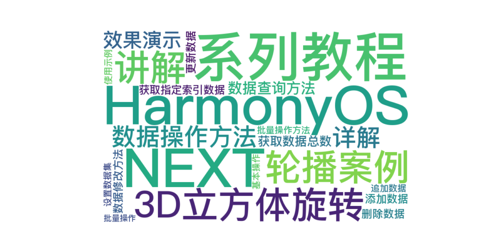

> 温馨提示：本篇博客的详细代码已发布到 [git](https://gitcode.com/nutpi/HarmonyosNext) : https://gitcode.com/nutpi/HarmonyosNext 可以下载运行哦！



# HarmonyOS NEXT系列教程之3D立方体旋转轮播案例讲解之数据操作方法详解
## 效果演示


## 1. 数据查询方法

### 1.1 获取数据总数
```typescript
public totalCount(): number {
    return this.originDataArray.length;
}
```
- 作用：返回数据数组的长度
- 返回值：number类型
- 使用场景：需要知道数据总量时

### 1.2 获取指定索引数据
```typescript
public getData(index: number): ESObject {
    return this.originDataArray[index];
}
```
- 作用：获取指定位置的数据
- 参数：index - 数组索引
- 返回值：ESObject类型的数据对象

## 2. 数据修改方法

### 2.1 添加数据
```typescript
public addData(index: number, data: ESObject): void {
    this.originDataArray.splice(index, 0, data);
    this.notifyDataReload();
}
```
- 作用：在指定位置插入新数据
- 参数：
  - index：插入位置
  - data：要插入的数据
- 特点：会触发数据重载通知

### 2.2 删除数据
```typescript
public deleteData(index: number): void {
    this.originDataArray.splice(index, 1);
    this.notifyDataReload();
}
```
- 作用：删除指定位置的数据
- 参数：index - 要删除的位置
- 特点：会触发数据重载通知

### 2.3 更新数据
```typescript
public updateData(index: number, data: ESObject): void {
    this.originDataArray.splice(index, 1, data);
    this.notifyDataChange(index);
}
```
- 作用：更新指定位置的数据
- 参数：
  - index：更新位置
  - data：新的数据
- 特点：只触发数据变化通知

## 3. 批量操作方法

### 3.1 设置数据集
```typescript
public setData(data: ESObject[]): void {
    this.originDataArray = data;
    this.notifyDataReload();
}
```
- 作用：替换整个数据集
- 参数：data - 新的数据数组
- 特点：会触发数据重载通知

### 3.2 追加数据
```typescript
public pushData(data: ESObject): void {
    this.originDataArray.push(data);
    this.notifyDataAdd(this.originDataArray.length - 1);
}
```
- 作用：在数组末尾添加数据
- 参数：data - 要添加的数据
- 特点：触发数据添加通知

## 4. 使用示例

### 4.1 基本操作
```typescript
const dataSource = new SwiperDataSource();

// 设置初始数据
dataSource.setData([item1, item2, item3]);

// 添加新数据
dataSource.addData(0, newItem);

// 更新数据
dataSource.updateData(1, updatedItem);

// 删除数据
dataSource.deleteData(2);
```

### 4.2 批量操作
```typescript
// 替换所有数据
dataSource.setData(newDataArray);

// 追加数据
dataSource.pushData(additionalItem);
```

## 5. 小结

本篇教程详细介绍了数据源的核心操作方法：
1. 数据查询方法
2. 数据修改方法
3. 批量操作方法
4. 使用示例

下一篇将介绍数据变化通知机制的实现。
