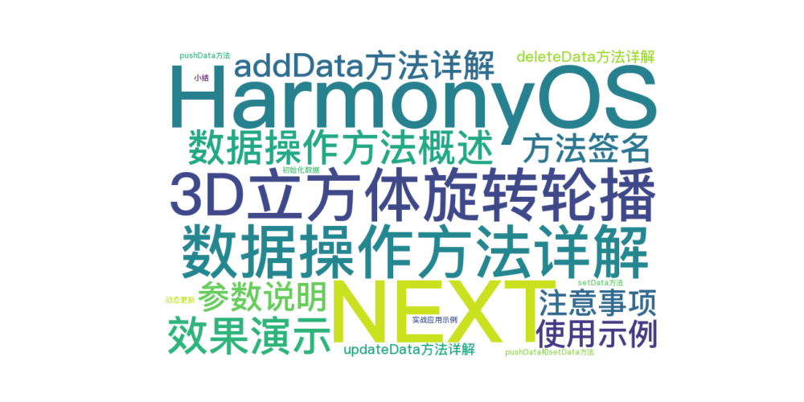
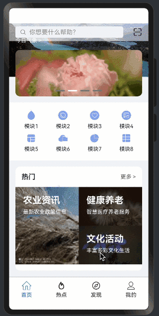

> 温馨提示：本篇博客的详细代码已发布到 [git](https://gitcode.com/nutpi/HarmonyosNext) : https://gitcode.com/nutpi/HarmonyosNext 可以下载运行哦！



# HarmonyOS NEXT系列教程之3D立方体旋转轮播案例讲解（二）：数据操作方法详解
## 效果演示



## 1. 数据操作方法概述

CubeSwiperController提供了五个核心数据操作方法：
- addData：插入数据
- deleteData：删除数据
- updateData：更新数据
- pushData：追加数据
- setData：设置数据集

## 2. addData方法详解

### 2.1 方法签名
```typescript
addData: (index: number, data: ESObject) => void = () => {};
```

### 2.2 参数说明
- index：插入位置的索引，从0开始
- data：要插入的数据对象

### 2.3 使用示例
```typescript
controller.addData(0, {
    title: "新项目",
    subTitle: "副标题",
    image: $r('app.media.icon')
});
```

### 2.4 注意事项
1. index不能超过数组长度
2. data对象需符合数据结构要求
3. 插入操作会引起视图更新

## 3. deleteData方法详解

### 3.1 方法签名
```typescript
deleteData: (index: number) => void = () => {};
```

### 3.2 参数说明
- index：要删除项的索引位置

### 3.3 使用示例
```typescript
controller.deleteData(0); // 删除第一项
```

### 3.4 注意事项
1. 确保index有效
2. 删除后数组长度会减少
3. 其他项的索引会自动调整

## 4. updateData方法详解

### 4.1 方法签名
```typescript
updateData: (index: number, data: ESObject) => void = () => {};
```

### 4.2 参数说明
- index：要更新项的索引
- data：新的数据对象

### 4.3 使用示例
```typescript
controller.updateData(1, {
    title: "更新的标题",
    subTitle: "更新的副标题",
    image: $r('app.media.newIcon')
});
```

## 5. pushData和setData方法

### 5.1 pushData方法
```typescript
pushData: (data: ESObject) => void = () => {};
```
- 在数组末尾添加新项
- 不需要指定索引
- 适合追加数据的场景

### 5.2 setData方法
```typescript
setData: (data: ESObject[]) => void = () => {};
```
- 替换整个数据集
- 用于批量更新
- 常用于初始化场景

## 6. 实战应用示例

### 6.1 初始化数据
```typescript
// 创建控制器
const controller = new CubeSwiperController();

// 设置初始数据
controller.setData([
    new MySwiperItem("标题1", "副标题1", $r('app.media.img1')),
    new MySwiperItem("标题2", "副标题2", $r('app.media.img2'))
]);
```

### 6.2 动态更新
```typescript
// 添加新项
controller.pushData(new MySwiperItem("新项目", "新副标题", $r('app.media.newImg')));

// 更新特定项
controller.updateData(0, {
    title: "更新后的标题",
    subTitle: "更新后的副标题",
    image: $r('app.media.updatedImg')
});
```

## 7. 小结

本篇教程详细介绍了CubeSwiperController的数据操作方法：
1. 五个核心方法的使用
2. 参数说明和注意事项
3. 实际应用示例
4. 最佳实践建议

下一篇将介绍接口类型系统的设计。
