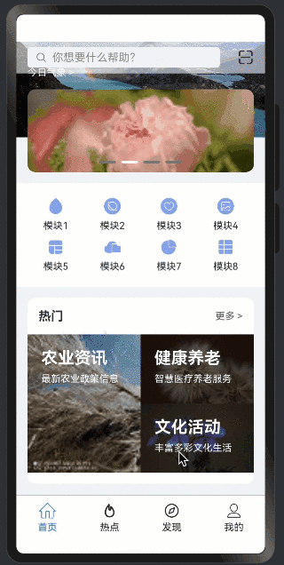

> 温馨提示：本篇博客的详细代码已发布到 [git](https://gitcode.com/nutpi/HarmonyosNext) : https://gitcode.com/nutpi/HarmonyosNext 可以下载运行哦！


# HarmonyOS NEXT系列教程之3D立方体旋转轮播案例讲解之数据源基础概念
## 效果演示



## 1. 什么是BasicDataSource？

BasicDataSource是一个实现了IDataSource接口的基础数据源类，它的主要职责是：
- 管理数据集合
- 处理数据变化监听
- 提供数据操作接口

## 2. 类的基本结构

```typescript
export class SwiperDataSource implements IDataSource {
    private listeners: DataChangeListener[] = [];
    private originDataArray: ESObject[] = [];
    // ... 其他方法
}
```

### 2.1 核心属性
1. `listeners`: 数据变化监听器数组
   - 类型：DataChangeListener[]
   - 作用：存储所有注册的数据变化监听器
   - 访问修饰符：private，确保只能在类内部访问

2. `originDataArray`: 原始数据数组
   - 类型：ESObject[]
   - 作用：存储实际的数据内容
   - 访问修饰符：private，保护数据安全

## 3. 为什么需要数据源？

### 3.1 数据管理的需求
1. 统一的数据访问接口
2. 数据变化的实时通知
3. 数据操作的封装
4. 支持数据监听机制

### 3.2 数据源的优势
1. 解耦数据和视图
2. 提供标准化的数据操作方法
3. 支持数据变化的响应式更新
4. 简化数据管理的复杂度

## 4. 最佳实践

### 4.1 使用建议
1. 始终通过数据源提供的方法操作数据
2. 注意及时注销不需要的监听器
3. 合理处理数据变化通知
4. 避免直接修改原始数据数组

### 4.2 性能考虑
1. 控制监听器数量
2. 避免频繁的数据重载
3. 合理使用批量操作
4. 注意内存管理

## 5. 小结

本篇教程介绍了BasicDataSource的基础概念，包括：
1. 数据源的定义和作用
2. 核心属性的设计
3. 为什么需要数据源
4. 使用建议和最佳实践

下一篇将详细介绍数据源的核心方法实现。
