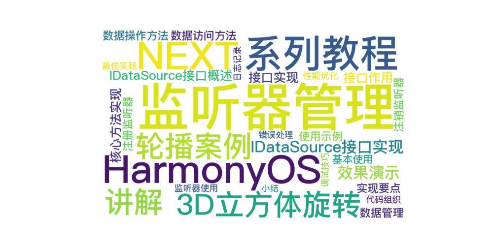

> 温馨提示：本篇博客的详细代码已发布到 [git](https://gitcode.com/nutpi/HarmonyosNext) : https://gitcode.com/nutpi/HarmonyosNext 可以下载运行哦！



# HarmonyOS NEXT系列教程之3D立方体旋转轮播案例讲解之IDataSource接口实现
## 效果演示


## 1. IDataSource接口概述

### 1.1 接口作用
IDataSource接口定义了数据源的标准接口，提供了：
1. 数据访问方法
2. 数据操作方法
3. 监听器管理方法

### 1.2 接口实现
```typescript
export class SwiperDataSource implements IDataSource {
    private listeners: DataChangeListener[] = [];
    private originDataArray: ESObject[] = [];
    // ... 方法实现
}
```

## 2. 核心方法实现

### 2.1 数据访问方法
```typescript
public totalCount(): number {
    return this.originDataArray.length;
}

public getData(index: number): ESObject {
    return this.originDataArray[index];
}
```

### 2.2 数据操作方法
```typescript
public addData(index: number, data: ESObject): void {
    this.originDataArray.splice(index, 0, data);
    this.notifyDataReload();
}

public deleteData(index: number): void {
    this.originDataArray.splice(index, 1);
    this.notifyDataReload();
}
```

## 3. 监听器管理

### 3.1 注册监听器
```typescript
registerDataChangeListener(listener: DataChangeListener): void {
    if (this.listeners.indexOf(listener) < 0) {
        this.listeners.push(listener);
    }
}
```

### 3.2 注销监听器
```typescript
unregisterDataChangeListener(listener: DataChangeListener): void {
    const pos = this.listeners.indexOf(listener)
    if (pos >= 0) {
        this.listeners.splice(pos, 1);
    }
}
```

## 4. 实现要点

### 4.1 数据管理
1. 使用私有数组存储数据
2. 提供标准的访问方法
3. 确保数据操作的原子性
4. 维护数据的一致性

### 4.2 监听器管理
1. 避免重复注册
2. 安全地注销监听器
3. 及时通知数据变化
4. 处理异常情况

## 5. 使用示例

### 5.1 基本使用
```typescript
class MyComponent {
    private dataSource: IDataSource;
    
    constructor() {
        this.dataSource = new SwiperDataSource();
        this.initData();
    }
    
    private initData(): void {
        // 添加初始数据
        this.dataSource.addData(0, {
            title: "测试项",
            value: 100
        });
    }
}
```

### 5.2 监听器使用
```typescript
class MyComponent {
    private listener: DataChangeListener;
    
    constructor() {
        this.listener = {
            onDataReloaded: () => this.updateUI(),
            onDataAdd: (index) => this.handleAdd(index),
            // ... 其他方法
        };
        this.dataSource.registerDataChangeListener(this.listener);
    }
    
    private updateUI(): void {
        // UI更新逻辑
    }
}
```

## 6. 最佳实践

### 6.1 代码组织
1. 清晰的方法命名
2. 适当的注释说明
3. 错误处理机制
4. 类型安全保证

### 6.2 性能优化
1. 避免频繁的数据操作
2. 合理使用批量操作
3. 优化监听器处理
4. 内存管理

## 7. 调试技巧

### 7.1 日志记录
```typescript
public addData(index: number, data: ESObject): void {
    console.log(`Adding data at index ${index}:`, data);
    this.originDataArray.splice(index, 0, data);
    this.notifyDataReload();
}
```

### 7.2 错误处理
```typescript
public getData(index: number): ESObject {
    if (index < 0 || index >= this.originDataArray.length) {
        console.error(`Invalid index: ${index}`);
        return null;
    }
    return this.originDataArray[index];
}
```

## 8. 小结

本篇教程详细介绍了IDataSource接口的实现：
1. 接口设计思路
2. 核心方法实现
3. 监听器管理机制
4. 最佳实践和调试技巧

下一篇将介绍实际应用中的高级特性。
