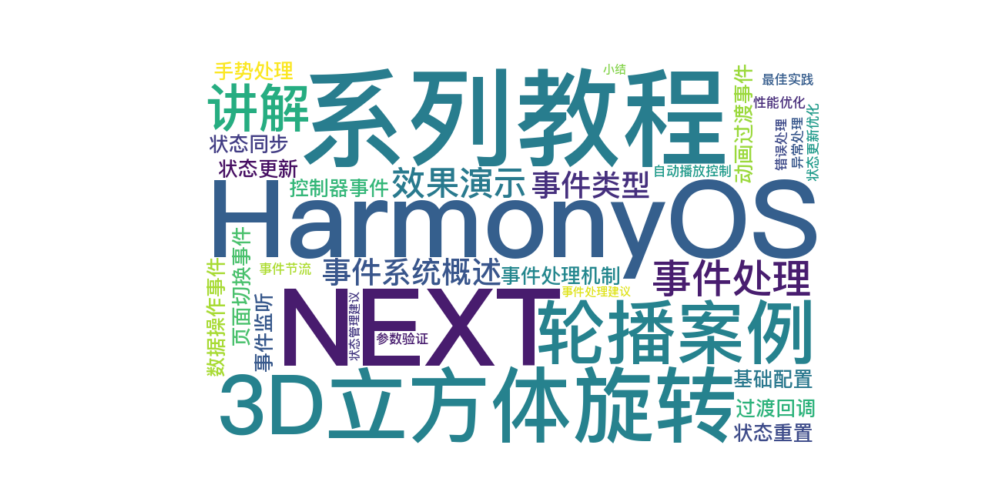

> 温馨提示：本篇博客的详细代码已发布到 [git](https://gitcode.com/nutpi/HarmonyosNext) : https://gitcode.com/nutpi/HarmonyosNext 可以下载运行哦！



# HarmonyOS NEXT系列教程之3D立方体旋转轮播案例讲解之事件处理
## 效果演示


## 1. 事件系统概述

### 1.1 事件类型
1. 页面切换事件
2. 动画过渡事件
3. 状态变化事件
4. 手势交互事件

### 1.2 事件处理机制
```typescript
// 页面切换事件
.onChange((index: number) => {
    this.currentIndex = index;
})

// 动画过渡事件
customContentTransition({
    transition: (proxy: SwiperContentTransitionProxy) => {
        // 处理过渡动画
    }
})
```

## 2. 页面切换事件

### 2.1 事件监听
```typescript
.onChange((index: number) => {
    // 更新当前索引
    this.currentIndex = index;
    
    // 可以在这里添加其他处理逻辑
    // 例如：触发回调、更新UI等
})
```

### 2.2 状态同步
```typescript
@State currentIndex: number = 0;

// 状态更新会触发UI刷新
private updateCurrentIndex(index: number) {
    this.currentIndex = index;
}
```

## 3. 动画过渡事件

### 3.1 过渡回调
```typescript
customContentTransition({
    timeout: 1000,
    transition: (proxy: SwiperContentTransitionProxy) => {
        let angle = 0;
        // 处理不同的滑动方向
        if (proxy.position < 0 && proxy.position > -1) {
            // 向左滑动
            angle = proxy.position * 90;
            this.centerXList[proxy.index] = '100%';
        } else if (proxy.position > 0 && proxy.position < 1) {
            // 向右滑动
            angle = proxy.position * 90;
            this.centerXList[proxy.index] = '0%';
        }
        // 更新旋转角度
        this.angleList[proxy.index] = angle;
    }
})
```

### 3.2 状态更新
```typescript
// 更新旋转角度
this.angleList[proxy.index] = angle;

// 更新旋转中心点
this.centerXList[proxy.index] = centerX;
```

## 4. 控制器事件

### 4.1 数据操作事件
```typescript
// 添加数据
addData: (index: number, data: ESObject) => void = (index: number, data: ESObject) => {
    this.swiperData.addData(index, data);
    this.resetAnimationAttr();
};

// 删除数据
deleteData: (index: number) => void = (index: number) => {
    this.swiperData.deleteData(index);
    this.resetAnimationAttr();
};
```

### 4.2 状态重置
```typescript
resetAnimationAttr() {
    this.angleList = new Array(this.items.length).fill(0);
    this.centerXList = new Array(this.items.length).fill('100%');
}
```

## 5. 手势处理

### 5.1 基础配置
```typescript
Swiper(this.swiperController) {
    // 内容
}
.cachedCount(1)  // 控制缓存数量
.indicator(false)  // 隐藏指示器
```

### 5.2 自动播放控制
```typescript
.autoPlay(this.autoPlay)  // 自动播放
.loop(this.loop)  // 循环播放
.duration(this.duration)  // 动画时长
```

## 6. 错误处理

### 6.1 参数验证
```typescript
if (this.items.length === 0 || this.swiperItemSlotParam === undefined) {
    // 使用默认值
    this.items = IMAGES;
    this.swiperItemSlotParam = this.defaultSwiperItem;
}
```

### 6.2 异常处理
```typescript
try {
    this.swiperData.addData(index, data);
} catch (error) {
    console.error('Failed to add data:', error);
}
```

## 7. 性能优化

### 7.1 事件节流
```typescript
// 使用timeout控制渲染树超时
customContentTransition({
    timeout: 1000,
    transition: (proxy) => {
        // 处理逻辑
    }
})
```

### 7.2 状态更新优化
```typescript
// 批量更新状态
setData: (data: ESObject[]) => void = (data: ESObject[]) => {
    this.swiperData.setData(data);
    this.resetAnimationAttr();
};
```

## 8. 最佳实践

### 8.1 事件处理建议
1. 合理使用事件委托
2. 避免频繁触发事件
3. 优化事件处理逻辑
4. 及时清理事件监听

### 8.2 状态管理建议
1. 集中管理状态
2. 避免重复更新
3. 优化更新逻辑
4. 处理边界情况

## 9. 小结

本篇教程详细介绍了：
1. 事件系统的设计和实现
2. 各类事件的处理方法
3. 性能优化策略
4. 最佳实践建议

下一篇将介绍组件开发的最佳实践总结。
