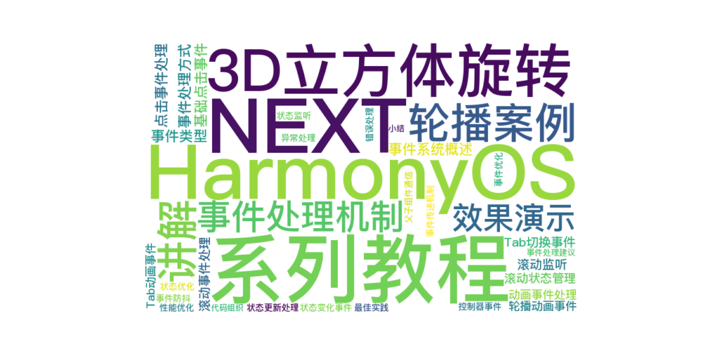

> 温馨提示：本篇博客的详细代码已发布到 [git](https://gitcode.com/nutpi/HarmonyosNext) : https://gitcode.com/nutpi/HarmonyosNext 可以下载运行哦！



# HarmonyOS NEXT系列教程之3D立方体旋转轮播案例讲解之事件处理机制
## 效果演示


## 1. 事件系统概述

### 1.1 事件类型
1. 点击事件
2. 滚动事件
3. 动画事件
4. 状态变化事件

### 1.2 事件处理方式
```typescript
// 点击事件处理
.onClick(() => {
    promptAction.showToast({
        message: $r('app.string.cube_animation_toast'),
    });
})

// 滚动事件处理
.onWillScroll(() => {
    let yOffset = this.scroller.currentOffset().yOffset;
    this.headerOpacity = Math.min(1, yOffset / 100);
})
```

## 2. 点击事件处理

### 2.1 基础点击事件
```typescript
Image(item)
    .onClick(() => {
        promptAction.showToast({
            message: $r('app.string.cube_animation_toast'),
        });
    })
```

### 2.2 Tab切换事件
```typescript
.onClick(() => {
    this.currentIndex = index;
    this.tabsController.changeIndex(index);
})
```

## 3. 滚动事件处理

### 3.1 滚动监听
```typescript
.onWillScroll(() => {
    let yOffset = this.scroller.currentOffset().yOffset;
    this.headerOpacity = Math.min(1, yOffset / 100);
})
```

### 3.2 滚动状态管理
```typescript
private scroller: Scroller = new Scroller();
@State headerOpacity: number = 0;
```

## 4. 动画事件处理

### 4.1 Tab动画事件
```typescript
.onAnimationStart((index: number, targetIndex: number, event: TabsAnimationEvent) => {
    if (index === targetIndex) {
        return;
    }
    this.currentIndex = targetIndex;
})
```

### 4.2 轮播动画事件
```typescript
customContentTransition({
    timeout: 1000,
    transition: (proxy: SwiperContentTransitionProxy) => {
        let angle = proxy.position * 90;
        this.angleList[proxy.index] = angle;
    }
})
```

## 5. 状态变化事件

### 5.1 状态监听
```typescript
@State currentIndex: number = 0;
@State headerOpacity: number = 0;
```

### 5.2 状态更新处理
```typescript
// 更新当前索引
this.currentIndex = index;

// 更新透明度
this.headerOpacity = Math.min(1, yOffset / 100);
```

## 6. 事件传递机制

### 6.1 父子组件通信
```typescript
// 父组件传递事件处理函数
CubeRotateAnimationSwiper({
    items: item,
    cubeSwiperController: this.cubeSwiperControllers[index],
    swiperItemSlotParam: (item: MySwiperItem) => {
        this.mySwiperItem(item);
    }
})
```

### 6.2 控制器事件
```typescript
// 通过控制器切换页面
this.tabsController.changeIndex(index);
```

## 7. 错误处理

### 7.1 事件防抖
```typescript
// 滚动事件防抖
let timer: number = null;
.onWillScroll(() => {
    if (timer) {
        clearTimeout(timer);
    }
    timer = setTimeout(() => {
        let yOffset = this.scroller.currentOffset().yOffset;
        this.headerOpacity = Math.min(1, yOffset / 100);
    }, 16);
})
```

### 7.2 异常处理
```typescript
try {
    this.tabsController.changeIndex(index);
} catch (error) {
    console.error('Tab change failed:', error);
}
```

## 8. 性能优化

### 8.1 事件优化
1. 使用事件委托
2. 避免频繁触发
3. 合理使用防抖

### 8.2 状态优化
1. 减少不必要的状态更新
2. 优化状态传递
3. 合理的更新策略

## 9. 最佳实践

### 9.1 事件处理建议
1. 统一的事件处理方式
2. 清晰的事件命名
3. 合理的错误处理
4. 优化性能消耗

### 9.2 代码组织
1. 事件处理集中管理
2. 状态更新逻辑分离
3. 错误处理规范化
4. 性能优化策略

## 10. 小结

本篇教程详细介绍了：
1. 事件系统的整体设计
2. 各类事件的处理方式
3. 状态变化的管理
4. 错误处理机制
5. 性能优化策略

下一篇将介绍资源管理系统的实现细节。
