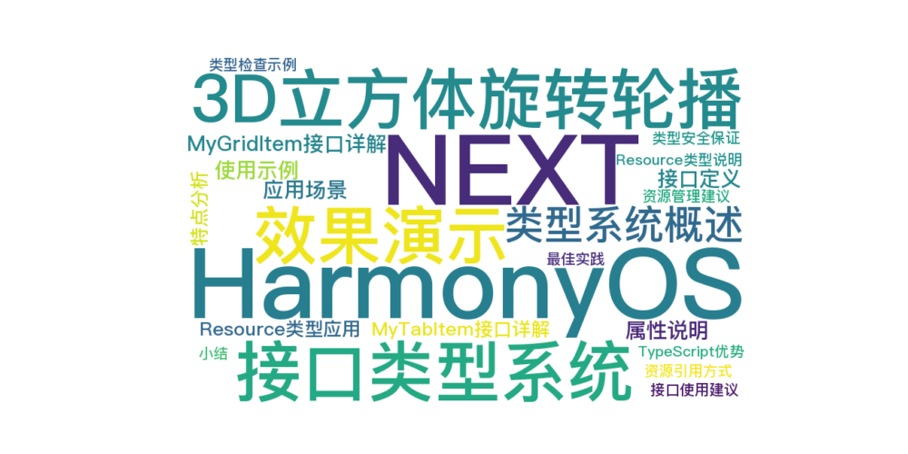

> 温馨提示：本篇博客的详细代码已发布到 [git](https://gitcode.com/nutpi/HarmonyosNext) : https://gitcode.com/nutpi/HarmonyosNext 可以下载运行哦！



# HarmonyOS NEXT系列教程之3D立方体旋转轮播案例讲解（三）：接口类型系统
## 效果演示


## 1. 类型系统概述

本案例中定义了三个主要的接口/类型：
1. MyGridItem：网格项接口
2. MyTabItem：标签项接口
3. MySwiperItem：轮播项类

## 2. MyGridItem接口详解

### 2.1 接口定义
```typescript
export interface MyGridItem {
    icon: Resource
    title: string
}
```

### 2.2 属性说明
- icon：网格项的图标，Resource类型
- title：网格项的标题，字符串类型

### 2.3 使用示例
```typescript
const gridItem: MyGridItem = {
    icon: $r('app.media.grid_icon'),
    title: "功能项"
};
```

### 2.4 应用场景
1. 功能导航网格
2. 应用功能列表
3. 分类展示

## 3. MyTabItem接口详解

### 3.1 接口定义
```typescript
export interface MyTabItem {
    icon: Resource
    selectedIcon: Resource
    title: ResourceStr
}
```

### 3.2 属性说明
- icon：未选中状态的图标
- selectedIcon：选中状态的图标
- title：标签标题，支持国际化

### 3.3 使用示例
```typescript
const tabItem: MyTabItem = {
    icon: $r('app.media.tab_normal'),
    selectedIcon: $r('app.media.tab_selected'),
    title: $r('app.string.tab_title')
};
```

### 3.4 特点分析
1. 双状态图标设计
2. 支持资源引用
3. 支持多语言

## 4. Resource类型应用

### 4.1 Resource类型说明
```typescript
icon: Resource
```
Resource类型的特点：
1. 支持应用资源引用
2. 支持主题适配
3. 支持多分辨率

### 4.2 资源引用方式
```typescript
// 图片资源
$r('app.media.icon_name')

// 字符串资源
$r('app.string.text_key')

// 颜色资源
$r('app.color.color_key')
```

## 5. 类型安全保证

### 5.1 TypeScript优势
1. 编译时类型检查
2. IDE智能提示
3. 代码重构支持

### 5.2 类型检查示例
```typescript
// 正确的类型使用
const validItem: MyGridItem = {
    icon: $r('app.media.icon'),
    title: "标题"
};

// 错误的类型使用（编译器会报错）
const invalidItem: MyGridItem = {
    icon: "invalid_icon", // 错误：应该是Resource类型
    title: 123 // 错误：应该是string类型
};
```

## 6. 最佳实践

### 6.1 接口使用建议
1. 保持接口简单明确
2. 使用TypeScript类型注解
3. 遵循单一职责原则
4. 做好注释文档

### 6.2 资源管理建议
1. 统一管理资源引用
2. 使用有意义的资源名称
3. 考虑多语言支持
4. 注意资源文件大小

## 7. 小结

本篇教程详细介绍了：
1. 三个核心接口/类型的设计
2. Resource类型的使用
3. TypeScript类型系统的应用
4. 最佳实践建议

下一篇将介绍MySwiperItem类的具体实现。
