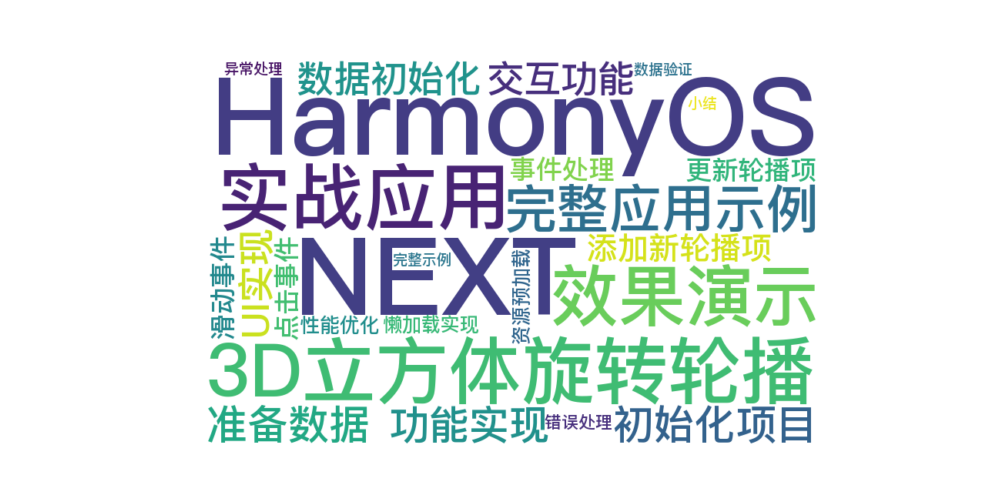

> 温馨提示：本篇博客的详细代码已发布到 [git](https://gitcode.com/nutpi/HarmonyosNext) : https://gitcode.com/nutpi/HarmonyosNext 可以下载运行哦！



# HarmonyOS NEXT系列教程之3D立方体旋转轮播案例讲解（五）：实战应用
## 效果演示


## 1. 完整应用示例

### 1.1 初始化项目
```typescript
// 导入必要的类和接口
import { CubeSwiperController, MySwiperItem } from './DataModel';

// 创建控制器实例
const controller = new CubeSwiperController();
```

### 1.2 准备数据
```typescript
// 准备轮播数据
const swiperData = [
    new MySwiperItem(
        "精选推荐",
        "发现好物",
        $r('app.media.banner1')
    ),
    new MySwiperItem(
        "热门活动",
        "限时特惠",
        $r('app.media.banner2')
    ),
    new MySwiperItem(
        "新品上市",
        "品质优选",
        $r('app.media.banner3')
    )
];
```

## 2. 功能实现

### 2.1 数据初始化
```typescript
@Entry
@Component
struct MainPage {
    private controller: CubeSwiperController = new CubeSwiperController();

    aboutToAppear() {
        // 设置初始数据
        this.controller.setData(swiperData);
    }
}
```

### 2.2 UI实现
```typescript
@Entry
@Component
struct MainPage {
    build() {
        Column() {
            Swiper(this.controller) {
                ForEach(swiperData, (item: MySwiperItem) => {
                    this.SwiperItem(item)
                })
            }
        }
    }

    @Builder
    SwiperItem(item: MySwiperItem) {
        Stack() {
            Image(item.image)
                .width('100%')
                .height('100%')
            
            Column() {
                Text(item.title)
                    .fontSize(20)
                    .fontWeight(FontWeight.Bold)
                Text(item.subTitle)
                    .fontSize(16)
            }
        }
    }
}
```

## 3. 交互功能

### 3.1 添加新轮播项
```typescript
addNewItem() {
    const newItem = new MySwiperItem(
        "新增项目",
        "新项目描述",
        $r('app.media.new_banner')
    );
    this.controller.pushData(newItem);
}
```

### 3.2 更新轮播项
```typescript
updateItem(index: number) {
    const updatedItem = new MySwiperItem(
        "更新的标题",
        "更新的描述",
        $r('app.media.updated_banner')
    );
    this.controller.updateData(index, updatedItem);
}
```

## 4. 事件处理

### 4.1 点击事件
```typescript
handleItemClick(item: MySwiperItem) {
    // 处理点击事件
    console.info(`Clicked item: ${item.title}`);
}
```

### 4.2 滑动事件
```typescript
onPageChange(index: number) {
    // 处理页面切换事件
    console.info(`Current page: ${index}`);
}
```

## 5. 性能优化

### 5.1 懒加载实现
```typescript
LazyForEach(swiperData, (item: MySwiperItem) => {
    this.SwiperItem(item)
}, item => item.title)
```

### 5.2 资源预加载
```typescript
aboutToAppear() {
    // 预加载图片资源
    this.preloadImages([
        $r('app.media.banner1'),
        $r('app.media.banner2'),
        $r('app.media.banner3')
    ]);
}
```

## 6. 错误处理

### 6.1 数据验证
```typescript
validateItem(item: MySwiperItem): boolean {
    if (!item.title || !item.image) {
        console.error('Invalid item data');
        return false;
    }
    return true;
}
```

### 6.2 异常处理
```typescript
try {
    this.controller.addData(0, newItem);
} catch (error) {
    console.error(`Failed to add item: ${error.message}`);
}
```

## 7. 完整示例

```typescript
@Entry
@Component
struct CubeSwiperDemo {
    private controller: CubeSwiperController = new CubeSwiperController();
    
    aboutToAppear() {
        // 初始化数据
        this.controller.setData(swiperData);
    }

    build() {
        Column() {
            // 轮播组件
            Swiper(this.controller) {
                ForEach(swiperData, (item: MySwiperItem) => {
                    this.SwiperItem(item)
                })
            }
            .width('100%')
            .height(300)
            .onChange((index) => this.onPageChange(index))

            // 控制按钮
            Row() {
                Button('添加')
                    .onClick(() => this.addNewItem())
                Button('更新')
                    .onClick(() => this.updateItem(0))
                Button('删除')
                    .onClick(() => this.controller.deleteData(0))
            }
            .padding(10)
        }
    }
}
```

## 8. 小结

本教程系列已经完整介绍了：
1. 控制器的设计和实现
2. 数据模型的定义
3. UI组件的开发
4. 交互功能的实现
5. 性能优化方案
6. 错误处理机制

通过这个实战案例，你应该已经掌握了如何开发一个完整的3D立方体轮播组件。
