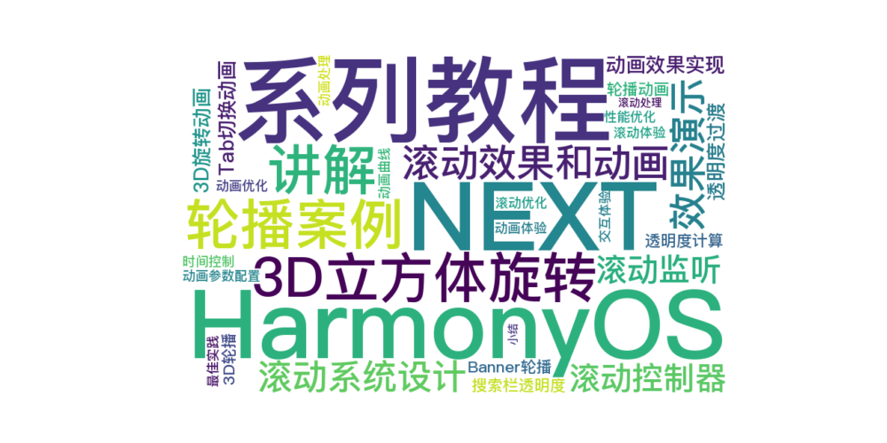

> 温馨提示：本篇博客的详细代码已发布到 [git](https://gitcode.com/nutpi/HarmonyosNext) : https://gitcode.com/nutpi/HarmonyosNext 可以下载运行哦！



# HarmonyOS NEXT系列教程之3D立方体旋转轮播案例讲解之滚动效果和动画
## 效果演示


## 1. 滚动系统设计

### 1.1 滚动控制器
```typescript
private scroller: Scroller = new Scroller();

Scroll(this.scroller) {
    Column() {
        // 滚动内容
    }
}
```

### 1.2 滚动监听
```typescript
.onWillScroll(() => {
    let yOffset = this.scroller.currentOffset().yOffset;
    this.headerOpacity = Math.min(1, yOffset / 100);
})
```

## 2. 动画效果实现

### 2.1 3D旋转动画
```typescript
customContentTransition({
    timeout: 1000,
    transition: (proxy: SwiperContentTransitionProxy) => {
        let angle = proxy.position * 90;
        this.angleList[proxy.index] = angle;
        this.centerXList[proxy.index] = proxy.position < 0 ? '100%' : '0%';
    }
})
```

### 2.2 Tab切换动画
```typescript
.onAnimationStart((index: number, targetIndex: number, event: TabsAnimationEvent) => {
    if (index === targetIndex) {
        return;
    }
    this.currentIndex = targetIndex;
})
```

## 3. 透明度过渡

### 3.1 搜索栏透明度
```typescript
.backgroundColor(`rgba(255, 255, 255, ${this.headerOpacity})`)

// 图标颜色切换
Image(this.headerOpacity < 0.5 ?
    $r('app.media.cube_animation_scan_white') :
    $r('app.media.cube_animation_scan_black'))
```

### 3.2 透明度计算
```typescript
this.headerOpacity = Math.min(1, yOffset / 100);
```

## 4. 轮播动画

### 4.1 Banner轮播
```typescript
Swiper(this.swiperController) {
    ForEach(this.bannerItems, (item: Resource) => {
        Image(item)
    })
}
.autoPlay(true)
.indicator(new DotIndicator())
```

### 4.2 3D轮播
```typescript
CubeRotateAnimationSwiper({
    items: item,
    cubeSwiperController: this.cubeSwiperControllers[index],
    swiperItemSlotParam: (item: MySwiperItem) => {
        this.mySwiperItem(item);
    }
})
```

## 5. 动画参数配置

### 5.1 时间控制
```typescript
// 3D轮播超时设置
timeout: 1000,

// Tab切换动画
.barAnimationDuration(300)
```

### 5.2 动画曲线
```typescript
.curve(Curve.EaseInOut)
.duration(this.duration)
```

## 6. 性能优化

### 6.1 动画优化
1. 使用硬件加速
2. 避免频繁更新
3. 优化计算逻辑

### 6.2 滚动优化
1. 滚动防抖
2. 延迟加载
3. 内存管理

## 7. 交互体验

### 7.1 滚动体验
1. 平滑的滚动效果
2. 及时的视觉反馈
3. 合理的滚动阻尼

### 7.2 动画体验
1. 流畅的过渡效果
2. 自然的动画曲线
3. 适当的动画时长

## 8. 最佳实践

### 8.1 动画处理
1. 合理使用硬件加速
2. 避免动画冲突
3. 优化性能消耗
4. 处理边界情况

### 8.2 滚动处理
1. 优化滚动性能
2. 处理滚动边界
3. 合理的刷新策略
4. 内存优化

## 9. 小结

本篇教程详细介绍了：
1. 滚动系统的实现
2. 动画效果的处理
3. 透明度过渡的实现
4. 性能优化策略
5. 交互体验优化

下一篇将介绍事件处理机制的实现细节。
