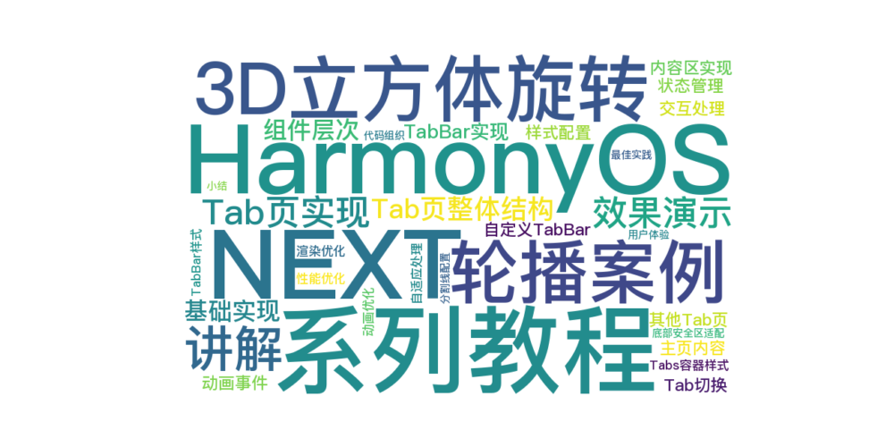

> 温馨提示：本篇博客的详细代码已发布到 [git](https://gitcode.com/nutpi/HarmonyosNext) : https://gitcode.com/nutpi/HarmonyosNext 可以下载运行哦！



# HarmonyOS NEXT系列教程之3D立方体旋转轮播案例讲解之Tab页实现
## 效果演示


## 1. Tab页整体结构

### 1.1 基础实现
```typescript
build() {
    Tabs({ barPosition: BarPosition.End, controller: this.tabsController }) {
        ForEach(this.tabItems, (item: MyTabItem, index: number) => {
            TabContent() {
                if (index === 0) {
                    this.mainContent()
                } else {
                    this.tabContent(item.title)
                }
            }.tabBar(this.TabBuilder(item, index))
        })
    }
}
```

### 1.2 组件层次
1. Tabs容器
2. TabContent内容区
3. 自定义TabBar
4. 内容构建器

## 2. TabBar实现

### 2.1 自定义TabBar
```typescript
@Builder
TabBuilder(item: MyTabItem, index: number) {
    Column() {
        Image(this.currentIndex === index ? item.selectedIcon : item.icon)
            .width($r('app.integer.cube_animation_icon_size'))
            .height($r('app.integer.cube_animation_icon_size'))
            .margin({ top: $r('app.integer.cube_animation_margin_small') })
        
        Text(item.title)
            .fontSize($r('app.integer.cube_animation_text_small'))
            .margin({ top: $r('app.integer.cube_animation_margin_xs') })
            .fontColor(this.currentIndex === index ?
                $r('app.color.cube_animation_tab_selected') :
                $r('app.color.cube_animation_tab_normal'))
    }
}
```

### 2.2 状态管理
```typescript
@State currentIndex: number = 0;
private tabsController: TabsController = new TabsController();
```

## 3. 内容区实现

### 3.1 主页内容
```typescript
@Builder
mainContent() {
    Stack({ alignContent: Alignment.Top }) {
        Scroll(this.scroller) {
            Column() {
                // 顶部背景图
                Image($r('app.media.cube_animation_background'))
                // 顶部轮播UI
                this.bannerModule()
                // 功能图标网格UI
                this.functionGird()
                // 热门模块UI
                this.popularModule()
            }
        }
        this.headerBuilder()
    }
}
```

### 3.2 其他Tab页
```typescript
@Builder
tabContent(info: ResourceStr) {
    Text(info)
        .fontSize($r('app.integer.cube_animation_text_large'))
}
```

## 4. 交互处理

### 4.1 Tab切换
```typescript
.onClick(() => {
    this.currentIndex = index;
    this.tabsController.changeIndex(index);
})
```

### 4.2 动画事件
```typescript
.onAnimationStart((index: number, targetIndex: number, event: TabsAnimationEvent) => {
    if (index === targetIndex) {
        return;
    }
    this.currentIndex = targetIndex;
})
```

## 5. 样式配置

### 5.1 Tabs容器样式
```typescript
Tabs()
    .width($r('app.string.cube_animation_full_size'))
    .height($r('app.string.cube_animation_full_size'))
    .barHeight('auto')
    .barBackgroundColor($r('app.color.cube_animation_bg_white'))
    .backgroundColor($r('app.color.cube_animation_bg_gray'))
```

### 5.2 TabBar样式
```typescript
Column()
    .width($r('app.string.cube_animation_full_size'))
    .padding({ bottom: px2vp(this.avoidAreaBottomToModule) })
    .justifyContent(FlexAlign.Center)
```

## 6. 性能优化

### 6.1 渲染优化
1. 使用@Builder装饰器
2. 懒加载Tab内容
3. 合理使用状态管理

### 6.2 动画优化
1. 平滑的切换动画
2. 合理的动画时长
3. 优化状态更新

## 7. 自适应处理

### 7.1 底部安全区适配
```typescript
@StorageLink('avoidAreaBottomToModule') avoidAreaBottomToModule: number = 0;

.padding({ bottom: px2vp(this.avoidAreaBottomToModule) })
```

### 7.2 分割线配置
```typescript
.divider({
    strokeWidth: $r('app.integer.cube_animation_divider_width'),
    startMargin: 0,
    endMargin: 0
})
```

## 8. 最佳实践

### 8.1 代码组织
1. 模块化设计
2. 样式分离
3. 状态集中管理
4. 事件处理规范

### 8.2 用户体验
1. 流畅的切换效果
2. 清晰的视觉反馈
3. 合理的交互设计
4. 统一的样式风格

## 9. 小结

本篇教程详细介绍了：
1. Tab页的整体结构设计
2. 自定义TabBar的实现
3. 内容区的构建方式
4. 交互处理机制
5. 性能优化策略

下一篇将介绍滚动效果和动画的实现细节。
