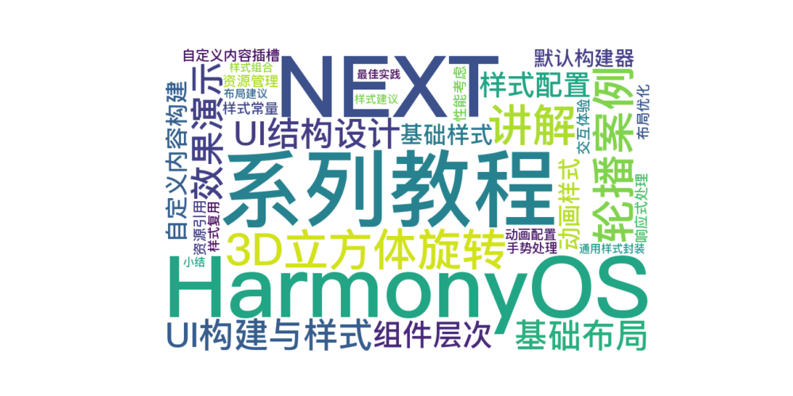

> 温馨提示：本篇博客的详细代码已发布到 [git](https://gitcode.com/nutpi/HarmonyosNext) : https://gitcode.com/nutpi/HarmonyosNext 可以下载运行哦！





# HarmonyOS NEXT系列教程之3D立方体旋转轮播案例讲解之UI构建与样式
## 效果演示


## 1. UI结构设计

### 1.1 基础布局
```typescript
build() {
    Swiper(this.swiperController) {
        LazyForEach(this.swiperData, (item: ESObject, index: number) => {
            Stack() {
                this.swiperItemSlotParam(item)
            }
            .maskShape(new RectShape())
            .width($r('app.string.cube_animation_full_size'))
            .height($r('app.string.cube_animation_full_size'))
        })
    }
    .width($r('app.string.cube_animation_full_size'))
    .height($r('app.string.cube_animation_full_size'))
}
```

### 1.2 组件层次
1. Swiper：外层容器
2. Stack：内容包装器
3. LazyForEach：数据渲染
4. 自定义内容：通过BuilderParam实现

## 2. 样式配置

### 2.1 基础样式
```typescript
// 尺寸设置
.width($r('app.string.cube_animation_full_size'))
.height($r('app.string.cube_animation_full_size'))

// 遮罩形状
.maskShape(new RectShape()
    .width($r('app.string.cube_animation_full_size'))
    .height($r('app.string.cube_animation_full_size'))
    .fill(Color.White))
```

### 2.2 动画样式
```typescript
.rotate({
    x: 0,
    y: 1,
    z: 0,
    angle: this.angleList[index],
    centerX: this.centerXList[index],
    centerY: '50%',
    centerZ: 0,
    perspective: 0
})
```

## 3. 自定义内容构建

### 3.1 默认构建器
```typescript
@Builder
defaultSwiperItemBuilder(item: ESObject) {
    Image(item)
        .objectFit(ImageFit.Cover)
        .width($r('app.string.cube_animation_full_size'))
        .height($r('app.string.cube_animation_full_size'))
}
```

### 3.2 自定义内容插槽
```typescript
@BuilderParam swiperItemSlotParam: (item: ESObject) => void = this.defaultSwiperItemBuilder;
```

## 4. 资源管理

### 4.1 资源引用
```typescript
// 使用资源字符串
$r('app.string.cube_animation_full_size')

// 使用图片资源
$r('app.media.banner1')
```

### 4.2 样式常量
```typescript
// 建议定义常量管理样式值
const ANIMATION_DURATION = 500;
const DEFAULT_SIZE = '100%';
```

## 5. 布局优化

### 5.1 性能考虑
1. 使用LazyForEach延迟加载
2. 合理设置缓存数量
3. 避免深层嵌套
4. 优化重绘区域

### 5.2 响应式处理
```typescript
// 使用百分比适应不同屏幕
.width('100%')
.height('100%')

// 使用资源适配不同设备
.width($r('app.string.cube_animation_full_size'))
```

## 6. 交互体验

### 6.1 动画配置
```typescript
.curve(Curve.EaseInOut)
.duration(this.duration)
.autoPlay(this.autoPlay)
.loop(this.loop)
```

### 6.2 手势处理
```typescript
// 轮播手势配置
.cachedCount(1)
.indicator(false)
```

## 7. 样式复用

### 7.1 通用样式封装
```typescript
@Styles function commonItemStyle() {
    .width('100%')
    .height('100%')
    .objectFit(ImageFit.Cover)
}
```

### 7.2 样式组合
```typescript
Stack() {
    this.swiperItemSlotParam(item)
}
.commonItemStyle()
.rotate(/* ... */)
```

## 8. 最佳实践

### 8.1 布局建议
1. 保持结构简单清晰
2. 合理使用布局容器
3. 避免不必要的嵌套
4. 优化渲染性能

### 8.2 样式建议
1. 使用资源引用
2. 封装复用样式
3. 保持一致性
4. 考虑适配性

## 9. 小结

本篇教程详细介绍了：
1. UI结构的设计和实现
2. 样式系统的使用
3. 自定义内容的构建
4. 布局和样式优化

下一篇将介绍组件的事件处理机制。
