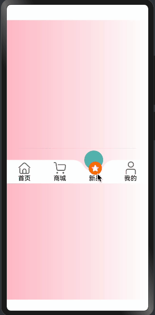

> 温馨提示：本篇博客的详细代码已发布到 [git](https://gitcode.com/nutpi/HarmonyosNext) : https://gitcode.com/nutpi/HarmonyosNext 可以下载运行哦！


# HarmonyOS NEXT系列教程之 TabsConcaveCircle组件动画系统实现

本文将详细介绍TabsConcaveCircle组件中的动画系统实现，包括选项切换动画和凹陷圆球的移动动画。
## 效果演示


## 1. 选项切换动画实现

```typescript
getAnimateSelectIndex() {
  let animateDelay = 500;
  animateTo({
    duration: this.animateTime,
    delay: animateDelay
  }, () => {
    this.animateSelectIndex = this.selectIndex
  })
  this.createAnimation()
}
```

### 动画实现说明：
1. `animateDelay`: 设置500ms的延迟，用于等待上一个选项动画结束
2. `animateTo`: ArkUI提供的动画API，用于创建过渡动画
3. 动画参数：
   - `duration`: 动画持续时间
   - `delay`: 动画延迟时间
4. 动画执行时更新`animateSelectIndex`，触发UI更新
5. 调用`createAnimation()`开始圆球移动动画

## 2. 圆球移动动画实现

```typescript
createAnimation() {
  if (!this.circleInfo) {
    return;
  }
  
  this.canvasAnimator = animator.create({
    duration: this.animateTime,
    easing: "ease",
    delay: 0,
    fill: "forwards",
    direction: "normal",
    iterations: 1,
    begin: this.animationPositionX,
    end: this.circleInfo?.getMenuCenterX(this.selectIndex)
  })
  
  this.canvasAnimator.onFrame = (value: number) => {
    this.animationPositionX = value;
    this.circleInfo?.setPositionXY({ x: value - this.circleInfo.circleRadius })
    this.createCanvas()
  }
  
  this.canvasAnimator.play()
}
```

### 动画配置详解：
1. 动画参数设置：
   - `duration`: 动画持续时间
   - `easing`: 使用"ease"缓动函数
   - `fill`: "forwards"保持动画最后一帧状态
   - `direction`: "normal"表示正向播放
   - `iterations`: 1表示只播放一次
   - `begin`: 起始位置（当前位置）
   - `end`: 目标位置（选中项的中心位置）

2. 帧动画处理：
   ```typescript
   this.canvasAnimator.onFrame = (value: number) => {
     this.animationPositionX = value;
     this.circleInfo?.setPositionXY({ x: value - this.circleInfo.circleRadius })
     this.createCanvas()
   }
   ```
   - 更新动画位置
   - 设置圆球新位置
   - 重新绘制Canvas

## 3. 图片偏移动画实现

```typescript
@Builder
TabItem(item: TabMenusInterfaceIRequired, index: number) {
  Column() {
    if (item.image) {
      Image(getImageUrl(item as TabMenusInterfaceIRequired, index, this.selectIndex))
        .size({
          width: this.imageWH,
          height: this.imageWH,
        })
        .interpolation(ImageInterpolation.High)
        .offset({
          y: this.selectIndex === index && this.animateSelectIndex === index ? 
             -this.imageOffsetY : 0,
        })
        .id(`${this.concaveCircleId}${index}`)
    }
    // ... 其他代码
  }
}
```

### 图片动画说明：
1. 图片大小设置：
   - 使用`imageWH`控制图片尺寸
   - 高清显示设置：`interpolation(ImageInterpolation.High)`

2. 偏移动画：
   - 通过`offset`属性实现垂直方向的偏移
   - 根据选中状态决定是否应用偏移
   - 偏移量由`imageOffsetY`控制

## 4. 动画初始化和监听

```typescript
aboutToAppear(): void {
  this.listener = inspector.createComponentObserver(`${this.concaveCircleId}0`)
  this.getImageOffsetY()
  this.animateSelectIndex = this.selectIndex;
}

getImageOffsetY() {
  let onLayoutComplete: () => void = (): void => {
    let modePosition = componentUtils.getRectangleById(`${this.concaveCircleId}0`)
    if (modePosition.localOffset) {
      let halfHeight = px2vp(modePosition.size.height) / 2;
      this.imageOffsetY = px2vp(modePosition.localOffset.y) + halfHeight;
      this.listener?.off('draw')
    }
  }
  let FuncDraw = onLayoutComplete;
  this.listener?.on('draw', FuncDraw)
}
```

### 初始化流程说明：
1. 组件初始化时：
   - 创建组件观察器
   - 计算图片偏移量
   - 同步选中状态

2. 偏移量计算：
   - 获取组件位置信息
   - 计算垂直方向的偏移量
   - 移除监听器

## 总结

TabsConcaveCircle组件的动画系统主要包含三个部分：
1. 选项切换动画：控制整体切换效果
2. 圆球移动动画：实现凹陷圆球的平滑移动
3. 图片偏移动画：处理选中项的视觉效果

这些动画协同工作，创造出流畅的用户交互体验。通过合理的动画配置和状态管理，实现了一个专业的底部导航栏组件。
