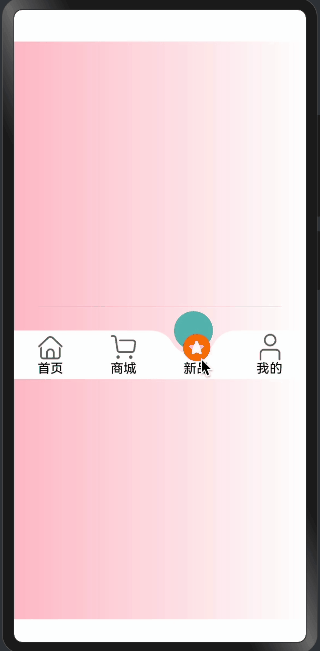

> 温馨提示：本篇博客的详细代码已发布到 [git](https://gitcode.com/nutpi/HarmonyosNext) : https://gitcode.com/nutpi/HarmonyosNext 可以下载运行哦！


# HarmonyOS NEXT系列教程之 TabsConcaveCircle组件交互处理与事件响应

本文将详细介绍TabsConcaveCircle组件的交互处理和事件响应机制，包括点击事件处理、状态更新和视觉反馈。
## 效果演示


## 1. 菜单项构建与交互

```typescript
@Builder
TabItem(item: TabMenusInterfaceIRequired, index: number) {
  Column() {
    // 图片部分
    if (item.image) {
      Image(getImageUrl(item as TabMenusInterfaceIRequired, index, this.selectIndex))
        .size({
          width: this.imageWH,
          height: this.imageWH,
        })
        .interpolation(ImageInterpolation.High)
        .offset({
          y: this.selectIndex === index && this.animateSelectIndex === index ? 
             -this.imageOffsetY : 0,
        })
        .id(`${this.concaveCircleId}${index}`)
    }
    
    // 文字部分
    Text(item.text)
      .maxLines(1)
      .textOverflow({ overflow: TextOverflow.Ellipsis })
      .textAlign(TextAlign.Center)
      .width("100%")
      .fontColor(this.selectIndex === index ? 
        (item.tabsFontColor || this.tabsFontColor) :
        (item.tabsSelectFontColor || this.tabsSelectFontColor))
  }
  .onClick(() => {
    animateTo({
      duration: this.animateTime,
    }, () => {
      this.selectIndex = index;
    })
    this.createAnimation()
  })
  .layoutWeight(1)
  .height("100%")
  .justifyContent(FlexAlign.Center)
}
```

### 交互实现说明：
1. 菜单项结构：
   - 使用Column布局
   - 包含可选的图片和必需的文字
   - 自适应宽度（layoutWeight: 1）

2. 点击事件处理：
   - 使用onClick响应点击
   - 通过animateTo创建过渡动画
   - 更新选中索引
   - 触发圆球动画

3. 视觉反馈：
   - 图片位置偏移
   - 文字颜色变化
   - 动画过渡效果

## 2. 状态监听与更新

```typescript
@Link @Watch("getAnimateSelectIndex") selectIndex: number;
@State animateSelectIndex: number = 0;

getAnimateSelectIndex() {
  let animateDelay = 500;
  animateTo({
    duration: this.animateTime,
    delay: animateDelay
  }, () => {
    this.animateSelectIndex = this.selectIndex
  })
  this.createAnimation()
}
```

### 状态管理说明：
1. 状态定义：
   - `selectIndex`: 当前选中项，支持双向绑定
   - `animateSelectIndex`: 动画控制状态

2. 状态监听：
   - 使用@Watch监听selectIndex变化
   - 触发动画状态更新
   - 同步更新UI显示

3. 动画控制：
   - 设置延迟和持续时间
   - 同步更新状态
   - 触发相关动画

## 3. 组件生命周期处理

```typescript
aboutToAppear(): void {
  this.listener = inspector.createComponentObserver(`${this.concaveCircleId}0`)
  this.getImageOffsetY()
  this.animateSelectIndex = this.selectIndex;
}

getImageOffsetY() {
  let onLayoutComplete: () => void = (): void => {
    let modePosition = componentUtils.getRectangleById(`${this.concaveCircleId}0`)
    if (modePosition.localOffset) {
      let halfHeight = px2vp(modePosition.size.height) / 2;
      this.imageOffsetY = px2vp(modePosition.localOffset.y) + halfHeight;
      this.listener?.off('draw')
    }
  }
  let FuncDraw = onLayoutComplete;
  this.listener?.on('draw', FuncDraw)
}
```

### 生命周期管理：
1. 初始化处理：
   - 创建组件观察器
   - 计算图片偏移量
   - 同步选中状态

2. 布局完成处理：
   - 获取组件位置信息
   - 计算偏移量
   - 清理监听器

3. 事件监听：
   - 监听draw事件
   - 更新组件状态
   - 处理布局变化

## 4. 组件属性配置

```typescript
@Prop tabHeight: number = 60;
@Prop tabsBgColor: string = "rgb(255, 255, 255)";
@Prop tabsSelectBgColor: Color | number | string | Resource = "rgba(92, 187, 183,1)";
@Prop tabsFontColor: Color = Color.Black;
@Prop tabsSelectFontColor: Color = Color.Black;
```

### 属性配置说明：
1. 尺寸配置：
   - `tabHeight`: 控制整体高度

2. 颜色配置：
   - `tabsBgColor`: 背景颜色
   - `tabsSelectBgColor`: 选中状态颜色
   - `tabsFontColor`: 文字颜色
   - `tabsSelectFontColor`: 选中文字颜色

3. 属性使用：
   - 支持多种颜色格式
   - 提供默认值
   - 允许外部覆盖

## 总结

TabsConcaveCircle组件的交互系统主要包含：
1. 完整的点击事件处理
2. 状态管理和更新机制
3. 生命周期管理
4. 灵活的属性配置

通过这些实现，组件能够：
- 响应用户交互
- 提供流畅的动画效果
- 维护一致的状态
- 支持灵活的定制

这些特性共同构建了一个专业、可靠的底部导航栏组件，为应用提供了良好的用户体验。
