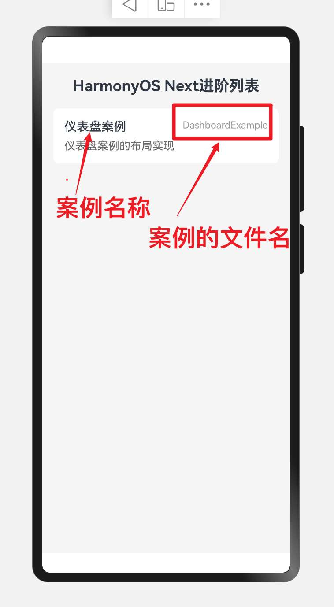
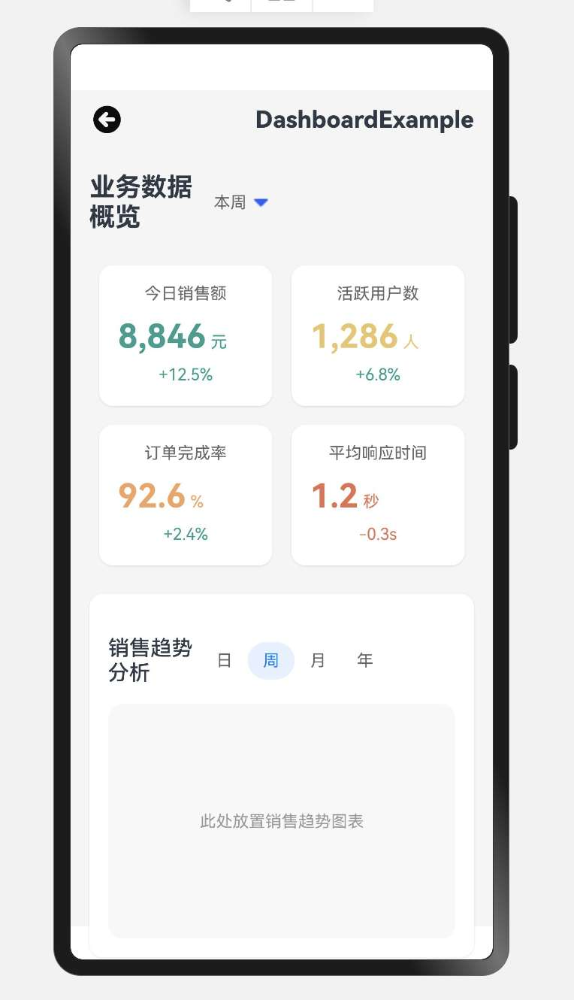

 

> 温馨提示：本篇博客的详细代码已发布到 [git](https://gitcode.com/nutpi/HarmonyosNext) : https://gitcode.com/nutpi/HarmonyosNext 可以下载运行哦！
# HarmonyOS Next仪表盘案例详解（二）：进阶篇
## 前言 
关于HarmonyOS NEXT 的仪表盘 从 
 - 01. HarmonyOS应用开发实践与技术解析
 - 02. HarmonyOS Next仪表盘案例详解（一）：基础篇
 再到本章节 就已经全部讲完了， 接下来我们先展示一下其运行的效果
 
 > 首页List
 


>效果演示




## 1. 响应式设计

### 1.1 屏幕适配

```typescript
// 获取屏幕宽度
this.screenWidth = px2vp(AppStorage.Get<number>('windowWidth') || 720)

// 根据屏幕宽度决定每行显示的卡片数量
Flex({ wrap: FlexWrap.Wrap, justifyContent: this.screenWidth > 600 ? FlexAlign.Start : FlexAlign.SpaceAround })

// 卡片宽度自适应
.width(this.screenWidth > 600 ? '22%' : '45%')
```

案例中通过检测屏幕宽度实现响应式布局：
- 当屏幕宽度大于600像素时，每行显示4个卡片，宽度为22%
- 当屏幕宽度小于等于600像素时，每行显示2个卡片，宽度为45%

这种响应式设计使应用能够在不同尺寸的设备上提供良好的用户体验。

### 1.2 弹性布局

```typescript
Flex({ wrap: FlexWrap.Wrap, justifyContent: this.screenWidth > 600 ? FlexAlign.Start : FlexAlign.SpaceAround })
```

使用Flex组件的wrap属性实现卡片的自动换行，并根据屏幕宽度动态调整对齐方式：
- 宽屏设备：左对齐(FlexAlign.Start)
- 窄屏设备：均匀分布(FlexAlign.SpaceAround)

## 2. 数据展示与交互

### 2.1 数据卡片渲染

```typescript
ForEach(this.dataCards, (card: DashboardCardItem) => {
    // 数据卡片
    Column() {
        // 卡片标题
        Text(card.title)
            .fontSize(14)
            .fontColor('#666')
            .margin({bottom: 12})

        // 数据值和单位
        Flex({alignItems: ItemAlign.Baseline}) {
            Text(card.value)
                .fontSize(28)
                .fontWeight(FontWeight.Bold)
                .fontColor(card.color)

            Text(card.unit)
                .fontSize(14)
                .fontColor(card.color)
                .margin({left: 4})
        }
        .margin({bottom: 8})

        // 趋势指标
        Text(card.trend)
            .fontSize(14)
            .fontColor(card.trend.includes('+') ? '#2A9D8F' : '#E76F51')
    }
    // 卡片样式...
})
```

使用ForEach循环渲染数据卡片，每个卡片包含标题、数值、单位和趋势指标。根据趋势的正负动态设置颜色：
- 正向趋势(+)：绿色(#2A9D8F)
- 负向趋势(-)：红色(#E76F51)

### 2.2 图表区域

```typescript
// 图表区域（示意）
Column() {
    Flex({ justifyContent: FlexAlign.SpaceBetween, alignItems: ItemAlign.Center }) {
        Text('销售趋势分析')
            .fontSize(18)
            .fontWeight(FontWeight.Medium)

        Flex() {
            ForEach(['日', '周', '月', '年'], (item: string) => {
                Text(item)
                    .fontSize(14)
                    .fontColor(item === '周' ? '#007DFF' : '#666')
                    .backgroundColor(item === '周' ? '#E6F1FF' : 'transparent')
                    .height(32)
                    .width(40)
                    .textAlign(TextAlign.Center)
                    .borderRadius(16)
            })
        }
    }
    // ...

    // 图表占位区域
    Column() {
        Text('此处放置销售趋势图表')
            .fontSize(14)
            .fontColor('#999')
    }
    // ...
}
```

图表区域包含标题栏和时间筛选器，通过ForEach循环渲染日、周、月、年四个选项，并高亮显示当前选中的"周"选项。这种设计允许用户快速切换不同时间维度的数据视图。

## 3. 事件处理机制

### 3.1 点击事件处理

```typescript
ForEach(['日', '周', '月', '年'], (item: string) => {
    Text(item)
        .fontSize(14)
        .fontColor(item === this.timeRange ? '#007DFF' : '#666')
        .backgroundColor(item === this.timeRange ? '#E6F1FF' : 'transparent')
        .height(32)
        .width(40)
        .textAlign(TextAlign.Center)
        .borderRadius(16)
        .onClick(() => {
            // 更新选中的时间范围
            this.timeRange = item
            // 根据新的时间范围更新图表数据
            this.updateChartData()
        })
})
```

通过onClick事件处理器实现交互功能，当用户点击不同的时间选项时：
1. 更新当前选中的时间范围状态变量
2. 调用更新图表数据的方法，刷新图表显示

### 3.2 手势交互

```typescript
// 图表区域手势交互
GestureGroup({
    // 同时识别多种手势
    type: GestureType.Parallel,
    // 手势之间的关系
    gestures: [
        PanGesture({ direction: PanDirection.Horizontal })
            .onActionStart((event: GestureEvent) => {
                // 记录起始位置
                this.startX = event.offsetX
            })
            .onActionUpdate((event: GestureEvent) => {
                // 计算拖动距离，更新图表显示范围
                let offsetX = event.offsetX - this.startX
                this.updateChartViewport(offsetX)
            }),
        PinchGesture()
            .onActionUpdate((event: GestureEvent) => {
                // 根据缩放比例调整图表显示范围
                this.updateChartScale(event.scale)
            })
    ]
})
```

实现了两种手势交互：
- 平移手势(PanGesture)：允许用户左右滑动查看不同时间段的数据
- 捏合手势(PinchGesture)：允许用户通过捏合操作放大或缩小图表视图

## 4. 性能优化技巧

### 4.1 懒加载与按需渲染

```typescript
LazyForEach(this.dataSource, (item: DataItem) => {
    // 数据项渲染逻辑
    DataItemComponent({ data: item })
})
```

使用LazyForEach代替ForEach进行大量数据的渲染，实现按需加载，提高应用性能：
- 只渲染可见区域的数据项
- 当用户滚动时，动态加载新的数据项
- 释放不可见区域的资源

### 4.2 状态管理优化

```typescript
// 使用AppStorage全局状态管理
aboutToAppear() {
    // 订阅全局状态变化
    this.dashboardDataSubscriber = AppStorage.Subscribe('dashboardData', (data: DashboardData) => {
        // 仅在数据变化时更新UI
        if (JSON.stringify(data) !== JSON.stringify(this.localData)) {
            this.localData = data
            this.updateUI()
        }
    })
}

aboutToDisappear() {
    // 取消订阅，避免内存泄漏
    this.dashboardDataSubscriber.unsubscribe()
}
```

通过状态管理优化提高应用性能：
- 使用AppStorage进行全局状态管理
- 实现数据变化的细粒度检测，避免不必要的UI更新
- 组件销毁时取消订阅，防止内存泄漏

## 5. 数据流管理

### 5.1 单向数据流

```typescript
// 父组件
@State dashboardData: DashboardData = initialData

build() {
    Column() {
        // 将数据通过属性传递给子组件
        DataCards({ data: this.dashboardData.cards })
        ChartSection({ 
            data: this.dashboardData.chartData,
            // 传递回调函数处理子组件事件
            onTimeRangeChange: (range) => this.updateTimeRange(range)
        })
    }
}

// 子组件
@Component
struct DataCards {
    // 使用@Prop接收父组件传递的数据
    @Prop data: CardData[]
    
    build() {
        // 渲染逻辑
    }
}
```

实现单向数据流模式：
- 父组件维护应用状态
- 通过属性将数据传递给子组件
- 子组件通过回调函数将事件传递给父组件
- 父组件处理事件并更新状态，触发UI更新

### 5.2 响应式数据绑定

```typescript
// 定义响应式状态
@State selectedTimeRange: string = '周'
@State chartData: ChartDataPoint[] = []

// 计算属性
@Computed get filteredData(): ChartDataPoint[] {
    return this.chartData.filter(item => {
        // 根据选中的时间范围过滤数据
        if (this.selectedTimeRange === '日') {
            return item.date.startsWith(this.currentDay)
        } else if (this.selectedTimeRange === '周') {
            return this.isInCurrentWeek(item.date)
        }
        // 其他条件...
    })
}

build() {
    Column() {
        // 使用计算属性自动更新UI
        ChartComponent({ data: this.filteredData })
    }
}
```

利用ArkTS的响应式特性：
- 使用@State声明响应式状态
- 使用@Computed定义计算属性，自动响应状态变化
- 状态变化时自动触发UI更新，无需手动干预

## 6. 最佳实践

### 6.1 组件化开发

```typescript
// 抽取数据卡片为独立组件
@Component
struct DataCard {
    @Prop cardData: DashboardCardItem
    
    build() {
        Column() {
            Text(this.cardData.title)
                .fontSize(14)
                .fontColor('#666')
                .margin({bottom: 12})
                
            Flex({alignItems: ItemAlign.Baseline}) {
                Text(this.cardData.value)
                    .fontSize(28)
                    .fontWeight(FontWeight.Bold)
                    .fontColor(this.cardData.color)

                Text(this.cardData.unit)
                    .fontSize(14)
                    .fontColor(this.cardData.color)
                    .margin({left: 4})
            }
            .margin({bottom: 8})

            Text(this.cardData.trend)
                .fontSize(14)
                .fontColor(this.cardData.trend.includes('+') ? '#2A9D8F' : '#E76F51')
        }
        .width('100%')
        .padding(16)
        .backgroundColor('#FFFFFF')
        .borderRadius(12)
    }
}

// 在主组件中使用
ForEach(this.dataCards, (card: DashboardCardItem) => {
    DataCard({ cardData: card })
})
```

组件化开发的优势：
- 提高代码复用率
- 简化主组件逻辑
- 便于维护和测试
- 支持团队协作开发

### 6.2 样式与逻辑分离

```typescript
// 样式常量
const CARD_STYLES = {
    container: {
        width: '100%',
        padding: 16,
        borderRadius: 12,
        backgroundColor: '#FFFFFF'
    },
    title: {
        fontSize: 14,
        fontColor: '#666',
        marginBottom: 12
    },
    // 其他样式...
}

// 在组件中使用
@Component
struct StyledCard {
    @Prop data: CardData
    
    build() {
        Column() {
            Text(this.data.title)
                .fontSize(CARD_STYLES.title.fontSize)
                .fontColor(CARD_STYLES.title.fontColor)
                .margin({bottom: CARD_STYLES.title.marginBottom})
            // 其他UI元素...
        }
        .width(CARD_STYLES.container.width)
        .padding(CARD_STYLES.container.padding)
        .backgroundColor(CARD_STYLES.container.backgroundColor)
        .borderRadius(CARD_STYLES.container.borderRadius)
    }
}
```

样式与逻辑分离的好处：
- 提高代码可读性
- 便于统一管理和修改样式
- 支持主题切换
- 减少重复代码

## 7. 总结

本文详细介绍了HarmonyOS仪表盘应用的进阶开发技巧，包括：

1. 响应式设计：通过屏幕适配和弹性布局实现多设备适配
2. 数据展示与交互：实现数据卡片渲染和图表区域的交互功能
3. 事件处理机制：通过点击事件和手势交互增强用户体验
4. 性能优化技巧：使用懒加载和状态管理优化提高应用性能
5. 数据流管理：实现单向数据流和响应式数据绑定
6. 最佳实践：采用组件化开发和样式与逻辑分离的开发模式

通过这些技巧，开发者可以构建出高性能、易维护且用户体验良好的HarmonyOS仪表盘应用。
