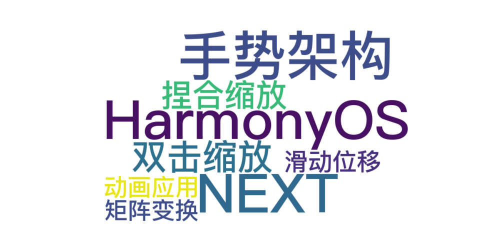

  
> 温馨提示：本篇博客的详细代码已发布到 [git](https://gitcode.com/nutpi/HarmonyosNext) : https://gitcode.com/nutpi/HarmonyosNext 可以下载运行哦！
 


# HarmonyOS NEXT ImageItemView组件深度剖析：手势交互与动画实现(二)


#### 一、手势系统架构
```typescript
.gesture(
  GestureGroup(
    GestureMode.Exclusive, // 手势互斥模式
    TapGesture({ count: 2 }), // 双击
    TapGesture({ count: 1 }), // 单击
    PinchGesture({ fingers: 2 }), // 双指捏合
    PanGesture({ fingers: 1 }) // 单指滑动
  )
)
```
- **GestureGroup**：手势组合容器，管理多个手势的相互关系
- **GestureMode.Exclusive**：互斥模式，同一时刻只有一个手势生效
- **优先级顺序**：后声明的手势优先级更高（这里双击手势优先于单击）

#### 二、双击缩放实现
```typescript
TapGesture({ count: 2 })
  .onAction(() => {
    if (this.imageScaleInfo.scaleValue > 默认值) {
      // 缩小逻辑
      fn = () => {
        this.isEnableSwipe = true; // 启用滑动切换
        this.imageScaleInfo.reset(); // 重置缩放
        this.matrix = matrix4.identity(); // 重置变换矩阵
      };
    } else {
      // 放大逻辑
      fn = () => {
        this.isEnableSwipe = false; // 禁用滑动切换
        const ratio = this.calcFitScaleRatio(...); // 计算适配比例
        this.matrix = matrix4.identity().scale({x: ratio, y: ratio});
      };
    }
    runWithAnimation(fn); // 带动画执行
  })
```
- **状态切换逻辑**：
  - 当前已放大 → 双击恢复默认
  - 当前默认状态 → 双击放大至屏幕适配尺寸
- **关键方法**：
  - `calcFitScaleRatio`：计算填满屏幕所需比例
  - `runWithAnimation`：HarmonyOS动画API，实现平滑过渡

#### 三、捏合缩放实现
```typescript
PinchGesture({ fingers: 2 })
  .onActionUpdate((event) => {
    // 实时计算缩放比例
    this.imageScaleInfo.scaleValue = 上次值 * event.scale;
    
    // 边界限制
    const maxScale = 最大缩放值 * 1.3; // 允许超出20%的弹性效果
    const minScale = 默认值 * 0.7; // 允许缩小到70%
    this.imageScaleInfo.scaleValue = Math.min(maxScale, 
      Math.max(minScale, this.imageScaleInfo.scaleValue));
    
    // 应用矩阵变换
    this.matrix = matrix4.identity().scale({
      x: 当前比例,
      y: 当前比例
    });
  })
  .onActionEnd(() => {
    // 弹性回弹处理
    if (当前比例 < 默认值) {
      runWithAnimation(() => 重置到默认值);
    } else if (当前比例 > 最大缩放值) {
      runWithAnimation(() => 调整到最大值);
    }
  })
```
- **核心参数**：
  - `event.scale`：捏合手势的实时缩放系数（>1放大，<1缩小）
  - `lastValue`：记录上次缩放值，保证连续性
- **边界处理技巧**：
  - 允许超出最大/最小值一定比例（提升操作手感）
  - 手势结束后执行弹性动画

#### 四、滑动位移实现
```typescript
PanGesture({ fingers: 1 })
  .onActionUpdate((event) => {
    if (当前是默认缩放比例) return; // 默认状态禁止滑动
    
    // 计算新偏移量
    this.imageOffsetInfo.currentX = 上次X + event.offsetX;
    this.imageOffsetInfo.currentY = 上次Y + event.offsetY;
  })
  .onActionEnd(() => {
    // 保存当前偏移量
    this.imageOffsetInfo.stash();
  })
```
- **位移条件**：
  - 仅在放大状态下允许滑动
  - 默认状态下的滑动留给父组件处理（用于图片切换）
- **坐标计算**：
  - `offsetX/Y`：手势相对于起点的位移量
  - 需要叠加上次的偏移量实现连续移动

#### 五、动画系统应用
```typescript
runWithAnimation(() => {
  // 状态变更操作
  this.imageScaleInfo.scaleValue = 目标值;
  this.matrix = 新矩阵;
});
```
- **动画原理**：
  - 包裹在`runWithAnimation`中的状态变更会自动应用动画
  - 系统默认使用弹性动画（spring）效果
- **自定义动画**：
  ```typescript
  runWithAnimation(() => {
    // 操作
  }, {
    duration: 300, // 动画时长
    curve: Curve.EaseInOut // 缓动曲线
  })
  ```

#### 六、矩阵变换原理
```typescript
matrix4.identity() // 创建单位矩阵
  .scale({ x: 2, y: 2 }) // 缩放变换
  .translate({ x: 100, y: 50 }) // 位移变换
  .copy(); // 创建新实例
```
- **矩阵操作顺序**：
  - 先缩放后位移（矩阵乘法顺序，实际是反向应用）
  - 建议先执行缩放再执行位移
- **坐标系特点**：
  - 以组件中心点为变换原点
  - 位移量基于缩放后的坐标系
 
