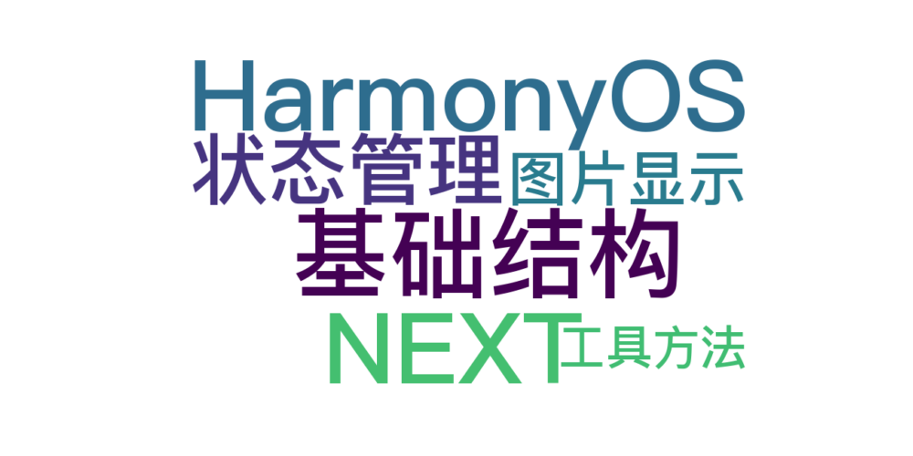

  
> 温馨提示：本篇博客的详细代码已发布到 [git](https://gitcode.com/nutpi/HarmonyosNext) : https://gitcode.com/nutpi/HarmonyosNext 可以下载运行哦！
 


# HarmonyOS NEXT ImageItemView组件深度剖析：组件基础结构与核心状态管理(一)


#### 一、组件基础结构解析
1. **组件装饰器与复用机制**
```typescript
@Reusable
@Component
export struct ImageItemView {
  // ...
}
```
- `@Component`：声明这是一个自定义组件，HarmonyOS 中所有 UI 组件必须使用此装饰器
- `@Reusable`：实现组件复用机制，当组件被移除时会进入复用缓存池，下次创建时直接复用（类似 Android RecyclerView 的回收机制）
- **复用场景**：在多图切换时，不同图片项可复用同一组件实例，提升性能

2. **组件生命周期 - aboutToAppear**
```typescript
aboutToAppear(): void {
  this.initCurrentImageInfo(); // 初始化图片信息
}
```
- 组件即将显示时触发
- 此处用于初始化图片信息（尺寸、宽高比等），确保组件显示时数据就绪

#### 二、核心状态管理
1. **状态变量装饰器**
```typescript
@Consume private bgc: Color;          // 共享背景色
@Link isEnableSwipe: boolean;         // 控制滑动切换
@State isEnableOffset: boolean = false; // 位移开关
@State imageScaleInfo: ScaleModel;    // 缩放状态
@State imageOffsetInfo: OffsetModel;  // 位移状态
```
- `@Consume`：跨组件共享状态（与祖先组件的 `@Provide` 配对使用），这里用于全局背景色管理
- `@Link`：父子组件双向绑定，`isEnableSwipe` 控制是否允许滑动切换图片
- `@State`：组件内部状态管理，变化时会触发 UI 更新
- **设计思想**：通过装饰器实现状态分层管理（全局共享、组件间通信、组件内部状态）

2. **图片信息初始化流程**
```typescript
initCurrentImageInfo(): void {
  const imageSource = image.createImageSource(this.imageUri);
  imageSource.getImageInfo().then((data) => {
    // 计算宽高比和默认尺寸
    this.imageWHRatio = data.size.width / data.size.height;
    this.imageDefaultSize = this.calcImageDefaultSize(...);
    // 判断适配方向（宽度优先/高度优先）
    this.fitWH = this.imageDefaultSize.width === windowWidth ? "width" : "height";
  });
  // 创建像素地图用于显示
  imageSource.createPixelMap().then((data) => {
    this.imagePixelMap = data;
  });
}
```
- **关键步骤**：
  1. 通过 URI 创建 ImageSource 获取图片元数据
  2. 计算图片默认显示尺寸（根据屏幕宽高比）
  3. 异步加载 PixelMap 数据（避免阻塞主线程）
- **核心算法**：`calcImageDefaultSize`
  - 比较图片与屏幕宽高比，决定按宽度或高度适配
  - 示例：竖屏手机显示横屏图片时，按宽度适配避免上下黑边

#### 三、图片显示核心逻辑
```typescript
Image(this.imagePixelMap)
  .width(this.fitWH === "width" ? $r(...) : undefined)
  .height(this.fitWH === "height" ? $r(...) : undefined)
  .aspectRatio(this.imageWHRatio)
  .objectFit(ImageFit.Cover)
```
- **动态尺寸策略**：
  - 仅设置宽度或高度，通过 `aspectRatio` 自动计算另一维度
  - `$r("app.string...")` 引用资源文件中的尺寸值（实现多设备适配）
- **objectFit 详解**：
  - `ImageFit.Cover`：保持宽高比缩放，使图片至少一边填满容器
  - 与 `aspectRatio` 配合实现自适应布局

#### 四、关键工具方法
1. **默认尺寸计算**
```typescript
calcImageDefaultSize(imageWHRatio: number, size: window.Size): image.Size {
  if (imageWHRatio > size.width / size.height) {
    return { width: size.width, height: size.width / imageWHRatio };
  } else {
    return { height: size.height, width: size.height * imageWHRatio };
  }
}
```
- **逻辑解析**：
  - 当图片比屏幕"更宽"（宽高比更大），按屏幕宽度适配
  - 当图片比屏幕"更高"，按屏幕高度适配
- **示例**：屏幕 1080x2400，图片 3000x2000（宽高比 1.5）
  - 屏幕宽高比 ≈ 0.45（竖屏）
  - 1.5 > 0.45 → 按宽度 1080px 显示，高度 = 1080 / 1.5 = 720px

2. **缩放比例计算**
```typescript
calcFitScaleRatio(imageSize: image.Size, windowSize: window.Size): number {
  return Math.max(windowSize.width / imageSize.width, 
                 windowSize.height / imageSize.height);
}
```
- **功能**：计算图片填满屏幕所需的最小缩放比例
- **使用场景**：双击放大时，确保图片能完整填充屏幕

 
