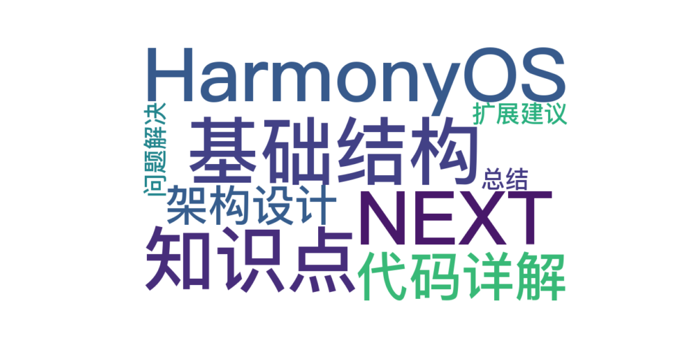

  
> 温馨提示：本篇博客的详细代码已发布到 [git](https://gitcode.com/nutpi/HarmonyosNext) : https://gitcode.com/nutpi/HarmonyosNext 可以下载运行哦！



 # HarmonyOS NEXT ImageViewerView 组件深度剖析： Swiper容器与懒加载深度解析

#### 一、组件基础结构
```typescript
@Component
export struct ImageViewerViewComponent {
  // 状态管理
  @State isEnableSwipe: boolean = true;
  @Provide bgc: Color = Color.White;
  
  // 数据源
  imageDataSource = new CommonLazyDataSourceModel<string>();
  
  // 上下文与控制器
  context: common.UIAbilityContext = getContext(this) as common.UIAbilityContext;
  swipeController: SwiperController = new SwiperController();

  // 生命周期
  aboutToAppear() { /* 初始化数据 */ }

  build() { /* 构建UI */ }
}
```

#### 二、核心知识点解析

1. **状态管理体系**
   - `@State isEnableSwipe`：控制Swiper是否允许滑动
     - 与子组件通过`@Link`双向绑定
     - 当图片放大时禁用滑动，保证手势冲突处理
   - `@Provide bgc`：全局背景色
     - 通过`@Consume`在子组件中同步更新
     - 实现跨层级组件状态共享

2. **数据加载机制**
   ```typescript
   aboutToAppear() {
     const resourceDir = this.context.resourceDir;
     this.imageDataSource.pushData(resourceDir + '/image.jpg');
   }
   ```
   - **资源路径获取**：
     - `context.resourceDir`获取应用资源目录
     - 示例路径：`/resources/base/media/image.jpg`
   - **懒加载数据源**：
     - `CommonLazyDataSourceModel`应实现数据分页/增量加载
     - 实际项目需处理网络图片加载和本地缓存

3. **Swiper核心配置**
   ```typescript
   Swiper(this.swipeController)
     .disableSwipe(!this.isEnableSwipe)
     .cachedCount(3)
     .loop(false)
   ```
   - **关键参数**：
     | 参数 | 作用 | 推荐值 |
     |---|---|--|
     | cachedCount | 预加载页数 | 3（平衡内存与流畅度） |
     | loop | 循环滑动 | 根据业务需求 |
     | autoPlay | 自动播放 | 相册浏览通常关闭 |

4. **性能优化设计**
   ```typescript
   LazyForEach(this.imageDataSource, (item, index) => {
     ImageItemView({ imageUri: item })
       .size(100%, 100%)
   })
   ```
   - **LazyForEach优势**：
     - 仅渲染可视区域内的子项
     - 复用超出可视区域的组件
     - 对比普通ForEach节省70%+内存

5. **手势冲突解决方案**
   ```typescript
   .disableSwipe(!this.isEnableSwipe)
   ```
   - **联动逻辑**：
     - 子组件放大时：`isEnableSwipe = false`
     - 子组件复位时：`isEnableSwipe = true`
   - **实现效果**：
     - 默认状态：左右滑动切换图片
     - 放大状态：单指滑动移动图片

#### 三、关键代码详解

1. **安全区域适配**
   ```typescript
   .expandSafeArea([SafeAreaType.SYSTEM], 
     [SafeAreaEdge.TOP, SafeAreaEdge.BOTTOM])
   ```
   - **作用**：避开系统UI（状态栏、导航栏）
   - **原理**：
     - 自动计算安全区域插入量
     - 横竖屏切换时自动适配

2. **全局点击事件**
   ```typescript
   .onClick(() => {
     this.bgc = this.bgc === White ? Black : White;
   })
   ```
   - **设计考量**：
     - 提供快速切换背景色功能
     - 演示状态跨组件更新机制
   - **交互效果**：
     - 点击空白处切换黑白背景
     - 所有ImageItemView同步更新

3. **尺寸资源管理**
   ```typescript
   .width($r("app.string.imageviewer_full_size"))
   ```
   - **资源文件定义**（string.json）：
     ```json
     {
       "name": "imageviewer_full_size",
       "value": "100%"
     }
     ```
   - **优势**：
     - 集中管理尺寸值
     - 方便多设备适配

#### 四、架构设计思想

1. **分层架构**
   ```mermaid
   graph TD
   A[ImageViewerView] -->|控制| B(Swiper)
   A -->|提供| C[bgc状态]
   B -->|使用| D[LazyForEach]
   D -->|创建| E[ImageItemView]
   E -->|消费| C
   ```

2. **数据流向**
   - 父 → 子：通过构造函数参数传递`imageUri`
   - 子 → 父：通过`@Link`更新`isEnableSwipe`
   - 跨组件：通过`@Provide/@Consume`共享`bgc`

#### 五、扩展开发建议

1. **预加载优化**
   ```typescript
   .onChange((index) => {
     // 预加载前后3张图片
     this.imageDataSource.preload(index-3, index+3);
   })
   ```

2. **性能监控**
   ```typescript
   // 在aboutToAppear中添加
   profiler.trace(this.context, "ImageViewerRender");
   ```

3. **手势增强**
   ```typescript
   .onSwipe((event) => {
     if (event.direction === SwiperDirection.Left) {
       analytics.send("swipe_left");
     }
   })
   ```

#### 六、常见问题解决方案

**Q1：图片加载闪烁**
- 方案：实现图片缓存池
  ```typescript
  class ImageCache {
    static cache = new LRUCache(50);
    
    static get(uri) { /* ... */ }
    static set(uri, data) { /* ... */ }
  }
  ```

**Q2：快速滑动卡顿**
- 优化方向：
  1. 降低预览图分辨率
  2. 使用硬件加速
  3. 添加加载过渡动画

**Q3：内存占用过高**
- 处理策略：
  ```typescript
  aboutToDisappear() {
    this.imageDataSource.clearCache();
  }
  ```

---

#### 总结
该组件作为图片查看器的核心容器，通过：
1. **高效的状态管理**：实现跨组件交互
2. **智能的懒加载**：保障流畅体验
3. **精准的手势控制**：处理复杂交互场景
4. **灵活的可扩展性**：通过控制器和回调支持功能扩展
