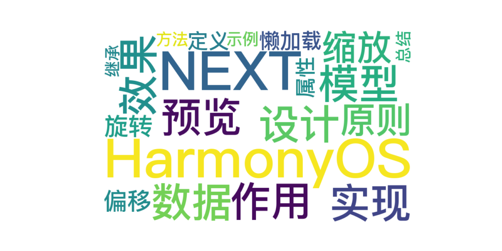

 
> 温馨提示：本篇博客的详细代码已发布到 [git](https://gitcode.com/nutpi/HarmonyosNext) : https://gitcode.com/nutpi/HarmonyosNext 可以下载运行哦！



# Harmonyos NEXT 图片预览组件之数据模型设计与实现
## 效果预览


## 一、数据模型概述

图片预览组件采用了模型驱动的设计思想，将不同的交互状态抽象为独立的数据模型，实现了状态管理的解耦和代码的高内聚。本文将详细介绍图片预览组件中的四个核心数据模型：ScaleModel、RotateModel、OffsetModel和CommonLazyDataSourceModel。

### 1. 数据模型的作用

在图片预览组件中，数据模型主要承担以下职责：

1. **状态封装**：将相关的状态变量和操作方法封装在一起
2. **数据持久化**：记录交互过程中的状态变化
3. **行为一致性**：提供统一的接口和行为模式
4. **状态重置**：支持状态的重置和恢复

### 2. 数据模型的设计原则

| 设计原则 | 说明 | 实现方式 |
| --- | --- | --- |
| 单一职责 | 每个模型只负责一种类型的状态管理 | 分离缩放、旋转、偏移为独立模型 |
| 状态可观察 | 状态变化可被组件感知和响应 | 使用@Observed装饰器 |
| 接口一致性 | 提供统一的方法接口 | 所有模型都实现reset()和stash()方法 |
| 默认值设置 | 提供合理的默认值 | 构造函数中设置默认参数 |

## 二、ScaleModel - 缩放模型

### 1. 模型定义

```typescript
@Observed
export class ScaleModel {
  // 本次缩放因子，用于控制图片的大小显示
  public scaleValue: number;
  // 记录上次缩放完后的缩放因子
  public lastValue: number;
  // 最大放大值
  public maxScaleValue: number;
  // 额外比例值
  public extraScaleValue: number;
  // 默认缩放值
  public readonly defaultScaleValue: number = 1;

  constructor(scaleValue: number = 1.0, lastValue: number = 1.0,
              maxScaleValue: number = 1.5, extraScaleValue: number = 0.2) {
    this.scaleValue = scaleValue;
    this.lastValue = lastValue;
    this.maxScaleValue = maxScaleValue;
    this.extraScaleValue = extraScaleValue;
  }

  reset(): void {
    this.scaleValue = this.defaultScaleValue;
    this.lastValue = this.scaleValue;
  }

  stash(): void {
    this.lastValue = this.scaleValue;
  }
}
```

### 2. 属性说明

| 属性名 | 类型 | 说明 |
| --- | --- | --- |
| scaleValue | number | 当前缩放因子，用于控制图片的显示大小 |
| lastValue | number | 记录上次缩放完成后的缩放因子，用于计算相对缩放 |
| maxScaleValue | number | 最大允许的放大值，防止过度放大 |
| extraScaleValue | number | 额外比例值，用于提供弹性缩放体验 |
| defaultScaleValue | number | 默认缩放值，固定为1.0 |

### 3. 方法说明

- **reset()**: 重置缩放状态到默认值
- **stash()**: 保存当前缩放值为最后缩放值，用于下次缩放的基准计算

### 4. 使用示例

```typescript
// 创建缩放模型实例
this.imageScaleInfo = new ScaleModel(1.0, 1.0, 1.5, 0.3);

// 在双指缩放手势中使用
PinchGesture({ fingers: 2, distance: 1 })
    .onActionUpdate((event: GestureEvent) => {
        // 计算新的缩放值
        let scale = this.imageScaleInfo.lastValue * event.scale;
        
        // 限制缩放范围
        if (scale > this.imageScaleInfo.maxScaleValue * (1 + this.imageScaleInfo.extraScaleValue)) {
            scale = this.imageScaleInfo.maxScaleValue * (1 + this.imageScaleInfo.extraScaleValue);
        }
        if (scale < this.imageScaleInfo.defaultScaleValue * (1 - this.imageScaleInfo.extraScaleValue)) {
            scale = this.imageScaleInfo.defaultScaleValue * (1 - this.imageScaleInfo.extraScaleValue);
        }
        
        // 更新当前缩放值
        this.imageScaleInfo.scaleValue = scale;
        
        // 应用到矩阵变换
        this.matrix = matrix4.identity().scale({
            x: this.imageScaleInfo.scaleValue,
            y: this.imageScaleInfo.scaleValue,
        }).copy();
    })
    .onActionEnd(() => {
        // 保存当前缩放值为最后缩放值
        this.imageScaleInfo.stash();
    })
```

## 三、RotateModel - 旋转模型

### 1. 模型定义

```typescript
@Observed
export class RotateModel {
    // 当前旋转角度
    public currentRotate: number;
    // 最后的角度
    public lastRotate: number = 0;
    // 起步触发旋转的角度
    public startAngle:number = 20;

    constructor(currentX: number = 0) {
        this.currentRotate = currentX;
    }

    // 重置
    reset(): void {
        this.currentRotate = 0;
        this.lastRotate = 0;
    }

    // 保存最后的数据
    stash(): void {
        // 一个完整的圆的角度是360度
        let angle = 360;
        this.lastRotate = this.currentRotate % angle;
    }
}
```

### 2. 属性说明

| 属性名 | 类型 | 说明 |
| --- | --- | --- |
| currentRotate | number | 当前旋转角度，用于实时控制图片旋转 |
| lastRotate | number | 最后保存的旋转角度，用于计算相对旋转 |
| startAngle | number | 触发旋转的最小角度阈值，防止误触 |

### 3. 方法说明

- **reset()**: 重置旋转状态到0度
- **stash()**: 保存当前旋转角度为最后旋转角度，并进行360度取模运算

### 4. 使用示例

```typescript
// 创建旋转模型实例
this.imageRotateInfo = new RotateModel();

// 在双指旋转手势中使用
RotationGesture({ angle: this.imageRotateInfo.startAngle })
    .onActionUpdate((event: GestureEvent) => {
        let angle = this.imageRotateInfo.lastRotate + event.angle
        if (event.angle > 0) {
            angle -= this.imageRotateInfo.startAngle;
        } else {
            angle += this.imageRotateInfo.startAngle;
        }
        
        // 应用旋转变换
        this.matrix = matrix4.identity()
            .rotate({
                z: 1,
                angle: angle,
            }).copy();
            
        // 更新当前旋转角度
        this.imageRotateInfo.currentRotate = angle;
    })
    .onActionEnd(() => {
        // 保存当前旋转角度
        this.imageRotateInfo.stash();
    })
```

## 四、OffsetModel - 偏移模型

### 1. 模型定义

```typescript
@Observed
export class OffsetModel {
  // 当前移动偏移量 X
  public currentX: number;
  // 当前移动偏移量 Y
  public currentY: number;
  // 最后的偏移量 X
  public lastX: number = 0;
  // 最后的偏移量 Y
  public lastY: number = 0;

  constructor(currentX: number = 0, currentY: number = 0) {
    this.currentX = currentX;
    this.currentY = currentY;
  }

  reset(): void {
    this.currentX = 0;
    this.currentY = 0;
    this.lastX = 0;
    this.lastY = 0;
  }

  stash(): void {
    this.lastX = this.currentX;
    this.lastY = this.currentY;
  }
}
```

### 2. 属性说明

| 属性名 | 类型 | 说明 |
| --- | --- | --- |
| currentX | number | 当前X轴偏移量，用于实时控制图片水平位置 |
| currentY | number | 当前Y轴偏移量，用于实时控制图片垂直位置 |
| lastX | number | 最后保存的X轴偏移量，用于计算相对移动 |
| lastY | number | 最后保存的Y轴偏移量，用于计算相对移动 |

### 3. 方法说明

- **reset()**: 重置所有偏移量为0
- **stash()**: 保存当前偏移量为最后偏移量

### 4. 使用示例

```typescript
// 创建偏移模型实例
this.imageOffsetInfo = new OffsetModel(0, 0);

// 在单指拖动手势中使用
PanGesture({ fingers: 1 })
    .onActionUpdate((event: GestureEvent) => {
        // 计算新的偏移量
        let calculatedOffsetX = this.imageOffsetInfo.lastX + event.offsetX;
        let calculatedOffsetY = this.imageOffsetInfo.lastY + event.offsetY;
        
        // 更新当前偏移量
        this.imageOffsetInfo.currentX = calculatedOffsetX;
        this.imageOffsetInfo.currentY = calculatedOffsetY;
        
        // 应用偏移
        this.offset({
            x: this.imageOffsetInfo.currentX,
            y: this.imageOffsetInfo.currentY
        });
    })
    .onActionEnd(() => {
        // 保存当前偏移量
        this.imageOffsetInfo.stash();
        // 评估边界
        this.evaluateBound();
    })
```

## 五、CommonLazyDataSourceModel - 懒加载数据源模型

### 1. 模型定义

```typescript
export class CommonLazyDataSourceModel<T> extends BasicDataSource<T> {
  private dataArray: T[] = [];

  public totalCount(): number {
    return this.dataArray.length;
  }

  public getData(index: number): T {
    return this.dataArray[index];
  }

  public addData(index: number, data: T): void {
    this.dataArray.splice(index, 0, data);
    this.notifyDataAdd(index);
  }

  public pushData(data: T): void {
    this.dataArray.push(data);
    this.notifyDataAdd(this.dataArray.length - 1);
  }

  public clearAndPushAll(data: T[]): void {
    this.dataArray = [];
    this.dataArray.push(...data);
    this.notifyDataReload();
  }
}
```

### 2. 继承关系

CommonLazyDataSourceModel继承自BasicDataSource，而BasicDataSource实现了IDataSource接口，提供了数据变化通知机制。

```typescript
class BasicDataSource <T> implements IDataSource {
  private listeners: DataChangeListener[] = [];
  private originDataArray: T[] = [];

  // 注册数据变化监听器
  registerDataChangeListener(listener: DataChangeListener): void {
    if (this.listeners.indexOf(listener) < 0) {
      this.listeners.push(listener);
    }
  }

  // 取消注册数据变化监听器
  unregisterDataChangeListener(listener: DataChangeListener): void {
    const pos = this.listeners.indexOf(listener);
    if (pos >= 0) {
      this.listeners.splice(pos, 1);
    }
  }

  // 通知数据重载
  notifyDataReload(): void {
    this.listeners.forEach(listener => {
      listener.onDataReloaded();
    })
  }

  // 通知数据添加
  notifyDataAdd(index: number): void {
    this.listeners.forEach(listener => {
      listener.onDataAdd(index);
    })
  }

  // 其他通知方法...
}
```

## 六 总结
 
本文介绍了在开发中常用的几个数据模型，包括OffsetModel、CommonLazyDataSourceModel，以及它们在开发中的应用场景。通过使用这些数据模型，可以简化开发过程，提高代码的可读性和可维护性。
