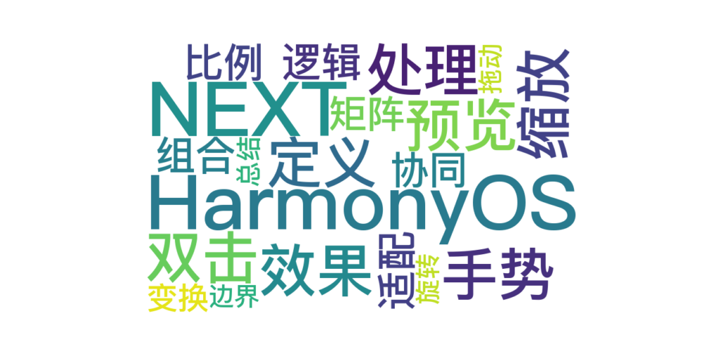

 
> 温馨提示：本篇博客的详细代码已发布到 [git](https://gitcode.com/nutpi/HarmonyosNext) : https://gitcode.com/nutpi/HarmonyosNext 可以下载运行哦！




# Harmonyos NEXT 图片预览组件之手势处理实现（三）
## 效果预览


## 一、双击缩放手势实现

在前两篇文章中，我们介绍了图片预览组件的单指拖动、双指缩放和双指旋转手势实现。本文将继续介绍双击缩放手势的实现细节，以及手势之间的协同工作机制。

### 1. 双击缩放手势定义

```typescript
TapGesture({ count: 2 })
    .onAction(() => {
        let fn: Function;
        // 当前大小倍数 大于 默认的倍数，则是放大状态需要缩小
        if (this.imageScaleInfo.scaleValue > this.imageScaleInfo.defaultScaleValue) {
            fn = () => {
                // 恢复默认大小
                this.imageScaleInfo.reset();
                // 重置偏移量
                this.imageOffsetInfo.reset();
                // 设置一个新的矩阵
                this.matrix = matrix4.identity().copy().rotate({
                    z: 1,
                    angle: this.imageRotateInfo.lastRotate
                });
            }
        } else {
            fn = () => {
                // 这里是正常状态 -- 需要放大
                // 获取放大倍数
                const ratio: number = this.calcFitScaleRatio(this.imageDefaultSize, windowSizeManager.get());
                // 设置当前放大倍数
                this.imageScaleInfo.scaleValue = ratio;
                // 重置偏移量
                this.imageOffsetInfo.reset();
                // 设置矩阵元素
                this.matrix = matrix4.identity().scale({
                    x: ratio,
                    y: ratio,
                }).rotate({
                    z: 1,
                    angle: this.imageRotateInfo.lastRotate
                }).copy();
                // 设置最后放大倍数设置为当前的倍数
                this.imageScaleInfo.stash();
            }
        }
        runWithAnimation(fn);
    })
```

### 2. 双击缩放处理逻辑

双击缩放手势的核心逻辑包括：

1. 判断当前图片的缩放状态：
   - 如果当前缩放值大于默认值（已放大状态），则执行缩小操作
   - 如果当前缩放值等于默认值（未放大状态），则执行放大操作
2. 缩小操作：
   - 重置缩放值为默认值
   - 重置偏移量为0
   - 应用矩阵变换，保持当前旋转角度
3. 放大操作：
   - 计算适合屏幕的缩放比例
   - 设置缩放值为计算得到的比例
   - 重置偏移量为0
   - 应用矩阵变换，结合缩放和旋转
   - 保存当前缩放值为最后缩放值
4. 使用动画效果执行缩放操作，提供平滑的视觉体验

### 3. 适配屏幕的缩放比例计算

```typescript
calcFitScaleRatio(imageSize: image.Size, windowSize: window.Size): number {
    let ratio: number = 1.0;
    if (windowSize.width > imageSize.width) {
        ratio = windowSize.width / imageSize.width;
    } else {
        ratio = windowSize.height / imageSize.height;
    }
    return ratio;
}
```

这个方法计算图片适配屏幕的缩放比例，确保图片能够填满屏幕。计算逻辑如下：

1. 如果窗口宽度大于图片宽度，则以宽度为基准计算缩放比例
2. 否则，以高度为基准计算缩放比例

## 二、手势组合与协同工作

### 1. 手势组合实现

图片预览组件使用GestureGroup将多种手势组合在一起，实现复杂的交互效果：

```typescript
.gesture(
    GestureGroup(
        GestureMode.Parallel,
        // 双击切换图片大小
        TapGesture({ count: 2 }),
        // 拖动图片
        PanGesture({ fingers: 1 })
    )
)
// 两根手指操作
.gesture(
    GestureGroup(
        GestureMode.Parallel,
        // 双指旋转图片
        RotationGesture({ angle: this.imageRotateInfo.startAngle }),
        // 双指缩放图片
        PinchGesture({ fingers: 2, distance: 1 })
    )
)
```

组件将手势分为两组：

1. 单指手势组：包含双击手势和单指拖动手势
2. 双指手势组：包含旋转手势和缩放手势

通过GestureMode.Parallel模式，允许同一组内的手势并行识别和处理，提供更自然的交互体验。

### 2. 手势状态协同

不同手势之间通过共享数据模型实现状态协同：

```typescript
// 图片旋转信息
@State imageRotateInfo: RotateModel = new RotateModel();
// 图片缩放信息
@State imageScaleInfo: ScaleModel = new ScaleModel(1.0, 1.0, 1.5, 0.3);
// 图片偏移信息
@State imageOffsetInfo: OffsetModel = new OffsetModel(0, 0);
```

这些状态模型在不同手势之间共享，确保手势操作的一致性和连贯性：

1. 旋转手势更新imageRotateInfo
2. 缩放手势更新imageScaleInfo
3. 拖动手势更新imageOffsetInfo

### 3. 矩阵变换的统一应用

所有手势操作最终都通过matrix4矩阵变换应用到图片上：

```typescript
// 本模块提供矩阵变换功能，可对图形进行平移、旋转和缩放等
@State matrix: matrix4.Matrix4Transit = matrix4.identity().copy();

// 应用矩阵变换
Image(this.imageUrl)
    .transform(this.matrix)
    .offset({
        x: this.imageOffsetInfo.currentX,
        y: this.imageOffsetInfo.currentY
    })
```

矩阵变换和偏移量的组合使用，实现了图片的复合变换效果：

1. 矩阵变换（matrix）：实现缩放和旋转
2. 偏移量（offset）：实现位移

## 三、手势边界处理

### 1. 缩放边界处理

```typescript
// 当小于默认大小时，恢复为默认大小
if (this.imageScaleInfo.scaleValue < this.imageScaleInfo.defaultScaleValue) {
    runWithAnimation(() => {
        this.imageScaleInfo.reset();
        this.imageOffsetInfo.reset();
        this.matrix = matrix4.identity().rotate({
            x: 0,
            y: 0,
            z: 1,
            angle: this.imageRotateInfo.currentRotate,
        }).copy();
    })
}
// 当大于最大缩放因子时，恢复到最大
if (this.imageScaleInfo.scaleValue > this.imageScaleInfo.maxScaleValue) {
    runWithAnimation(() => {
        this.imageScaleInfo.scaleValue = this.imageScaleInfo.maxScaleValue;
        this.matrix = matrix4.identity()
            .scale({
                x: this.imageScaleInfo.maxScaleValue,
                y: this.imageScaleInfo.maxScaleValue
            }).rotate({
                x: 0,
                y: 0,
                z: 1,
                angle: this.imageRotateInfo.currentRotate,
            });
    })
}
```

缩放边界处理确保图片的缩放值在合理范围内，并在超出范围时平滑恢复。

### 2. 旋转边界处理

```typescript
let rotate = simplestRotationQuarter(this.imageRotateInfo.currentRotate);
runWithAnimation(() => {
    this.imageRotateInfo.currentRotate = rotate;
    // 应用旋转变换
})
```

旋转边界处理将旋转角度对齐到最接近的90度倍数，提供更整齐的视觉效果。

### 3. 拖动边界处理

```typescript
evaluateBound(): void {
    const xBol = constrainOffsetAndAnimation({
        dimensionWH: ImageFitType.TYPE_WIDTH,
        // 其他参数...
    });
    const yBol = constrainOffsetAndAnimation({
        dimensionWH: ImageFitType.TYPE_HEIGHT,
        // 其他参数...
    });
    // 处理边界情况...
}
```

拖动边界处理确保图片不会被拖出视口，并在达到边界时触发图片切换。

## 四、总结

图片预览组件的手势处理实现了丰富的交互功能，包括单指拖动、双指缩放、双指旋转和双击缩放等。通过合理的手势组合和状态协同，提供了流畅自然的用户体验。

手势处理的核心技术包括：

1. 使用GestureGroup组合多种手势，实现复杂交互
2. 通过数据模型共享状态，确保手势操作的一致性
3. 使用matrix4矩阵变换实现图片的复合变换
4. 通过边界处理确保交互操作的合理性
5. 添加动画效果提供平滑的视觉体验

这些技术的综合应用，使图片预览组件能够提供接近原生应用的交互体验，满足用户对图片预览的各种需求。
