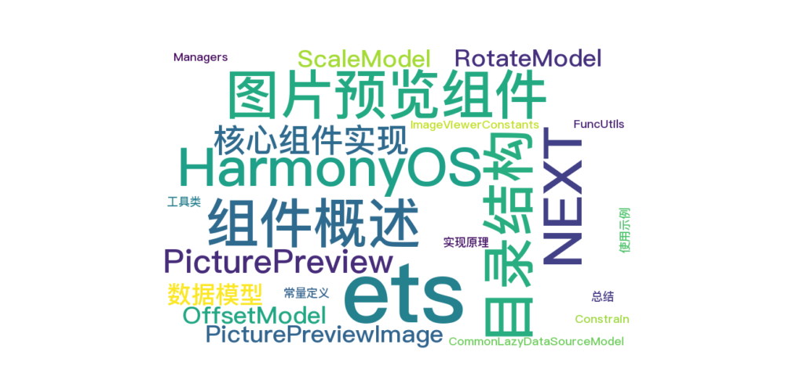

 
> 温馨提示：本篇博客的详细代码已发布到 [git](https://gitcode.com/nutpi/HarmonyosNext) : https://gitcode.com/nutpi/HarmonyosNext 可以下载运行哦！



# Harmonyos NEXT 图片预览组件实现概览

## 效果预览


## 一、组件概述

图片预览组件是一个用于展示和交互图片的高级组件，支持图片的缩放、旋转、滑动切换等功能。该组件由两个核心部分组成：

1. **PicturePreview**：外层容器组件，负责图片列表的管理和切换
2. **PicturePreviewImage**：内层图片组件，负责单张图片的展示和交互

## 二、目录结构

```
├── components/ImagePreview/       # 图片预览组件
│   ├── PicturePreview.ets        # 图片预览外层组件
│   ├── PicturePreviewImage.ets   # 图片预览内层组件
│   ├── ImageItemView.ets         # 图片项视图
│   └── ImageViewerView.ets       # 图片查看器视图
├── model/                        # 数据模型
│   ├── CommonLazyDataSourceModel.ets  # 懒加载数据源模型
│   ├── OffsetModel.ets           # 偏移模型
│   ├── RotateModel.ets           # 旋转模型
│   ├── ScaleModel.ets            # 缩放模型
│   └── PositionModel.ets         # 位置模型
├── utils/                        # 工具类
│   ├── Constrain.ets             # 约束工具
│   ├── FuncUtils.ets             # 功能工具
│   └── Managers.ets              # 管理器
└── constants/                    # 常量
    └── ImageViewerConstants.ets  # 图片查看器常量
```

## 三、核心组件实现

### 1. PicturePreview 组件

`PicturePreview` 是图片预览的外层容器组件，主要负责：

- 使用 List 组件实现多图片的移动和展示
- 通过 ListScroller 控制图片预览的位移
- 管理图片数据源和懒加载

**核心属性**：

```typescript
// 滑动方向
@Prop listDirection: Axis = Axis.Vertical;
// 外部传入的图片数据
@Link @Watch('getListMaxLength') imageList: string[];
// 背景颜色
@State listBGColor: Color = Color.White;
// 图片懒加载数据源
@State lazyImageList: CommonLazyDataSourceModel<string> = new CommonLazyDataSourceModel();
```

**核心方法**：

- `setListOffset`：设置列表偏移量
- `setListToIndex`：切换到指定索引的图片
- `getListMaxLength`：获取图片数量并设置懒加载数据

### 2. PicturePreviewImage 组件

`PicturePreviewImage` 是图片预览的内层组件，负责单张图片的展示和交互，主要实现：

- 使用 matrix4 实现图片的缩放和旋转
- 使用 offset 实现组件的偏移
- 提前计算图片属性以便对组件属性进行设置
- 使用 Image.objectFile 的 Cover 模式使图片能够超出父组件显示

**核心属性**：

```typescript
// 图片旋转信息
@State imageRotateInfo: RotateModel = new RotateModel();
// 图片缩放信息
@State imageScaleInfo: ScaleModel = new ScaleModel(1.0, 1.0, 1.5, 0.3);
// 图片默认大小 -- 是转化后的大小
@State imageDefaultSize: image.Size = { width: 0, height: 0 };
// 本模块提供矩阵变换功能，可对图形进行平移、旋转和缩放等
@State matrix: matrix4.Matrix4Transit = matrix4.identity().copy();
// 图片偏移信息
@State imageOffsetInfo: OffsetModel = new OffsetModel(0, 0);
```

**核心方法**：

- `calcImageDefaultSize`：计算图片的默认尺寸
- `initCurrentImageInfo`：初始化图片信息
- `evaluateBound`：评估边界以控制图片切换
- `resetCurrentImageInfo`：重置图片信息

## 四、数据模型

### 1. ScaleModel - 缩放模型

管理图片的缩放状态：

```typescript
@Observed
export class ScaleModel {
  // 本次缩放因子，用于控制图片的大小显示
  public scaleValue: number;
  // 记录上次缩放完后的缩放因子
  public lastValue: number;
  // 最大放大值
  public maxScaleValue: number;
  // 额外比例值
  public extraScaleValue: number;
  // 默认缩放值
  public readonly defaultScaleValue: number = 1;
}
```

### 2. RotateModel - 旋转模型

管理图片的旋转状态：

```typescript
@Observed
export class RotateModel {
  // 当前旋转角度
  public currentRotate: number;
  // 最后的角度
  public lastRotate: number = 0;
  // 起步触发旋转的角度
  public startAngle: number = 20;
}
```

### 3. OffsetModel - 偏移模型

管理图片的位移状态：

```typescript
@Observed
export class OffsetModel {
  // 当前移动偏移量 X
  public currentX: number;
  // 当前移动偏移量 Y
  public currentY: number;
  // 最后的偏移量 X
  public lastX: number = 0;
  // 最后的偏移量 Y
  public lastY: number = 0;
}
```

### 4. CommonLazyDataSourceModel - 懒加载数据源模型

实现图片的懒加载，提高性能：

- 继承自 BasicDataSource，实现 IDataSource 接口
- 提供数据变化通知机制
- 支持数据的添加、删除、更新等操作

## 五、工具类

### 1. Constrain.ets - 约束工具

提供图片显示的约束功能：

- `ImageFitType`：定义图片适配类型（宽度适配、高度适配）
- `getMaxAllowedOffset`：计算最大允许的偏移量
- `constrainOffset`：约束图片偏移，确保不超出视口边界
- `isToggle`：判断是否需要切换图片

### 2. Managers.ets - 窗口管理器

提供窗口尺寸管理：

```typescript
class WindowSizeManager {
  private size: window.Size = { width: 0, height: 0 };
  get(): window.Size { return this.size; }
}
```

### 3. FuncUtils.ets - 功能工具

提供动画和旋转计算功能：

- `runWithAnimation`：给函数执行添加动画效果
- `simplestRotationQuarter`：计算最简旋转角度，将任意角度转换为0°、90°、180°、270°

## 六、常量定义

### ImageViewerConstants.ets

```typescript
export class ImageViewerConstants {
  // 缩放动画的持续时间
  static readonly ANIMATE_DURATION: number = 300;
  // swiper中缓存图片的数量
  static readonly SWIPER_CACHE_COUNT: number = 2;
  // 测试文件名称
  static readonly IMAGE_NAME: string = "02.jpg";
}
```

## 七、使用示例

```typescript
@Entry
@Component
struct PicturePreviewSample {
  @State imageList: string[] = [];
  @State listDirection: Axis = Axis.Horizontal;

  aboutToAppear(): void {
    let imageSource: string = $r("app.media.02") as ESObject;
    this.imageList.push(
      imageSource,
      imageSource,
      imageSource
    )
  }

  build() {
    RelativeContainer() {
      PicturePreview({ imageList: this.imageList, listDirection: this.listDirection })
    }
    .height('100%')
    .width('100%')
  }
}
```

## 八、实现原理

1. **图片缩放**：使用matrix4矩阵变换实现图片的缩放效果
2. **图片旋转**：通过matrix4矩阵变换实现图片的旋转效果
3. **图片切换**：使用List组件和ListScroller控制图片的切换
4. **手势处理**：
   - 单指拖动：移动图片
   - 双指缩放：缩放图片
   - 双指旋转：旋转图片
5. **边界处理**：通过constrainOffset函数约束图片的偏移，确保不超出视口边界
6. **懒加载**：使用CommonLazyDataSourceModel实现图片的懒加载，提高性能

## 九、总结

图片预览组件是一个功能完善的图片查看器，支持图片的缩放、旋转、滑动切换等功能。通过合理的组件设计和数据模型抽象，实现了高性能、高可用性的图片预览体验。开发者可以通过简单的配置，快速集成该组件到自己的应用中。
