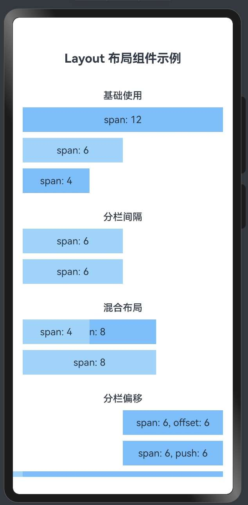

> 温馨提示：本篇博客的详细代码已发布到 [git](https://gitcode.com/nutpi/HarmonyosNext) : https://gitcode.com/nutpi/HarmonyosNext 可以下载运行哦！


# HarmonyOS NEXT Layout 布局组件系统详解（十二）：高级应用案例与性能优化

## 效果演示



## 1. 高级应用案例概述

在前一篇文章中，我们介绍了 HarmonyOS Layout 布局组件系统的基本应用案例。本文将继续深入探讨更多高级应用场景，并提供性能优化的最佳实践，帮助开发者创建既美观又高效的用户界面。

## 2. 高级布局实现

### 2.1 卡片网格布局

卡片网格布局是现代应用中常见的 UI 模式，适合展示图片、产品或文章列表：

```typescript
// 卡片网格布局
AutoRow({ gutter: [16, 16] }) {
    // 动态计算每个卡片的span值
    let cardSpan = 12; // 默认移动端一行一个
    if (screenWidth >= 600) cardSpan = 6;  // 平板一行两个
    if (screenWidth >= 1024) cardSpan = 4; // 桌面一行三个
    if (screenWidth >= 1440) cardSpan = 3; // 大屏一行四个

    // 生成卡片列表
    ForEach([1, 2, 3, 4, 5, 6, 7, 8], (item) => {
        AutoCol({ span: cardSpan }) {
            Column() {
                // 卡片图片
                Column()
                    .width('100%')
                    .height(160)
                    .backgroundColor('#e6f7ff')
                    .borderRadius({ topLeft: 8, topRight: 8 })

                // 卡片内容
                Column() {
                    Text(`卡片标题 ${item}`)
                        .fontSize(16)
                        .fontWeight(FontWeight.Medium)

                    Text('卡片描述信息，简短的介绍内容...')
                        .fontSize(14)
                        .fontColor('#666')
                        .margin({ top: 8 })

                    Row() {
                        Button('查看详情')
                            .height(32)
                            .fontSize(14)
                            .backgroundColor('#1890ff')
                            .fontColor('#fff')
                    }
                    .width('100%')
                    .margin({ top: 16 })
                }
                .width('100%')
                .padding(16)
            }
            .width('100%')
            .backgroundColor('#fff')
            .borderRadius(8)
            .shadow({
                radius: 4,
                color: 'rgba(0, 0, 0, 0.1)',
                offsetX: 0,
                offsetY: 2
            })
        }
    })
}
```

### 2.2 媒体布局

媒体布局适合展示图片和视频内容，通常需要考虑不同屏幕尺寸下的展示效果：

```typescript
// 媒体布局
AutoRow({ gutter: [16, 16] }) {
    // 主要内容区
    AutoCol({ span: screenWidth >= 768 ? 8 : 12 }) {
        Column() {
            // 主要媒体内容
            Column()
                .width('100%')
                .aspectRatio(16 / 9)
                .backgroundColor('#1890ff')
                .borderRadius(8)

            // 内容标题和描述
            Text('主要内容标题')
                .fontSize(20)
                .fontWeight(FontWeight.Bold)
                .margin({ top: 16 })

            Text('详细描述信息，介绍媒体内容的详细信息。这里可以是多行文本，包含丰富的描述内容...')
                .fontSize(14)
                .margin({ top: 8 })

            // 标签和操作按钮
            Row() {
                Row() {
                    Text('标签1')
                        .fontSize(12)
                        .backgroundColor('#e6f7ff')
                        .fontColor('#1890ff')
                        .padding({ left: 8, right: 8, top: 4, bottom: 4 })
                        .borderRadius(4)
                        .margin({ right: 8 })

                    Text('标签2')
                        .fontSize(12)
                        .backgroundColor('#e6f7ff')
                        .fontColor('#1890ff')
                        .padding({ left: 8, right: 8, top: 4, bottom: 4 })
                        .borderRadius(4)
                }

                Blank()

                Button('分享')
                    .height(32)
                    .fontSize(14)
                    .backgroundColor('#1890ff')
                    .fontColor('#fff')
            }
            .width('100%')
            .margin({ top: 16 })
        }
        .width('100%')
        .padding(16)
        .backgroundColor('#fff')
        .borderRadius(8)
    }

    // 侧边推荐内容
    if (screenWidth >= 768) {
        AutoCol({ span: 4 }) {
            Column() {
                Text('推荐内容')
                    .fontSize(16)
                    .fontWeight(FontWeight.Bold)
                    .margin({ bottom: 16 })

                // 推荐列表
                ForEach([1, 2, 3, 4], (item) => {
                    Row() {
                        // 缩略图
                        Column()
                            .width(80)
                            .height(60)
                            .backgroundColor('#e6f7ff')
                            .borderRadius(4)

                        // 标题和描述
                        Column() {
                            Text(`推荐内容 ${item}`)
                                .fontSize(14)
                                .fontWeight(FontWeight.Medium)

                            Text('简短描述...')
                                .fontSize(12)
                                .fontColor('#666')
                                .margin({ top: 4 })
                        }
                        .layoutWeight(1)
                        .alignItems(HorizontalAlign.Start)
                        .margin({ left: 12 })
                    }
                    .width('100%')
                    .margin({ bottom: 16 })
                })
            }
            .width('100%')
            .padding(16)
            .backgroundColor('#fff')
            .borderRadius(8)
        }
    }
}
```

## 3. 性能优化最佳实践

### 3.1 减少嵌套层级

过深的嵌套会影响渲染性能，应尽量减少不必要的嵌套：

```typescript
// 不推荐：过多嵌套
AutoRow() {
    AutoCol({ span: 12 }) {
        Column() {
            AutoRow() {
                AutoCol({ span: 12 }) {
                    Column() {
                        // 内容...
                    }
                }
            }
        }
    }
}

// 推荐：减少嵌套
AutoRow() {
    AutoCol({ span: 12 }) {
        // 内容...
    }
}
```

### 3.2 条件渲染优化

使用条件渲染时，应尽量减少不必要的重新计算和渲染：

```typescript
// 不推荐：频繁计算span值
AutoRow() {
    ForEach(items, (item) => {
        // 每次循环都计算span值
        let span = screenWidth >= 768 ? 6 : 12;
        AutoCol({ span: span }) {
            // 内容...
        }
    })
}

// 推荐：提前计算span值
let span = screenWidth >= 768 ? 6 : 12;
AutoRow() {
    ForEach(items, (item) => {
        AutoCol({ span: span }) {
            // 内容...
        }
    })
}
```

### 3.3 懒加载和虚拟列表

对于大量数据，应使用懒加载和虚拟列表技术：

```typescript
// 结合LazyForEach实现虚拟列表
AutoRow() {
    List() {
        LazyForEach(dataSource, (item) => {
            ListItem() {
                AutoRow() {
                    AutoCol({ span: 12 }) {
                        // 列表项内容...
                    }
                }
            }
        })
    }
    .width('100%')
    .height('100%')
}
```

### 3.4 避免频繁重新布局

避免在频繁变化的场景中使用复杂的栅格布局：

```typescript
// 不推荐：动画中使用复杂栅格布局
Animator()
    .onframe((progress) => {
        // 每帧都重新计算布局
        this.animValue = progress;
    })

build() {
    AutoRow() {
        AutoCol({ span: 6 + this.animValue * 6 }) {
            // 内容...
        }
    }
}

// 推荐：使用更简单的布局或预计算值
Animator()
    .onframe((progress) => {
        // 计算宽度百分比而非span值
        this.widthPercent = 50 + progress * 50;
    })

build() {
    Row() {
        Column() {
            // 内容...
        }
        .width(`${this.widthPercent}%`)
    }
}
```

## 4. 响应式布局最佳实践

### 4.1 使用标准断点

定义并使用标准的断点值，保持一致性：

```typescript
// 定义标准断点
const BREAKPOINTS = {
    xs: 0,      // 超小屏幕（手机竖屏）
    sm: 576,    // 小屏幕（手机横屏）
    md: 768,    // 中等屏幕（平板）
    lg: 992,    // 大屏幕（桌面）
    xl: 1200,   // 超大屏幕（大桌面）
    xxl: 1600   // 巨大屏幕
};

// 定义每个断点对应的列配置
const GRID_CONFIG = {
    xs: { span: 12, gutter: 8 },
    sm: { span: 6, gutter: 16 },
    md: { span: 4, gutter: 16 },
    lg: { span: 3, gutter: 24 },
    xl: { span: 3, gutter: 24 },
    xxl: { span: 2, gutter: 24 }
};

// 获取当前断点
function getBreakpoint(width: number) {
    if (width >= BREAKPOINTS.xxl) return 'xxl';
    if (width >= BREAKPOINTS.xl) return 'xl';
    if (width >= BREAKPOINTS.lg) return 'lg';
    if (width >= BREAKPOINTS.md) return 'md';
    if (width >= BREAKPOINTS.sm) return 'sm';
    return 'xs';
}

// 使用断点配置
const currentBreakpoint = getBreakpoint(screenWidth);
const gridConfig = GRID_CONFIG[currentBreakpoint];

AutoRow({ gutter: gridConfig.gutter }) {
    ForEach(items, (item) => {
        AutoCol({ span: gridConfig.span }) {
            // 内容...
        }
    })
}
```

### 4.2 组件化响应式布局

将响应式逻辑封装到组件中，提高复用性：

```typescript
@Component
struct ResponsiveGrid {
    @State currentBreakpoint: string = 'md';
    private items: any[] = [];
    private renderItem: (item: any, breakpoint: string) => void;

    aboutToAppear() {
        // 初始化断点
        this.updateBreakpoint();
        // 监听屏幕尺寸变化
        // 实际项目中可以使用媒体查询或窗口事件
    }

    private updateBreakpoint() {
        this.currentBreakpoint = getBreakpoint(screenWidth);
    }

    build() {
        AutoRow({ gutter: GRID_CONFIG[this.currentBreakpoint].gutter }) {
            ForEach(this.items, (item) => {
                AutoCol({ span: GRID_CONFIG[this.currentBreakpoint].span }) {
                    // 使用传入的渲染函数
                    this.renderItem(item, this.currentBreakpoint);
                }
            })
        }
    }
}

// 使用响应式网格组件
ResponsiveGrid({
    items: productList,
    renderItem: (item, breakpoint) => {
        // 根据断点渲染不同的内容
        if (breakpoint === 'xs') {
            // 简化版卡片
            // ...
        } else {
            // 完整版卡片
            // ...
        }
    }
})
```

## 5. 总结

HarmonyOS Layout 布局组件系统提供了强大的功能，可以实现各种复杂的布局需求。
本文深入探讨了高级应用案例和性能优化的最佳实践，帮助开发者创建美观、高效的用户界面。
通过灵活运用布局组件，开发者可以轻松构建出美观、易用的界面，提升用户体验。
