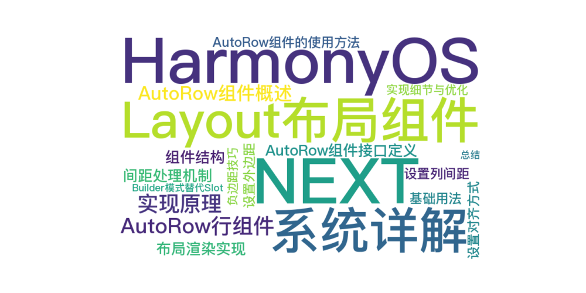

# HarmonyOS NEXT  Layout布局组件系统详解（二）：AutoRow行组件实现原理



## 1. AutoRow组件概述

AutoRow是HarmonyOS Layout布局系统中的核心组件之一，用于创建水平行布局，作为AutoCol列组件的容器。本文将详细介绍AutoRow组件的实现原理、属性配置和使用方法。

## 2. AutoRow组件接口定义

```typescript
export interface RowProps {
    // 列元素之间的间距（像素）
    gutter?: number | [number, number];
    // 水平排列方式
    justify?: FlexAlign;
    // 垂直对齐方式
    align?: ItemAlign;
    // 自定义样式类
    customClass?: string;
    // 外边距
    autoMargin?: string | number | Margin;
    // 内边距
    autoPadding?: string | number | Padding;
    // 宽度
    autoWidth?: string | number;
    // 高度
    autoHeight?: string | number;
}
```

## 3. AutoRow组件实现原理

### 3.1 组件结构

AutoRow组件的实现基于ArkUI的`@Component`装饰器，内部使用Flex布局来实现行布局：

```typescript
@Component
export struct AutoRow {
    // 组件私有状态
    @State gutterStyle: string = '';

    // 组件属性，可由父组件传入
    @Prop gutter: number | [number, number] = 0;
    @Prop justify: FlexAlign = FlexAlign.Start;
    @Prop ItemAligns: ItemAlign = ItemAlign.Center;
    @Prop customClass: string = '';
    @Prop autoMargin: string | number | Margin = 0;
    @Prop autoPadding: string | number | Padding = 0;
    @Prop autoWidth: string | number = '100%';
    @Prop autoHeight: string | number = '20';

    // 定义内容构建函数，替代Slot
    @Builder
    defaultContent() {
        // 默认内容为空
    }

    @BuilderParam content: () => void = this.defaultContent;

    // 组件生命周期和方法...
}
```

### 3.2 间距处理机制

AutoRow组件的一个重要功能是处理列之间的间距（gutter）。这是通过在组件的`aboutToAppear`生命周期中调用`handleGutter`方法实现的：

```typescript
/**
 * 组件生命周期函数，在组件创建时调用
 */
aboutToAppear() {
    // 处理gutter属性，设置对应的样式
    this.handleGutter();
}

/**
 * 处理gutter属性，计算对应的样式
 */
private handleGutter() {
    if (this.gutter === 0) {
        return;
    }

    // 处理水平和垂直方向的间距
    let horizontalGutter = 0;
    let verticalGutter = 0;

    if (typeof this.gutter === 'number') {
        horizontalGutter = this.gutter;
    } else if (Array.isArray(this.gutter) && this.gutter.length >= 2) {
        horizontalGutter = this.gutter[0];
        verticalGutter = this.gutter[1];
    }

    // 设置行的负边距，用于抵消列的边距
    if (horizontalGutter > 0) {
        this.gutterStyle = `margin-left: -${horizontalGutter / 2}px; margin-right: -${horizontalGutter / 2}px;`;
    }
}
```

这里的关键点是：

1. 支持两种gutter设置方式：单一数值或数组
2. 单一数值表示水平间距，数组表示水平和垂直间距
3. 通过设置行的负边距来抵消列的边距，实现列之间的间隔效果

### 3.3 布局渲染实现

AutoRow组件的布局渲染通过build方法实现：

```typescript
/**
 * 组件构建函数
 */
build() {
    Column() {
        Flex({ direction: FlexDirection.Row, justifyContent: this.justify, alignItems: this.ItemAligns, wrap: FlexWrap.Wrap }) {
            // 渲染内容构建函数
            this.content();
        }
        .width('100%')
        .height('100%')
        .padding(0)
        .margin(0)
    }
    .width(this.autoWidth)
    .height(this.autoHeight)
    .padding(this.autoPadding)
    .margin(this.autoMargin)
}
```

这里的关键点是：

1. 使用Column作为外层容器，提供整体布局控制
2. 内部使用Flex组件实现行布局，设置为水平方向（FlexDirection.Row）
3. 支持自定义对齐方式（justifyContent和alignItems）
4. 启用自动换行（FlexWrap.Wrap）
5. 通过content()函数渲染内部内容（AutoCol组件）

## 4. AutoRow组件的使用方法

### 4.1 基础用法

```typescript
AutoRow() {
    AutoCol({ span: 12 }) {
        Text('span: 12')
            .width('100%')
            .height(40)
            .textAlign(TextAlign.Center)
            .backgroundColor('#69c0ff')
    }
}
```

### 4.2 设置列间距

```typescript
// 水平间隔
AutoRow({ gutter: 20 }) {
    AutoCol({ span: 6 }) {
        Text('span: 6')
            .width('100%')
            .height(40)
            .textAlign(TextAlign.Center)
            .backgroundColor('#69c0ff')
    }
    AutoCol({ span: 6 }) {
        Text('span: 6')
            .width('100%')
            .height(40)
            .textAlign(TextAlign.Center)
            .backgroundColor('#91d5ff')
    }
}

// 水平和垂直间隔
AutoRow({ gutter: [20, 20] }) {
    AutoCol({ span: 6 }) {
        Text('span: 6')
            .width('100%')
            .height(40)
            .textAlign(TextAlign.Center)
            .backgroundColor('#69c0ff')
    }
    AutoCol({ span: 6 }) {
        Text('span: 6')
            .width('100%')
            .height(40)
            .textAlign(TextAlign.Center)
            .backgroundColor('#91d5ff')
    }
}
```

### 4.3 设置对齐方式

```typescript
// 左对齐
AutoRow({ justify: FlexAlign.Start }) {
    AutoCol({ span: 4 }) {
        Text('左对齐')
            .width('100%')
            .height(40)
            .textAlign(TextAlign.Center)
            .backgroundColor('#69c0ff')
    }
}

// 居中对齐
AutoRow({ justify: FlexAlign.Center }) {
    AutoCol({ span: 4 }) {
        Text('居中对齐')
            .width('100%')
            .height(40)
            .textAlign(TextAlign.Center)
            .backgroundColor('#69c0ff')
    }
}

// 右对齐
AutoRow({ justify: FlexAlign.End }) {
    AutoCol({ span: 4 }) {
        Text('右对齐')
            .width('100%')
            .height(40)
            .textAlign(TextAlign.Center)
            .backgroundColor('#69c0ff')
    }
}
```

### 4.4 设置外边距

```typescript
AutoRow({ autoMargin: { bottom: 30 } }) {
    AutoCol({ span: 12 }) {
        Text('带底部外边距的行')
            .width('100%')
            .height(40)
            .textAlign(TextAlign.Center)
            .backgroundColor('#69c0ff')
    }
}
```

## 5. 实现细节与优化

### 5.1 负边距技巧

AutoRow组件使用了一个常见的CSS技巧：通过设置负边距来抵消列的内边距，从而实现列之间的间隔效果。这种方式的优点是：

1. 保持整体布局的宽度不变
2. 确保第一列和最后一列与容器边缘的距离一致
3. 实现列之间的均匀间隔

### 5.2 Builder模式替代Slot

AutoRow组件使用`@Builder`和`@BuilderParam`装饰器来实现内容构建，这是ArkUI中替代传统Slot插槽的方式：

```typescript
@Builder
defaultContent() {
    // 默认内容为空
}

@BuilderParam content: () => void = this.defaultContent;
```

这种方式的优点是：

1. 更灵活的内容构建
2. 支持条件渲染和循环渲染
3. 可以在构建函数中访问组件的状态和属性

## 6. 总结

AutoRow组件是HarmonyOS Layout布局系统的核心组件之一，通过灵活的属性配置和内部的Flex布局实现，可以轻松创建各种水平行布局。其主要特点包括：

1. 支持设置列间距（gutter）
2. 支持自定义对齐方式（justify和align）
3. 支持自定义外边距和内边距
4. 使用Builder模式实现内容构建

在下一篇文章中，我们将详细介绍AutoCol列组件的实现原理和使用方法。