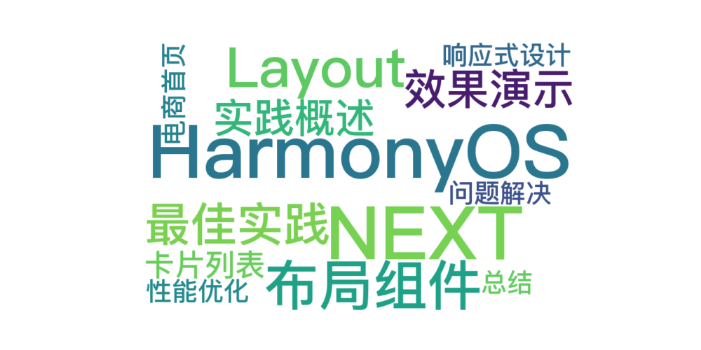
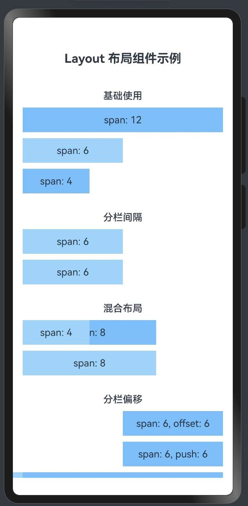

 
> 温馨提示：本篇博客的详细代码已发布到 [git](https://gitcode.com/nutpi/HarmonyosNext) : https://gitcode.com/nutpi/HarmonyosNext 可以下载运行哦！



# HarmonyOS NEXT Layout布局组件系统详解（十一）：最佳实践与高级应用

## 效果演示




## 1. 布局最佳实践概述

在前一篇文章中，我们介绍了HarmonyOS Layout布局组件系统的基本应用案例，包括三段式布局、仪表盘布局和表单布局等。本文将继续深入探讨更多高级应用场景和最佳实践，帮助开发者创建既美观又高效的用户界面。

## 2. 卡片列表布局

卡片列表是展示多条相似信息的常用方式，以下是一个商品列表的实现：

```typescript
AutoRow({ gutter: [16, 16] }) {
    // 标题区域
    AutoCol({ span: 12 }) {
        Row() {
            Text('商品列表').fontSize(20).fontWeight(FontWeight.Bold)
            Blank()
            Text('查看全部 >').fontColor('#1890ff')
        }
        .width('100%')
        .justifyContent(FlexAlign.SpaceBetween)
        .margin({ bottom: 16 })
    }
    
    // 商品卡片
    ForEach([1, 2, 3, 4, 5, 6], (item) => {
        AutoCol({ 
            span: screenWidth >= 1200 ? 4 : (screenWidth >= 768 ? 6 : 12) 
        }) {
            Column() {
                // 商品图片
                Column()
                    .width('100%')
                    .height(160)
                    .backgroundColor('#e6f7ff')
                    .borderRadius({ topLeft: 8, topRight: 8 })
                
                // 商品信息
                Column() {
                    Text(`商品名称 ${item}`)
                        .fontSize(16)
                        .fontWeight(FontWeight.Medium)
                        .margin({ bottom: 8 })
                    
                    Text('商品描述信息，简短介绍商品特点和亮点...')
                        .fontSize(14)
                        .fontColor('#666')
                        .margin({ bottom: 12 })
                        .maxLines(2)
                        .textOverflow({ overflow: TextOverflow.Ellipsis })
                    
                    Row() {
                        Text('¥199.00')
                            .fontSize(18)
                            .fontColor('#f5222d')
                            .fontWeight(FontWeight.Bold)
                        
                        Blank()
                        
                        Button('加入购物车')
                            .height(32)
                            .fontSize(14)
                            .backgroundColor('#1890ff')
                            .fontColor('#fff')
                    }
                    .width('100%')
                }
                .width('100%')
                .padding(12)
            }
            .width('100%')
            .backgroundColor('#fff')
            .borderRadius(8)
        }
    })
}
```

## 3. 响应式设计原则

在HarmonyOS应用开发中，遵循以下响应式设计原则可以提升用户体验：

1. **移动优先设计**：先为小屏幕设计布局，再逐步扩展到大屏幕。

```typescript
// 移动优先的列宽设置
AutoCol({ 
    span: 12,  // 默认在小屏幕上占满宽度
    md: 6,     // 中等屏幕上占一半宽度
    lg: 4      // 大屏幕上占三分之一宽度
}) {
    // 内容
}
```

2. **断点设计**：根据常见设备尺寸设置合理的断点。

```typescript
// 常用断点设置
const breakpoints = {
    xs: 480,   // 超小屏幕
    sm: 768,   // 小屏幕
    md: 992,   // 中等屏幕
    lg: 1200,  // 大屏幕
    xl: 1600   // 超大屏幕
}

// 使用断点进行响应式设计
AutoCol({ 
    span: screenWidth >= breakpoints.md ? 6 : 12 
}) {
    // 内容
}
```

3. **流式布局**：使用百分比和弹性布局，避免固定宽度。

```typescript
// 使用百分比和弹性布局
Column() {
    // 内容
}
.width('100%')  // 使用百分比宽度
.height('auto')  // 高度自适应内容
```

## 4. 性能优化建议

在使用HarmonyOS Layout布局组件时，可以采取以下措施优化性能：

1. **减少嵌套层级**：过深的嵌套会影响渲染性能。

```typescript
// 不推荐：过多嵌套
AutoRow() {
    AutoCol() {
        Column() {
            Row() {
                Column() {
                    // 内容
                }
            }
        }
    }
}

// 推荐：减少嵌套
AutoRow() {
    AutoCol() {
        Row() {
            // 内容
        }
    }
}
```

2. **懒加载和虚拟列表**：对于长列表，使用懒加载和虚拟列表技术。

```typescript
List() {
    LazyForEach(dataSource, (item) => {
        ListItem() {
            // 列表项内容
        }
    })
}
```

3. **条件渲染**：根据需要渲染组件，避免不必要的渲染。

```typescript
// 条件渲染示例
AutoRow() {
    // 只在大屏幕上显示侧边栏
    if (screenWidth >= 768) {
        AutoCol({ span: 4 }) {
            // 侧边栏内容
        }
    }
    
    // 内容区域
    AutoCol({ span: screenWidth >= 768 ? 8 : 12 }) {
        // 主要内容
    }
}
```

4. **使用缓存**：对于复杂计算或布局，使用缓存避免重复计算。

```typescript
// 使用@Builder缓存复杂组件
@Builder
function CardBuilder(title: string, content: string) {
    Column() {
        Text(title).fontSize(16).fontWeight(FontWeight.Bold)
        Text(content).fontSize(14).margin({ top: 8 })
    }
    .width('100%')
    .padding(16)
    .backgroundColor('#fff')
    .borderRadius(8)
}

// 在布局中使用
AutoRow({ gutter: [16, 16] }) {
    AutoCol({ span: 6 }) {
        this.CardBuilder('标题1', '内容1')
    }
    AutoCol({ span: 6 }) {
        this.CardBuilder('标题2', '内容2')
    }
}
```

## 5. 常见布局问题解决方案

在使用HarmonyOS Layout布局组件时，可能会遇到以下常见问题及解决方案：

1. **元素对齐问题**：使用justifyContent和alignItems属性控制对齐。

```typescript
// 水平居中对齐
Row() {
    // 内容
}
.width('100%')
.justifyContent(FlexAlign.Center)

// 垂直居中对齐
Column() {
    // 内容
}
.height('100%')
.alignItems(HorizontalAlign.Center)

// 水平垂直居中
Column() {
    // 内容
}
.width('100%')
.height('100%')
.justifyContent(FlexAlign.Center)
.alignItems(HorizontalAlign.Center)
```

2. **间距处理**：使用gutter属性和margin属性处理间距。

```typescript
// 使用gutter处理行列间距
AutoRow({ gutter: [16, 24] }) {
    // 列之间有16px间距，行之间有24px间距
    // 内容
}

// 使用margin处理特定元素间距
Text('内容')
    .margin({ top: 8, bottom: 8, left: 16, right: 16 })
```

3. **溢出处理**：处理内容溢出问题。

```typescript
// 文本溢出处理
Text('这是一段可能会溢出的长文本...')
    .maxLines(2)
    .textOverflow({ overflow: TextOverflow.Ellipsis })

// 容器溢出处理
Column() {
    // 大量内容
}
.width('100%')
.height(200)
.overflow(Overflow.Scroll)  // 设置滚动
```

## 6. 综合案例：电商应用首页

以下是一个电商应用首页的综合案例，展示了如何使用HarmonyOS Layout布局组件系统实现复杂的页面布局：

```typescript
@Entry
@Component
struct ECommerceHomePage {
  @State screenWidth: number = 0
  
  aboutToAppear() {
    // 获取屏幕宽度
    this.screenWidth = px2vp(AppStorage.Get('windowWidth'))
  }
  
  build() {
    Scroll() {
      Column() {
        // 顶部导航栏
        Row() {
          Image($r('app.media.logo'))
            .width(120)
            .height(32)
            .objectFit(ImageFit.Contain)
          
          Blank()
          
          Row() {
            Image($r('app.media.search'))
              .width(24)
              .height(24)
              .margin({ right: 20 })
            
            Image($r('app.media.cart'))
              .width(24)
              .height(24)
              .margin({ right: 20 })
            
            Image($r('app.media.user'))
              .width(24)
              .height(24)
          }
        }
        .width('100%')
        .height(56)
        .padding({ left: 16, right: 16 })
        .backgroundColor('#fff')
        
        // 轮播图
        Swiper() {
          ForEach([1, 2, 3], (item) => {
            Image($r(`app.media.banner${item}`))
              .width('100%')
              .height('100%')
              .borderRadius(8)
          })
        }
        .width('100%')
        .height(180)
        .margin({ top: 16 })
        .autoPlay(true)
        
        // 分类导航
        AutoRow({ gutter: [0, 0], autoMargin: { top: 24, bottom: 16 } }) {
          ForEach(['服装', '电子', '家居', '美妆', '食品'], (category) => {
            AutoCol({ span: this.screenWidth >= 768 ? 2 : 4 }) {
              Column() {
                Circle({ width: 48, height: 48 })
                  .fill('#e6f7ff')
                  .margin({ bottom: 8 })
                
                Text(category)
                  .fontSize(14)
              }
              .width('100%')
              .alignItems(HorizontalAlign.Center)
            }
          })
        }
        
        // 促销活动
        AutoRow({ gutter: [16, 16] }) {
          AutoCol({ span: 12 }) {
            Text('限时特惠').fontSize(18).fontWeight(FontWeight.Bold)
          }
          
          // 促销商品
          ForEach([1, 2, 3, 4], (item) => {
            AutoCol({ 
              span: this.screenWidth >= 1200 ? 3 : (this.screenWidth >= 768 ? 6 : 6) 
            }) {
              Column() {
                // 商品图片
                Stack() {
                  Rectangle()
                    .width('100%')
                    .height(120)
                    .fill('#f0f0f0')
                  
                  Text('限时')
                    .fontSize(12)
                    .backgroundColor('#f5222d')
                    .fontColor('#fff')
                    .padding({ left: 8, right: 8, top: 4, bottom: 4 })
                    .borderRadius({ topRight: 8, bottomRight: 8 })
                    .position({ x: 0, y: 8 })
                }
                
                // 商品信息
                Column() {
                  Text(`特惠商品${item}`)
                    .fontSize(14)
                    .maxLines(1)
                    .textOverflow({ overflow: TextOverflow.Ellipsis })
                    .margin({ bottom: 4 })
                  
                  Row() {
                    Text('¥99')
                      .fontSize(16)
                      .fontColor('#f5222d')
                      .fontWeight(FontWeight.Bold)
                    
                    Text('¥199')
                      .fontSize(12)
                      .fontColor('#999')
                      .decoration({ type: TextDecorationType.LineThrough })
                      .margin({ left: 8 })
                  }
                }
                .width('100%')
                .padding(8)
              }
              .width('100%')
              .backgroundColor('#fff')
              .borderRadius(8)
            }
          })
        }
        .padding({ left: 16, right: 16 })
        
        // 推荐商品
        AutoRow({ gutter: [16, 16], autoMargin: { top: 24, bottom: 16 } }) {
          AutoCol({ span: 12 }) {
            Row() {
              Text('为你推荐').fontSize(18).fontWeight(FontWeight.Bold)
              Blank()
              Text('查看更多 >').fontSize(14).fontColor('#1890ff')
            }
            .width('100%')
            .justifyContent(FlexAlign.SpaceBetween)
            .margin({ bottom: 16 })
          }
          
          // 推荐商品列表
          ForEach([1, 2, 3, 4, 5, 6], (item) => {
            AutoCol({ 
              span: this.screenWidth >= 1200 ? 4 : (this.screenWidth >= 768 ? 6 : 12) 
            }) {
              Column() {
                // 商品图片
                Rectangle()
                  .width('100%')
                  .height(160)
                  .fill('#f5f5f5')
                  .borderRadius({ topLeft: 8, topRight: 8 })
                
                // 商品信息
                Column() {
                  Text(`推荐商品${item}`)
                    .fontSize(16)
                    .maxLines(1)
                    .textOverflow({ overflow: TextOverflow.Ellipsis })
                    .margin({ bottom: 8 })
                  
                  Text('商品描述信息，简短介绍...')
                    .fontSize(14)
                    .fontColor('#666')
                    .maxLines(2)
                    .textOverflow({ overflow: TextOverflow.Ellipsis })
                    .margin({ bottom: 8 })
                  
                  Row() {
                    Text('¥129.00')
                      .fontSize(16)
                      .fontColor('#f5222d')
                      .fontWeight(FontWeight.Bold)
                    
                    Blank()
                    
                    Image($r('app.media.cart_add'))
                      .width(24)
                      .height(24)
                  }
                  .width('100%')
                }
                .width('100%')
                .padding(12)
              }
              .width('100%')
              .backgroundColor('#fff')
              .borderRadius(8)
            }
          })
        }
        .padding({ left: 16, right: 16 })
      }
      .width('100%')
    }
    .width('100%')
    .height('100%')
    .scrollBar(BarState.Off)
    .backgroundColor('#f5f5f5')
  }
}
```

## 7. 总结

HarmonyOS Layout布局组件系统提供了强大而灵活的布局能力，通过AutoRow和AutoCol组件，可以轻松实现响应式布局和复杂的页面结构。在实际应用中，我们应该遵循以下原则：

1. **合理使用栅格系统**：利用12列栅格系统实现灵活的布局。
2. **响应式设计**：根据屏幕尺寸调整布局，提供最佳用户体验。
3. **减少嵌套**：避免过深的组件嵌套，提高性能。
4. **一致性**：保持设计的一致性，包括间距、对齐方式等。
5. **性能优化**：使用懒加载、条件渲染等技术优化性能。

通过本系列文章的学习，相信你已经掌握了HarmonyOS Layout布局组件系统的核心概念和使用方法。希望这些知识能帮助你在HarmonyOS应用开发中创建出优秀的用户界面。
