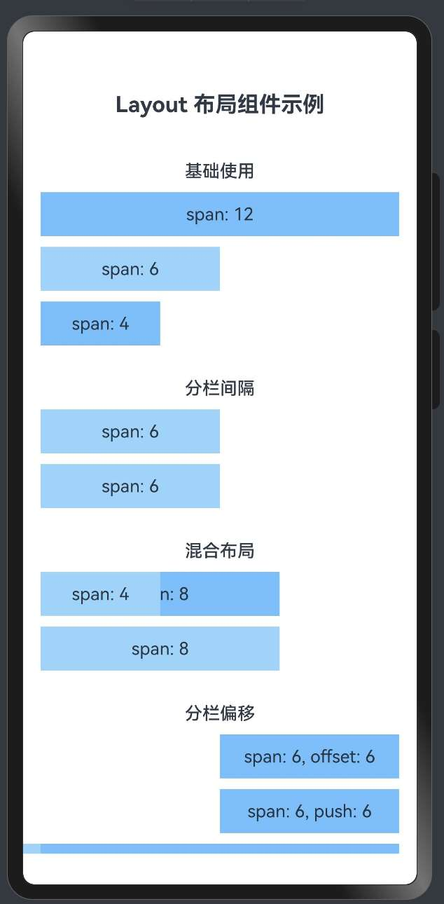

> 温馨提示：本篇博客的详细代码已发布到 [git](https://gitcode.com/nutpi/HarmonyosNext) : https://gitcode.com/nutpi/HarmonyosNext 可以下载运行哦！


# HarmonyOS NEXT Layout 布局组件系统详解（八）：自定义样式与类

## 效果演示



## 1. 自定义样式概述

在 HarmonyOS 的 Layout 布局组件系统中，除了基本的布局功能外，还提供了丰富的自定义样式选项，使开发者能够根据需求灵活调整组件的外观。本文将详细介绍 Layout 布局组件系统中的自定义样式和类的使用方法。

## 2. 自定义样式属性定义

### 2.1 AutoRow 组件中的样式属性

```typescript
export interface RowProps {
    // 自定义样式类
    customClass?: string;
    // 外边距
    autoMargin?: string | number | Margin;
    // 内边距
    autoPadding?: string | number | Padding;
    // 宽度
    autoWidth?: string | number;
    // 高度
    autoHeight?: string | number;
    // 其他属性...
}
```

### 2.2 AutoCol 组件中的样式属性

```typescript
export interface LayoutProps {
    // 自定义样式类
    customClass?: string;
    // 其他属性...
}
```

## 3. 自定义样式的实现原理

### 3.1 直接样式属性

AutoRow 组件提供了多个直接样式属性，如 autoMargin、autoPadding、autoWidth 和 autoHeight，这些属性直接映射到组件的样式属性：

```typescript
build() {
    Column() {
        Flex({ direction: FlexDirection.Row, justifyContent: this.justify, alignItems: this.ItemAligns, wrap: FlexWrap.Wrap }) {
            // 渲染内容构建函数
            this.content();
        }
        .width('100%')
        .height('100%')
        .padding(0)
        .margin(0)
    }
    .width(this.autoWidth)
    .height(this.autoHeight)
    .padding(this.autoPadding)
    .margin(this.autoMargin)
}
```

### 3.2 customClass 属性

customClass 属性允许开发者为组件指定自定义的样式类，这些样式类可以在应用的样式文件中定义。虽然在当前的实现中，customClass 属性已经定义但尚未完全实现，但它为未来的扩展提供了基础。

## 4. 自定义样式的使用方法

### 4.1 设置外边距和内边距

```typescript
// 设置外边距
AutoRow({ autoMargin: { bottom: 30 } }) {
    AutoCol({ span: 12 }) {
        Text('带底部外边距的行')
            .width('100%')
            .height(40)
            .textAlign(TextAlign.Center)
            .backgroundColor('#69c0ff')
    }
}

// 设置内边距
AutoRow({ autoPadding: { left: 20, right: 20 } }) {
    AutoCol({ span: 12 }) {
        Text('带左右内边距的行')
            .width('100%')
            .height(40)
            .textAlign(TextAlign.Center)
            .backgroundColor('#69c0ff')
    }
}
```

### 4.2 设置宽度和高度

```typescript
// 设置宽度和高度
AutoRow({ autoWidth: '90%', autoHeight: '60' }) {
    AutoCol({ span: 12 }) {
        Text('自定义宽度和高度的行')
            .width('100%')
            .height(40)
            .textAlign(TextAlign.Center)
            .backgroundColor('#69c0ff')
    }
}
```

### 4.3 组合使用多种样式

```typescript
// 组合使用多种样式
AutoRow({
    autoMargin: { top: 20, bottom: 20 },
    autoPadding: 16,
    autoWidth: '95%',
    autoHeight: 'auto'
}) {
    AutoCol({ span: 12 }) {
        Text('组合样式的行')
            .width('100%')
            .height(40)
            .textAlign(TextAlign.Center)
            .backgroundColor('#69c0ff')
    }
}
```

## 5. 自定义样式的最佳实践

### 5.1 保持样式的一致性

在实际开发中，应保持样式的一致性，可以定义一组标准的样式值：

```typescript
// 定义标准样式值
const STYLES = {
    margin: {
        small: 8,
        medium: 16,
        large: 24
    },
    padding: {
        small: 8,
        medium: 16,
        large: 24
    },
    width: {
        narrow: '90%',
        standard: '95%',
        full: '100%'
    }
};

// 使用标准样式值
AutoRow({
    autoMargin: { bottom: STYLES.margin.medium },
    autoPadding: STYLES.padding.small,
    autoWidth: STYLES.width.standard
}) {
    // 列内容...
}
```

### 5.2 响应式样式

结合响应式设计，可以根据屏幕尺寸动态调整样式：

```typescript
// 根据屏幕宽度设置不同的样式
let marginValue = 8;
let paddingValue = 8;
let widthValue = '100%';

if (screenWidth >= 768) {
    marginValue = 16;
    paddingValue = 16;
    widthValue = '95%';
}
if (screenWidth >= 1200) {
    marginValue = 24;
    paddingValue = 24;
    widthValue = '90%';
}

AutoRow({
    autoMargin: { bottom: marginValue },
    autoPadding: paddingValue,
    autoWidth: widthValue
}) {
    // 列内容...
}
```

### 5.3 使用主题样式

为了支持主题切换，可以定义主题相关的样式：

```typescript
// 定义主题样式
const THEME = {
    light: {
        background: '#ffffff',
        primary: '#1890ff',
        secondary: '#69c0ff',
        text: '#000000'
    },
    dark: {
        background: '#141414',
        primary: '#177ddc',
        secondary: '#40a9ff',
        text: '#ffffff'
    }
};

// 当前主题
const currentTheme = isDarkMode ? THEME.dark : THEME.light;

// 使用主题样式
AutoRow() {
    AutoCol({ span: 12 }) {
        Text('主题样式')
            .width('100%')
            .height(40)
            .textAlign(TextAlign.Center)
            .backgroundColor(currentTheme.secondary)
            .fontColor(currentTheme.text)
    }
}
```

## 6. 自定义样式的扩展方向

### 6.1 样式类系统

未来可以实现一个完整的样式类系统，支持通过 customClass 属性应用预定义的样式：

```typescript
// 定义样式类
@Styles function cardStyle() {
    .borderRadius(8)
    .backgroundColor('#f0f0f0')
    .shadow({
        radius: 4,
        color: 'rgba(0, 0, 0, 0.1)',
        offsetX: 0,
        offsetY: 2
    })
}

// 使用样式类
AutoRow({ customClass: 'card' }) {
    AutoCol({ span: 12 }) {
        Text('卡片样式')
            .width('100%')
            .height(40)
            .textAlign(TextAlign.Center)
    }
}
```

### 6.2 样式主题化

支持通过主题系统自动应用样式：

```typescript
// 主题化样式
AutoRow({ theme: 'primary' }) {
    AutoCol({ span: 12 }) {
        Text('主题样式')
            .width('100%')
            .height(40)
            .textAlign(TextAlign.Center)
    }
}
```

## 7. 总结

HarmonyOS Layout 布局组件系统提供了丰富的自定义样式选项，包括外边距、内边距、宽度和高度等。通过这些选项，开发者可以灵活调整组件的外观，实现各种复杂的界面设计。

虽然当前的实现中 customClass 属性尚未完全发挥作用，但未来可以通过扩展样式类系统和主题化支持，进一步增强 Layout 布局组件系统的灵活性和可定制性。

在实际开发中，应保持样式的一致性，结合响应式设计动态调整样式，并考虑主题切换的支持，以创建出既美观又实用的用户界面。
