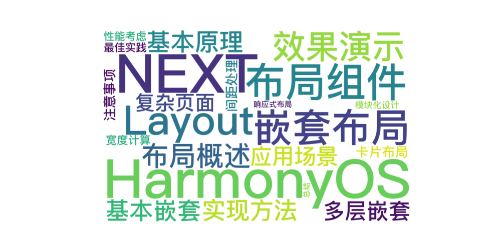

 
> 温馨提示：本篇博客的详细代码已发布到 [git](https://gitcode.com/nutpi/HarmonyosNext) : https://gitcode.com/nutpi/HarmonyosNext 可以下载运行哦！



# HarmonyOS NEXT Layout布局组件系统详解（九）：嵌套布局实现

## 效果演示


## 1. 嵌套布局概述

在HarmonyOS的Layout布局组件系统中，嵌套布局是一种强大的技术，它允许开发者在列内部再次使用行和列组件，从而创建更加复杂和灵活的界面结构。本文将详细介绍Layout布局组件系统中的嵌套布局实现原理和使用方法。

## 2. 嵌套布局的基本原理

嵌套布局的基本原理是在AutoCol组件内部再次使用AutoRow组件，形成多层次的布局结构。这种嵌套可以是多层的，理论上没有嵌套深度的限制，但为了保持代码的可读性和性能，建议控制嵌套的层数。

嵌套布局的基本结构如下：

```
AutoRow（外层行）
  ├── AutoCol（外层列）
  │     └── AutoRow（内层行）
  │           ├── AutoCol（内层列）
  │           └── AutoCol（内层列）
  └── AutoCol（外层列）
```

## 3. 嵌套布局的实现方法

### 3.1 基本嵌套布局

```typescript
AutoRow() {
    // 外层列
    AutoCol({ span: 12 }) {
        // 内层行
        AutoRow() {
            // 内层列
            AutoCol({ span: 6 }) {
                Text('内层列1')
                    .width('100%')
                    .height(40)
                    .textAlign(TextAlign.Center)
                    .backgroundColor('#69c0ff')
            }
            // 内层列
            AutoCol({ span: 6 }) {
                Text('内层列2')
                    .width('100%')
                    .height(40)
                    .textAlign(TextAlign.Center)
                    .backgroundColor('#91d5ff')
            }
        }
    }
}
```

### 3.2 多层嵌套布局

```typescript
AutoRow() {
    // 第一层列
    AutoCol({ span: 12 }) {
        // 第二层行
        AutoRow() {
            // 第二层列
            AutoCol({ span: 6 }) {
                // 第三层行
                AutoRow() {
                    // 第三层列
                    AutoCol({ span: 6 }) {
                        Text('第三层列1')
                            .width('100%')
                            .height(40)
                            .textAlign(TextAlign.Center)
                            .backgroundColor('#69c0ff')
                    }
                    // 第三层列
                    AutoCol({ span: 6 }) {
                        Text('第三层列2')
                            .width('100%')
                            .height(40)
                            .textAlign(TextAlign.Center)
                            .backgroundColor('#91d5ff')
                    }
                }
            }
            // 第二层列
            AutoCol({ span: 6 }) {
                Text('第二层列')
                    .width('100%')
                    .height(80)
                    .textAlign(TextAlign.Center)
                    .backgroundColor('#40a9ff')
            }
        }
    }
}
```

## 4. 嵌套布局的应用场景

### 4.1 复杂页面布局

嵌套布局特别适合用于创建复杂的页面结构，例如包含多个区域的仪表盘：

```typescript
AutoRow() {
    // 顶部区域
    AutoCol({ span: 12 }) {
        Text('顶部区域')
            .width('100%')
            .height(60)
            .textAlign(TextAlign.Center)
            .backgroundColor('#69c0ff')
    }
    
    // 中间区域
    AutoCol({ span: 12 }) {
        // 中间区域内部行
        AutoRow({ gutter: 16 }) {
            // 左侧区域
            AutoCol({ span: 8 }) {
                Text('左侧区域')
                    .width('100%')
                    .height(200)
                    .textAlign(TextAlign.Center)
                    .backgroundColor('#91d5ff')
            }
            // 右侧区域
            AutoCol({ span: 4 }) {
                // 右侧区域内部行
                AutoRow({ gutter: [0, 16] }) {
                    // 右上区域
                    AutoCol({ span: 12 }) {
                        Text('右上区域')
                            .width('100%')
                            .height(90)
                            .textAlign(TextAlign.Center)
                            .backgroundColor('#40a9ff')
                    }
                    // 右下区域
                    AutoCol({ span: 12 }) {
                        Text('右下区域')
                            .width('100%')
                            .height(90)
                            .textAlign(TextAlign.Center)
                            .backgroundColor('#1890ff')
                    }
                }
            }
        }
    }
    
    // 底部区域
    AutoCol({ span: 12 }) {
        Text('底部区域')
            .width('100%')
            .height(60)
            .textAlign(TextAlign.Center)
            .backgroundColor('#69c0ff')
    }
}
```

### 4.2 卡片布局

嵌套布局可以用于创建卡片布局，每个卡片内部又可以有自己的行列结构：

```typescript
AutoRow({ gutter: [16, 16] }) {
    // 卡片1
    AutoCol({ span: 6 }) {
        Column() {
            // 卡片标题
            Text('卡片1')
                .fontSize(16)
                .fontWeight(FontWeight.Bold)
                .margin({ bottom: 8 })
            
            // 卡片内容（嵌套行列）
            AutoRow() {
                AutoCol({ span: 6 }) {
                    Text('左侧')
                        .width('100%')
                        .height(40)
                        .textAlign(TextAlign.Center)
                        .backgroundColor('#e6f7ff')
                }
                AutoCol({ span: 6 }) {
                    Text('右侧')
                        .width('100%')
                        .height(40)
                        .textAlign(TextAlign.Center)
                        .backgroundColor('#bae7ff')
                }
            }
        }
        .width('100%')
        .padding(16)
        .borderRadius(8)
        .backgroundColor('#f0f0f0')
    }
    
    // 卡片2
    AutoCol({ span: 6 }) {
        // 类似的卡片结构...
    }
    
    // 更多卡片...
}
```

## 5. 嵌套布局的注意事项

### 5.1 间距处理

在嵌套布局中，需要特别注意内外层的间距配合：

```typescript
// 外层行使用较大的间距
AutoRow({ gutter: 24 }) {
    AutoCol({ span: 12 }) {
        // 内层行使用较小的间距
        AutoRow({ gutter: 16 }) {
            AutoCol({ span: 6 }) {
                // 内容...
            }
            AutoCol({ span: 6 }) {
                // 内容...
            }
        }
    }
}
```

通常，内层的间距应该小于或等于外层的间距，以保持视觉层次感。

### 5.2 宽度计算

在嵌套布局中，每一层的宽度计算都是相对于其父容器的。例如，在一个span=6的列内部，再次使用12列栅格系统，每一列的实际宽度是外层列宽度的一部分：

```typescript
AutoRow() {
    // 外层列占据50%宽度
    AutoCol({ span: 6 }) {
        AutoRow() {
            // 内层列占据外层列的50%宽度，即总宽度的25%
            AutoCol({ span: 6 }) {
                Text('内层列')
                    .width('100%')
                    .height(40)
                    .textAlign(TextAlign.Center)
                    .backgroundColor('#69c0ff')
            }
        }
    }
}
```

### 5.3 性能考虑

过度嵌套可能导致性能问题，特别是在复杂界面中。建议：

1. 控制嵌套深度，通常不超过3-4层
2. 对于静态内容，可以考虑使用预定义的组件而非动态嵌套
3. 使用懒加载技术处理不在视口内的嵌套内容

## 6. 嵌套布局的最佳实践

### 6.1 模块化设计

将复杂的嵌套布局拆分为可重用的模块：

```typescript
// 定义卡片组件
@Component
struct CardItem {
    title: string = '';
    
    build() {
        Column() {
            Text(this.title)
                .fontSize(16)
                .fontWeight(FontWeight.Bold)
                .margin({ bottom: 8 })
            
            // 卡片内容
            AutoRow() {
                AutoCol({ span: 6 }) {
                    Text('左侧')
                        .width('100%')
                        .height(40)
                        .textAlign(TextAlign.Center)
                        .backgroundColor('#e6f7ff')
                }
                AutoCol({ span: 6 }) {
                    Text('右侧')
                        .width('100%')
                        .height(40)
                        .textAlign(TextAlign.Center)
                        .backgroundColor('#bae7ff')
                }
            }
        }
        .width('100%')
        .padding(16)
        .borderRadius(8)
        .backgroundColor('#f0f0f0')
    }
}

// 使用卡片组件
AutoRow({ gutter: [16, 16] }) {
    AutoCol({ span: 6 }) {
        CardItem({ title: '卡片1' })
    }
    AutoCol({ span: 6 }) {
        CardItem({ title: '卡片2' })
    }
}
```

### 6.2 响应式嵌套布局

结合响应式设计，可以根据屏幕尺寸动态调整嵌套结构：

```typescript
AutoRow() {
    // 在大屏幕上使用左右布局
    if (screenWidth >= 768) {
        // 左侧区域
        AutoCol({ span: 6 }) {
            Text('左侧区域')
                .width('100%')
                .height(200)
                .textAlign(TextAlign.Center)
                .backgroundColor('#69c0ff')
        }
        // 右侧区域
        AutoCol({ span: 6 }) {
            // 右侧区域内部行
            AutoRow({ gutter: [0, 16] }) {
                AutoCol({ span: 12 }) {
                    Text('右上区域')
                        .width('100%')
                        .height(90)
                        .textAlign(TextAlign.Center)
                        .backgroundColor('#91d5ff')
                }
                AutoCol({ span: 12 }) {
                    Text('右下区域')
                        .width('100%')
                        .height(90)
                        .textAlign(TextAlign.Center)
                        .backgroundColor('#40a9ff')
                }
            }
        }
    } else {
        // 在小屏幕上使用上下布局
        AutoCol({ span: 12 }) {
            Text('上部区域')
                .width('100%')
                .height(100)
                .textAlign(TextAlign.Center)
                .backgroundColor('#69c0ff')
        }
        AutoCol({ span: 12 }) {
            Text('中部区域')
                .width('100%')
                .height(100)
                .textAlign(TextAlign.Center)
                .backgroundColor('#91d5ff')
        }
        AutoCol({ span: 12 }) {
            Text('下部区域')
                .width('100%')
                .height(100)
                .textAlign(TextAlign.Center)
                .backgroundColor('#40a9ff')
        }
    }
}
```

## 7. 总结

嵌套布局是HarmonyOS Layout布局组件系统中的一项强大功能，通过在AutoCol组件内部再次使用AutoRow组件，可以创建复杂的多层次布局结构。这种技术特别适合用于创建复杂的页面布局、卡片布局等。

在使用嵌套布局时，需要注意间距处理、宽度计算和性能考虑。通过模块化设计和响应式嵌套布局，可以创建既灵活又高效的界面结构。

掌握嵌套布局技术，是充分发挥HarmonyOS Layout布局组件系统潜力的关键，可以帮助开发者创建出更加复杂和精美的用户界面。
