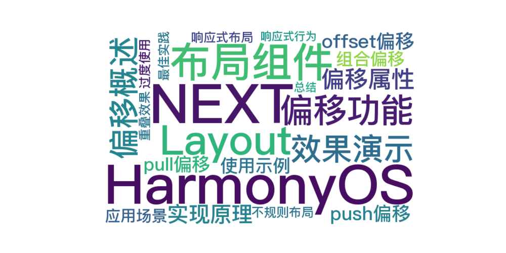

 
> 温馨提示：本篇博客的详细代码已发布到 [git](https://gitcode.com/nutpi/HarmonyosNext) : https://gitcode.com/nutpi/HarmonyosNext 可以下载运行哦！




# HarmonyOS NEXT Layout布局组件系统详解（六）：偏移功能实现

## 效果演示


## 1. 偏移功能概述

在HarmonyOS的Layout布局组件系统中，偏移功能是一个强大的布局工具，它允许开发者灵活地调整列的位置，而不改变其他列的布局。本文将详细介绍Layout布局组件系统中的三种偏移方式：offset、push和pull的实现原理和使用方法。

## 2. 偏移属性定义

偏移属性定义在LayoutProps接口中，用于AutoCol组件：

```typescript
export interface LayoutProps {
    // 栅格左侧的间隔格数
    offset?: number;
    // 栅格向右移动格数
    push?: number;
    // 栅格向左移动格数
    pull?: number;
    // 其他属性...
}
```

在AutoCol组件的实现中，这些属性被定义为：

```typescript
@Prop offsetNum: number = 0;
@Prop push: number = 0;
@Prop pull: number = 0;
```

## 3. 三种偏移方式的实现原理

### 3.1 offset偏移实现原理

offset偏移通过设置左边距（margin-left）实现，计算公式与列宽度计算类似：

```typescript
const offsetWidth = (this.offsetNum / 12 * 100) + '%';
style += ` margin-left: ${offsetWidth};`;
```

在build方法中的实现：

```typescript
.margin({ left: this.offsetNum > 0 ? (this.offsetNum / 12 * 100) + '%' : '0px' })
```

offset偏移的特点是：

1. 不改变元素的位置关系，只是增加左边距
2. 后续元素会自动适应偏移，不会发生重叠
3. 适合用于调整列的起始位置

### 3.2 push偏移实现原理

push偏移通过设置相对定位（position: relative）和左偏移（left）实现：

```typescript
if (this.push > 0) {
    const pushWidth = (this.push / 12 * 100) + '%';
    style += ` left: ${pushWidth};`;
}
```

在build方法中的实现：

```typescript
.position({
    x: this.push > 0 ? (this.push / 12 * 100) + '%' : this.pull > 0 ? '-' + (this.pull / 12 * 100) + '%' : '0px'
})
```

push偏移的特点是：

1. 使用相对定位向右移动元素
2. 可能会与其他元素重叠
3. 不影响文档流中其他元素的位置
4. 适合用于微调元素位置或创建重叠效果

### 3.3 pull偏移实现原理

pull偏移也是通过设置相对定位（position: relative）和右偏移（right）实现：

```typescript
if (this.pull > 0) {
    const pullWidth = (this.pull / 12 * 100) + '%';
    style += ` right: ${pullWidth};`;
}
```

在build方法中，pull偏移通过设置负的x位置值实现：

```typescript
.position({
    x: this.push > 0 ? (this.push / 12 * 100) + '%' : this.pull > 0 ? '-' + (this.pull / 12 * 100) + '%' : '0px'
})
```

pull偏移的特点是：

1. 使用相对定位向左移动元素
2. 可能会与其他元素重叠
3. 不影响文档流中其他元素的位置
4. 适合用于微调元素位置或创建重叠效果

## 4. 偏移功能使用示例

### 4.1 offset偏移示例

```typescript
// 使用offsetNum偏移
AutoRow() {
    AutoCol({ span: 6, offsetNum: 6 }) {
        Text('span: 6, offset: 6')
            .width('100%')
            .height(40)
            .textAlign(TextAlign.Center)
            .backgroundColor('#69c0ff')
    }
}
```

在这个示例中：

1. AutoCol设置了span为6，表示占据6列宽度
2. offsetNum设置为6，表示在左侧添加6列的空白
3. 最终效果是一个占据右半部分的列

### 4.2 push偏移示例

```typescript
// 使用push向右偏移
AutoRow() {
    AutoCol({ span: 6, push: 6 }) {
        Text('span: 6, push: 6')
            .width('100%')
            .height(40)
            .textAlign(TextAlign.Center)
            .backgroundColor('#69c0ff')
    }
}
```

在这个示例中：

1. AutoCol设置了span为6，表示占据6列宽度
2. push设置为6，表示向右偏移6列
3. 最终效果是一个向右偏移的列，可能会与其他列重叠

### 4.3 pull偏移示例

```typescript
// 使用pull向左偏移
AutoRow() {
    AutoCol({ span: 12 }) {
        Text('span: 12')
            .width('100%')
            .height(40)
            .textAlign(TextAlign.Center)
            .backgroundColor('#69c0ff')
    }
    AutoCol({ span: 6, pull: 6 }) {
        Text('span: 6, pull: 6')
            .width('100%')
            .height(40)
            .textAlign(TextAlign.Center)
            .backgroundColor('#91d5ff')
    }
}
```

在这个示例中：

1. 第一个AutoCol设置了span为12，占据整行
2. 第二个AutoCol设置了span为6，表示占据6列宽度
3. pull设置为6，表示向左偏移6列
4. 最终效果是第二个列会与第一个列部分重叠

### 4.4 组合使用偏移

```typescript
// 组合使用偏移
AutoRow() {
    AutoCol({ span: 6, offsetNum: 3 }) {
        Text('span: 6, offset: 3')
            .width('100%')
            .height(40)
            .textAlign(TextAlign.Center)
            .backgroundColor('#69c0ff')
    }
    AutoCol({ span: 6, push: 3 }) {
        Text('span: 6, push: 3')
            .width('100%')
            .height(40)
            .textAlign(TextAlign.Center)
            .backgroundColor('#91d5ff')
    }
}
```

## 5. 偏移功能的应用场景

### 5.1 创建不规则布局

偏移功能可以用于创建不规则的布局，例如：

```typescript
AutoRow() {
    // 第一行
    AutoCol({ span: 8 }) {
        Text('span: 8')
            .width('100%')
            .height(40)
            .textAlign(TextAlign.Center)
            .backgroundColor('#69c0ff')
    }
    AutoCol({ span: 4, offsetNum: 0 }) {
        Text('span: 4')
            .width('100%')
            .height(40)
            .textAlign(TextAlign.Center)
            .backgroundColor('#91d5ff')
    }
    // 第二行
    AutoCol({ span: 4, offsetNum: 2 }) {
        Text('span: 4, offset: 2')
            .width('100%')
            .height(40)
            .textAlign(TextAlign.Center)
            .backgroundColor('#69c0ff')
    }
    AutoCol({ span: 4, offsetNum: 2 }) {
        Text('span: 4, offset: 2')
            .width('100%')
            .height(40)
            .textAlign(TextAlign.Center)
            .backgroundColor('#91d5ff')
    }
}
```

### 5.2 响应式布局中的偏移

在响应式布局中，可以根据屏幕尺寸动态调整偏移值：

```typescript
// 根据屏幕宽度设置不同的偏移值
let offsetValue = 0;
if (screenWidth >= 1200) {
    offsetValue = 2;
} else if (screenWidth >= 768) {
    offsetValue = 1;
}

AutoRow() {
    AutoCol({ span: 8, offsetNum: offsetValue }) {
        // 内容...
    }
}
```

### 5.3 创建重叠效果

使用push和pull可以创建元素重叠的效果，适用于特殊的UI设计：

```typescript
AutoRow() {
    AutoCol({ span: 6 }) {
        Text('底层元素')
            .width('100%')
            .height(60)
            .textAlign(TextAlign.Center)
            .backgroundColor('#69c0ff')
    }
    AutoCol({ span: 4, pull: 2 }) {
        Text('重叠元素')
            .width('100%')
            .height(40)
            .textAlign(TextAlign.Center)
            .backgroundColor('#ff7875')
    }
}
```

## 6. 偏移功能的最佳实践

### 6.1 选择合适的偏移方式

在实际开发中，应根据需求选择合适的偏移方式：

1. 需要调整列的起始位置，且不影响其他列：使用offset
2. 需要微调列的位置，可能与其他列重叠：使用push或pull
3. 需要创建特殊的视觉效果：组合使用不同的偏移方式

### 6.2 避免过度使用偏移

过度使用偏移可能导致布局混乱，难以维护。建议：

1. 优先使用基本的栅格布局（span属性）
2. 只在必要时使用偏移功能
3. 保持偏移值的简单和一致性

### 6.3 注意偏移的响应式行为

在响应式设计中，需要注意偏移在不同屏幕尺寸下的表现：

1. 在小屏幕上，可能需要减小或取消偏移
2. 测试不同屏幕尺寸下的布局效果
3. 考虑使用条件渲染或动态计算偏移值

## 7. 总结

HarmonyOS Layout布局组件系统中的偏移功能提供了三种不同的偏移方式：offset、push和pull，它们各有特点和适用场景。通过灵活运用这些偏移方式，可以实现更加复杂和精细的布局效果。

在实际开发中，应根据具体需求选择合适的偏移方式，避免过度使用，并注意响应式设计中的偏移行为。

在下一篇文章中，我们将详细介绍Layout布局组件系统中的响应式设计实现。