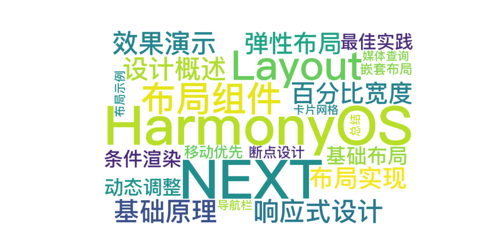

 
> 温馨提示：本篇博客的详细代码已发布到 [git](https://gitcode.com/nutpi/HarmonyosNext) : https://gitcode.com/nutpi/HarmonyosNext 可以下载运行哦！




# HarmonyOS NEXT Layout布局组件系统详解（七）：响应式设计实现


## 效果演示


## 1. 响应式设计概述

响应式设计是现代UI开发中的重要概念，它使应用能够自动适应不同屏幕尺寸和设备类型。在HarmonyOS的Layout布局组件系统中，响应式设计是通过栅格系统和百分比宽度的组合实现的。本文将详细介绍Layout布局组件系统中的响应式设计实现原理和最佳实践。
    
## 2. 响应式设计的基础原理

### 2.1 百分比宽度

Layout布局组件系统的响应式设计基础是使用百分比宽度而非固定像素值。AutoCol组件的宽度计算公式为：

```typescript
width = (span / 12) * 100 + '%'
```

这种实现方式使得列宽度会随着容器宽度的变化而自动调整，是响应式布局的核心机制。

### 2.2 弹性布局

AutoRow组件内部使用Flex布局，设置了自动换行（FlexWrap.Wrap）属性：

```typescript
Flex({ 
    direction: FlexDirection.Row, 
    justifyContent: this.justify, 
    alignItems: this.ItemAligns, 
    wrap: FlexWrap.Wrap 
})
```

这使得当容器宽度不足以容纳所有列时，列会自动换行，形成新的行，这是响应式布局的另一个重要特性。

## 3. 响应式布局实现方法

### 3.1 基础响应式布局

最简单的响应式布局是使用基本的栅格系统，不需要额外的代码：

```typescript
AutoRow() {
    AutoCol({ span: 6 }) {
        Text('span: 6')
            .width('100%')
            .height(40)
            .textAlign(TextAlign.Center)
            .backgroundColor('#69c0ff')
    }
    AutoCol({ span: 6 }) {
        Text('span: 6')
            .width('100%')
            .height(40)
            .textAlign(TextAlign.Center)
            .backgroundColor('#91d5ff')
    }
}
```

这种布局会自动适应容器宽度的变化，列宽度会保持相对比例不变。

### 3.2 条件渲染

更复杂的响应式布局可以通过条件渲染实现，根据屏幕宽度动态调整列的span值：

```typescript
// 根据屏幕宽度计算span值
let spanValue = 6; // 默认值
if (screenWidth < 768) {
    spanValue = 12; // 小屏幕时占满一行
} else if (screenWidth >= 1200) {
    spanValue = 4; // 大屏幕时一行显示3列
}

AutoRow() {
    AutoCol({ span: spanValue }) {
        // 内容...
    }
    AutoCol({ span: spanValue }) {
        // 内容...
    }
    AutoCol({ span: spanValue }) {
        // 内容...
    }
}
```

### 3.3 动态调整间距和对齐

响应式设计不仅包括调整列宽，还可以动态调整间距和对齐方式：

```typescript
// 根据屏幕宽度调整间距和对齐方式
let gutterValue = 8;
let justifyValue = FlexAlign.Start;

if (screenWidth >= 768) {
    gutterValue = 16;
    justifyValue = FlexAlign.Center;
}
if (screenWidth >= 1200) {
    gutterValue = 24;
    justifyValue = FlexAlign.SpaceBetween;
}

AutoRow({ gutter: gutterValue, justify: justifyValue }) {
    // 列内容...
}
```

## 4. 响应式布局的最佳实践

### 4.1 移动优先设计

在实现响应式布局时，建议采用移动优先的设计思路：

1. 首先为移动设备设计布局（小屏幕）
2. 然后逐步扩展到平板和桌面设备（中、大屏幕）
3. 使用条件判断添加针对大屏幕的优化

```typescript
// 移动优先设计示例
let spanValue = 12; // 默认为移动设备设计，一列占满
let offsetValue = 0;

// 平板设备
if (screenWidth >= 768) {
    spanValue = 6; // 一行两列
    offsetValue = 0;
}

// 桌面设备
if (screenWidth >= 1200) {
    spanValue = 4; // 一行三列
    offsetValue = 0;
}

AutoRow() {
    AutoCol({ span: spanValue, offsetNum: offsetValue }) {
        // 内容...
    }
    // 更多列...
}
```

### 4.2 断点设计

为了使响应式布局更加系统化，可以定义标准的断点值：

```typescript
// 定义标准断点
const BREAKPOINTS = {
    xs: 0,      // 超小屏幕（手机竖屏）
    sm: 576,    // 小屏幕（手机横屏）
    md: 768,    // 中等屏幕（平板）
    lg: 992,    // 大屏幕（桌面）
    xl: 1200,   // 超大屏幕（大桌面）
    xxl: 1600   // 巨大屏幕
};

// 获取当前断点
function getBreakpoint(width: number) {
    if (width >= BREAKPOINTS.xxl) return 'xxl';
    if (width >= BREAKPOINTS.xl) return 'xl';
    if (width >= BREAKPOINTS.lg) return 'lg';
    if (width >= BREAKPOINTS.md) return 'md';
    if (width >= BREAKPOINTS.sm) return 'sm';
    return 'xs';
}

// 根据断点设置布局参数
const breakpoint = getBreakpoint(screenWidth);
let spanValue, gutterValue;

switch (breakpoint) {
    case 'xs':
        spanValue = 12;
        gutterValue = 8;
        break;
    case 'sm':
        spanValue = 6;
        gutterValue = 16;
        break;
    case 'md':
    case 'lg':
        spanValue = 4;
        gutterValue = 20;
        break;
    case 'xl':
    case 'xxl':
        spanValue = 3;
        gutterValue = 24;
        break;
}
```

### 4.3 嵌套响应式布局

在复杂的UI中，可能需要嵌套使用响应式布局：

```typescript
AutoRow() {
    // 左侧边栏
    AutoCol({ span: screenWidth >= 768 ? 6 : 12 }) {
        // 边栏内容...
    }
    
    // 右侧内容区
    AutoCol({ span: screenWidth >= 768 ? 6 : 12 }) {
        // 嵌套的响应式布局
        AutoRow() {
            AutoCol({ span: screenWidth >= 1200 ? 6 : 12 }) {
                // 内容...
            }
            AutoCol({ span: screenWidth >= 1200 ? 6 : 12 }) {
                // 内容...
            }
        }
    }
}
```

### 4.4 使用媒体查询补充

虽然Layout布局组件系统本身具有响应式特性，但在某些情况下，可能需要使用媒体查询来补充：

```typescript
// 使用媒体查询调整样式
@Styles function getResponsiveStyles() {
    .width('100%')
    .height(40)
    .backgroundColor('#69c0ff')
    
    // 媒体查询
    @media (min-width: 768px) {
        .height(60)
        .backgroundColor('#40a9ff')
    }
    
    @media (min-width: 1200px) {
        .height(80)
        .backgroundColor('#1890ff')
    }
}

AutoRow() {
    AutoCol({ span: 6 }) {
        Text('响应式样式')
            .getResponsiveStyles()
    }
}
```

## 5. 响应式布局示例

### 5.1 响应式导航栏

```typescript
// 响应式导航栏
AutoRow({ justify: screenWidth >= 768 ? FlexAlign.SpaceBetween : FlexAlign.Center }) {
    // Logo
    AutoCol({ span: screenWidth >= 768 ? 4 : 12 }) {
        Text('Logo')
            .fontSize(20)
            .fontWeight(FontWeight.Bold)
    }
    
    // 导航菜单
    if (screenWidth >= 768) {
        AutoCol({ span: 8 }) {
            Row() {
                // 水平菜单
                Text('首页').margin({ right: 20 })
                Text('产品').margin({ right: 20 })
                Text('关于').margin({ right: 20 })
                Text('联系')
            }
            .width('100%')
            .justifyContent(FlexAlign.End)
        }
    } else {
        // 移动端显示菜单按钮
        AutoCol({ span: 12 }) {
            Button('菜单')
                .margin({ top: 10 })
        }
    }
}
```

### 5.2 响应式卡片网格

```typescript
// 响应式卡片网格
let cardSpan = 12; // 默认一行一个卡片

if (screenWidth >= 576) {
    cardSpan = 6; // 一行两个卡片
}
if (screenWidth >= 992) {
    cardSpan = 4; // 一行三个卡片
}
if (screenWidth >= 1200) {
    cardSpan = 3; // 一行四个卡片
}

AutoRow({ gutter: [16, 16] }) {
    // 生成多个卡片
    ForEach([1, 2, 3, 4, 5, 6, 7, 8], (item) => {
        AutoCol({ span: cardSpan }) {
            Column() {
                Text(`卡片 ${item}`)
                    .width('100%')
                    .height(120)
                    .textAlign(TextAlign.Center)
                    .backgroundColor('#69c0ff')
            }
            .width('100%')
            .borderRadius(8)
            .backgroundColor('#f0f0f0')
        }
    })
}
```

## 6. 总结

HarmonyOS Layout布局组件系统的响应式设计基于百分比宽度和弹性布局实现，通过栅格系统的自动适应特性，可以轻松创建适应不同屏幕尺寸的界面。

在实际开发中，可以结合条件渲染、动态参数调整和媒体查询等技术，实现更加复杂和精细的响应式布局。采用移动优先的设计思路和标准的断点设计，可以使响应式布局更加系统化和可维护。

响应式设计是现代应用开发的必备技能，掌握HarmonyOS Layout布局组件系统的响应式设计实现，可以帮助开发者创建出在各种设备上都能提供良好用户体验的应用。
