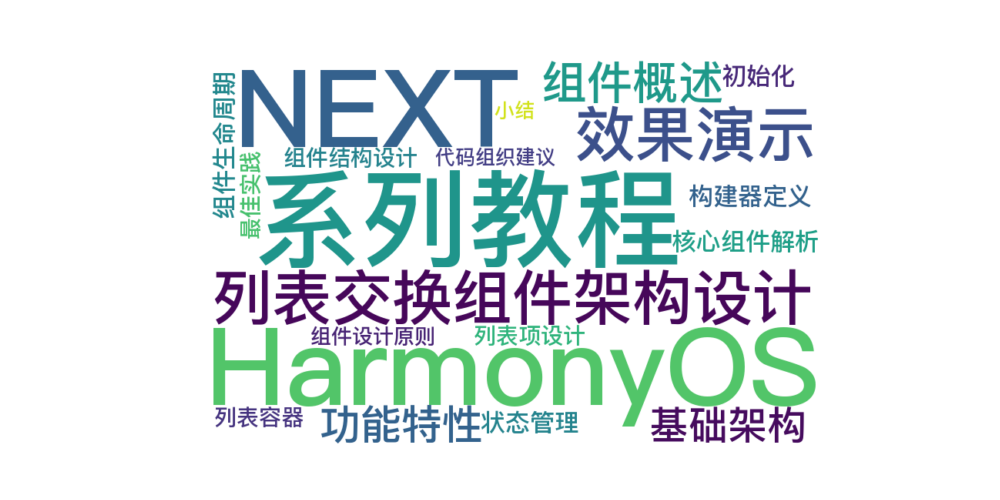

> 温馨提示：本篇博客的详细代码已发布到 [git](https://gitcode.com/nutpi/HarmonyosNext) : https://gitcode.com/nutpi/HarmonyosNext 可以下载运行哦！



# HarmonyOS NEXT系列教程之列表交换组件架构设计

## 效果演示


## 1. 组件概述

### 1.1 功能特性
ListExchange组件提供以下核心功能：
1. 长按列表项进行拖动排序
2. 左滑显示删除按钮
3. 支持自定义列表项内容
4. 提供平滑的动画效果

### 1.2 基础架构
```typescript
@Component
export struct ListExchange {
    // 对外暴露的属性
    @Link appInfoList: Object[];
    @Link listExchangeCtrl: ListExchangeCtrl<Object>;
    @BuilderParam deductionView: (listInfo: Object) => void;

    // 内部状态
    @State currentListItem: Object | undefined = undefined;
    @State isLongPress: boolean = false;
}
```

## 2. 核心组件解析

### 2.1 状态管理
```typescript
// 对外状态
@Link appInfoList: Object[];  // 列表数据
@Link listExchangeCtrl: ListExchangeCtrl<Object>;  // 列表控制器

// 内部状态
@State currentListItem: Object | undefined;  // 当前选中项
@State isLongPress: boolean = false;  // 长按状态
```

### 2.2 构建器定义
```typescript
@Builder
deductionViewBuilder() {
    Text('')  // 默认构建器
}

@BuilderParam 
deductionView: (listInfo: Object) => void = this.deductionViewBuilder;
```

## 3. 组件生命周期

### 3.1 初始化
```typescript
aboutToAppear(): void {
    this.checkParam();
}

checkParam() {
    // 参数检查和默认值设置
    if (!this.appInfoList.length) {
        this.appInfoList.push(new ListInfo(
            $r("app.media.list_exchange_ic_public_cards_filled"), 
            commonConstants.LIST_NAME
        ))
    }
    
    // 设置默认构建器
    if (!this.deductionView) {
        this.deductionView = this.deductionView;
    }
    
    // 初始化控制器
    if (!this.listExchangeCtrl) {
        this.listExchangeCtrl = new ListExchangeCtrl();
        this.listExchangeCtrl.initData(this.appInfoList);
    }
}
```

## 4. 组件结构设计

### 4.1 列表容器
```typescript
build() {
    Column() {
        List() {
            ForEach(this.appInfoList, (item: Object, index: number) => {
                ListItem() {
                    this.deductionView(item)
                }
                .id('list_exchange_' + index)
                .zIndex(this.currentListItem === item ? 2 : 1)
                .swipeAction({ end: this.defaultDeleteBuilder(item) })
            })
        }
        .divider({ strokeWidth: '1px', color: 0xeaf0ef })
        .scrollBar(BarState.Off)
    }
}
```

### 4.2 列表项设计
```typescript
@Builder
defaultDeductionView(listItemInfo: ListInfo) {
    Row() {
        Image(listItemInfo.icon)
            .width($r('app.integer.list_exchange_icon_size'))
            .height($r('app.integer.list_exchange_icon_size'))
        
        Text(listItemInfo.name)
            .margin({ left: $r('app.string.ohos_id_elements_margin_vertical_l') })
        
        Blank()
        
        Image($r("app.media.list_exchange_ic_public_drawer"))
            .width($r('app.integer.list_exchange_icon_size'))
            .height($r('app.integer.list_exchange_icon_size'))
    }
}
```

## 5. 最佳实践

### 5.1 组件设计原则
1. 高内聚低耦合
2. 可配置性强
3. 易于扩展
4. 性能优化

### 5.2 代码组织建议
1. 清晰的职责划分
2. 统一的命名规范
3. 完整的参数检查
4. 合理的默认值

## 6. 小结

本篇教程详细介绍了：
1. ListExchange组件的整体架构
2. 核心组件的实现方式
3. 生命周期管理
4. 组件结构设计
5. 最佳实践建议

下一篇将介绍手势系统的实现细节。
