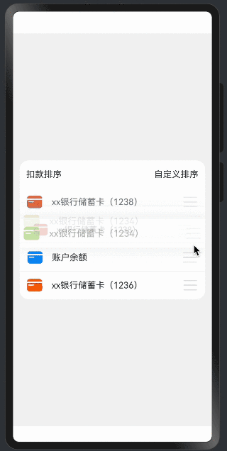

> 温馨提示：本篇博客的详细代码已发布到 [git](https://gitcode.com/nutpi/HarmonyosNext) : https://gitcode.com/nutpi/HarmonyosNext 可以下载运行哦！


# HarmonyOS NEXT系列教程之列表交换组件常量配置管理
## 效果演示


## 1. 常量配置系统架构

### 1.1 配置管理器
```typescript
// 配置管理器接口
interface ConfigManager {
    get<T>(key: string): T;
    set<T>(key: string, value: T): void;
    has(key: string): boolean;
    remove(key: string): void;
}

// 配置管理器实现
class ConfigurationManager implements ConfigManager {
    private static instance: ConfigurationManager;
    private configs: Map<string, any> = new Map();

    static getInstance(): ConfigurationManager {
        if (!this.instance) {
            this.instance = new ConfigurationManager();
        }
        return this.instance;
    }

    get<T>(key: string): T {
        if (!this.configs.has(key)) {
            throw new Error(`Configuration key "${key}" not found`);
        }
        return this.configs.get(key);
    }

    set<T>(key: string, value: T): void {
        this.configs.set(key, value);
    }

    has(key: string): boolean {
        return this.configs.has(key);
    }

    remove(key: string): void {
        this.configs.delete(key);
    }
}
```

### 1.2 配置加载器
```typescript
class ConfigLoader {
    // 加载配置文件
    static async loadConfig(path: string): Promise<void> {
        try {
            const config = await this.readConfigFile(path);
            this.validateConfig(config);
            this.applyConfig(config);
        } catch (error) {
            console.error('Failed to load configuration:', error);
            throw error;
        }
    }

    // 验证配置
    private static validateConfig(config: any): boolean {
        // 配置验证逻辑
        return true;
    }

    // 应用配置
    private static applyConfig(config: any): void {
        Object.entries(config).forEach(([key, value]) => {
            ConfigurationManager.getInstance().set(key, value);
        });
    }
}
```

## 2. 基础常量定义

### 2.1 尺寸常量
```typescript
export const DimensionConstants = {
    // 列表项高度
    ITEM_HEIGHT: 60,
    
    // 图标尺寸
    ICON_SIZE: {
        SMALL: 16,
        MEDIUM: 24,
        LARGE: 32
    },
    
    // 间距
    SPACING: {
        SMALL: 4,
        MEDIUM: 8,
        LARGE: 16
    },
    
    // 边框圆角
    BORDER_RADIUS: {
        SMALL: 4,
        MEDIUM: 8,
        LARGE: 16
    }
};
```

### 2.2 时间常量
```typescript
export const TimeConstants = {
    // 动画持续时间
    ANIMATION_DURATION: {
        FAST: 150,
        NORMAL: 300,
        SLOW: 450
    },
    
    // 延迟时间
    DELAY: {
        SHORT: 100,
        MEDIUM: 200,
        LONG: 300
    },
    
    // 防抖时间
    DEBOUNCE: {
        DEFAULT: 300,
        SCROLL: 150,
        SEARCH: 500
    }
};
```

## 3. 主题配置管理

### 3.1 主题定义
```typescript
// 主题接口
interface Theme {
    colors: ThemeColors;
    typography: Typography;
    spacing: Spacing;
}

// 主题配置
export const ThemeConfig: Theme = {
    colors: {
        primary: '#007AFF',
        secondary: '#5856D6',
        background: '#FFFFFF',
        text: {
            primary: '#000000',
            secondary: '#666666',
            disabled: '#999999'
        },
        border: '#E5E5E5',
        shadow: 'rgba(0, 0, 0, 0.1)'
    },
    typography: {
        fontFamily: 'HarmonyOS Sans',
        fontSize: {
            small: 12,
            medium: 14,
            large: 16
        },
        fontWeight: {
            regular: 400,
            medium: 500,
            bold: 600
        }
    },
    spacing: {
        unit: 4,
        small: 8,
        medium: 16,
        large: 24
    }
};
```

### 3.2 主题管理器
```typescript
class ThemeManager {
    private static currentTheme: Theme = ThemeConfig;

    // 设置主题
    static setTheme(theme: Theme): void {
        this.currentTheme = theme;
        this.applyTheme();
    }

    // 获取主题配置
    static getThemeValue<T>(path: string): T {
        return get(this.currentTheme, path);
    }

    // 应用主题
    private static applyTheme(): void {
        // 更新全局样式
        this.updateGlobalStyles();
        // 触发主题变更事件
        this.emitThemeChanged();
    }
}
```

## 4. 国际化配置

### 4.1 语言配置
```typescript
// 语言包接口
interface LanguagePack {
    [key: string]: string;
}

// 语言配置
export const LanguageConfig: Record<string, LanguagePack> = {
    'zh-CN': {
        confirmDelete: '确认删除',
        cancelText: '取消',
        confirmText: '确认',
        loadingText: '加载中...',
        errorText: '出错了',
        emptyText: '暂无数据'
    },
    'en-US': {
        confirmDelete: 'Confirm Delete',
        cancelText: 'Cancel',
        confirmText: 'Confirm',
        loadingText: 'Loading...',
        errorText: 'Error',
        emptyText: 'No Data'
    }
};
```

### 4.2 国际化管理器
```typescript
class I18nManager {
    private static currentLocale: string = 'zh-CN';
    private static messages: Record<string, LanguagePack> = LanguageConfig;

    // 设置语言
    static setLocale(locale: string): void {
        if (this.messages[locale]) {
            this.currentLocale = locale;
            this.emitLocaleChanged();
        }
    }

    // 获取文本
    static getText(key: string, params?: Record<string, string>): string {
        const message = this.messages[this.currentLocale][key];
        if (!message) return key;
        
        return params ? this.formatMessage(message, params) : message;
    }

    // 格式化文本
    private static formatMessage(
        message: string,
        params: Record<string, string>
    ): string {
        return message.replace(/\{(\w+)\}/g, (_, key) => params[key] || '');
    }
}
```

## 5. 动画配置管理

### 5.1 动画常量
```typescript
export const AnimationConfig = {
    // 动画曲线
    curves: {
        DEFAULT: Curve.EaseInOut,
        SPRING: curves.interpolatingSpring(14, 1, 170, 17),
        BOUNCE: curves.springMotion()
    },
    
    // 动画时间
    duration: {
        FAST: 150,
        NORMAL: 300,
        SLOW: 450
    },
    
    // 动画属性
    properties: {
        scale: {
            normal: 1,
            active: 1.05,
            pressed: 0.95
        },
        opacity: {
            normal: 1,
            disabled: 0.5,
            hidden: 0
        }
    }
};
```

### 5.2 动画配置器
```typescript
class AnimationConfigurator {
    // 创建动画配置
    static createAnimation(type: string): Animation {
        const config = AnimationConfig;
        
        switch (type) {
            case 'press':
                return {
                    duration: config.duration.FAST,
                    curve: config.curves.DEFAULT,
                    scale: config.properties.scale.pressed
                };
            case 'release':
                return {
                    duration: config.duration.NORMAL,
                    curve: config.curves.SPRING,
                    scale: config.properties.scale.normal
                };
            default:
                return {
                    duration: config.duration.NORMAL,
                    curve: config.curves.DEFAULT
                };
        }
    }
}
```

## 6. 布局配置管理

### 6.1 布局常量
```typescript
export const LayoutConfig = {
    // 网格配置
    grid: {
        columns: 4,
        spacing: 16,
        padding: 16
    },
    
    // 列表配置
    list: {
        itemHeight: 60,
        spacing: 8,
        padding: {
            horizontal: 16,
            vertical: 8
        }
    },
    
    // 容器配置
    container: {
        maxWidth: 1200,
        margin: {
            horizontal: 'auto',
            vertical: 24
        }
    }
};
```

### 6.2 布局管理器
```typescript
class LayoutManager {
    // 获取布局配置
    static getLayoutValue<T>(path: string): T {
        return get(LayoutConfig, path);
    }

    // 计算布局尺寸
    static calculateSize(
        containerWidth: number,
        itemCount: number
    ): { width: number; height: number } {
        const config = LayoutConfig.grid;
        const itemWidth = (containerWidth - (config.columns + 1) * config.spacing) / config.columns;
        const rows = Math.ceil(itemCount / config.columns);
        const height = rows * itemWidth + (rows + 1) * config.spacing;
        
        return { width: containerWidth, height };
    }
}
```

## 7. 最佳实践

### 7.1 配置管理建议
1. 集中管理配置
2. 类型安全
3. 易于扩展
4. 运行时验证

### 7.2 使用建议
1. 合理组织配置
2. 提供默认值
3. 支持覆盖配置
4. 实现配置热更新

## 8. 小结

本篇教程详细介绍了：
1. 常量配置系统的架构设计
2. 基础常量的定义方法
3. 主题配置的管理机制
4. 国际化配置的实现
5. 动画和布局配置的处理

下一篇将介绍观察者模式的应用实现。
