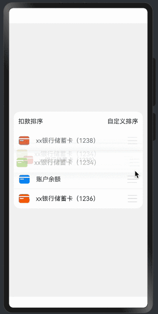

> 温馨提示：本篇博客的详细代码已发布到 [git](https://gitcode.com/nutpi/HarmonyosNext) : https://gitcode.com/nutpi/HarmonyosNext 可以下载运行哦！


# HarmonyOS NEXT系列教程之列表交换组件控制器实现
## 效果演示


## 1. 控制器基础架构

### 1.1 核心结构
```typescript
@Observed
export class ListExchangeCtrl<T> {
    // 列表数据
    private deductionData: Array<T> = [];
    
    // 属性修改器数组
    private modifier: Array<ListItemModifier> = [];
    
    // 拖拽参考偏移量
    private dragRefOffset: number = 0;
    
    // 当前偏移量
    offsetY: number = 0;
    
    // 操作状态
    state: OperationStatus = OperationStatus.IDLE;
}
```

### 1.2 状态定义
```typescript
// 操作状态枚举
enum OperationStatus {
    IDLE,       // 空闲状态
    PRESSING,   // 长按状态
    MOVING,     // 移动状态
    DROPPING,   // 放置状态
    DELETE      // 删除状态
}
```

## 2. 数据管理

### 2.1 数据初始化
```typescript
initData(deductionData: Array<T>) {
    this.deductionData = deductionData;
    deductionData.forEach(() => {
        this.modifier.push(new ListItemModifier());
    })
}
```

### 2.2 数据操作
```typescript
// 获取修改器
getModifier(item: T): ListItemModifier {
    const index: number = this.deductionData.indexOf(item);
    return this.modifier[index];
}

// 交换位置
changeItem(index: number, newIndex: number): void {
    const tmp: Array<T> = this.deductionData.splice(index, 1);
    this.deductionData.splice(newIndex, 0, tmp[0]);
    const tmp2: Array<ListItemModifier> = this.modifier.splice(index, 1);
    this.modifier.splice(newIndex, 0, tmp2[0]);
}
```

## 3. 交互事件处理

### 3.1 长按处理
```typescript
onLongPress(item: T): void {
    const index: number = this.deductionData.indexOf(item);
    this.dragRefOffset = 0;
    
    // 添加长按动画效果
    animateTo({ 
        curve: Curve.Friction, 
        duration: commonConstants.ANIMATE_DURATION 
    }, () => {
        this.state = OperationStatus.PRESSING;
        this.modifier[index].hasShadow = true;
        this.modifier[index].scale = 1.04;
    })
}
```

### 3.2 移动处理
```typescript
onMove(item: T, offsetY: number): void {
    try {
        const index: number = this.deductionData.indexOf(item);
        this.offsetY = offsetY - this.dragRefOffset;
        this.modifier[index].offsetY = this.offsetY;
        
        // 计算移动方向
        const direction: number = this.offsetY > 0 ? 1 : -1;
        
        // 处理被覆盖项的缩放效果
        const curveValue: ICurve = curves.initCurve(Curve.Sharp);
        const value: number = curveValue.interpolate(
            Math.abs(this.offsetY) / ITEM_HEIGHT
        );
        const shrinkScale: number = 1 - value / 10;
        
        // 应用缩放效果
        this.applyScaleEffect(index, direction, shrinkScale);
        
        // 处理位置交换
        this.handlePositionSwap(index, direction);
    } catch (err) {
        logger.error(`onMove err:${JSON.stringify(err)}`);
    }
}
```

## 4. 动画效果实现

### 4.1 拖拽动画
```typescript
private applyDragAnimation(index: number): void {
    animateTo({ 
        curve: curves.interpolatingSpring(0, 1, 400, 38) 
    }, () => {
        this.state = OperationStatus.DROPPING;
        
        // 恢复相邻项的缩放
        if (index < this.modifier.length - 1) {
            this.modifier[index + 1].scale = 1;
        }
        if (index > 0) {
            this.modifier[index - 1].scale = 1;
        }
    })
}
```

### 4.2 删除动画
```typescript
deleteItem(item: T): void {
    try {
        const index: number = this.deductionData.indexOf(item);
        this.dragRefOffset = 0;
        
        // 左偏移和透明度动画
        animateTo({
            curve: Curve.Friction,
            duration: 300,
            onFinish: () => {
                // 删除动画
                this.applyDeleteAnimation(index);
            }
        }, () => {
            this.state = OperationStatus.DELETE;
            this.modifier[index].offsetX = 150;
            this.modifier[index].opacity = 0;
        })
    } catch (err) {
        console.error(`delete err:${JSON.stringify(err)}`);
    }
}
```

## 5. 性能优化

### 5.1 动画优化
```typescript
// 使用curves.interpolatingSpring优化动画效果
private applySpringAnimation(index: number): void {
    animateTo({ 
        curve: curves.interpolatingSpring(14, 1, 170, 17) 
    }, () => {
        this.resetItemState(index);
    })
}
```

### 5.2 状态管理优化
```typescript
private resetItemState(index: number): void {
    this.state = OperationStatus.IDLE;
    this.modifier[index].hasShadow = false;
    this.modifier[index].scale = 1;
    this.modifier[index].offsetY = 0;
}
```

## 6. 错误处理

### 6.1 异常捕获
```typescript
try {
    // 业务逻辑
} catch (err) {
    logger.error(`Operation failed: ${JSON.stringify(err)}`);
}
```

### 6.2 边界处理
```typescript
if (index === 0 && direction === -1) {
    return; // 处理第一项向上拖动
}
if (index === this.deductionData.length - 1 && direction === 1) {
    return; // 处理最后一项向下拖动
}
```

## 7. 最佳实践

### 7.1 代码组织
1. 清晰的状态管理
2. 模块化的动画处理
3. 完善的错误处理
4. 优化的性能表现

### 7.2 使用建议
1. 合理使用状态枚举
2. 优化动画性能
3. 处理边界情况
4. 实现错误处理

## 8. 小结

本篇教程详细介绍了：
1. 控制器的基础架构
2. 数据管理的实现
3. 交互事件的处理
4. 动画效果的实现
5. 性能优化的策略

下一篇将介绍数据模型的设计与实现。
