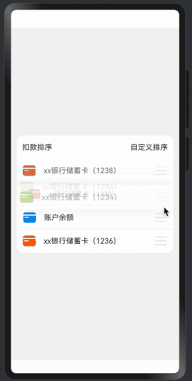

> 温馨提示：本篇博客的详细代码已发布到 [git](https://gitcode.com/nutpi/HarmonyosNext) : https://gitcode.com/nutpi/HarmonyosNext 可以下载运行哦！


# HarmonyOS NEXT系列教程之列表交换组件开发总结
## 效果演示


## 1. 知识体系概览

### 1.1 核心概念
1. 组件架构设计
   - 单一职责原则
   - 组件化封装
   - 接口设计
   - 生命周期管理

2. 交互系统
   - 手势识别
   - 拖拽排序
   - 滑动删除
   - 动画效果

3. 数据管理
   - 状态管理
   - 数据流设计
   - Mock数据
   - 数据同步

4. 性能优化
   - 渲染优化
   - 内存管理
   - 事件处理
   - 资源释放

### 1.2 技术栈掌握
```typescript
// 核心技术要点
interface TechnologyStack {
    // UI开发
    uiFramework: '@arkui/components';
    layoutSystem: 'Flex | Grid | List';
    animationSystem: 'animation | transition';
    
    // 状态管理
    stateManagement: '@State | @Link | @Prop';
    dataFlow: 'Single Direction Data Flow';
    
    // 手势系统
    gestureSystem: 'PanGesture | LongPressGesture';
    
    // 性能优化
    performance: 'LazyLoad | Cache | Memory Management';
}
```

## 2. 开发流程总结

### 2.1 需求分析
```typescript
// 功能需求清单
interface Requirements {
    basic: {
        listDisplay: boolean;      // 列表显示
        dragSort: boolean;         // 拖拽排序
        swipeDelete: boolean;      // 滑动删除
    };
    
    advanced: {
        animation: boolean;        // 动画效果
        customStyle: boolean;      // 自定义样式
        performance: boolean;      // 性能优化
    };
}
```

### 2.2 开发步骤
1. 基础架构搭建
2. 核心功能实现
3. 交互效果开发
4. 性能优化
5. 测试与调试

## 3. 关键技术点

### 3.1 手势系统
```typescript
// 手势组合
.gesture(
    GestureGroup(GestureMode.Sequence,
        LongPressGesture()
            .onAction(() => {
                // 长按处理
            }),
        PanGesture()
            .onActionUpdate((event) => {
                // 拖动处理
            })
    )
)
```

### 3.2 动画系统
```typescript
// 动画效果
.animation({
    duration: 300,
    curve: Curve.EaseInOut,
    delay: 0,
    iterations: 1,
    playMode: PlayMode.Normal
})
.transition(TransitionEffect.OPACITY)
```

## 4. 性能优化经验

### 4.1 渲染优化
```typescript
// 延迟加载
LazyForEach(this.dataSource, (item) => {
    ListItem() {
        this.itemBuilder(item)
    }
})

// 缓存管理
class CacheManager {
    private static cache: Map<string, any> = new Map();
    private static readonly MAX_SIZE = 100;
    
    static set(key: string, value: any) {
        if (this.cache.size >= this.MAX_SIZE) {
            this.clearOldest();
        }
        this.cache.set(key, value);
    }
}
```

### 4.2 内存管理
```typescript
// 资源释放
class ResourceManager {
    static release() {
        // 释放图片资源
        ImageCache.clear();
        // 清理事件监听
        EventBus.clear();
        // 释放定时器
        TimerManager.clear();
    }
}
```

## 5. 最佳实践总结

### 5.1 代码组织
```typescript
// 项目结构
project/
  ├── components/
  │   └── ListExchange/
  │       ├── index.ets          // 组件入口
  │       ├── types.ets          // 类型定义
  │       ├── constants.ets      // 常量定义
  │       └── utils/             // 工具函数
  ├── models/                    // 数据模型
  ├── services/                  // 业务逻辑
  └── styles/                    // 样式定义
```

### 5.2 开发规范
1. 命名规范
   - 组件名：大驼峰
   - 方法名：小驼峰
   - 常量名：大写下划线

2. 代码风格
   - 清晰的注释
   - 统一的格式
   - 模块化组织

## 6. 常见问题解决

### 6.1 性能问题
1. 列表卡顿
   - 使用虚拟列表
   - 优化渲染逻辑
   - 实现懒加载

2. 内存泄漏
   - 及时释放资源
   - 清理事件监听
   - 优化缓存策略

### 6.2 兼容性问题
1. 设备适配
   - 响应式布局
   - 屏幕适配
   - 性能调优

2. 版本兼容
   - API兼容处理
   - 降级方案
   - 错误处理

## 7. 未来展望

### 7.1 功能扩展
1. 更多交互方式
2. 自定义动画
3. 主题定制
4. 无障碍支持

### 7.2 性能提升
1. 虚拟滚动优化
2. 渲染性能提升
3. 内存优化
4. 动画性能优化

## 8. 小结

本系列教程详细介绍了ListExchange组件的：
1. 完整的开发流程
2. 核心技术要点
3. 性能优化策略
4. 最佳实践经验
5. 常见问题解决方案

通过这些内容，开发者可以：
1. 掌握组件开发的核心技术
2. 理解性能优化的关键点
3. 提高代码质量和可维护性
4. 解决实际开发中的常见问题

希望这个系列教程能帮助你更好地开发HarmonyOS应用。
