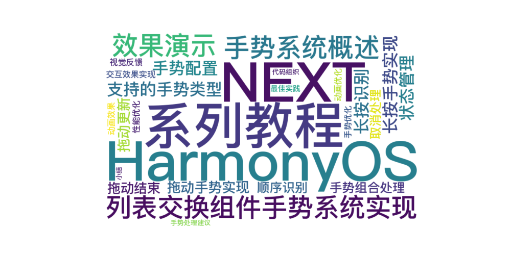

> 温馨提示：本篇博客的详细代码已发布到 [git](https://gitcode.com/nutpi/HarmonyosNext) : https://gitcode.com/nutpi/HarmonyosNext 可以下载运行哦！



# HarmonyOS NEXT系列教程之列表交换组件手势系统实现
## 效果演示


## 1. 手势系统概述

### 1.1 支持的手势类型
1. 长按手势（LongPressGesture）
2. 拖动手势（PanGesture）
3. 组合手势（GestureGroup）

### 1.2 手势配置
```typescript
.gesture(
    GestureGroup(GestureMode.Sequence,
        LongPressGesture()
            .onAction((event: GestureEvent) => {
                this.currentListItem = item;
                this.isLongPress = true;
                this.listExchangeCtrl.onLongPress(item);
            }),
        PanGesture()
            .onActionUpdate((event: GestureEvent) => {
                this.listExchangeCtrl.onMove(item, event.offsetY);
            })
            .onActionEnd((event: GestureEvent) => {
                this.listExchangeCtrl.onDrop(item);
                this.isLongPress = false;
            })
    )
)
```

## 2. 长按手势实现

### 2.1 长按识别
```typescript
LongPressGesture()
    .onAction((event: GestureEvent) => {
        // 设置当前选中项
        this.currentListItem = item;
        // 更新长按状态
        this.isLongPress = true;
        // 触发控制器长按事件
        this.listExchangeCtrl.onLongPress(item);
    })
```

### 2.2 状态管理
```typescript
@State currentListItem: Object | undefined = undefined;
@State isLongPress: boolean = false;
```

## 3. 拖动手势实现

### 3.1 拖动更新
```typescript
PanGesture()
    .onActionUpdate((event: GestureEvent) => {
        // 处理拖动过程
        this.listExchangeCtrl.onMove(item, event.offsetY);
    })
```

### 3.2 拖动结束
```typescript
.onActionEnd((event: GestureEvent) => {
    // 处理放下事件
    this.listExchangeCtrl.onDrop(item);
    // 重置长按状态
    this.isLongPress = false;
})
```

## 4. 手势组合处理

### 4.1 顺序识别
```typescript
GestureGroup(GestureMode.Sequence,
    // 首先识别长按
    LongPressGesture(),
    // 然后识别拖动
    PanGesture()
)
```

### 4.2 取消处理
```typescript
.onCancel(() => {
    if (!this.isLongPress) {
        return;
    }
    this.listExchangeCtrl.onDrop(item);
})
```

## 5. 交互效果实现

### 5.1 视觉反馈
```typescript
.zIndex(this.currentListItem === item ? 2 : 1) // 控制层级
.transition(TransitionEffect.OPACITY) // 透明度过渡
.attributeModifier(this.listExchangeCtrl.getModifier(item)) // 动态属性修改
```

### 5.2 动画效果
```typescript
// 通过属性修改器实现平滑动画
.attributeModifier({
    transform: {
        translate: { y: offsetY + 'px' }
    },
    opacity: opacity,
    scale: scale
})
```

## 6. 性能优化

### 6.1 手势优化
1. 使用组合手势避免冲突
2. 合理的手势识别顺序
3. 优化手势回调处理
4. 减少不必要的状态更新

### 6.2 动画优化
1. 使用硬件加速
2. 优化动画帧率
3. 减少重绘区域
4. 合理的动画持续时间

## 7. 最佳实践

### 7.1 手势处理建议
1. 清晰的手势状态管理
2. 合理的手势识别顺序
3. 完善的错误处理
4. 流畅的动画效果

### 7.2 代码组织
1. 分离手势逻辑
2. 统一的状态管理
3. 模块化的动画处理
4. 可维护的代码结构

## 8. 小结

本篇教程详细介绍了：
1. 手势系统的整体设计
2. 各类手势的实现方式
3. 手势组合的处理方法
4. 交互效果的实现
5. 性能优化策略

下一篇将介绍列表项交互的实现细节。
