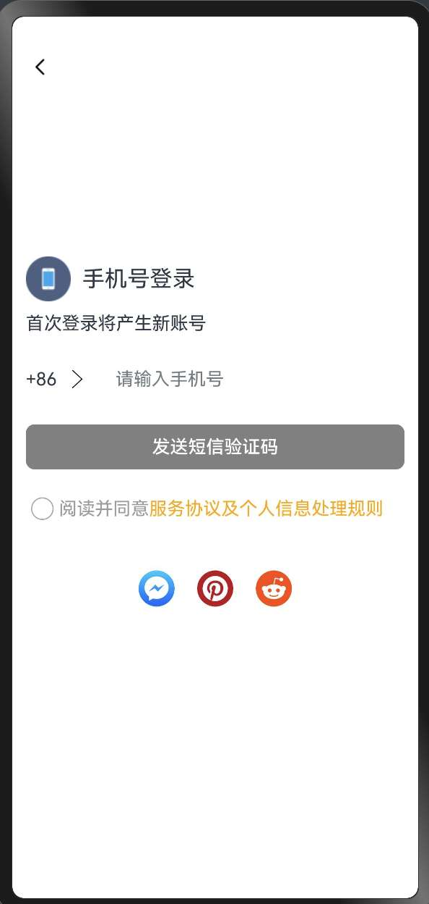

 
> 温馨提示：本篇博客的详细代码已发布到 [git](https://gitcode.com/nutpi/HarmonyosNext) : https://gitcode.com/nutpi/HarmonyosNext 可以下载运行哦！


# HarmonyOS NEXT 登录模块开发教程（九）：部署与发布
## 效果预览



## 1. 引言

在前八篇教程中，我们介绍了HarmonyOS NEXT登录模块的整体架构、模态窗口的实现原理、一键登录页面的实现、短信验证码登录的实现、状态管理和数据绑定机制、安全性考虑、UI设计和用户体验优化、性能优化和最佳实践以及测试与调试技巧。本篇教程将深入讲解登录模块的部署和发布流程，帮助开发者将登录功能顺利部署到实际环境中。

部署和发布是应用开发的最后一环，也是将开发成果转化为用户价值的关键步骤。在HarmonyOS NEXT中，应用的部署和发布有其特定的流程和要求，本教程将详细介绍这些内容，确保登录模块能够顺利地集成到应用中并发布到应用市场。

## 2. 应用打包与签名

### 2.1 应用打包概述

HarmonyOS NEXT应用的打包过程主要包括以下步骤：

1. **编译代码**：将ArkTS代码编译为可执行文件
2. **打包资源**：将图片、字符串等资源文件打包
3. **生成HAP包**：生成Harmony Ability Package（HAP）文件
4. **签名验证**：对HAP包进行签名，确保其完整性和来源可信

### 2.2 使用DevEco Studio打包应用

DevEco Studio提供了图形化界面，简化了应用打包过程：

1. 在DevEco Studio中，选择菜单栏的`Build > Build Hap(s)/APP(s) > Build APP(s)`
2. 在弹出的对话框中，选择要构建的模块和配置
3. 点击`OK`按钮，开始构建过程
4. 构建完成后，HAP包将生成在项目的`build/outputs/app/debug`或`build/outputs/app/release`目录下

### 2.3 应用签名

应用签名是确保应用完整性和来源可信的重要机制。HarmonyOS NEXT要求所有应用必须经过签名才能安装和运行。

#### 2.3.1 创建签名证书

```bash
# 使用keytool创建签名证书
keytool -genkeypair -alias key0 -keyalg RSA -keysize 2048 -validity 3650 -keystore my_application.p12 -storetype PKCS12 -storepass 123456
n```

在交互式提示中，需要输入以下信息：
- 名字与姓氏（CN）
- 组织单位名称（OU）
- 组织名称（O）
- 城市或区域名称（L）
- 省/市/自治区名称（ST）
- 国家/地区代码（C）

#### 2.3.2 配置签名信息

在项目的`build-profile.json5`文件中配置签名信息：

```json
{
  "app": {
    "signingConfigs": [
      {
        "name": "release",
        "type": "HarmonyOS",
        "material": {
          "certpath": "C:/Users/Username/my_application.cer",
          "storePassword": "123456",
          "keyAlias": "key0",
          "keyPassword": "123456",
          "profile": "C:/Users/Username/my_application.p7b",
          "signAlg": "SHA256withECDSA"
        }
      }
    ],
    "compileSdkVersion": 9,
    "compatibleSdkVersion": 9,
    "products": [
      {
        "name": "default",
        "signingConfig": "release"
      }
    ]
  },
  "modules": [
    // 模块配置
  ]
}
```

#### 2.3.3 使用DevEco Studio签名应用

1. 在DevEco Studio中，选择菜单栏的`Build > Build Hap(s)/APP(s) > Build APP(s)`
2. 在弹出的对话框中，选择`Release`模式和之前配置的签名信息
3. 点击`OK`按钮，开始构建和签名过程

## 3. 环境配置与切换

### 3.1 多环境配置

在实际开发中，通常需要为不同的环境（开发、测试、生产）配置不同的参数，如API地址、日志级别等。

#### 3.1.1 使用配置文件

创建不同环境的配置文件：

```typescript
// config/dev.ets - 开发环境配置
export default {
  API_BASE_URL: 'https://dev-api.example.com',
  LOG_LEVEL: 'DEBUG',
  ENABLE_MOCK: true
};

// config/test.ets - 测试环境配置
export default {
  API_BASE_URL: 'https://test-api.example.com',
  LOG_LEVEL: 'INFO',
  ENABLE_MOCK: false
};

// config/prod.ets - 生产环境配置
export default {
  API_BASE_URL: 'https://api.example.com',
  LOG_LEVEL: 'ERROR',
  ENABLE_MOCK: false
};
```

#### 3.1.2 环境切换机制

创建一个环境管理模块，用于加载和切换环境配置：

```typescript
// utils/env.ets
import devConfig from '../config/dev';
import testConfig from '../config/test';
import prodConfig from '../config/prod';

// 环境类型
export enum EnvType {
  DEV = 'dev',
  TEST = 'test',
  PROD = 'prod'
}

// 当前环境
let currentEnv: EnvType = EnvType.DEV;

// 环境配置映射
const configMap = {
  [EnvType.DEV]: devConfig,
  [EnvType.TEST]: testConfig,
  [EnvType.PROD]: prodConfig
};

// 获取当前环境配置
export function getConfig() {
  return configMap[currentEnv];
}

// 设置当前环境
export function setEnv(env: EnvType) {
  currentEnv = env;
}

// 获取当前环境类型
export function getEnv(): EnvType {
  return currentEnv;
}
```

#### 3.1.3 在登录模块中使用环境配置

```typescript
// services/auth.ets
import { getConfig } from '../utils/env';
import http from '@ohos.net.http';

// 发送验证码
export async function sendVerifyCode(phoneNumber: string): Promise<boolean> {
  const config = getConfig();
  const url = `${config.API_BASE_URL}/auth/sendVerifyCode`;
  
  // 如果启用了模拟模式，直接返回成功
  if (config.ENABLE_MOCK) {
    return true;
  }
  
  try {
    const httpRequest = http.createHttp();
    const response = await httpRequest.request(url, {
      method: http.RequestMethod.POST,
      extraData: { phoneNumber },
      connectTimeout: 60000,
      readTimeout: 60000
    });
    
    httpRequest.destroy();
    
    if (response.responseCode === 200) {
      const result = JSON.parse(response.result.toString());
      return result.success;
    }
    
    return false;
  } catch (error) {
    console.error(`Failed to send verify code: ${error}`);
    return false;
  }
}
```

### 3.2 构建变体

使用DevEco Studio的构建变体功能，可以更方便地管理不同环境的构建配置：

1. 在项目的`build-profile.json5`文件中配置构建变体：

```json
{
  "app": {
    // 应用配置
  },
  "modules": [
    {
      "name": "entry",
      "srcPath": "./entry",
      "targets": [
        {
          "name": "default",
          "applyToProducts": [
            "default"
          ]
        }
      ],
      "buildVariants": [
        {
          "name": "dev",
          "productFlavors": [
            {
              "name": "flavor1",
              "value": "dev"
            }
          ]
        },
        {
          "name": "test",
          "productFlavors": [
            {
              "name": "flavor1",
              "value": "test"
            }
          ]
        },
        {
          "name": "prod",
          "productFlavors": [
            {
              "name": "flavor1",
              "value": "prod"
            }
          ]
        }
      ]
    }
  ]
}
```

2. 在代码中获取当前构建变体：

```typescript
import bundleManager from '@ohos.bundle.bundleManager';

// 获取当前构建变体
async function getBuildVariant(): Promise<string> {
  try {
    const bundleInfo = await bundleManager.getBundleInfoForSelf(bundleManager.BundleFlag.GET_BUNDLE_INFO_WITH_METADATA);
    const metadata = bundleInfo.metadata;
    return metadata['flavor1'] || 'dev'; // 默认为dev
  } catch (error) {
    console.error(`Failed to get build variant: ${error}`);
    return 'dev'; // 默认为dev
  }
}

// 根据构建变体设置环境
async function initEnv() {
  const variant = await getBuildVariant();
  switch (variant) {
    case 'dev':
      setEnv(EnvType.DEV);
      break;
    case 'test':
      setEnv(EnvType.TEST);
      break;
    case 'prod':
      setEnv(EnvType.PROD);
      break;
    default:
      setEnv(EnvType.DEV);
  }
}
```

## 4. 版本管理

### 4.1 版本号规范

HarmonyOS NEXT应用的版本号由两部分组成：

1. **版本名称（versionName）**：用于向用户展示的版本号，通常采用语义化版本号格式（主版本号.次版本号.修订号）
2. **版本号（versionCode）**：用于系统识别的整数版本号，每次更新都应该递增

在项目的`module.json5`文件中配置版本信息：

```json
{
  "module": {
    "name": "entry",
    "type": "entry",
    "description": "$string:module_desc",
    "mainElement": "EntryAbility",
    "deviceTypes": [
      "phone",
      "tablet"
    ],
    "deliveryWithInstall": true,
    "installationFree": false,
    "pages": "$profile:main_pages",
    "abilities": [
      {
        "name": "EntryAbility",
        "srcEntry": "./ets/entryability/EntryAbility.ets",
        "description": "$string:EntryAbility_desc",
        "icon": "$media:icon",
        "label": "$string:EntryAbility_label",
        "startWindowIcon": "$media:icon",
        "startWindowBackground": "$color:start_window_background",
        "skills": [
          {
            "entities": [
              "entity.system.home"
            ],
            "actions": [
              "action.system.home"
            ]
          }
        ]
      }
    ],
    "requestPermissions": [
      {
        "name": "ohos.permission.INTERNET"
      }
    ]
  },
  "app": {
    "bundleName": "com.example.myapplication",
    "vendor": "example",
    "versionCode": 1000000,
    "versionName": "1.0.0"
  }
}
```

### 4.2 版本更新策略

在更新应用时，应遵循以下版本更新策略：

1. **主版本号**：当进行不兼容的API更改时递增
2. **次版本号**：当添加向下兼容的功能时递增
3. **修订号**：当进行向下兼容的问题修复时递增
4. **版本号（versionCode）**：每次发布都递增，建议使用格式：主版本号×1000000 + 次版本号×1000 + 修订号

### 4.3 版本更新检测

在应用中实现版本更新检测功能，提醒用户更新到最新版本：

```typescript
// services/update.ets
import http from '@ohos.net.http';
import promptAction from '@ohos.promptAction';
import bundleManager from '@ohos.bundle.bundleManager';

// 检查更新
export async function checkUpdate(): Promise<void> {
  try {
    // 获取当前应用版本信息
    const bundleInfo = await bundleManager.getBundleInfoForSelf(bundleManager.BundleFlag.GET_BUNDLE_INFO_DEFAULT);
    const currentVersionCode = bundleInfo.versionCode;
    const currentVersionName = bundleInfo.versionName;
    
    // 从服务器获取最新版本信息
    const httpRequest = http.createHttp();
    const response = await httpRequest.request('https://api.example.com/app/version', {
      method: http.RequestMethod.GET,
      connectTimeout: 60000,
      readTimeout: 60000
    });
    
    httpRequest.destroy();
    
    if (response.responseCode === 200) {
      const result = JSON.parse(response.result.toString());
      const latestVersionCode = result.versionCode;
      const latestVersionName = result.versionName;
      const updateUrl = result.updateUrl;
      const updateDescription = result.description;
      
      // 检查是否需要更新
      if (latestVersionCode > currentVersionCode) {
        // 显示更新提示
        promptAction.showDialog({
          title: '发现新版本',
          message: `当前版本：${currentVersionName}\n最新版本：${latestVersionName}\n\n${updateDescription}`,
          buttons: [
            {
              text: '稍后再说',
              color: '#666666'
            },
            {
              text: '立即更新',
              color: '#0000ff'
            }
          ],
          success: (result) => {
            if (result.index === 1) {
              // 用户点击了立即更新，跳转到更新页面或应用市场
              // 实际实现可能需要调用系统API打开浏览器或应用市场
              console.info(`Update URL: ${updateUrl}`);
            }
          }
        });
      } else {
        console.info('当前已是最新版本');
      }
    }
  } catch (error) {
    console.error(`Failed to check update: ${error}`);
  }
}
```

## 5. 应用市场发布

### 5.1 华为应用市场发布流程

将应用发布到华为应用市场（AppGallery）的主要步骤：

1. **注册开发者账号**：在[华为开发者联盟](https://developer.huawei.com/)注册开发者账号
2. **创建应用**：在华为开发者联盟控制台创建应用
3. **上传应用包**：上传签名后的HAP包
4. **填写应用信息**：填写应用名称、描述、分类、标签、截图等信息
5. **设置定价和发布范围**：设置应用的定价策略和发布国家/地区
6. **提交审核**：提交应用进行审核
7. **发布应用**：审核通过后发布应用

### 5.2 应用发布前的检查清单

在发布应用前，应进行以下检查：

1. **功能完整性**：确保所有功能正常工作
2. **兼容性**：在不同设备和系统版本上测试
3. **性能**：检查应用的启动时间、响应速度、内存占用等
4. **安全性**：确保敏感数据加密、网络通信安全等
5. **隐私合规**：检查隐私政策是否完整，权限申请是否合理
6. **资源完整**：确保所有图片、文本等资源文件完整
7. **版本信息**：检查版本号是否正确
8. **签名验证**：确保应用已正确签名

### 5.3 灰度发布策略

灰度发布是一种将新版本逐步推广给用户的策略，可以降低风险：

1. **阶段性发布**：先发布给小部分用户，逐步扩大发布范围
2. **用户分组**：根据用户特征（如地区、设备类型）进行分组发布
3. **监控反馈**：密切监控用户反馈和应用性能
4. **快速响应**：发现问题时能够快速响应和修复

在华为应用市场中，可以通过以下方式实现灰度发布：

1. 在发布新版本时，选择"分阶段发布"选项
2. 设置每个阶段的用户比例和时间间隔
3. 根据每个阶段的反馈情况，决定是否继续推进或回滚

## 6. 登录模块的部署注意事项

### 6.1 服务端接口对接

登录模块需要与服务端接口对接，确保通信正常：

1. **接口文档**：明确接口的URL、参数、返回值等
2. **错误处理**：处理各种可能的错误情况
3. **超时设置**：设置合理的超时时间
4. **重试机制**：实现请求失败后的重试机制

```typescript
// services/auth.ets
import http from '@ohos.net.http';
import { getConfig } from '../utils/env';

// 登录接口
export async function login(phoneNumber: string, verifyCode: string): Promise<any> {
  const config = getConfig();
  const url = `${config.API_BASE_URL}/auth/login`;
  
  try {
    const httpRequest = http.createHttp();
    const response = await httpRequest.request(url, {
      method: http.RequestMethod.POST,
      extraData: {
        phoneNumber,
        verifyCode
      },
      connectTimeout: 30000,
      readTimeout: 30000
    });
    
    httpRequest.destroy();
    
    if (response.responseCode === 200) {
      return JSON.parse(response.result.toString());
    }
    
    throw new Error(`Login failed with code: ${response.responseCode}`);
  } catch (error) {
    console.error(`Login error: ${error}`);
    // 实现重试逻辑
    return await retryLogin(phoneNumber, verifyCode);
  }
}

// 重试登录
async function retryLogin(phoneNumber: string, verifyCode: string, maxRetries = 3): Promise<any> {
  let retries = 0;
  let lastError;
  
  while (retries < maxRetries) {
    try {
      const config = getConfig();
      const url = `${config.API_BASE_URL}/auth/login`;
      
      const httpRequest = http.createHttp();
      const response = await httpRequest.request(url, {
        method: http.RequestMethod.POST,
        extraData: {
          phoneNumber,
          verifyCode
        },
        connectTimeout: 30000,
        readTimeout: 30000
      });
      
      httpRequest.destroy();
      
      if (response.responseCode === 200) {
        return JSON.parse(response.result.toString());
      }
      
      throw new Error(`Login failed with code: ${response.responseCode}`);
    } catch (error) {
      lastError = error;
      retries++;
      
      // 等待一段时间后重试
      await new Promise(resolve => setTimeout(resolve, 1000 * retries));
    }
  }
  
  throw lastError;
}
```

### 6.2 用户数据迁移

在更新应用时，可能需要迁移用户数据：

1. **数据备份**：在更新前备份用户数据
2. **数据迁移**：实现数据格式转换和迁移逻辑
3. **兼容处理**：处理新旧版本数据格式不兼容的情况

```typescript
// utils/dataMigration.ets
import data_preferences from '@ohos.data.preferences';

// 数据迁移
export async function migrateUserData(): Promise<void> {
  try {
    const context = getContext(this);
    const oldPreferences = await data_preferences.getPreferences(context, 'user_data_v1');
    const newPreferences = await data_preferences.getPreferences(context, 'user_data_v2');
    
    // 检查是否需要迁移
    const migrated = await newPreferences.get('data_migrated', false);
    if (migrated) {
      return; // 已经迁移过，无需再次迁移
    }
    
    // 获取旧数据
    const userId = await oldPreferences.get('userId', '');
    const token = await oldPreferences.get('token', '');
    const loginTime = await oldPreferences.get('loginTime', 0);
    
    // 迁移到新格式
    if (userId) {
      await newPreferences.put('user_id', userId); // 新的键名格式
      await newPreferences.put('auth_token', token); // 新的键名格式
      await newPreferences.put('last_login_timestamp', loginTime); // 新的键名格式
      
      // 标记为已迁移
      await newPreferences.put('data_migrated', true);
      await newPreferences.flush();
      
      console.info('User data migration completed');
    }
  } catch (error) {
    console.error(`Data migration failed: ${error}`);
  }
}
```

### 6.3 多端同步

对于支持多端登录的应用，需要考虑数据同步问题：

1. **用户标识**：使用统一的用户标识符
2. **数据同步**：实现多端数据同步机制
3. **冲突解决**：处理数据冲突情况

## 7. 最佳实践与注意事项

在部署和发布登录模块时，有以下几点最佳实践和注意事项：

1. **环境隔离**：严格隔离开发、测试和生产环境
2. **配置外部化**：将配置参数外部化，便于不同环境切换
3. **版本控制**：使用语义化版本号，便于版本管理
4. **发布节奏**：建立规律的发布节奏，避免频繁更新
5. **监控告警**：部署监控和告警系统，及时发现问题
6. **灰度策略**：采用灰度发布策略，降低风险
7. **回滚机制**：建立快速回滚机制，应对紧急情况
8. **用户反馈**：收集和分析用户反馈，持续改进

## 8. 小结

本文详细介绍了HarmonyOS NEXT登录模块的部署和发布流程，包括应用打包与签名、环境配置与切换、版本管理、应用市场发布以及登录模块的部署注意事项。通过合理的部署和发布策略，可以确保登录模块稳定可靠地运行在用户设备上。

部署和发布是应用开发的最后一环，但同样重要。良好的部署和发布实践不仅能够提高应用的质量和稳定性，还能提升用户体验和满意度。在登录模块的部署和发布过程中，应注重安全性、稳定性和用户体验，确保用户能够顺利登录并使用应用。

## 9. 参考资源

- [HarmonyOS开发者文档 - 应用打包与签名](https://developer.huawei.com/consumer/cn/doc/harmonyos-guides/publish-app-signature-0000001493744020)
- [HarmonyOS开发者文档 - 应用发布](https://developer.huawei.com/consumer/cn/doc/harmonyos-guides/publish-app-release-0000001493744024)
- [HarmonyOS开发者文档 - 版本管理](https://developer.huawei.com/consumer/cn/doc/harmonyos-guides/version-management-0000001493584088)
- [华为应用市场开发者政策](https://developer.huawei.com/consumer/cn/doc/distribution/app/50104)
