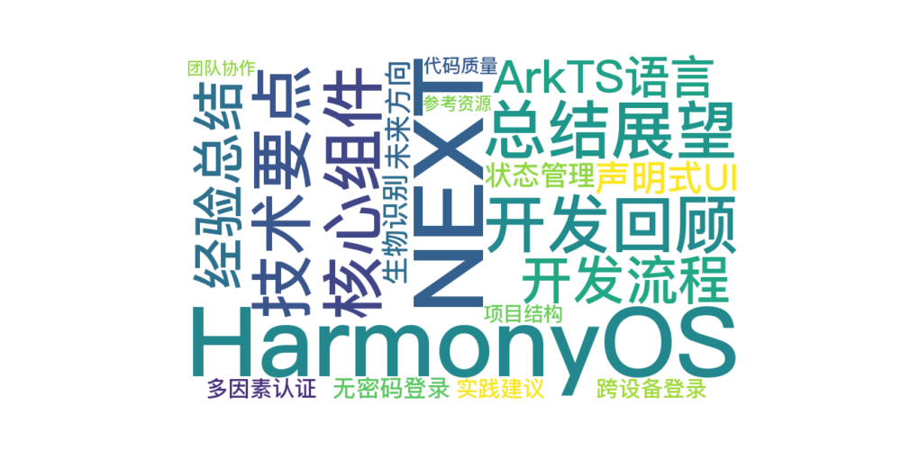

 
> 温馨提示：本篇博客的详细代码已发布到 [git](https://gitcode.com/nutpi/HarmonyosNext) : https://gitcode.com/nutpi/HarmonyosNext 可以下载运行哦！



# HarmonyOS NEXT 登录模块开发教程（十）：总结与展望

## 效果预览


## 1. 引言

在前九篇教程中，我们全面介绍了HarmonyOS NEXT登录模块的开发过程，包括整体架构、模态窗口的实现原理、一键登录页面的实现、短信验证码登录的实现、状态管理和数据绑定机制、安全性考虑、UI设计和用户体验优化、性能优化和最佳实践、测试与调试技巧以及部署与发布流程。本篇教程将对整个系列进行总结和回顾，并展望登录模块的未来发展方向。

通过这个系列教程，我们不仅学习了如何实现一个功能完善的登录模块，还深入了解了HarmonyOS NEXT的核心开发理念和技术特点。本文将对这些内容进行系统性的总结，帮助读者形成完整的知识体系。

## 2. 登录模块开发回顾

### 2.1 核心组件回顾

在这个系列教程中，我们实现了以下核心组件：

| 组件名称 | 主要功能 | 关键技术点 |
| --- | --- | --- |
| ModalWindowComponent | 提供全屏模态窗口容器 | bindContentCover、状态管理 |
| DefaultLogin | 实现一键登录页面 | 条件渲染、转场动画、事件处理 |
| OtherWaysToLogin | 提供短信验证码登录 | 输入验证、倒计时、第三方登录 |
| ReadAgreement | 用户协议和隐私政策展示 | 富文本处理、事件绑定 |

这些组件共同构成了一个完整的登录模块，涵盖了现代移动应用中常见的登录方式和功能。

### 2.2 技术要点回顾

在开发过程中，我们涉及了以下关键技术点：

1. **组件化开发**：使用@Component装饰器创建自定义组件，实现UI和逻辑的封装
2. **状态管理**：使用@State、@Link等装饰器管理组件状态，实现数据驱动的UI更新
3. **条件渲染**：使用if语句实现条件渲染，根据状态变量控制UI显示
4. **事件处理**：实现按钮点击、输入变化等事件的处理逻辑
5. **转场动画**：使用transition属性和TransitionEffect实现平滑的页面切换效果
6. **网络通信**：使用http模块实现与服务器的通信，如发送验证码、验证登录等
7. **安全处理**：实现输入验证、数据加密、安全存储等安全措施
8. **性能优化**：减少组件层级、优化渲染逻辑、合理使用状态变量等
9. **测试与调试**：使用Jest进行单元测试，使用UITest进行UI测试，使用日志和断点进行调试
10. **部署与发布**：实现应用打包、签名、环境配置、版本管理等

### 2.3 开发流程回顾

登录模块的开发流程可以概括为以下几个阶段：

1. **需求分析**：明确登录功能的需求，包括登录方式、界面设计、交互流程等
2. **架构设计**：设计登录模块的整体架构，确定组件结构和通信方式
3. **UI实现**：实现登录界面的布局和样式，包括模态窗口、一键登录页面、短信验证码登录页面等
4. **功能实现**：实现登录功能的核心逻辑，如输入验证、发送验证码、登录验证等
5. **优化与完善**：优化性能、提升用户体验、增强安全性等
6. **测试与调试**：进行单元测试、UI测试、集成测试等，确保功能正常和稳定
7. **部署与发布**：打包应用、签名、配置环境、版本管理、发布到应用市场等

## 3. HarmonyOS NEXT开发经验总结

### 3.1 ArkTS语言特点

ArkTS是HarmonyOS NEXT的开发语言，它基于TypeScript，并增加了声明式UI和状态管理等特性。主要特点包括：

1. **类型安全**：继承TypeScript的静态类型检查，提高代码质量和可维护性
2. **声明式UI**：使用类似JSX的语法，直观地描述UI结构和样式
3. **装饰器**：使用@Component、@State等装饰器简化组件定义和状态管理
4. **响应式编程**：基于状态变化自动更新UI，简化开发流程

### 3.2 声明式UI开发模式

HarmonyOS NEXT采用声明式UI开发模式，主要优势包括：

1. **代码简洁**：UI描述更加直观，减少样板代码
2. **状态驱动**：UI随状态自动更新，无需手动操作DOM
3. **组件复用**：便于创建和复用自定义组件
4. **性能优化**：框架自动优化渲染性能

### 3.3 状态管理最佳实践

在HarmonyOS NEXT中，状态管理是一个核心概念，最佳实践包括：

1. **合理使用装饰器**：根据状态的作用范围和修改需求，选择合适的装饰器
2. **状态粒度控制**：避免过大或过小的状态粒度，保持合理的状态划分
3. **单向数据流**：尽量保持数据流向的单一性，避免复杂的双向绑定
4. **状态提升**：将共享状态提升到最近的公共祖先组件
5. **应用级状态**：使用AppStorage管理全局状态

## 4. 登录模块的未来发展方向

### 4.1 生物识别登录

随着生物识别技术的发展，指纹识别、人脸识别等生物特征登录方式将成为趋势：

```typescript
// 生物识别登录示例
import biometricAuthentication from '@ohos.biometricAuthentication';

async function biometricLogin() {
  try {
    // 检查设备支持的生物识别类型
    const result = await biometricAuthentication.isDeviceSupported();
    
    if (result.facial) {
      // 支持人脸识别
      return await performFacialAuth();
    } else if (result.fingerprint) {
      // 支持指纹识别
      return await performFingerprintAuth();
    } else {
      // 不支持生物识别，回退到传统登录方式
      return false;
    }
  } catch (error) {
    console.error(`Biometric authentication error: ${error}`);
    return false;
  }
}

async function performFacialAuth() {
  // 实现人脸识别登录
  const authParam = {
    challenge: new Uint8Array([1, 2, 3, 4, 5, 6, 7, 8]),
    authType: biometricAuthentication.AuthType.BIOMETRIC_TYPE_FACIAL,
    title: '人脸识别登录',
    description: '请将脸部对准屏幕进行识别',
    dialogAvoidArea: null
  };
  
  const authResult = await biometricAuthentication.auth(authParam);
  return authResult.result === biometricAuthentication.Result.SUCCESS;
}
```

### 4.2 无密码登录

无密码登录（Passwordless Authentication）是未来的发展趋势，包括：

1. **WebAuthn标准**：基于公钥加密的强认证机制
2. **设备绑定**：将用户身份与特定设备绑定
3. **一次性密码**：通过邮件、短信等发送一次性密码
4. **魔术链接**：通过点击邮件中的特殊链接完成登录

### 4.3 多因素认证

多因素认证（MFA）通过组合多种认证方式提高安全性：

```typescript
// 多因素认证示例
async function multiFactorAuth(username: string, password: string) {
  // 第一因素：用户名密码验证
  const firstFactorResult = await verifyCredentials(username, password);
  if (!firstFactorResult.success) {
    return { success: false, message: '用户名或密码错误' };
  }
  
  // 第二因素：短信验证码
  const phoneNumber = firstFactorResult.phoneNumber;
  const smsResult = await sendSmsVerificationCode(phoneNumber);
  if (!smsResult.success) {
    return { success: false, message: '短信验证码发送失败' };
  }
  
  // 等待用户输入验证码
  // 实际应用中，这里应该返回到UI层，让用户输入验证码
  
  // 第三因素（可选）：生物识别
  const bioResult = await biometricLogin();
  if (!bioResult) {
    // 生物识别失败，可以选择继续或要求重试
  }
  
  return { success: true, message: '登录成功' };
}
```

### 4.4 跨设备登录与同步

随着多设备使用场景的增加，跨设备登录与数据同步变得越来越重要：

1. **统一账号系统**：一个账号在多个设备上使用
2. **无缝切换**：在不同设备间无缝切换登录状态
3. **数据同步**：自动同步用户数据和偏好设置
4. **安全机制**：确保跨设备访问的安全性

## 5. 实践建议与经验分享

### 5.1 项目结构组织

良好的项目结构有助于提高代码可维护性：

```
- entry/
  - src/main/ets/
    - components/
      - ModelLogin/
        - DefaultLogin.ets     // 一键登录组件
        - ModalWindow.ets      // 模态窗口组件
        - OtherWaysToLogin.ets // 其他登录方式组件
    - services/
      - auth.ets              // 认证服务
      - storage.ets           // 存储服务
    - utils/
      - validators.ets        // 输入验证工具
      - encryption.ets        // 加密工具
    - models/
      - user.ets              // 用户模型
    - pages/
      - index.ets             // 主页面
```

### 5.2 代码质量保证

保证代码质量的关键措施：

1. **代码规范**：遵循统一的编码规范和命名约定
2. **代码审查**：实施严格的代码审查流程
3. **自动化测试**：建立完善的自动化测试体系
4. **持续集成**：使用持续集成工具自动构建和测试
5. **静态分析**：使用静态代码分析工具发现潜在问题

### 5.3 团队协作流程

高效的团队协作流程：

1. **需求管理**：明确需求，避免需求蔓延
2. **任务分解**：将大任务分解为小任务，便于并行开发
3. **版本控制**：使用Git等版本控制工具，规范分支管理
4. **文档共享**：及时更新和共享开发文档
5. **知识沉淀**：总结经验教训，形成知识库

## 6. 总结

通过这个系列教程，我们全面介绍了HarmonyOS NEXT登录模块的开发过程，从架构设计到具体实现，从性能优化到安全考虑，从测试调试到部署发布，涵盖了登录模块开发的各个方面。

登录模块作为应用的入口，其质量直接影响用户的第一印象和使用体验。通过合理的架构设计、精细的UI实现、严格的安全措施、全面的测试验证和规范的部署流程，我们可以构建一个既安全可靠又用户友好的登录模块。

HarmonyOS NEXT提供了强大的开发工具和框架支持，使得开发高质量的登录模块变得更加简单和高效。随着技术的不断发展，登录模块也将向着更加安全、便捷、智能的方向演进。作为开发者，我们应该不断学习和实践，跟进最新的技术趋势和安全标准，为用户提供更好的登录体验。

## 7. 参考资源

- [HarmonyOS开发者文档 - ArkTS语言基础](https://developer.huawei.com/consumer/cn/doc/harmonyos-guides/arkts-basics-0000001281480778)
- [HarmonyOS开发者文档 - 组件化开发](https://developer.huawei.com/consumer/cn/doc/harmonyos-guides/arkts-component-0000001473537046)
- [HarmonyOS开发者文档 - 状态管理](https://developer.huawei.com/consumer/cn/doc/harmonyos-guides/arkts-state-management-overview-0000001524537149)
- [HarmonyOS开发者文档 - UI框架](https://developer.huawei.com/consumer/cn/doc/harmonyos-guides/arkui-overview-0000001281480682)
- [HarmonyOS开发者文档 - 安全指南](https://developer.huawei.com/consumer/cn/doc/harmonyos-guides/security-guidelines-0000001064024850)
- [HarmonyOS开发者文档 - 性能优化](https://developer.huawei.com/consumer/cn/doc/harmonyos-guides/performance-overview-0000001493744012)
- [HarmonyOS开发者文档 - 测试指南](https://developer.huawei.com/consumer/cn/doc/harmonyos-guides/test-overview-0000001333396393)
- [HarmonyOS开发者文档 - 应用发布](https://developer.huawei.com/consumer/cn/doc/harmonyos-guides/publish-app-release-0000001493744024)
