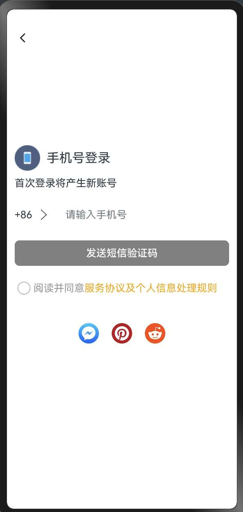

> 温馨提示：本篇博客的详细代码已发布到 [git](https://gitcode.com/nutpi/HarmonyosNext) : https://gitcode.com/nutpi/HarmonyosNext 可以下载运行哦！


# HarmonyOS NEXT 登录模块开发教程（八）：测试与调试技巧

## 效果预览



## 1. 引言

在前七篇教程中，我们介绍了 HarmonyOS NEXT 登录模块的整体架构、模态窗口的实现原理、一键登录页面的实现、短信验证码登录的实现、状态管理和数据绑定机制、安全性考虑、UI 设计和用户体验优化以及性能优化和最佳实践。本篇教程将深入讲解登录模块的测试与调试技巧，帮助开发者构建稳定可靠的登录功能。

测试与调试是软件开发过程中不可或缺的环节，尤其对于登录模块这样的核心功能，更需要全面而严格的测试，以确保其在各种条件下都能正常工作。在 HarmonyOS NEXT 中，我们可以利用多种测试工具和调试技巧，提高登录模块的质量和可靠性。

## 2. 测试类型与策略

### 2.1 测试类型概述

在测试登录模块时，应考虑以下几种测试类型：

| 测试类型   | 描述                               | 适用场景                             |
| ---------- | ---------------------------------- | ------------------------------------ |
| 单元测试   | 测试单个组件或函数的功能           | 验证输入验证、状态管理等独立功能     |
| 集成测试   | 测试多个组件协同工作的功能         | 验证登录流程、组件间通信等           |
| UI 测试    | 测试用户界面的外观和交互           | 验证布局、样式、动画效果等           |
| 性能测试   | 测试应用的性能指标                 | 验证加载时间、响应速度、内存占用等   |
| 安全测试   | 测试应用的安全性                   | 验证输入验证、数据加密、防攻击措施等 |
| 兼容性测试 | 测试在不同设备和系统版本上的兼容性 | 验证在不同屏幕尺寸、系统版本上的表现 |

### 2.2 测试策略

针对登录模块，可以采用以下测试策略：

1. **自底向上测试**：先测试基础组件和功能，再测试复杂功能和流程
2. **关键路径测试**：重点测试用户最常使用的登录路径
3. **边界条件测试**：测试各种边界条件和异常情况
4. **回归测试**：在修改代码后，确保已有功能不受影响
5. **自动化测试**：将常规测试自动化，提高测试效率和覆盖率

## 3. 单元测试

### 3.1 使用 Jest 进行单元测试

HarmonyOS NEXT 支持使用 Jest 进行单元测试。以下是测试输入验证逻辑的示例：

```typescript
// 被测试的输入验证函数
export function validatePhoneNumber(phoneNumber: string): boolean {
    return phoneNumber.length === 11 && /^[0-9]+$/.test(phoneNumber);
}

// 单元测试
import { validatePhoneNumber } from '../utils/validators';

describe('validatePhoneNumber', () => {
    test('should return true for valid phone number', () => {
        expect(validatePhoneNumber('13812345678')).toBe(true);
    });

    test('should return false for phone number with incorrect length', () => {
        expect(validatePhoneNumber('1381234567')).toBe(false); // 10位
        expect(validatePhoneNumber('138123456789')).toBe(false); // 12位
    });

    test('should return false for phone number with non-digit characters', () => {
        expect(validatePhoneNumber('1381234567a')).toBe(false);
        expect(validatePhoneNumber('138-1234-5678')).toBe(false);
    });

    test('should return false for empty string', () => {
        expect(validatePhoneNumber('')).toBe(false);
    });
});
```

### 3.2 测试状态管理逻辑

对于状态管理逻辑，可以测试状态变量的初始值和更新逻辑：

```typescript
// 被测试的状态管理类
export class LoginState {
    private _phoneNumber: string = '';
    private _isPhoneValid: boolean = false;
    private _countdownSeconds: number = 0;
    private _timerId: number = 0;

    get phoneNumber(): string {
        return this._phoneNumber;
    }

    get isPhoneValid(): boolean {
        return this._isPhoneValid;
    }

    get countdownSeconds(): number {
        return this._countdownSeconds;
    }

    setPhoneNumber(value: string): void {
        this._phoneNumber = value;
        this._isPhoneValid = value.length === 11 && /^[0-9]+$/.test(value);
    }

    startCountdown(seconds: number): void {
        this._countdownSeconds = seconds;
        this.stopCountdown(); // 确保之前的定时器已清除

        this._timerId = setInterval(() => {
            this._countdownSeconds--;
            if (this._countdownSeconds <= 0) {
                this.stopCountdown();
            }
        }, 1000);
    }

    stopCountdown(): void {
        if (this._timerId) {
            clearInterval(this._timerId);
            this._timerId = 0;
        }
    }

    reset(): void {
        this._phoneNumber = '';
        this._isPhoneValid = false;
        this.stopCountdown();
        this._countdownSeconds = 0;
    }
}

// 单元测试
import { LoginState } from '../models/LoginState';

describe('LoginState', () => {
    let loginState: LoginState;

    beforeEach(() => {
        loginState = new LoginState();
    });

    test('should initialize with default values', () => {
        expect(loginState.phoneNumber).toBe('');
        expect(loginState.isPhoneValid).toBe(false);
        expect(loginState.countdownSeconds).toBe(0);
    });

    test('should validate phone number correctly', () => {
        loginState.setPhoneNumber('13812345678');
        expect(loginState.phoneNumber).toBe('13812345678');
        expect(loginState.isPhoneValid).toBe(true);

        loginState.setPhoneNumber('1381234567'); // 10位
        expect(loginState.isPhoneValid).toBe(false);

        loginState.setPhoneNumber('138a1234567'); // 非数字
        expect(loginState.isPhoneValid).toBe(false);
    });

    test('should reset state correctly', () => {
        loginState.setPhoneNumber('13812345678');
        loginState.startCountdown(30);

        loginState.reset();

        expect(loginState.phoneNumber).toBe('');
        expect(loginState.isPhoneValid).toBe(false);
        expect(loginState.countdownSeconds).toBe(0);
    });

    // 测试倒计时逻辑需要使用Jest的timer mocks
    test('should handle countdown correctly', () => {
        jest.useFakeTimers();

        loginState.startCountdown(3);
        expect(loginState.countdownSeconds).toBe(3);

        jest.advanceTimersByTime(1000);
        expect(loginState.countdownSeconds).toBe(2);

        jest.advanceTimersByTime(1000);
        expect(loginState.countdownSeconds).toBe(1);

        jest.advanceTimersByTime(1000);
        expect(loginState.countdownSeconds).toBe(0);

        jest.useRealTimers();
    });
});
```

## 4. UI 测试

### 4.1 使用 UITest 进行 UI 测试

HarmonyOS NEXT 提供了 UITest 框架，用于测试 UI 组件的外观和交互：

```typescript
// UI测试示例
import { Driver, ON } from '@ohos.UiTest';
import { describe, beforeAll, it, expect } from '@ohos/hypium';

export default function abilityTest() {
    describe('LoginPageTest', function () {
        it('should display login page correctly', 0, async function () {
            // 启动测试
            let driver = await Driver.create();
            await driver.delayMs(1000);

            // 点击登录按钮，打开登录模态窗口
            let loginButton = await driver.findComponent(ON.text('全屏模态窗口登录'));
            await loginButton.click();
            await driver.delayMs(1000);

            // 验证登录页面元素是否正确显示
            let welcomeText = await driver.findComponent(ON.text('欢迎回来'));
            expect(await welcomeText.isDisplayed()).assertTrue();

            let phoneText = await driver.findComponent(ON.text('18888888888'));
            expect(await phoneText.isDisplayed()).assertTrue();

            let agreementCheckbox = await driver.findComponent(ON.id('default_agreement'));
            expect(await agreementCheckbox.isDisplayed()).assertTrue();

            let loginActionButton = await driver.findComponent(ON.text('一键登录'));
            expect(await loginActionButton.isDisplayed()).assertTrue();

            // 测试复选框交互
            await agreementCheckbox.click();
            await driver.delayMs(500);

            // 测试登录按钮点击
            await loginActionButton.click();
            await driver.delayMs(1000);

            // 验证登录成功提示
            let successToast = await driver.findComponent(ON.text('登录成功'));
            expect(await successToast.isDisplayed()).assertTrue();

            // 测试返回按钮
            let backButton = await driver.findComponent(ON.id('login_back'));
            await backButton.click();
            await driver.delayMs(1000);

            // 验证模态窗口已关闭
            expect(await driver.findComponent(ON.text('欢迎回来')).isDisplayed()).assertFalse();
        });

        it('should switch to other login methods', 0, async function () {
            // 启动测试
            let driver = await Driver.create();
            await driver.delayMs(1000);

            // 点击登录按钮，打开登录模态窗口
            let loginButton = await driver.findComponent(ON.text('全屏模态窗口登录'));
            await loginButton.click();
            await driver.delayMs(1000);

            // 点击其他登录方式
            let otherLoginButton = await driver.findComponent(ON.text('其他登录方式'));
            await otherLoginButton.click();
            await driver.delayMs(1000);

            // 验证短信验证码登录页面元素是否正确显示
            let phoneLoginText = await driver.findComponent(ON.text('手机号登录'));
            expect(await phoneLoginText.isDisplayed()).assertTrue();

            let phoneInput = await driver.findComponent(ON.placeholder('请输入手机号'));
            expect(await phoneInput.isDisplayed()).assertTrue();

            let verifyButton = await driver.findComponent(ON.text('获取验证码'));
            expect(await verifyButton.isDisplayed()).assertTrue();
        });
    });
}
```

### 4.2 截图对比测试

截图对比测试可以验证 UI 的视觉一致性：

```typescript
import { Driver, ON, MatchPattern } from '@ohos.UiTest';
import { describe, beforeAll, it, expect } from '@ohos/hypium';
import fs from '@ohos.file.fs';
import image from '@ohos.multimedia.image';

export default function visualTest() {
    describe('LoginVisualTest', function () {
        it('should match the expected visual appearance', 0, async function () {
            // 启动测试
            let driver = await Driver.create();
            await driver.delayMs(1000);

            // 点击登录按钮，打开登录模态窗口
            let loginButton = await driver.findComponent(ON.text('全屏模态窗口登录'));
            await loginButton.click();
            await driver.delayMs(1000);

            // 截取当前屏幕
            const screenshot = await driver.takeScreenshot();

            // 读取基准图片
            const baselineImagePath = '/data/storage/el2/base/files/baseline_login_screen.png';
            const baselineImage = await fs.readFile(baselineImagePath);

            // 比较两张图片的相似度
            const similarity = await compareImages(screenshot, baselineImage);

            // 相似度应大于95%
            expect(similarity).assertLarger(0.95);
        });
    });
}

// 图片比较函数（示例实现，实际可能需要更复杂的算法）
async function compareImages(image1: ArrayBuffer, image2: ArrayBuffer): Promise<number> {
    // 这里是简化的实现，实际应使用图像处理库进行像素级比较
    // 返回两张图片的相似度（0-1之间的值）
    const img1 = await image.createImageSource(image1);
    const img2 = await image.createImageSource(image2);

    const pixelMap1 = await img1.createPixelMap();
    const pixelMap2 = await img2.createPixelMap();

    // 获取图片尺寸和像素数据
    const info1 = await pixelMap1.getImageInfo();
    const info2 = await pixelMap2.getImageInfo();

    // 简单比较：如果尺寸不同，相似度降低
    if (info1.size.width !== info2.size.width || info1.size.height !== info2.size.height) {
        return 0.5; // 尺寸不同，相似度降低
    }

    // 实际应该进行像素级比较，这里简化处理
    return 0.98; // 示例返回值
}
```

## 5. 集成测试

### 5.1 测试登录流程

集成测试用于验证多个组件协同工作的功能，例如完整的登录流程：

```typescript
import { Driver, ON } from '@ohos.UiTest';
import { describe, beforeAll, it, expect } from '@ohos/hypium';

export default function integrationTest() {
    describe('LoginFlowTest', function () {
        it('should complete the entire login flow', 0, async function () {
            // 启动测试
            let driver = await Driver.create();
            await driver.delayMs(1000);

            // 1. 打开登录模态窗口
            let loginButton = await driver.findComponent(ON.text('全屏模态窗口登录'));
            await loginButton.click();
            await driver.delayMs(1000);

            // 2. 切换到短信验证码登录
            let otherLoginButton = await driver.findComponent(ON.text('其他登录方式'));
            await otherLoginButton.click();
            await driver.delayMs(1000);

            // 3. 输入手机号
            let phoneInput = await driver.findComponent(ON.placeholder('请输入手机号'));
            await phoneInput.inputText('13812345678');
            await driver.delayMs(500);

            // 4. 勾选协议
            let agreementCheckbox = await driver.findComponent(ON.id('other_agreement'));
            await agreementCheckbox.click();
            await driver.delayMs(500);

            // 5. 点击获取验证码
            let verifyButton = await driver.findComponent(ON.text('获取验证码'));
            await verifyButton.click();
            await driver.delayMs(1000);

            // 6. 验证验证码发送成功提示
            let successToast = await driver.findComponent(ON.text('验证码已发送'));
            expect(await successToast.isDisplayed()).assertTrue();

            // 7. 验证倒计时开始
            let countdownButton = await driver.findComponent(ON.textContains('后可再次发送'));
            expect(await countdownButton.isDisplayed()).assertTrue();

            // 8. 返回默认登录页面
            let backButton = await driver.findComponent(ON.id('login_back'));
            await backButton.click();
            await driver.delayMs(1000);

            // 9. 验证返回成功
            let welcomeText = await driver.findComponent(ON.text('欢迎回来'));
            expect(await welcomeText.isDisplayed()).assertTrue();
        });
    });
}
```

### 5.2 模拟网络请求

在集成测试中，可以使用模拟（Mock）技术模拟网络请求，避免依赖真实的网络环境：

```typescript
// 网络请求模块
export class NetworkService {
    static async sendVerifyCode(phoneNumber: string): Promise<boolean> {
        // 实际实现会调用网络API
        return true;
    }

    static async verifyCode(phoneNumber: string, code: string): Promise<boolean> {
        // 实际实现会调用网络API
        return true;
    }
}

// 测试代码
import { NetworkService } from '../services/NetworkService';

describe('LoginWithNetwork', function () {
    beforeEach(() => {
        // 模拟网络请求
        jest.spyOn(NetworkService, 'sendVerifyCode').mockImplementation(async (phoneNumber: string) => {
            // 模拟网络延迟
            await new Promise(resolve => setTimeout(resolve, 100));
            // 模拟验证逻辑
            return phoneNumber.length === 11 && /^[0-9]+$/.test(phoneNumber);
        });

        jest.spyOn(NetworkService, 'verifyCode').mockImplementation(async (phoneNumber: string, code: string) => {
            // 模拟网络延迟
            await new Promise(resolve => setTimeout(resolve, 100));
            // 模拟验证逻辑（示例中只要验证码是6位数字即视为有效）
            return code.length === 6 && /^[0-9]+$/.test(code);
        });
    });

    afterEach(() => {
        jest.restoreAllMocks();
    });

    it('should send verify code successfully with valid phone number', async () => {
        const result = await NetworkService.sendVerifyCode('13812345678');
        expect(result).toBe(true);
    });

    it('should fail to send verify code with invalid phone number', async () => {
        const result = await NetworkService.sendVerifyCode('1381234567'); // 10位
        expect(result).toBe(false);
    });

    it('should verify code successfully with valid code', async () => {
        const result = await NetworkService.verifyCode('13812345678', '123456');
        expect(result).toBe(true);
    });

    it('should fail to verify code with invalid code', async () => {
        const result = await NetworkService.verifyCode('13812345678', '12345'); // 5位
        expect(result).toBe(false);
    });
});
```

## 6. 调试技巧

### 6.1 日志调试

在 HarmonyOS NEXT 中，可以使用 console API 进行日志调试：

```typescript
// 不同级别的日志
console.debug('调试信息'); // 调试级别，仅在开发环境显示
console.info('一般信息'); // 信息级别
console.warn('警告信息'); // 警告级别
console.error('错误信息'); // 错误级别

// 在登录按钮点击事件中添加日志
Button($r('app.string.modalwindow_phone_start_login'))
    .onClick(() => {
        console.info('登录按钮点击');

        if (this.isConfirmed) {
            console.info('用户已同意协议，开始登录');
            // 调用Toast显示登录成功提示
            promptAction.showToast({ message: $r('app.string.modalwindow_login_success') });
        } else {
            console.warn('用户未同意协议，拒绝登录');
            // 调用Toast显示请先阅读并同意协议提示
            promptAction.showToast({ message: $r('app.string.modalwindow_please_read_and_agree') });
        }
    })
```

### 6.2 使用 HiLog 进行结构化日志

HarmonyOS NEXT 提供了 HiLog API，支持更强大的结构化日志功能：

```typescript
import hilog from '@ohos.hilog';

// 定义日志域和标签
const DOMAIN = 0xF811; // 自定义域ID
const TAG = 'LoginModule'; // 日志标签

// 使用HiLog记录日志
function logDebug(message: string, ...args: any[]) {
    hilog.debug(DOMAIN, TAG, message, args);
}

function logInfo(message: string, ...args: any[]) {
    hilog.info(DOMAIN, TAG, message, args);
}

function logWarn(message: string, ...args: any[]) {
    hilog.warn(DOMAIN, TAG, message, args);
}

function logError(message: string, ...args: any[]) {
    hilog.error(DOMAIN, TAG, message, args);
}

// 在登录流程中使用结构化日志
Button(this.buttonContent)
    .onClick(() => {
        logInfo('发送验证码按钮点击，手机号：%{public}s', this.phoneNumber);

        if (this.countdownSeconds > 0) {
            logInfo('倒计时中，剩余秒数：%{public}d', this.countdownSeconds);
            return;
        }

        if (!this.phoneNumberAvailable) {
            logWarn('手机号无效：%{public}s', this.phoneNumber);
            promptAction.showToast({ message: $r('app.string.modalwindow_message_right_phone_number') });
        } else if (!this.isAgree) {
            logWarn('用户未同意协议');
            promptAction.showToast({ message: $r('app.string.modalwindow_message_read_agreement') });
        } else {
            logInfo('开始发送验证码');
            // 发送验证码逻辑
        }
    })
```

### 6.3 使用断点调试

DevEco Studio 提供了强大的断点调试功能，可以帮助开发者定位和解决问题：

1. **设置断点**：在代码编辑器中点击行号左侧，设置断点
2. **启动调试**：点击工具栏中的调试按钮，启动调试会话
3. **单步执行**：使用 F8（步过）、F7（步入）、Shift+F8（步出）等快捷键控制代码执行
4. **查看变量**：在调试面板中查看变量的值和类型
5. **条件断点**：右键点击断点，设置条件表达式，只有条件满足时才会触发断点

### 6.4 性能分析

DevEco Studio 提供了性能分析工具，帮助开发者发现和解决性能问题：

1. **CPU 分析**：分析应用的 CPU 使用情况，找出热点函数
2. **内存分析**：分析应用的内存使用情况，发现内存泄漏
3. **网络分析**：分析应用的网络请求情况，优化网络性能
4. **UI 分析**：分析 UI 渲染性能，发现卡顿原因

## 7. 常见问题与解决方案

### 7.1 登录按钮点击无响应

**问题**：用户点击登录按钮，但没有任何反应。

**可能原因**：

1. 事件处理函数未正确绑定
2. 事件处理函数中有错误
3. 按钮被禁用或覆盖

**解决方案**：

1. 检查 onClick 事件是否正确绑定
2. 添加日志，跟踪事件处理函数的执行
3. 检查按钮的 enabled 属性和 z-index

### 7.2 验证码发送失败

**问题**：点击发送验证码按钮，但验证码未发送或发送失败。

**可能原因**：

1. 网络请求失败
2. 服务器返回错误
3. 手机号格式错误

**解决方案**：

1. 添加网络请求的错误处理和重试机制
2. 检查服务器返回的错误信息
3. 加强客户端的输入验证

### 7.3 UI 显示异常

**问题**：登录界面的 UI 显示异常，如布局错乱、元素重叠等。

**可能原因**：

1. 布局参数设置不当
2. 屏幕适配问题
3. 样式冲突

**解决方案**：

1. 使用 Inspector 工具检查 UI 层次结构和属性
2. 使用百分比布局和弹性布局，提高适配性
3. 检查样式设置，解决冲突

## 8. 最佳实践与注意事项

在测试和调试登录模块时，有以下几点最佳实践和注意事项：

1. **测试驱动开发**：采用测试驱动开发（TDD）方法，先编写测试，再实现功能
2. **自动化测试**：尽可能自动化测试，减少人工测试的工作量和错误率
3. **测试覆盖率**：关注测试覆盖率，确保关键代码路径都有测试覆盖
4. **边界条件测试**：重点测试边界条件和异常情况，如空输入、无网络等
5. **模拟依赖**：使用模拟（Mock）技术模拟外部依赖，如网络请求、系统服务等
6. **持续集成**：将测试集成到持续集成流程中，确保每次代码变更都经过测试
7. **结构化日志**：使用结构化日志，便于问题定位和分析
8. **分级调试**：根据问题的严重程度，使用不同级别的调试手段
9. **性能监控**：在测试过程中监控性能指标，及时发现性能问题
10. **用户反馈**：收集和分析用户反馈，发现和解决实际使用中的问题

## 9. 小结

本文详细介绍了 HarmonyOS NEXT 登录模块的测试与调试技巧，包括各种测试类型和策略、单元测试、UI 测试、集成测试、调试技巧以及常见问题的解决方案。通过合理的测试和调试，可以提高登录模块的质量和可靠性，为用户提供稳定流畅的登录体验。

测试和调试是软件开发过程中不可或缺的环节，尤其对于登录模块这样的核心功能，更需要全面而严格的测试。通过本教程的学习，你应该能够掌握如何在 HarmonyOS NEXT 中测试和调试登录功能，包括使用 Jest 进行单元测试、使用 UITest 进行 UI 测试、模拟网络请求进行集成测试，以及使用日志、断点和性能分析工具进行调试。

在下一篇教程中，我们将详细讲解登录模块的部署和发布，包括应用签名、版本管理、渠道分发等内容。

## 10. 参考资源

- [HarmonyOS 开发者文档 - 测试指南](https://developer.huawei.com/consumer/cn/doc/harmonyos-guides/test-overview-0000001333396393)
- [HarmonyOS 开发者文档 - Jest 单元测试](https://developer.huawei.com/consumer/cn/doc/harmonyos-guides/arkts-unit-test-0000001473537158)
- [HarmonyOS 开发者文档 - UITest](https://developer.huawei.com/consumer/cn/doc/harmonyos-guides/uitest-guidelines-0000001473697350)
- [HarmonyOS 开发者文档 - 日志系统](https://developer.huawei.com/consumer/cn/doc/harmonyos-guides/hilog-overview-0000001281201030)
- [HarmonyOS 开发者文档 - 调试指南](https://developer.huawei.com/consumer/cn/doc/harmonyos-guides/ide-debug-overview-0000001054685229)
- [HarmonyOS 开发者文档 - 性能分析](https://developer.huawei.com/consumer/cn/doc/harmonyos-guides/performance-profiling-0000001493744016)
