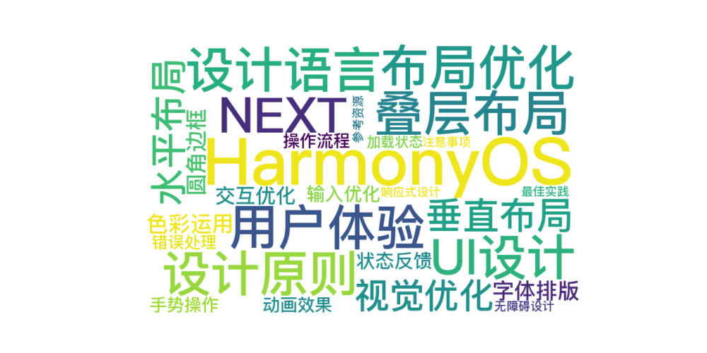

> 温馨提示：本篇博客的详细代码已发布到 [git](https://gitcode.com/nutpi/HarmonyosNext) : https://gitcode.com/nutpi/HarmonyosNext 可以下载运行哦！



# HarmonyOS NEXT 登录模块开发教程（六）：UI 设计与用户体验优化

## 效果预览


## 1. 引言

在前五篇教程中，我们介绍了 HarmonyOS NEXT 登录模块的整体架构、模态窗口的实现原理、一键登录页面的实现、短信验证码登录的实现、状态管理和数据绑定机制以及安全性考虑。本篇教程将深入讲解登录模块的 UI 设计和用户体验优化，帮助开发者构建美观且易用的登录界面。

良好的 UI 设计和用户体验不仅能提升用户对应用的第一印象，还能降低用户的操作难度，提高登录成功率。在 HarmonyOS NEXT 中，我们可以利用丰富的 UI 组件和布局能力，结合合理的交互设计，打造出既美观又实用的登录界面。

## 2. 登录界面设计原则

### 2.1 设计原则概述

在设计登录界面时，应遵循以下基本原则：

| 原则     | 描述                             | 实现方式                     |
| -------- | -------------------------------- | ---------------------------- |
| 简洁明了 | 界面简洁，重点突出，减少干扰     | 精简 UI 元素，突出登录按钮   |
| 引导性强 | 清晰的视觉引导，帮助用户完成登录 | 合理的视觉层次和操作流程     |
| 反馈及时 | 对用户操作提供及时反馈           | 状态变化、加载动画、提示信息 |
| 容错性高 | 允许用户犯错，并提供恢复机制     | 输入验证、错误提示、恢复选项 |
| 一致性好 | 与系统和应用的整体风格保持一致   | 统一的颜色、字体、交互模式   |

### 2.2 HarmonyOS NEXT 的设计语言

HarmonyOS NEXT 提供了一套完整的设计语言和 UI 组件，帮助开发者构建符合系统风格的应用界面：

1. **栅格系统**：基于栅格的布局，确保界面元素对齐和间距合理
2. **色彩系统**：主色调、辅助色、功能色的合理搭配
3. **字体系统**：不同级别的字体大小和粗细，建立清晰的视觉层次
4. **组件库**：丰富的预设组件，如按钮、输入框、复选框等
5. **动效系统**：自然流畅的动画效果，增强交互体验

## 3. 登录模块的 UI 优化

### 3.1 布局优化

在登录模块中，我们采用了嵌套的容器组件实现布局，主要包括 Stack、Column 和 Row 组件。以下是一些布局优化的实践：

#### 3.1.1 使用 Stack 实现叠层布局

```typescript
build() {
    Stack({ alignContent: Alignment.TopStart }) {
        // 登录方式有两种(默认一键登录方式和其他方式登录)，需要在一个模态窗口中切换，使用if进行条件渲染
        if (this.isDefaultLogin) {
            this.DefaultLoginPage() // 默认一键登录方式
        } else {
            OtherWaysToLogin()// 其他登录方式
                .transition(this.effect) // 此处涉及到组件的显示和消失，所以使用transition属性设置出现/消失转场
        }
        Image($r('app.media.arrow_back'))// 通过Stack组件，两个页面只实现一个back
            .id('login_back')
            .width($r('app.integer.modalwindow_height_twenty_five')).height($r('app.integer.modalwindow_height_twenty_five'))
            .margin({ top: $r('app.integer.modalwindow_margin_mid') })
            .onClick(() => {
                if (this.isDefaultLogin) {
                    this.isPresentInLoginView = false;
                } else {
                    this.isDefaultLogin = true
                }
            })
    }
    .expandSafeArea([SafeAreaType.SYSTEM], [SafeAreaEdge.BOTTOM])
    .size({ width: $r('app.string.modalwindow_size_full'), height: $r('app.string.modalwindow_size_full') })
    .padding({
        top: $r('app.integer.modalwindow_padding_default'),
        left: $r('app.integer.modalwindow_padding_default'),
        right: $r('app.integer.modalwindow_padding_default')
    })
    .backgroundColor(Color.White) // 将模态页面背景设置为白色，以避免模态页面内组件发生显隐变化时露出下层页面
}
```

在上面的代码中，我们使用 Stack 组件实现了叠层布局，将返回按钮叠加在登录页面上方。这种布局方式有以下优点：

1. **层次清晰**：不同功能的 UI 元素位于不同层次，视觉上更加清晰
2. **复用元素**：返回按钮可以在不同登录页面间复用，减少代码冗余
3. **统一交互**：提供统一的返回操作，增强用户体验的一致性

#### 3.1.2 使用 Column 实现垂直布局

```typescript
Column({ space: SPACE_TEN }) {
    Row({ space: SPACE_TEN }) {
        Image($r('app.media.batman'))
            .width($r('app.integer.modalwindow_user_image_height'))
            .height($r('app.integer.modalwindow_user_image_height'))
        Column({ space: SPACE_TEN }) {
            Text($r('app.string.modalwindow_welcome_back'))
                .fontWeight(FontWeight.Bold)
                .fontSize($r('app.integer.modalwindow_font_size_mid'))
                .fontColor(Color.Black)

            Text($r('app.string.modalwindow_more_wonderful_after_login'))
                .fontColor($r('app.color.modalwindow_grey_3'))
        }
        .alignItems(HorizontalAlign.Start)
    }
    .alignItems(VerticalAlign.Center)
    .width($r('app.string.modalwindow_size_full'))

    // ... 其他UI元素
}
.width($r('app.string.modalwindow_size_full'))
.height($r('app.string.modalwindow_size_full'))
.backgroundColor(Color.White)
.justifyContent(FlexAlign.Center)
```

在上面的代码中，我们使用 Column 组件实现了垂直布局，将各个 UI 元素从上到下排列。通过 space 属性设置元素间距，确保布局美观。同时，使用 justifyContent 属性将内容垂直居中，提升视觉平衡感。

#### 3.1.3 使用 Row 实现水平布局

```typescript
Row() {
    Text($r('app.string.modalwindow_86'))
    Image($r('app.media.arrow_right'))
        .size({
            width: $r('app.integer.modalwindow_arrow_right_height'),
            height: $r('app.integer.modalwindow_arrow_right_height')
        })
        .margin($r('app.integer.modalwindow_margin_default'))
    TextInput({ placeholder: $r('app.string.modalwindow_input_phone_number') })
        .inputFilter('[0-9]')
        .backgroundColor(Color.Transparent)
        .caretColor(Color.Grey)
        .width($r('app.string.modalwindow_size_full'))
        .maxLength(PHONE_NUMBER_LENGTH)
        .onChange((value: string) => {
            // ... 输入处理逻辑
        })
}
```

在上面的代码中，我们使用 Row 组件实现了水平布局，将国家/地区代码、箭头图标和手机号输入框从左到右排列。这种布局方式符合用户的阅读习惯，提升了操作的直观性。

### 3.2 视觉优化

#### 3.2.1 色彩运用

在登录模块中，我们使用了一套协调的色彩方案，主要包括：

```typescript
// 按钮颜色
.backgroundColor(this.buttonColor) // 动态变化的按钮颜色，根据状态显示蓝色或灰色

// 文本颜色
.fontColor(Color.White) // 按钮文本使用白色，提高对比度
.fontColor($r('app.color.modalwindow_grey_3')) // 次要文本使用灰色，降低视觉权重
.fontColor(Color.Orange) // 链接文本使用橙色，提示可点击

// 背景颜色
.backgroundColor(Color.White) // 页面背景使用白色，营造简洁明亮的视觉效果
.backgroundColor(Color.Transparent) // 输入框背景透明，减少视觉干扰
.backgroundColor($r('app.color.modalwindow_grey_e')) // 输入区域使用浅灰色背景，区分不同功能区域
```

色彩运用的原则：

1. **主次分明**：主要操作（如登录按钮）使用饱和度高的颜色，次要元素使用低饱和度颜色
2. **对比适中**：确保文本与背景之间有足够的对比度，提高可读性
3. **功能一致**：相同功能的元素使用相同的颜色，增强一致性
4. **状态区分**：不同状态（如按钮的可用/禁用状态）使用不同颜色，提供视觉反馈

#### 3.2.2 字体与排版

```typescript
Text($r('app.string.modalwindow_welcome_back'))
    .fontWeight(FontWeight.Bold) // 使用粗体强调标题
    .fontSize($r('app.integer.modalwindow_font_size_mid')) // 使用中等大小的字体
    .fontColor(Color.Black) // 使用黑色提高可读性

Text($r('app.string.modalwindow_more_wonderful_after_login'))
    .fontColor($r('app.color.modalwindow_grey_3')) // 使用灰色降低视觉权重
```

字体与排版的原则：

1. **层次清晰**：使用不同的字体大小和粗细，建立清晰的视觉层次
2. **对齐一致**：文本对齐方式保持一致，提升整体美感
3. **间距合理**：行间距和段落间距设置合理，提高可读性
4. **强调重点**：重要信息使用粗体或大号字体强调

#### 3.2.3 圆角与边框

```typescript
.borderRadius($r('app.integer.modalwindow_border_radius')) // 使用圆角软化视觉效果
.border({ radius: $r('app.integer.modalwindow_border_radius') }) // 为按钮添加圆角边框
```

圆角与边框的原则：

1. **视觉柔和**：使用圆角软化界面，减少视觉冲击
2. **一致性**：相同类型的元素使用相同的圆角半径，保持一致性
3. **区分边界**：使用边框区分不同功能区域，增强可识别性

### 3.3 交互优化

#### 3.3.1 状态反馈

在登录模块中，我们为用户操作提供了及时的状态反馈：

```typescript
// 按钮状态变化
if (value.length === PHONE_NUMBER_LENGTH) {
    this.phoneNumberAvailable = true;
    this.buttonColor = Color.Blue; // 当输入有效时，按钮变为蓝色
} else {
    this.phoneNumberAvailable = false;
    this.buttonColor = Color.Grey; // 当输入无效时，按钮变为灰色
}

// Toast提示
promptAction.showToast({ message: $r('app.string.modalwindow_message_verify_code_send') }); // 发送验证码成功提示
promptAction.showToast({ message: $r('app.string.modalwindow_message_right_phone_number') }); // 手机号格式错误提示
```

状态反馈的原则：

1. **及时性**：用户操作后立即提供反馈，减少等待焦虑
2. **明确性**：反馈信息清晰明确，避免歧义
3. **非侵入性**：反馈不应打断用户的操作流程
4. **多样性**：根据情况使用不同形式的反馈（颜色变化、提示信息等）

#### 3.3.2 输入优化

```typescript
TextInput({ placeholder: $r('app.string.modalwindow_input_phone_number') })
    .inputFilter('[0-9]') // 限制只能输入数字
    .backgroundColor(Color.Transparent) // 透明背景减少视觉干扰
    .caretColor(Color.Grey) // 设置光标颜色
    .width($r('app.string.modalwindow_size_full')) // 设置宽度占满容器
    .maxLength(PHONE_NUMBER_LENGTH) // 限制最大输入长度
```

输入优化的原则：

1. **输入限制**：使用 inputFilter 限制输入内容，减少用户输入错误
2. **长度控制**：使用 maxLength 限制输入长度，避免超长输入
3. **视觉提示**：使用 placeholder 提供输入提示，引导用户正确输入
4. **即时验证**：在 onChange 事件中验证输入，及时提供反馈

#### 3.3.3 动画效果

在登录模块中，我们使用了多种动画效果增强交互体验：

```typescript
// 页面转场动画
private effect: TransitionEffect = TransitionEffect.OPACITY
    .animation({ duration: EFFECT_DURATION })
    .combine(TransitionEffect.opacity(EFFECT_OPACITY))

// 应用转场效果
OtherWaysToLogin()
    .transition(this.effect) // 此处涉及到组件的显示和消失，所以使用transition属性设置出现/消失转场
```

动画效果的原则：

1. **自然流畅**：动画效果应自然流畅，避免生硬的跳转
2. **适度使用**：避免过度使用动画，以免分散用户注意力
3. **功能性**：动画应服务于功能，帮助用户理解界面变化
4. **一致性**：相似的操作应使用相似的动画效果

#### 3.3.4 手势操作

虽然登录模块主要基于点击操作，但我们也可以考虑添加手势支持，提升用户体验：

```typescript
// 添加滑动返回手势
.gesture(
    PanGesture({ direction: PanDirection.Right })
        .onAction((event: GestureEvent) => {
            if (event.offsetX > 100) { // 当右滑距离超过阈值时触发返回操作
                if (this.isDefaultLogin) {
                    this.isPresentInLoginView = false;
                } else {
                    this.isDefaultLogin = true;
                }
            }
        })
)
```

手势操作的原则：

1. **直观性**：手势应符合用户的直觉和习惯
2. **冗余性**：手势操作应作为按钮操作的补充，而非替代
3. **容错性**：手势识别应有一定的容错空间，避免误触
4. **反馈性**：手势操作应提供适当的视觉反馈

## 4. 用户体验优化

### 4.1 操作流程优化

登录模块的操作流程应简洁明了，减少用户的认知负担：

1. **减少步骤**：一键登录方式减少了输入验证码的步骤，提高登录效率
2. **清晰引导**：通过视觉设计引导用户完成登录流程
3. **灵活切换**：提供多种登录方式，允许用户根据需要切换
4. **记住状态**：记住用户的登录状态，减少重复登录

### 4.2 错误处理优化

良好的错误处理可以帮助用户快速恢复并完成登录：

```typescript
// 输入验证
if (!this.phoneNumberAvailable) {
    promptAction.showToast({ message: $r('app.string.modalwindow_message_right_phone_number') });
    return;
}

// 协议同意验证
if (!this.isAgree) {
    promptAction.showToast({ message: $r('app.string.modalwindow_message_read_agreement') });
    return;
}
```

错误处理的原则：

1. **预防为主**：通过输入限制和即时验证，预防错误发生
2. **明确提示**：错误提示应明确指出问题所在和解决方法
3. **就近提示**：错误提示应尽可能靠近错误发生的位置
4. **保留输入**：发生错误时保留用户已输入的内容，避免重新输入

### 4.3 加载状态优化

在网络请求等耗时操作中，应提供适当的加载状态提示：

```typescript
// 发送验证码时显示加载状态
Button(this.buttonContent)
    .enabled(!this.isLoading) // 加载中禁用按钮
    .onClick(() => {
        this.isLoading = true; // 设置加载状态
        // 发送验证码逻辑
        sendVerifyCode().then(() => {
            // 成功处理
            promptAction.showToast({ message: $r('app.string.modalwindow_message_verify_code_send') });
            // 开始倒计时
            this.startCountdown();
        }).catch((err) => {
            // 错误处理
            promptAction.showToast({ message: '发送失败，请重试' });
        }).finally(() => {
            this.isLoading = false; // 重置加载状态
        });
    })
```

加载状态的原则：

1. **及时反馈**：操作开始后立即显示加载状态
2. **视觉区分**：加载状态应与正常状态有明显区别
3. **禁用重复**：加载过程中禁用相关操作，防止重复提交
4. **超时处理**：设置合理的超时时间，避免无限等待

### 4.4 无障碍设计

为了让更多用户能够使用登录功能，应考虑无障碍设计：

```typescript
// 添加无障碍标签
Image($r('app.media.arrow_back'))
    .accessibilityLabel('返回按钮') // 为屏幕阅读器提供描述
    .accessibilityGroup(true) // 将组件标记为一个无障碍组
    .accessibilityText('点击返回上一页') // 提供详细的无障碍文本

// 确保足够的点击区域
.padding(10) // 增加内边距，扩大可点击区域
.margin(5) // 增加外边距，避免误触相邻元素
```

无障碍设计的原则：

1. **语义化**：为 UI 元素提供有意义的无障碍标签
2. **键盘可访问**：确保所有功能可通过键盘操作
3. **颜色对比**：确保文本与背景有足够的对比度
4. **适当尺寸**：交互元素应有足够大的点击区域

## 5. 响应式设计

为了适应不同尺寸的设备，登录模块应采用响应式设计：

```typescript
// 使用百分比布局
.width('100%') // 宽度占满父容器
.height('100%') // 高度占满父容器

// 使用弹性布局
.layoutWeight(1) // 按比例分配空间

// 使用媒体查询适应不同设备
@Styles function getCommonStyle() {
    .width('100%')
    .padding(10)
    .borderRadius(8)
    .backgroundColor(Color.White)
    .mediaQuery({ 'sm': { padding: 5, borderRadius: 4 }, 'md': { padding: 10, borderRadius: 8 }, 'lg': { padding: 15, borderRadius: 12 } }) // 根据设备尺寸调整样式
}
```

响应式设计的原则：

1. **流式布局**：使用百分比和弹性布局，适应不同屏幕尺寸
2. **断点设计**：为不同尺寸的设备设置断点，调整布局和样式
3. **内容优先**：在小屏幕上优先显示核心内容和功能
4. **触控友好**：确保在触摸屏设备上有足够大的点击区域

## 6. 最佳实践与注意事项

在设计和实现登录模块的 UI 和用户体验时，有以下几点最佳实践和注意事项：

1. **品牌一致性**：登录界面应与应用的整体品牌风格保持一致
2. **简化流程**：减少登录步骤，降低用户操作负担
3. **多种登录**：提供多种登录方式，满足不同用户的需求
4. **记住状态**：提供"记住登录状态"选项，减少重复登录
5. **安全与便捷平衡**：在保证安全的前提下，尽量简化登录流程
6. **性能优化**：确保登录界面加载迅速，响应及时
7. **测试验证**：进行用户测试，验证设计的可用性和易用性
8. **持续优化**：根据用户反馈和使用数据，持续优化登录体验

## 7. 小结

本文详细介绍了 HarmonyOS NEXT 登录模块的 UI 设计和用户体验优化，包括布局优化、视觉优化、交互优化、用户体验优化和响应式设计等方面。通过合理的设计和实现，可以打造出既美观又易用的登录界面，提升用户的登录体验。

良好的 UI 设计和用户体验不仅能提高用户的满意度，还能增强用户对应用的信任感，提高用户留存率。在登录模块的设计和实现过程中，应始终以用户为中心，关注用户的需求和使用场景，不断优化和改进。

## 8. 参考资源

- [HarmonyOS 设计指南](https://developer.huawei.com/consumer/cn/doc/design-guides/design-overview-0000001053563071)
- [HarmonyOS 开发者文档 - 布局容器](https://developer.huawei.com/consumer/cn/doc/harmonyos-guides/arkts-layout-development-0000001454445606)
- [HarmonyOS 开发者文档 - 动画](https://developer.huawei.com/consumer/cn/doc/harmonyos-guides/arkts-animation-overview-0000001450914110)
- [HarmonyOS 开发者文档 - 无障碍](https://developer.huawei.com/consumer/cn/doc/harmonyos-guides/accessibility-overview-0000001454357185)
- [HarmonyOS 开发者文档 - 响应式布局](https://developer.huawei.com/consumer/cn/doc/harmonyos-guides/arkts-layout-development-0000001454445606#section1017215384318)
