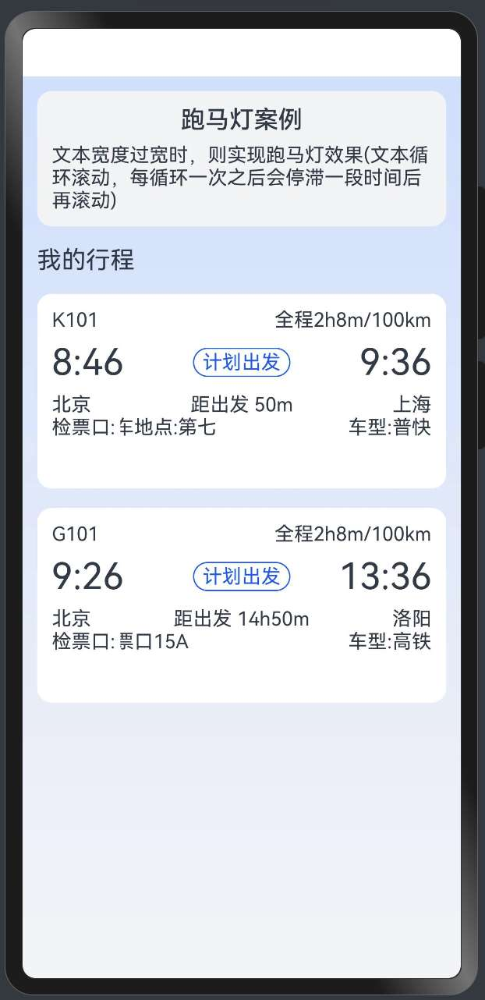

> 温馨提示：本篇博客的详细代码已发布到 [git](https://gitcode.com/nutpi/HarmonyosNext) : https://gitcode.com/nutpi/HarmonyosNext 可以下载运行哦！


# HarmonyOS NEXT跑马灯组件教程：数据源与数据类型详解

## 效果演示




## 1. 数据模型概述

在HarmonyOS NEXT跑马灯组件的实现中，数据模型是组件正常工作的基础。本文将详细介绍跑马灯组件使用的数据源和数据类型，包括TripDataType接口、TripDataSource类和相关的数据处理机制。

### 1.1 数据模型的作用

跑马灯组件的数据模型主要有以下作用：

1. **定义数据结构**：通过TripDataType接口定义行程信息的数据结构
2. **提供数据源**：通过TripDataSource类实现IDataSource接口，为LazyForEach组件提供数据
3. **支持数据更新**：提供数据变化通知机制，支持动态更新列表数据

### 1.2 数据模型组成

跑马灯组件的数据模型主要由以下部分组成：

| 组成部分 | 文件位置 | 主要功能 |
|------|------|------|
| TripDataType | model/marquee/DataType.ets | 定义行程信息的数据结构 |
| TripDataSource | model/marquee/DataSource.ets | 实现IDataSource接口，提供数据源 |
| TRIP_DATA | model/marquee/MockData.ets | 提供模拟数据 |

## 2. TripDataType接口详解

### 2.1 接口定义

TripDataType接口定义在model/marquee/DataType.ets文件中，用于描述行程信息的数据结构：

```typescript
/**
 * 行程信息类型
 *
 * @param id
 * @param trainNumber 列车号
 * @param wholeCourse 全程
 * @param startingTime 起始时间
 * @param endingTime 终止时间
 * @param timeDifference 距出发时间
 * @param origin 起始位置
 * @param destination 目的地
 * @param ticketEntrance 检票口
 * @param vehicleModel 车型
 */
export interface TripDataType {
  id: number;
  trainNumber: string;
  wholeCourse: ResourceStr;
  startingTime: string;
  endingTime: string;
  timeDifference: ResourceStr;
  origin: ResourceStr;
  destination: ResourceStr;
  ticketEntrance: ResourceStr;
  vehicleModel: ResourceStr;
}
```

### 2.2 属性详解

| 属性名 | 类型 | 说明 |
|------|------|------|
| id | number | 行程ID，用于唯一标识一条行程信息 |
| trainNumber | string | 列车号，如"G123" |
| wholeCourse | ResourceStr | 全程信息，如"北京-上海" |
| startingTime | string | 起始时间，如"08:00" |
| endingTime | string | 终止时间，如"12:30" |
| timeDifference | ResourceStr | 距出发时间，如"1小时后出发" |
| origin | ResourceStr | 起始位置，如"北京南站" |
| destination | ResourceStr | 目的地，如"上海虹桥站" |
| ticketEntrance | ResourceStr | 检票口信息，如"南检票口，二楼3号检票口，二楼3号检票口，二楼3号检票口" |
| vehicleModel | ResourceStr | 车型信息，如"高铁" |

### 2.3 ResourceStr类型

TripDataType接口中多次使用了ResourceStr类型，这是HarmonyOS中的资源字符串类型，可以通过$r函数引用资源文件中定义的字符串：

```typescript
// 使用ResourceStr类型
let text: ResourceStr = $r('app.string.ticket_entrance');
```

使用ResourceStr类型的好处是可以支持多语言和资源管理，便于应用的国际化和本地化。

## 3. TripDataSource类详解

### 3.1 类定义

TripDataSource类定义在model/marquee/DataSource.ets文件中，它继承自BasicDataSource类，实现了IDataSource接口：

```typescript
// 行程数据源
export class TripDataSource extends BasicDataSource {
  private tripData: TripDataType[] = TRIP_DATA;

  public totalCount(): number {
    return this.tripData.length;
  }

  public getData(index: number): TripDataType {
    return this.tripData[index];
  }

  public addData(index: number, data: TripDataType): void {
    this.tripData.splice(index, 0, data);
    this.notifyDataAdd(index);
  }

  public pushData(data: TripDataType): void {
    this.tripData.push(data);
    this.notifyDataAdd(this.tripData.length - 1);
  }
}
```

### 3.2 BasicDataSource类

TripDataSource类继承自BasicDataSource类，BasicDataSource类实现了IDataSource接口的基本功能：

```typescript
// Basic implementation of IDataSource to handle data listener
class BasicDataSource implements IDataSource {
  // 数据变化监听器
  private listeners: DataChangeListener[] = [];
  // 需要进行数据迭代的数据源
  private originDataArray: TripDataType[] = [];

  // 获取数据的长度
  public totalCount(): number {
    return 0;
  }

  // 获取指定数据项
  public getData(index: number): TripDataType {
    return this.originDataArray[index];
  }

  // 该方法为框架侧调用，为LazyForEach组件向其数据源处添加listener监听
  registerDataChangeListener(listener: DataChangeListener): void {
    if (this.listeners.indexOf(listener) < 0) {
      this.listeners.push(listener);
    }
  }

  // 该方法为框架侧调用，为对应的LazyForEach组件在数据源处去除listener监听
  unregisterDataChangeListener(listener: DataChangeListener): void {
    const pos = this.listeners.indexOf(listener);
    if (pos >= 0) {
      this.listeners.splice(pos, 1);
    }
  }

  // 通知LazyForEach组件需要重载所有子组件
  notifyDataReload(): void {
    this.listeners.forEach(listener => {
      listener.onDataReloaded();
    })
  }

  // 通知LazyForEach组件需要在index对应索引处添加子组件
  notifyDataAdd(index: number): void {
    this.listeners.forEach(listener => {
      listener.onDataAdd(index);
    })
  }

  // 通知LazyForEach组件需要在index对应索引处删除子组件
  notifyDataDelete(index: number): void {
    this.listeners.forEach(listener => {
      listener.onDataDelete(index);
    })
  }

  // 通知LazyForEach组件需要在index对应索引处更新子组件
  notifyDataChange(index: number): void {
    this.listeners.forEach(listener => {
      listener.onDataChange(index);
    })
  }
}
```

### 3.3 方法详解

| 方法名 | 参数 | 返回值 | 说明 |
|------|------|------|------|
| totalCount | 无 | number | 返回数据源中数据项的总数 |
| getData | index: number | TripDataType | 返回指定索引处的数据项 |
| addData | index: number, data: TripDataType | void | 在指定索引处添加数据项 |
| pushData | data: TripDataType | void | 在数据源末尾添加数据项 |
| registerDataChangeListener | listener: DataChangeListener | void | 注册数据变化监听器 |
| unregisterDataChangeListener | listener: DataChangeListener | void | 注销数据变化监听器 |
| notifyDataReload | 无 | void | 通知重新加载所有数据 |
| notifyDataAdd | index: number | void | 通知添加数据项 |
| notifyDataDelete | index: number | void | 通知删除数据项 |
| notifyDataChange | index: number | void | 通知更新数据项 |

### 3.4 数据变化通知机制

TripDataSource类通过以下方法实现数据变化通知机制：

1. **注册监听器**：通过registerDataChangeListener方法注册数据变化监听器
2. **通知数据变化**：通过notifyDataAdd、notifyDataDelete、notifyDataChange等方法通知数据变化
3. **监听器响应**：监听器收到通知后，会调用相应的回调方法（onDataAdd、onDataDelete、onDataChange等）

这种机制使得LazyForEach组件能够及时响应数据源的变化，更新UI显示。

## 4. 模拟数据

### 4.1 TRIP_DATA常量

TRIP_DATA常量定义在model/marquee/MockData.ets文件中，提供了模拟的行程数据：

```typescript
// 模拟数据
export const TRIP_DATA: TripDataType[] = [
  {
    id: 1,
    trainNumber: 'G123',
    wholeCourse: $r('app.string.whole_course'),
    startingTime: '08:00',
    endingTime: '12:30',
    timeDifference: $r('app.string.time_difference'),
    origin: $r('app.string.origin'),
    destination: $r('app.string.destination'),
    ticketEntrance: $r('app.string.ticket_entrance_content'),
    vehicleModel: $r('app.string.vehicle_model')
  },
  // 更多数据项...
];
```

### 4.2 资源文件

模拟数据中使用的资源字符串定义在资源文件中，例如：

```xml
<!-- app/src/main/resources/base/element/string.json -->
{
  "string": [
    {
      "name": "whole_course",
      "value": "北京-上海"
    },
    {
      "name": "time_difference",
      "value": "1小时后出发"
    },
    {
      "name": "origin",
      "value": "北京南站"
    },
    {
      "name": "destination",
      "value": "上海虹桥站"
    },
    {
      "name": "ticket_entrance_content",
      "value": "南检票口，二楼3号检票口，二楼3号检票口，二楼3号检票口"
    },
    {
      "name": "vehicle_model",
      "value": "高铁"
    }
  ]
}
```

## 5. 在组件中使用数据源

### 5.1 TripView组件

TripView组件使用TripDataSource作为数据源，通过LazyForEach组件遍历数据：

```typescript
@Component
struct TripView {
  @State tripData: TripDataSource = new TripDataSource();

  build() {
    Column() {
      // 行程信息列表
      List({ space: 12 }) {
        LazyForEach(this.tripData, (item: TripDataType) => {
          ListItem() {
            TripItem({ tripDataItem: item })
          }
        }, (item: TripDataType) => item.id.toString())
      }
      .width('100%')
      .layoutWeight(1)
    }
    .width('100%')
    .height('100%')
  }
}
```

### 5.2 TripItem组件

TripItem组件接收一个tripDataItem参数，类型为TripDataType，用于显示行程信息：

```typescript
@Component
struct TripItem {
  @Prop tripDataItem: TripDataType;

  @Builder
  marqueeTextBuilder(marqueeText: ResourceStr) {
    Text(marqueeText)
      .fontSize($r('app.float.trip_item_font_size'))
      .fontColor($r('app.color.trip_item_font_color'))
  }

  build() {
    RelativeContainer() {
      // 列车号
      Text(this.tripDataItem.trainNumber)
        .fontSize($r('app.float.trip_item_train_number_font_size'))
        .fontColor($r('app.color.trip_item_train_number_font_color'))
        .fontWeight(FontWeight.Medium)
        .id('trainNumber')
        .alignRules({
          top: { anchor: '__container__', align: VerticalAlign.Top },
          left: { anchor: '__container__', align: HorizontalAlign.Start }
        })
      
      // 全程
      Text(this.tripDataItem.wholeCourse)
        .fontSize($r('app.float.trip_item_font_size'))
        .fontColor($r('app.color.trip_item_font_color'))
        .id('wholeCourse')
        .alignRules({
          top: { anchor: 'trainNumber', align: VerticalAlign.Bottom },
          left: { anchor: '__container__', align: HorizontalAlign.Start }
        })
        .margin({ top: 4 })
      
      // 检票口信息（使用跑马灯）
      Text($r('app.string.ticket_entrance'))
        .fontSize($r('app.float.trip_item_font_size'))
        .fontColor($r('app.color.trip_item_font_color'))
        .id('ticketEntrance')
        .alignRules({
          top: { anchor: 'vehicleModel', align: VerticalAlign.Bottom },
          left: { anchor: '__container__', align: HorizontalAlign.Start }
        })
        .margin({ top: 12 })
      
      // 跑马灯组件
      MarqueeSection({
        marqueeTextBuilder: () => {
          this.marqueeTextBuilder(this.tripDataItem.ticketEntrance)
        },
        marqueeAnimationModifier: new MarqueeAnimationModifier(),
        marqueeScrollModifier: new MarqueeScrollModifier(display.isFoldable() ?
          $r('app.string.marquee_scroll_phone_width') : $r('app.string.marquee_scroll_tablet_width'),
          Constants.BLANK_SPACE)
      })
    }
  }
}
```

在这个示例中，TripItem组件使用tripDataItem属性显示行程信息，并使用MarqueeSection组件显示检票口信息。

## 6. 数据操作与更新

### 6.1 添加数据

TripDataSource类提供了addData和pushData方法，用于添加数据：

```typescript
// 在指定位置添加数据
this.tripData.addData(0, {
  id: 100,
  trainNumber: 'G100',
  wholeCourse: $r('app.string.whole_course_new'),
  startingTime: '09:00',
  endingTime: '13:30',
  timeDifference: $r('app.string.time_difference_new'),
  origin: $r('app.string.origin_new'),
  destination: $r('app.string.destination_new'),
  ticketEntrance: $r('app.string.ticket_entrance_content_new'),
  vehicleModel: $r('app.string.vehicle_model_new')
});

// 在末尾添加数据
this.tripData.pushData({
  id: 101,
  trainNumber: 'G101',
  // 其他属性...
});
```

### 6.2 更新数据

可以通过以下方式更新数据：

```typescript
// 获取数据
let item = this.tripData.getData(0);

// 修改数据
item.trainNumber = 'G200';

// 通知数据变化
this.tripData.notifyDataChange(0);
```

### 6.3 删除数据

可以通过以下方式删除数据：

```typescript
// 获取数据数组
let dataArray = [];
for (let i = 0; i < this.tripData.totalCount(); i++) {
  dataArray.push(this.tripData.getData(i));
}

// 删除指定索引的数据
dataArray.splice(index, 1);

// 通知数据删除
this.tripData.notifyDataDelete(index);
```

## 7. 数据绑定与响应式更新

### 7.1 使用@State装饰器

在组件中，可以使用@State装饰器将数据源声明为响应式数据：

```typescript
@Component
struct TripView {
  @State tripData: TripDataSource = new TripDataSource();
  
  // 当tripData变化时，组件会自动更新
}
```

### 7.2 数据变化通知

TripDataSource类通过notifyDataXXX方法通知数据变化：

```typescript
// 通知添加数据
notifyDataAdd(index: number): void {
  this.listeners.forEach(listener => {
    listener.onDataAdd(index);
  })
}

// 通知删除数据
notifyDataDelete(index: number): void {
  this.listeners.forEach(listener => {
    listener.onDataDelete(index);
  })
}

// 通知更新数据
notifyDataChange(index: number): void {
  this.listeners.forEach(listener => {
    listener.onDataChange(index);
  })
}

// 通知重新加载所有数据
notifyDataReload(): void {
  this.listeners.forEach(listener => {
    listener.onDataReloaded();
  })
}
```

### 7.3 LazyForEach组件

LazyForEach组件是HarmonyOS中用于高效渲染列表的组件，它与IDataSource接口配合使用：

```typescript
LazyForEach(this.tripData, (item: TripDataType) => {
  ListItem() {
    TripItem({ tripDataItem: item })
  }
}, (item: TripDataType) => item.id.toString())
```

LazyForEach组件接受三个参数：
1. **数据源**：实现IDataSource接口的对象
2. **项目构建器**：用于构建列表项的函数
3. **键值生成器**：用于生成列表项的唯一键值

当数据源发生变化时，LazyForEach组件会根据通知更新相应的列表项，而不是重新渲染整个列表，提高了性能。

## 8. 最佳实践

### 8.1 数据结构设计

在设计数据结构时，应遵循以下原则：

1. **明确属性类型**：为每个属性指定明确的类型
2. **使用资源字符串**：对于可能需要国际化的文本，使用ResourceStr类型
3. **唯一标识符**：为每条数据提供唯一的标识符（如id属性）

### 8.2 数据源实现

在实现数据源时，应注意以下几点：

1. **继承BasicDataSource**：继承BasicDataSource类可以减少重复代码
2. **实现必要方法**：至少实现totalCount和getData方法
3. **通知数据变化**：在数据变化时调用相应的通知方法

### 8.3 性能优化

为了提高性能，可以采取以下措施：

1. **延迟加载**：使用LazyForEach组件实现列表的延迟加载
2. **数据缓存**：缓存不经常变化的数据
3. **批量更新**：将多个数据更新操作合并为一次更新

```typescript
// 批量更新示例
let startIndex = 0;
let count = 3;

// 更新多条数据
for (let i = 0; i < count; i++) {
  let item = this.tripData.getData(startIndex + i);
  // 修改数据...
}

// 只通知一次数据重新加载
this.tripData.notifyDataReload();
```

## 9. 总结

本文详细介绍了HarmonyOS NEXT跑马灯组件的数据源和数据类型，包括TripDataType接口、TripDataSource类和相关的数据处理机制。通过这些数据模型，跑马灯组件能够高效地展示和更新行程信息，特别是检票口等需要滚动显示的长文本内容。

数据模型的设计遵循了HarmonyOS的开发规范，使用接口定义数据结构，使用IDataSource接口提供数据源，使用LazyForEach组件高效渲染列表。这种设计使得跑马灯组件具有良好的扩展性和性能，能够适应各种应用场景。

在实际应用中，开发者可以根据自己的需求，设计自定义的数据类型和数据源，与跑马灯组件配合使用，实现各种文本滚动效果。同时，也可以利用HarmonyOS提供的数据绑定和响应式更新机制，实现数据与UI的自动同步，提高开发效率和用户体验。
