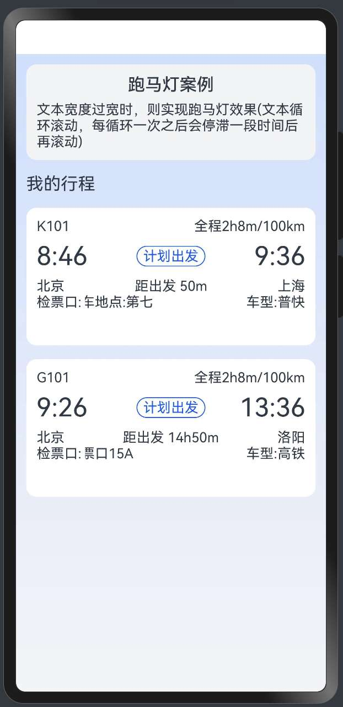

> 温馨提示：本篇博客的详细代码已发布到 [git](https://gitcode.com/nutpi/HarmonyosNext) : https://gitcode.com/nutpi/HarmonyosNext 可以下载运行哦！


# HarmonyOS NEXT跑马灯组件教程：实际应用场景与最佳实践
## 效果演示


## 1. 跑马灯组件应用场景概述

跑马灯组件是HarmonyOS NEXT中一个非常实用的UI组件，它可以在有限的空间内展示超出显示区域的文本内容。本文将详细介绍跑马灯组件的实际应用场景和最佳实践，帮助开发者更好地理解如何在实际项目中使用跑马灯组件。

### 1.1 适用场景分析

跑马灯组件适用于以下场景：

| 应用场景 | 特点 | 优势 |
|------|------|------|
| 通知公告 | 展示重要通知信息 | 吸引用户注意，节省空间 |
| 票务信息 | 展示检票口、登机口等长文本信息 | 在有限空间内展示完整信息 |
| 新闻标题 | 展示新闻头条或摘要 | 增加信息量，提高用户体验 |
| 商品促销 | 展示促销信息或折扣活动 | 增强视觉吸引力，提高点击率 |
| 股票行情 | 展示实时股票价格和涨跌幅 | 动态更新，实时展示 |

### 1.2 不适用场景

虽然跑马灯组件很实用，但并不是所有场景都适合使用它：

1. **关键操作按钮**：不应将跑马灯用于展示关键操作按钮或链接，因为移动的文本可能导致用户难以点击
2. **大段文本**：对于需要用户仔细阅读的大段文本，应使用滚动视图而非跑马灯
3. **频繁更新的内容**：如果内容频繁更新（如每秒更新），跑马灯可能导致用户难以捕捉信息
4. **多行文本**：跑马灯主要适用于单行文本，不适合多行文本的展示

## 2. 实际应用案例分析

### 2.1 票务信息展示

在票务应用中，跑马灯组件常用于展示检票口信息：

```typescript
@Component
struct TicketInfo {
  @Prop ticketData: TicketDataType;
  
  @Builder
  ticketEntranceBuilder(text: ResourceStr) {
    Text(text)
      .fontSize(14)
      .fontColor('#333333')
  }
  
  build() {
    Column() {
      // 票务基本信息
      Row() {
        Text(this.ticketData.trainNumber)
          .fontSize(18)
          .fontWeight(FontWeight.Bold)
        Text(this.ticketData.departTime)
          .fontSize(16)
          .margin({ left: 20 })
      }
      .width('100%')
      .margin({ bottom: 10 })
      
      // 检票口信息（使用跑马灯）
      Row() {
        Text("检票口：")
          .fontSize(14)
          .width(60)
        
        // 跑马灯组件
        MarqueeSection({
          marqueeTextBuilder: () => {
            this.ticketEntranceBuilder(this.ticketData.ticketEntrance)
          },
          // 配置较慢的滚动速度，适合阅读
          marqueeAnimationModifier: new MarqueeAnimationModifier(
            -1,                    // 无限循环
            12000,                 // 动画持续时间12秒
            0.8,                   // 动画速度0.8倍（较慢）
            PlayMode.Reverse,      // 从右到左滚动
            2000                   // 停顿时间2秒
          ),
          // 配置较宽的滚动区域
          marqueeScrollModifier: new MarqueeScrollModifier(
            '70%',                // 滚动区域宽度为70%
            40                     // 文本间隔40像素
          )
        })
      }
      .width('100%')
      .margin({ top: 5 })
    }
    .width('100%')
    .padding(15)
    .backgroundColor(Color.White)
    .borderRadius(8)
  }
}
```

这个示例展示了在票务信息场景中使用跑马灯组件的最佳实践：

1. 使用较慢的滚动速度（tempo=0.8），便于用户阅读检票口信息
2. 设置较长的动画持续时间（duration=12000ms），确保文本滚动平滑
3. 设置适当的停顿时间（delayTime=2000ms），给用户足够的阅读时间
4. 使用较宽的滚动区域（scrollWidth='70%'），减少不必要的滚动

### 2.2 通知公告展示

在应用的通知栏中，跑马灯组件可用于展示重要通知：

```typescript
@Component
struct NotificationBar {
  @Prop notificationText: string;
  @State isImportant: boolean = false;
  
  @Builder
  notificationTextBuilder() {
    Row() {
      if (this.isImportant) {
        Text("重要")
          .fontSize(12)
          .fontColor('#FFFFFF')
          .backgroundColor('#FF0000')
          .borderRadius(4)
          .padding({ left: 4, right: 4, top: 2, bottom: 2 })
          .margin({ right: 8 })
      }
      
      Text(this.notificationText)
        .fontSize(14)
        .fontColor(this.isImportant ? '#FF0000' : '#333333')
    }
  }
  
  build() {
    Row() {
      Image($r('app.media.ic_notification'))
        .width(20)
        .height(20)
        .margin({ right: 10 })
      
      // 跑马灯组件
      MarqueeSection({
        marqueeTextBuilder: () => {
          this.notificationTextBuilder()
        },
        // 配置适中的滚动速度
        marqueeAnimationModifier: new MarqueeAnimationModifier(
          -1,                    // 无限循环
          8000,                  // 动画持续时间8秒
          1.2,                   // 动画速度1.2倍（适中）
          PlayMode.Reverse,      // 从右到左滚动
          1500                   // 停顿时间1.5秒
        ),
        // 配置较宽的滚动区域
        marqueeScrollModifier: new MarqueeScrollModifier(
          '85%',                // 滚动区域宽度为85%
          50                     // 文本间隔50像素
        )
      })
    }
    .width('100%')
    .height(40)
    .backgroundColor('#F5F5F5')
    .padding({ left: 15, right: 15 })
    .border({ width: { bottom: 1 }, color: '#EEEEEE' })
  }
}
```

这个示例展示了在通知公告场景中使用跑马灯组件的最佳实践：

1. 使用适中的滚动速度（tempo=1.2），平衡可读性和信息传递效率
2. 根据通知重要性设置不同的样式（颜色、标签等）
3. 使用较宽的滚动区域（scrollWidth='85%'），最大化利用可用空间
4. 在文本构建器中使用复合组件（Row包含多个Text），增强视觉效果

## 3. 性能优化最佳实践

### 3.1 减少实例数量

在使用跑马灯组件时，应尽量减少实例数量，特别是在列表中：

```typescript
// 不推荐：为所有列表项创建跑马灯组件
@Component
struct BadPractice {
  @State dataList: DataSource = new DataSource();
  
  build() {
    List() {
      LazyForEach(this.dataList, (item) => {
        ListItem() {
          // 每个列表项都创建一个跑马灯组件
          MarqueeSection({ /* ... */ })
        }
      })
    }
  }
}

// 推荐：只在需要时创建跑马灯组件
@Component
struct GoodPractice {
  @State dataList: DataSource = new DataSource();
  
  // 判断文本是否需要跑马灯效果
  needMarquee(text: string, maxWidth: number): boolean {
    // 简单估算：假设每个字符宽度为10像素
    return text.length * 10 > maxWidth;
  }
  
  build() {
    List() {
      LazyForEach(this.dataList, (item) => {
        ListItem() {
          if (this.needMarquee(item.text, 200)) {
            // 文本超长时使用跑马灯
            MarqueeSection({ /* ... */ })
          } else {
            // 文本不超长时使用普通Text
            Text(item.text)
          }
        }
      })
    }
  }
}
```

### 3.2 延迟加载

对于不在视口内的跑马灯组件，可以使用延迟加载策略：

```typescript
@Component
struct LazyMarquee {
  @State isVisible: boolean = false;
  @Prop text: string;
  
  build() {
    Column() {
      if (this.isVisible) {
        MarqueeSection({
          marqueeTextBuilder: () => {
            Text(this.text)
          },
          // 配置...
        })
      } else {
        // 占位符，保持相同高度
        Text(this.text)
          .maxLines(1)
          .textOverflow({ overflow: TextOverflow.Ellipsis })
      }
    }
    .onAppear(() => {
      // 组件出现在视口时，延迟200ms加载跑马灯
      setTimeout(() => {
        this.isVisible = true;
      }, 200);
    })
    .onDisappear(() => {
      // 组件离开视口时，卸载跑马灯
      this.isVisible = false;
    })
  }
}
```

### 3.3 条件渲染

只在文本超出显示区域时才启用跑马灯效果：

```typescript
@Component
struct ConditionalMarquee {
  @State textWidth: number = 0;
  @State containerWidth: number = 0;
  @Prop text: string;
  
  build() {
    Column() {
      if (this.textWidth > this.containerWidth) {
        // 文本宽度超出容器宽度时使用跑马灯
        MarqueeSection({ /* ... */ })
      } else {
        // 文本宽度未超出容器宽度时使用普通Text
        Text(this.text)
          .onAreaChange((oldArea, newArea) => {
            this.textWidth = newArea.width;
          })
      }
    }
    .width('100%')
    .onAreaChange((oldArea, newArea) => {
      this.containerWidth = newArea.width;
    })
  }
}
```

## 4. 自定义样式最佳实践

### 4.1 文本样式定制

通过marqueeTextBuilder可以自定义文本样式：

```typescript
@Component
struct StyledMarquee {
  @Prop text: string;
  @Prop textColor: string = '#333333';
  @Prop fontSize: number = 14;
  @Prop fontWeight: number = FontWeight.Normal;
  
  @Builder
  customTextBuilder() {
    Text(this.text)
      .fontSize(this.fontSize)
      .fontColor(this.textColor)
      .fontWeight(this.fontWeight)
      // 可以添加更多样式
      .fontStyle(FontStyle.Normal)
      .decoration({ type: TextDecorationType.None })
      .letterSpacing(0)
  }
  
  build() {
    MarqueeSection({
      marqueeTextBuilder: () => {
        this.customTextBuilder()
      },
      // 配置...
    })
  }
}
```

### 4.2 复合内容展示

跑马灯不仅可以展示纯文本，还可以展示复合内容：

```typescript
@Component
struct CompositeMarquee {
  @Prop stockData: StockDataType;
  
  @Builder
  stockInfoBuilder() {
    Row() {
      Text(this.stockData.code)
        .fontSize(14)
        .fontColor('#333333')
        .margin({ right: 10 })
      
      Text(this.stockData.name)
        .fontSize(14)
        .fontColor('#333333')
        .margin({ right: 10 })
      
      Text(this.stockData.price)
        .fontSize(14)
        .fontColor('#333333')
        .margin({ right: 10 })
      
      Text(this.stockData.change > 0 ? '+' + this.stockData.change.toFixed(2) : this.stockData.change.toFixed(2))
        .fontSize(14)
        .fontColor(this.stockData.change > 0 ? '#FF0000' : '#00FF00')
    }
  }
  
  build() {
    MarqueeSection({
      marqueeTextBuilder: () => {
        this.stockInfoBuilder()
      },
      // 配置适合股票信息的滚动效果
      marqueeAnimationModifier: new MarqueeAnimationModifier(
        -1,                    // 无限循环
        15000,                 // 动画持续时间15秒
        1.5,                   // 动画速度1.5倍
        PlayMode.Reverse,      // 从右到左滚动
        0                      // 无停顿时间
      )
    })
  }
}
```

### 4.3 动态内容更新

跑马灯组件可以与响应式数据结合，实现动态内容更新：

```typescript
@Component
struct DynamicMarquee {
  @State message: string = "初始消息内容";
  @State updateTime: number = 0;
  
  @Builder
  dynamicTextBuilder() {
    Row() {
      Text(this.message)
        .fontSize(14)
        .fontColor('#333333')
      
      if (this.updateTime > 0) {
        Text(` (${new Date(this.updateTime).toLocaleTimeString()}更新)`)
          .fontSize(12)
          .fontColor('#999999')
          .margin({ left: 8 })
      }
    }
  }
  
  build() {
    Column() {
      MarqueeSection({
        marqueeTextBuilder: () => {
          this.dynamicTextBuilder()
        },
        // 配置...
      })
      
      Button("更新消息")
        .onClick(() => {
          this.message = "这是更新后的消息内容 - " + Math.floor(Math.random() * 1000);
          this.updateTime = Date.now();
        })
        .margin({ top: 20 })
    }
  }
}
```

## 5. 跨平台适配最佳实践

### 5.1 响应式布局

跑马灯组件应适应不同屏幕尺寸：

```typescript
@Component
struct ResponsiveMarquee {
  @State screenWidth: number = 0;
  @Prop text: string;
  
  // 根据屏幕宽度计算滚动区域宽度
  getScrollWidth(): string {
    if (this.screenWidth < 320) {
      return '60%'; // 小屏幕设备
    } else if (this.screenWidth < 720) {
      return '70%'; // 中等屏幕设备
    } else {
      return '80%'; // 大屏幕设备
    }
  }
  
  build() {
    Column() {
      MarqueeSection({
        marqueeTextBuilder: () => {
          Text(this.text)
        },
        marqueeScrollModifier: new MarqueeScrollModifier(
          this.getScrollWidth(),
          Constants.BLANK_SPACE
        )
      })
    }
    .onAreaChange((oldArea, newArea) => {
      this.screenWidth = newArea.width;
    })
  }
}
```

### 5.2 设备类型适配

根据设备类型调整跑马灯配置：

```typescript
@Component
struct DeviceAdaptiveMarquee {
  @Prop text: string;
  
  // 获取设备类型
  getDeviceType(): string {
    if (display.isFoldable()) {
      return 'foldable';
    } else if (display.getDefaultDisplay().width > 720) {
      return 'tablet';
    } else {
      return 'phone';
    }
  }
  
  // 根据设备类型获取动画配置
  getAnimationConfig(): MarqueeAnimationModifier {
    const deviceType = this.getDeviceType();
    
    switch (deviceType) {
      case 'foldable':
        return new MarqueeAnimationModifier(-1, 8000, 1.2, PlayMode.Reverse, 1500);
      case 'tablet':
        return new MarqueeAnimationModifier(-1, 12000, 1, PlayMode.Reverse, 2000);
      case 'phone':
      default:
        return new MarqueeAnimationModifier(-1, 10000, 1.5, PlayMode.Reverse, 1000);
    }
  }
  
  build() {
    MarqueeSection({
      marqueeTextBuilder: () => {
        Text(this.text)
      },
      marqueeAnimationModifier: this.getAnimationConfig()
    })
  }
}
```

## 6. 无障碍设计最佳实践

### 6.1 可访问性支持

为跑马灯组件添加无障碍支持：

```typescript
@Component
struct AccessibleMarquee {
  @Prop text: string;
  @Prop accessibilityDescription: string;
  
  build() {
    Column() {
      MarqueeSection({
        marqueeTextBuilder: () => {
          Text(this.text)
        },
        // 配置...
      })
    }
    .accessibilityGroup(true)
    .accessibilityText(this.accessibilityDescription || this.text)
    .accessibilityLevel(AccessibilityLevel.Important)
  }
}
```

### 6.2 控制滚动速度

为视力障碍用户提供更慢的滚动速度：

```typescript
@Component
struct AccessibilityFriendlyMarquee {
  @Prop text: string;
  @State isAccessibilityMode: boolean = false;
  
  aboutToAppear() {
    // 检测系统无障碍模式
    // 这里仅为示例，实际应使用系统API检测
    this.isAccessibilityMode = false; // 默认关闭
  }
  
  build() {
    Column() {
      MarqueeSection({
        marqueeTextBuilder: () => {
          Text(this.text)
            .fontSize(this.isAccessibilityMode ? 18 : 14) // 无障碍模式下使用更大字号
        },
        marqueeAnimationModifier: new MarqueeAnimationModifier(
          -1,
          this.isAccessibilityMode ? 20000 : 10000, // 无障碍模式下使用更长的动画时间
          this.isAccessibilityMode ? 0.5 : 1,      // 无障碍模式下使用更慢的速度
          PlayMode.Reverse,
          this.isAccessibilityMode ? 3000 : 1000    // 无障碍模式下使用更长的停顿时间
        )
      })
      
      Toggle({ type: ToggleType.Checkbox, isOn: this.isAccessibilityMode })
        .onChange((isOn) => {
          this.isAccessibilityMode = isOn;
        })
        .margin({ top: 10 })
      Text("无障碍模式")
        .fontSize(14)
    }
  }
}
```

## 7. 总结与最佳实践清单

### 7.1 总结

本文详细介绍了HarmonyOS NEXT跑马灯组件的实际应用场景和最佳实践，包括票务信息展示、通知公告展示等典型场景，以及性能优化、自定义样式、跨平台适配和无障碍设计等方面的最佳实践。通过这些实践，开发者可以更好地理解如何在实际项目中使用跑马灯组件，提供更好的用户体验。

### 7.2 最佳实践清单

以下是使用跑马灯组件的最佳实践清单：

1. **场景选择**
   - 只在适合的场景使用跑马灯组件
   - 避免在关键操作按钮、大段文本等场景使用

2. **性能优化**
   - 减少实例数量，只在必要时使用跑马灯
   - 使用延迟加载策略，减少不必要的渲染
   - 使用条件渲染，只在文本超出显示区域时启用跑马灯

3. **自定义样式**
   - 通过marqueeTextBuilder自定义文本样式
   - 使用复合内容展示更丰富的信息
   - 结合响应式数据实现动态内容更新

4. **跨平台适配**
   - 使用响应式布局适应不同屏幕尺寸
   - 根据设备类型调整跑马灯配置

5. **无障碍设计**
   - 添加无障碍支持，提高应用的可访问性
   - 为视力障碍用户提供更慢的滚动速度和更大的字号

6. **配置调优**
   - 根据文本内容和使用场景调整动画持续时间和速度
   - 设置适当的停顿时间，提高用户体验
   - 选择合适的滚动区域宽度，减少不必要的滚动

通过遵循这些最佳实践，开发者可以充分发挥跑马灯组件的优势，在有限的空间内展示更多的信息，提供更好的用户体验。