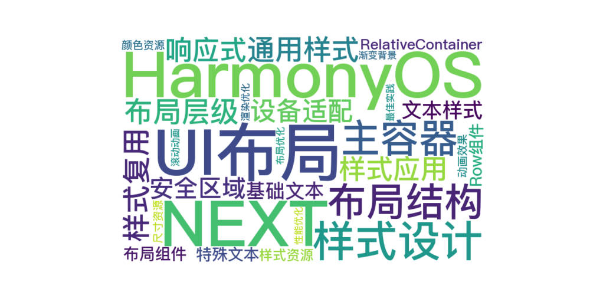

> 温馨提示：本篇博客的详细代码已发布到 [git](https://gitcode.com/nutpi/HarmonyosNext) : https://gitcode.com/nutpi/HarmonyosNext 可以下载运行哦！



# HarmonyOS NEXT 跑马灯组件详解(四): UI布局与样式设计
## 效果演示


## 1. 整体布局结构

### 1.1 主容器布局

```typescript
@Component
export struct MarqueeViewComponent {
  build() {
    Column() {
      // 场景介绍组件
      FunctionDescription({
        title: $r('app.string.marquee_title'),
        content: $r('app.string.marquee_content')
      })
      // 行程信息组件
      TripView()
    }
    .width('100%')
    .height('100%')
    .padding($r('app.string.ohos_id_card_padding_start'))
    .linearGradient({
      angle: Constants.ANGLE,
      colors: [[$r('app.color.marquee_bg_color1'), 0], 
               [$r('app.color.marquee_bg_color2'), 1]]
    })
  }
}
```

### 1.2 布局层级

```
Column (主容器)
├── FunctionDescription (功能描述)
│   └── Column
│       ├── Row (标题)
│       └── Row (内容)
└── TripView (行程信息)
    └── Column
        ├── Text (标题)
        └── LazyForEach
            └── TripMessage (行程消息)
```

## 2. 样式复用

### 2.1 通用样式定义

```typescript
@Styles
commonStyles(){
  .width('100%')
  .margin({ top: $r('app.string.ohos_id_elements_margin_vertical_m') })
}
```

### 2.2 样式应用

```typescript
Row() {
  Text(this.tripDataItem.origin)
  Text(this.tripDataItem.timeDifference)
  Text(this.tripDataItem.destination)
}
.commonStyles()  // 应用通用样式
.justifyContent(FlexAlign.SpaceBetween)
```

## 3. 响应式布局

### 3.1 设备适配

```typescript
MarqueeScrollModifier(
  display.isFoldable() ?
    $r('app.string.marquee_scroll_phone_width') : // 手机宽度
    $r('app.string.marquee_scroll_tablet_width'), // 平板宽度
  Constants.BLANK_SPACE
)
```

### 3.2 安全区域处理

```typescript
.expandSafeArea([SafeAreaType.SYSTEM], [SafeAreaEdge.BOTTOM])
```

## 4. 文本样式

### 4.1 基础文本样式

```typescript
Text(this.tripDataItem.trainNumber)
  .fontSize($r('sys.float.ohos_id_text_size_headline6'))
  .fontWeight(FontWeight.Medium)
  .textOverflow({ overflow: TextOverflow.Ellipsis })
  .maxLines(1)
```

### 4.2 特殊文本样式

```typescript
Text($r('app.string.marquee_plan_text'))
  .fontColor($r('app.color.ohos_id_color_emphasize'))
  .width(80)
  .height(24)
  .textAlign(TextAlign.Center)
  .border({
    width: 1,
    radius: $r('app.string.ohos_id_corner_radius_default_m'),
    color: $r('app.color.ohos_id_color_emphasize')
  })
```

## 5. 布局组件使用

### 5.1 Row组件

```typescript
Row() {
  Text(this.tripDataItem.startingTime)
  Text($r('app.string.marquee_plan_text'))
  Text(this.tripDataItem.endingTime)
}
.justifyContent(FlexAlign.SpaceBetween)
```

### 5.2 RelativeContainer组件

```typescript
RelativeContainer() {
  Text($r('app.string.marquee_ticket_entrance'))
    .id('ticketEntrance')
    .alignRules({
      top: { anchor: '__container__', align: VerticalAlign.Top },
      left: { anchor: '__container__', align: HorizontalAlign.Start }
    })
    
  MarqueeSection({ /* ... */ })
    
  Row() {
    Text($r('app.string.marquee_vehicle_model'))
    Text(this.tripDataItem.vehicleModel)
  }
  .id('vehicleModel')
  .alignRules({
    top: { anchor: '__container__', align: VerticalAlign.Top },
    right: { anchor: '__container__', align: HorizontalAlign.End }
  })
}
```

## 6. 样式资源管理

### 6.1 颜色资源

```typescript
// resources/colors.json
{
  "marquee_bg_color1": "#FFFFFF",
  "marquee_bg_color2": "#F1F3F5",
  "ohos_id_color_emphasize": "#007DFF"
}
```

### 6.2 尺寸资源

```typescript
// resources/dimens.json
{
  "marquee_trip_message_height": "160vp",
  "ohos_id_elements_margin_vertical_m": "12vp",
  "ohos_id_corner_radius_default_m": "8vp"
}
```

## 7. 动画效果

### 7.1 渐变背景

```typescript
.linearGradient({
  angle: Constants.ANGLE,
  colors: [
    [$r('app.color.marquee_bg_color1'), 0],
    [$r('app.color.marquee_bg_color2'), 1]
  ]
})
```

### 7.2 滚动动画

```typescript
new MarqueeAnimationModifier(
  -1,                           // 无限循环
  Constants.ANIMATION_DURATION, // 动画持续时间
  1,                           // 正常速度
  PlayMode.Reverse,           // 反向播放
  Constants.DELAY_TIME        // 延迟时间
)
```

## 8. 性能优化

### 8.1 布局优化

1. 避免深层嵌套：
```typescript
// 好的做法
Column() {
  Row() { /* 内容 */ }
  Row() { /* 内容 */ }
}

// 避免
Column() {
  Column() {
    Row() {
      Column() {
        // 过多嵌套
      }
    }
  }
}
```

2. 使用LazyForEach：
```typescript
LazyForEach(this.tripData, (item: TripDataType) => {
  TripMessage({ tripDataItem: item })
})
```

### 8.2 渲染优化

1. 条件渲染：
```typescript
if (this.showDetail) {
  DetailView()
}
```

2. 缓存常用样式：
```typescript
@Styles
function commonLayout() {
  .width('100%')
  .padding(12)
  .backgroundColor(Color.White)
}
```

## 9. 最佳实践

1. 样式统一管理
2. 使用响应式单位
3. 避免硬编码值
4. 合理使用布局组件
5. 注意性能优化

通过以上详细的UI布局和样式设计讲解，你应该能够更好地理解跑马灯组件的视觉呈现部分。这些知识将帮助你创建更美观、更易维护的UI组件。
