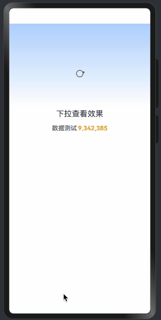

> 温馨提示：本篇博客的详细代码已发布到 [git](https://gitcode.com/nutpi/HarmonyosNext) : https://gitcode.com/nutpi/HarmonyosNext 可以下载运行哦！


# HarmonyOS  NEXT 数字滚动动画详解(五)：最佳实践与应用场景
## 效果演示


## 1. 使用场景

数字滚动组件适用于以下场景：
- 数值动态变化显示
- 计数器效果
- 金额变化展示
- 时间倒计时

## 2. 基本使用

### 2.1 组件创建

```typescript
@Entry
@Component
struct DigitalScrollDemo {
  @State isRefresh: boolean = false;

  build() {
    Column() {
      DigitalScrollDetail({
        isRefresh: this.isRefresh
      })
      
      Button('刷新数据')
        .onClick(() => {
          this.isRefresh = true;
        })
    }
  }
}
```

### 2.2 配置自定义

```typescript
// 自定义配置
const CustomConfig = {
  NUMBER_LEN: 8,        // 8位数字
  DURATION_TIME: 150,   // 更慢的动画
  ITEM_HEIGHT: 40       // 更大的数字
}
```

## 3. 常见应用场景

### 3.1 计数器

```typescript
@Component
struct Counter {
  @State count: number = 0;
  
  build() {
    Column() {
      DigitalScrollDetail({
        isRefresh: true,
        currentData: [this.count]
      })
      
      Button('+1')
        .onClick(() => {
          this.count++;
        })
    }
  }
}
```

### 3.2 金额显示

```typescript
@Component
struct PriceDisplay {
  @State price: number = 0;
  
  build() {
    Row() {
      Text('￥')
      DigitalScrollDetail({
        isRefresh: this.price > 0,
        currentData: this.formatPrice(this.price)
      })
    }
  }
  
  private formatPrice(price: number): number[] {
    return price.toFixed(2).split('').map(Number);
  }
}
```

## 4. 自定义扩展

### 4.1 样式定制

```typescript
@Component
struct CustomDigitalScroll {
  build() {
    DigitalScrollDetail({
      isRefresh: true
    })
    .width('100%')
    .height(50)
    .backgroundColor('#F5F5F5')
    .borderRadius(8)
  }
}
```

### 4.2 动画定制

```typescript
// 自定义动画配置
private customAnimation = {
  duration: 200,
  curve: Curve.EaseInOut,
  delay: 100
}
```

## 5. 错误处理

### 5.1 数据验证

```typescript
private validateData(data: number[]): boolean {
  if (!Array.isArray(data)) {
    return false;
  }
  if (data.length !== DATA_CONFIG.NUMBER_LEN) {
    return false;
  }
  return data.every(item => typeof item === 'number');
}
```

### 5.2 异常处理

```typescript
try {
  this.refreshData();
} catch (error) {
  console.error('Refresh error:', error);
  // 显示错误提示
  this.showError('数据刷新失败');
}
```

## 6. 测试建议

### 6.1 功能测试

```typescript
// 测试数据更新
test('should update numbers correctly', () => {
  // 测试代码
});

// 测试动画效果
test('should animate smoothly', () => {
  // 测试代码
});
```

### 6.2 性能测试

```typescript
// 测试大量数据更新
test('should handle rapid updates', () => {
  // 测试代码
});
```

## 7. 调试技巧

### 7.1 日志记录

```typescript
private logState() {
  console.info('Current state:', {
    currentData: this.currentData,
    scrollYList: this.scrollYList,
    isRefresh: this.isRefresh
  });
}
```

### 7.2 性能监控

```typescript
private measurePerformance() {
  const start = performance.now();
  // 执行操作
  const end = performance.now();
  console.info('Operation took:', end - start, 'ms');
}
```

## 8. 最佳实践建议

1. 使用规范
   - 遵循组件接口
   - 合理配置参数
   - 处理异常情况

2. 性能考虑
   - 控制更新频率
   - 优化动画效果
   - 注意内存使用

3. 用户体验
   - 平滑的动画
   - 及时的响应
   - 清晰的显示

## 9. 注意事项

1. 数据处理
   - 验证输入数据
   - 处理边界情况
   - 格式化显示

2. 性能问题
   - 避免频繁更新
   - 控制动画复杂度
   - 优化内存使用

3. 适配问题
   - 考虑不同屏幕
   - 处理方向变化
   - 支持深色模式

通过遵循这些最佳实践，你可以更好地使用数字滚动组件，创建出优秀的用户界面效果。
