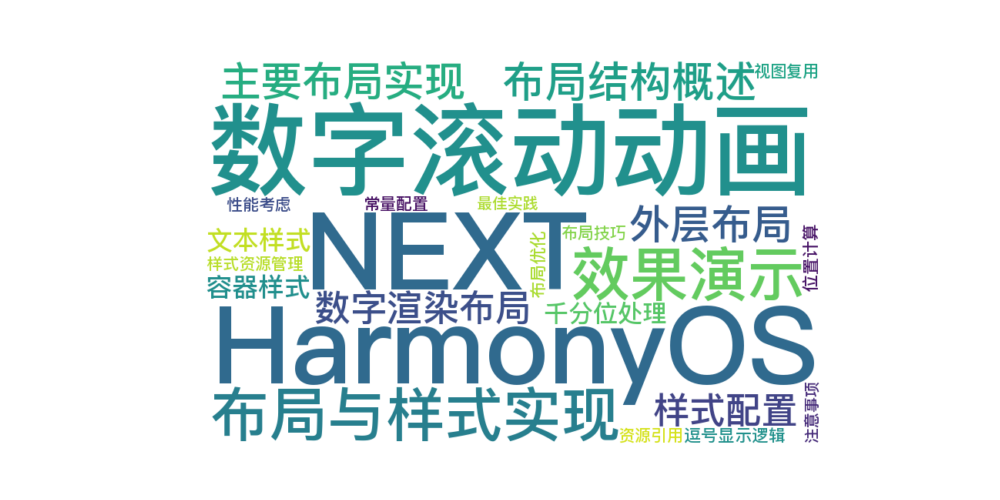

> 温馨提示：本篇博客的详细代码已发布到 [git](https://gitcode.com/nutpi/HarmonyosNext) : https://gitcode.com/nutpi/HarmonyosNext 可以下载运行哦！



# HarmonyOS  NEXT 数字滚动动画详解(三)：布局与样式实现
## 效果演示


## 1. 布局结构概述

数字滚动组件使用嵌套的Row和Column布局来实现数字的排列和滚动效果。主要包含：
- 外层Row布局：水平排列数字
- 内层Column布局：垂直排列数字
- 千分位逗号处理

## 2. 主要布局实现

### 2.1 外层布局

```typescript
build() {
  Row() {
    ForEach(this.currentData, (item: number, index: number) => {
      // 千分位逗号处理
      if ((DATA_CONFIG.NUMBER_LEN - index) % DATA_CONFIG.MILLENNIAL_LEN === 0 
          && index !== 0) {
        Text($r('app.string.digital_scroll_animation_comma'))
          .fontColor($r('sys.color.ohos_id_color_palette9'))
      }

      // 数字列布局
      Column() {
        // 数字渲染
      }
    })
  }
}
```

### 2.2 数字渲染布局

```typescript
Column() {
  ForEach(this.dataItem, (subItem: number) => {
    Text(subItem.toString())
      .fontColor(Color.Orange)
      .fontWeight(FontWeight.Bold)
      .height($r('app.string.digital_scroll_animation_max_size'))
      .textAlign(TextAlign.Center)
      .translate({ x: 0, y: this.scrollYList[index] })
  })
}
.height(STYLE_CONFIG.ITEM_HEIGHT)
.clip(true)
```

## 3. 样式配置

### 3.1 文本样式

```typescript
Text(subItem.toString())
  .fontColor(Color.Orange)    // 文字颜色
  .fontWeight(FontWeight.Bold) // 文字粗细
  .height($r('app.string.digital_scroll_animation_max_size')) // 文字高度
  .textAlign(TextAlign.Center) // 文字对齐
```

### 3.2 容器样式

```typescript
Column()
  .height(STYLE_CONFIG.ITEM_HEIGHT) // 固定高度
  .clip(true) // 启用裁剪
```

## 4. 千分位处理

### 4.1 逗号显示逻辑

```typescript
if ((DATA_CONFIG.NUMBER_LEN - index) % DATA_CONFIG.MILLENNIAL_LEN === 0 
    && index !== 0) {
  Text($r('app.string.digital_scroll_animation_comma'))
    .fontColor($r('sys.color.ohos_id_color_palette9'))
}
```

### 4.2 位置计算

- 从右向左每三位添加逗号
- 第一位不添加逗号
- 使用取模运算确定位置

## 5. 布局优化

### 5.1 性能考虑

```typescript
// 使用ForEach而不是map
ForEach(this.currentData, (item: number, index: number) => {
  // 渲染逻辑
})
```

### 5.2 视图复用

```typescript
// 数字项复用
ForEach(this.dataItem, (subItem: number) => {
  // 数字渲染
})
```

## 6. 样式资源管理

### 6.1 常量配置

```typescript
const STYLE_CONFIG = {
  ITEM_HEIGHT: 32  // 数字项高度
}
```

### 6.2 资源引用

```typescript
.height($r('app.string.digital_scroll_animation_max_size'))
.fontColor($r('sys.color.ohos_id_color_palette9'))
```

## 7. 布局技巧

1. 嵌套布局
   - Row用于水平排列
   - Column用于垂直滚动
   - 合理使用容器属性

2. 视图裁剪
   - 设置固定高度
   - 启用clip属性
   - 控制显示区域

3. 文本对齐
   - 居中对齐
   - 统一高度
   - 保持整齐排列

## 8. 最佳实践

1. 布局优化
   - 减少嵌套层级
   - 使用合适的容器
   - 优化渲染性能

2. 样式管理
   - 统一样式配置
   - 使用资源引用
   - 便于维护更新

3. 视图控制
   - 合理使用裁剪
   - 控制显示区域
   - 优化滚动效果

## 9. 注意事项

1. 性能考虑
   - 控制渲染数量
   - 优化布局结构
   - 避免过度嵌套

2. 样式统一
   - 使用统一配置
   - 保持风格一致
   - 便于维护更新

3. 适配处理
   - 考虑不同尺寸
   - 处理边界情况
   - 保持显示效果

通过以上详细讲解，你应该能够理解数字滚动组件的布局实现和样式处理方式。这些知识对于创建美观且性能良好的数字滚动效果至关重要。
